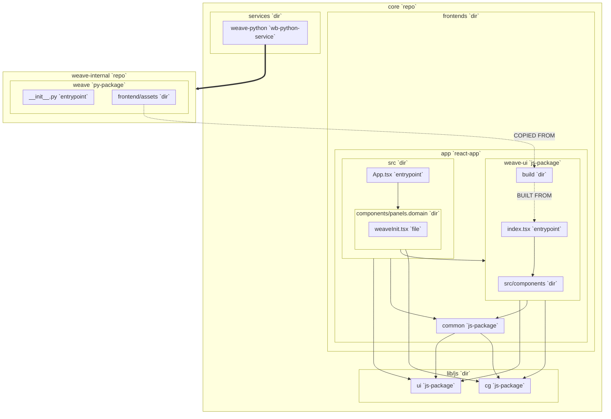

```mermaid
flowchart
    subgraph core `repo`
        subgraph lib/js `dir`
            subgraph WeaveJS [cg `js-package`]
            end
            subgraph WBUI [ui `js-package`]
            end
        end
        subgraph frontends `dir`
            subgraph app `react-app`
                subgraph WBCommon [common `js-package`]

                end
                subgraph WeaveUI [weave-ui `js-package`]
                    subgraph WeaveUIEntry [index.tsx `entrypoint`]
                    end
                    subgraph WeaveUIBuild [build `dir`]
                    end
                    subgraph WeaveUILibrary [src/components `dir`]
                    end
                end
                subgraph WBApp [src `dir`]
                    subgraph WBAppEntry [App.tsx `entrypoint`]
                    end
                    subgraph WBWeaveUI [components/panels.domain `dir`]
                        subgraph weaveInit.tsx `file`
                        end
                    end
                end
            end
        end
        subgraph services `dir`
            subgraph WeaveService [weave-python `wb-python-service`]
            end
        end
    end
    subgraph WeaveInternal [weave-internal `repo`]
        subgraph weave `py-package`
            subgraph WeaveiFrame [frontend/assets `dir`]
            end
            subgraph __init__.py `entrypoint`
            end
        end
    end
    WeaveUI --> WeaveJS
    WBWeaveUI --> WeaveJS
    WBCommon --> WeaveJS
    WBWeaveUI --> WeaveUI
    WBApp --> WBCommon
    WeaveUI --> WBCommon
    WBAppEntry --> WBWeaveUI
    WeaveService ==> WeaveInternal
    WeaveUI --> WBUI
    WBCommon --> WBUI
    WBApp --> WBUI
    WeaveUIBuild -. BUILT FROM .-> WeaveUIEntry
    WeaveiFrame -. COPIED FROM .-> WeaveUIBuild
    WeaveUIEntry --> WeaveUILibrary
```
