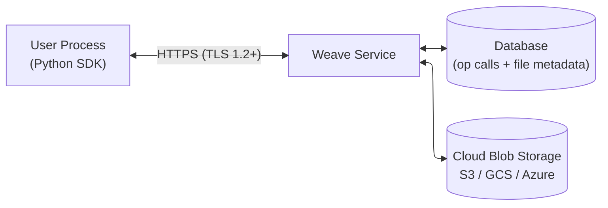
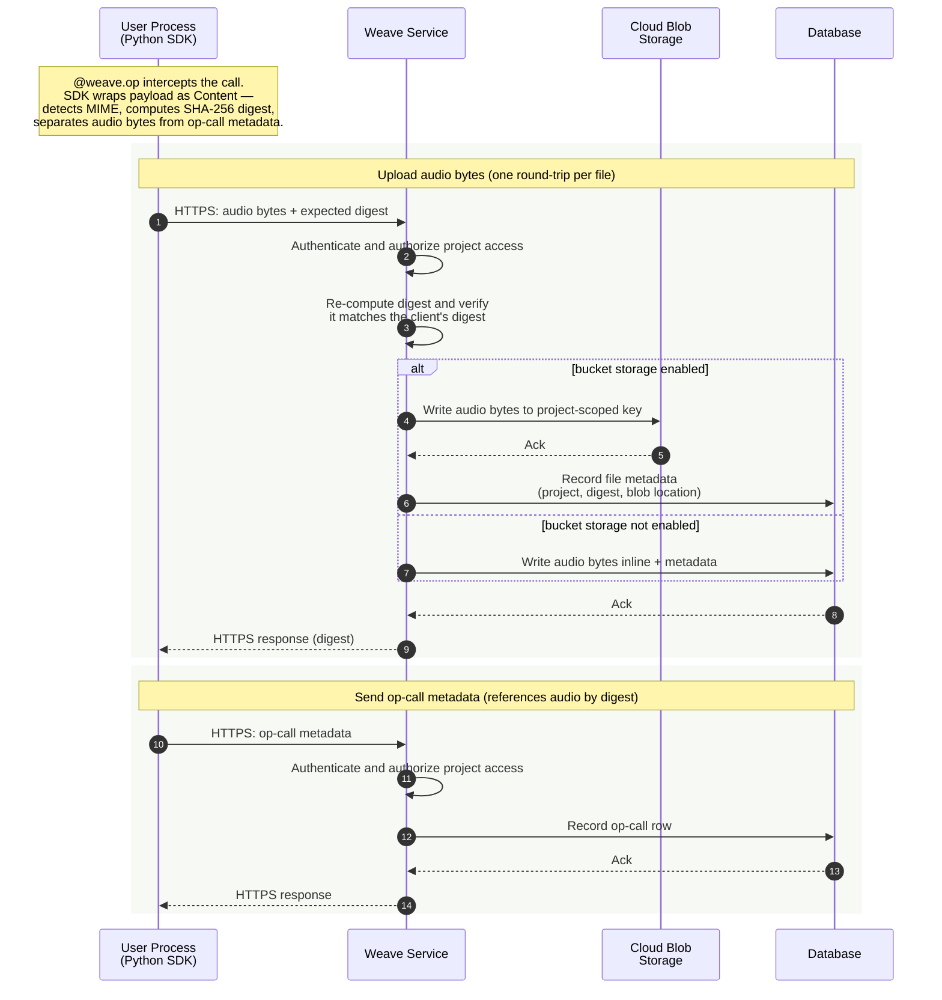
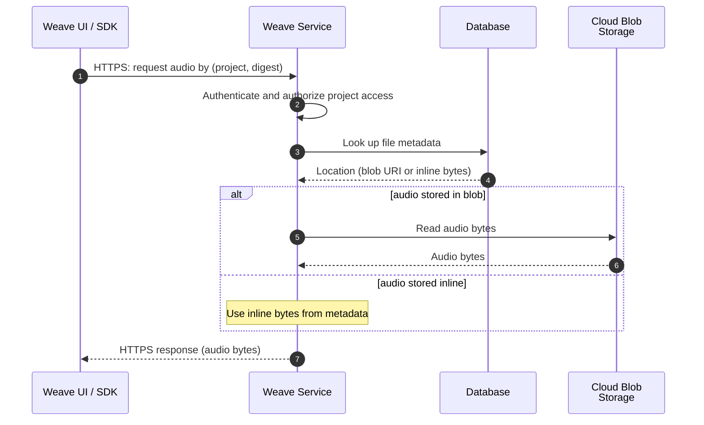

# Weave Audio Media Data Flow

**Audience:** Security reviewers evaluating how audio data is handled by Weights & Biases Weave.

**Scope:** Describes how audio bytes (mp3 / wav / flac / ogg / m4a) travel from a user's application to server-side storage and back, when **external bucket storage (S3 / GCS / Azure Blob) is enabled**.

---

## 1. Example

The flows below are driven by this minimal user program, adapted from the [Weave media docs](https://docs.wandb.ai/weave/guides/core-types/media#log-audio):

```python
import weave
from weave import Content
import wave
import numpy as np
from typing import Annotated

weave.init("your-team-name/your-project-name")

# Create a 1-second, 440 Hz sine-wave .wav on disk
frames = np.sin(2 * np.pi * 440 * np.linspace(0, 1, 44100))
audio_data = (frames * 32767 * 0.3).astype(np.int16)
with wave.open("beep.wav", "wb") as f:
    f.setnchannels(1); f.setsampwidth(2); f.setframerate(44100)
    f.writeframes(audio_data.tobytes())

@weave.op
def load_audio(path: Annotated[str, Content]) -> Annotated[bytes, Content]:
    with open(path, "rb") as f:
        return f.read()

result = load_audio("beep.wav")
```

The `Content` annotation tells Weave that the parameter is a binary media object, so it is stored as a referenced file rather than embedded in the op-call record.

---

## 2. Architecture



- **User Process** — the customer's application running the Weave Python SDK.
- **Weave Service** — authenticated HTTPS API; authorizes every request against project-level ACLs.
- **Database** — stores op-call records and file metadata (project, content digest, location).
- **Cloud Blob Storage** — stores the raw audio bytes when bucket storage is enabled.

---

## 3. Write Path



**Key points:**

- Audio bytes and op-call metadata are transmitted in **separate HTTPS requests**. Raw audio is never embedded in the op-call JSON.
- The SDK computes a **SHA-256 digest** of each audio file client-side; the service re-computes it on receipt and rejects the upload on mismatch, detecting corruption in transit.
- The digest is also used as the **content-addressed storage key**, scoped by project. Identical audio uploaded twice to the same project is stored once; different projects are isolated.
- The service writes to cloud blob storage at a deterministic, project-scoped path. The database only records the **location** (and size) — no audio bytes live in the database on this path.

---

## 4. Read Path



All reads are proxied through the authenticated Weave service. Blob objects are **not** exposed via direct public URLs or signed URLs; project-level ACLs are enforced on every request.

---

## 5. Configuration Controls

Bucket storage is enabled by the W&B operator via service configuration:

- A master setting specifies the **storage URI** (`s3://…`, `gs://…`, or `az://…`) and the cloud-provider credentials.
- An **allow list** (or a percentage-based ramp keyed on project ID) determines which projects route new uploads to blob storage. Projects not enabled continue to store files inline in the database.
- Provider-specific settings include region, optional KMS key (AWS), and service-account credentials (GCP/Azure).

Existing files are unaffected by flipping the switch: each file is read from whichever location it was originally written to.
