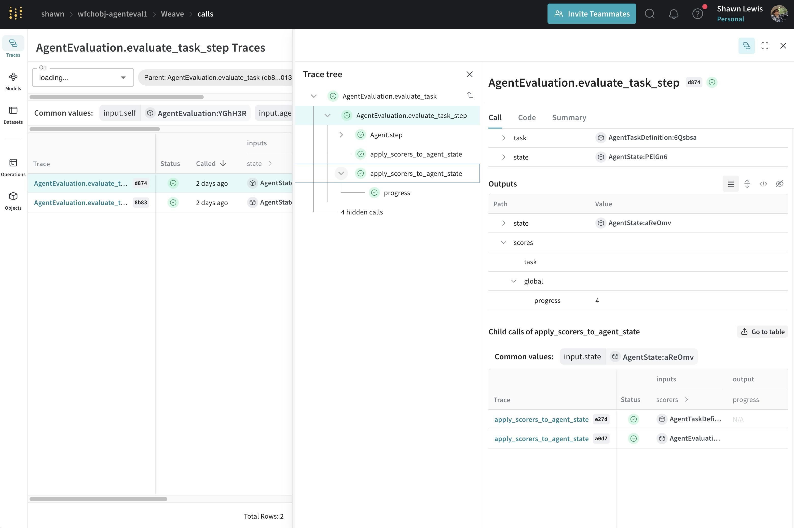

### **Weave** - AI Toolkit by [Weights & Biases](https://wandb.ai/)

---

Weave is a toolkit for developing AI-powered applications.

You can use Weave to:

- Log and debug language model inputs, outputs, and traces
- Build rigorous, apples-to-apples evaluations for language model use cases
- Organize all the information generated across the LLM workflow, from experimentation to evaluations to production

## Getting Started with Weave

To get started debugging, evaluating, and monitoring AI applications, read [the docs](https://wandb.me/weave)!

## The code base

Interested in pulling back the hood or contributing? Awesome, before you dive in, here's what you need to know.

We're in the process of 🧹 cleaning up 🧹. This codebase contains a large amount code for the "Weave engine" and "Weave boards", which we've put on pause as we focus on Tracing and Evaluations.

The Weave Tracing code is mostly in: `weave/trace` and `weave/trace_server`.

The Weave Evaluations code is mostly in `weave/flow`.
