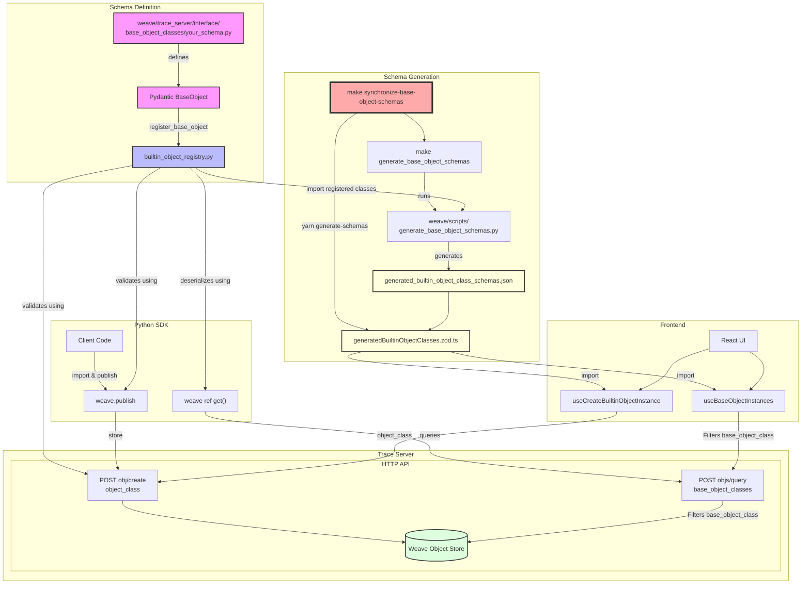

# BuiltinObjectClasses

## Refresher on Objects and object storage

In Weave, we have a general-purpose data storage system for objects.
The payloads themselves are completely free-form - basically anything that can be JSON-serialized.
Users can "publish" runtime objects to weave using `weave.publish`.
For example:

```python
config = {"model_name": "my_model", "model_version": "1.0"}
ref = weave.publish(config, name="my_model_config")
```

This will create a new object "version" in the collection called "my_model_config".
These can then be retrieved using `weave.ref().get()`:

```python
config = weave.ref("my_model_config").get()
```

Sometimes users are working with standard structured classes like `dataclasses` or `pydantic.BaseModel`.
In such cases, we have special serialization and deserialization logic that allows for cleaner serialization patterns.
For example, let's say the user does:

```python
class ModelConfig(weave.Object):
    model_name: str
    model_version: str
```

Then the user can publish an instance of `ModelConfig` as follows:

```python
config = ModelConfig(model_name="my_model", model_version="1.0")
ref = weave.publish(config)
```

This will result in an on-disk payload that looks like:

```json
{
  "model_name": "my_model",
  "model_version": "1.0",
  "_type": "ModelConfig",
  "_class_name": "ModelConfig",
  "_bases": ["Object", "BaseModel"]
}
```

And additionally, the user can query for all objects of the `ModelConfig` class using the `base_object_classes` filter in `objs_query` or `POST objs/query`.
Effectively, this is like creating a virtual table for that class.

**Terminology**: We use the term "weave Object" (capital "O") to refer to instances of classes that subclass `weave.Object`.

**Technical note**: the "base_object_class" is the first subtype of "Object", not the \_class_name.
For example, let's say the class hierarchy is:

- `A -> Object -> BaseModel`, then the `base_object_class` filter will be "A".
- `B -> A -> Object -> BaseModel`, then the `base_object_class` filter will still be "A"!

Finally, the Weave library itself utilizes this mechanism for common objects like `Model`, `Dataset`, `Evaluation`, etc...
This allows the user to subclass these objects to add additional metadata or functionality, while categorizing them in the same virtual table.

## Validated Base Objects

While many Weave Objects are free-form and user-defined, there is often a need for well-defined schemas for configuration objects that are tightly defined by Weave itself. The BaseObject system provides a way to define these schemas once and use them consistently across the entire stack.

### Key Features

1. **Single Source of Truth**: Define your schema once using Pydantic models
2. **Full Stack Integration**: The schema is used for:
   - Python SDK validation
   - Server-side HTTP API validation
   - Frontend UI validation with generated TypeScript types
   - Future: OpenAPI schema generation
   - Future: TypeScript SDK type generation

### Usage Example

Here's how to define and use a validated base object:

1. **Define your schema** (in `weave/trace_server/interface/builtin_object_classes/your_schema.py`):

```python
from pydantic import BaseModel
from weave.trace_server.interface.builtin_object_classes import base_object_def

class NestedConfig(BaseModel):
    setting_a: int

class MyConfig(base_object_def.BaseObject):
    name: str
    nested: NestedConfig
    reference: base_object_def.RefStr

__all__ = ["MyConfig"]
```

2. **Use in Python**:

```python
# Publishing
ref = weave.publish(MyConfig(...))

# Fetching (maintains type)
config = ref.get()
assert isinstance(config, MyConfig)
```

3. **Use via HTTP API**:

```bash
# Creating
curl -X POST 'https://trace.wandb.ai/obj/create' \
  -H 'Content-Type: application/json' \
  -d '{
    "obj": {
      "project_id": "user/project",
      "object_id": "my_config",
      "val": {...},
      "object_class": "MyConfig"
    }
  }'

# Querying
curl -X POST 'https://trace.wandb.ai/objs/query' \
  -d '{
    "project_id": "user/project",
    "filter": {
      "base_object_classes": ["MyConfig"]
    }
  }'
```

4. **Use in React**:

```typescript
// Read with type safety
const result = useBaseObjectInstances("MyConfig", ...);

// Write with validation
const createFn = useCreateBuiltinObjectInstance("MyConfig");
createFn({...}); // TypeScript enforced schema
```

### Keeping Frontend Types in Sync

Run `make synchronize-base-object-schemas` to ensure the frontend TypeScript types are up to date with your Pydantic schemas.

### Implementation Notes

- Base objects are pure data schemas (fields only)
- The system is designed to work independently of the weave SDK to maintain clean separation of concerns
- Server-side validation ensures data integrity
- Client-side validation (both Python and TypeScript) provides early feedback
- Generated TypeScript types ensure type safety in the frontend

### Architecture Flow

1. Define your schema in a python file in the `weave/trace_server/interface/builtin_object_classes/test_only_example.py` directory. See `weave/trace_server/interface/builtin_object_classes/test_only_example.py` as an example.
2. Make sure to register your schemas in `weave/trace_server/interface/builtin_object_classes/builtin_object_registry.py` by calling `register_base_object`.
3. Run `make synchronize-base-object-schemas` to generate the frontend types.
   - The first step (`make generate_base_object_schemas`) will run `weave/scripts/generate_base_object_schemas.py` to generate a JSON schema in `weave/trace_server/interface/builtin_object_classes/generated/generated_builtin_object_class_schemas.json`.
   - The second step (yarn `generate-schemas`) will read this file and use it to generate the frontend types located in `weave-js/src/components/PagePanelComponents/Home/Browse3/pages/wfReactInterface/generatedBuiltinObjectClasses.zod.ts`.
4. Now, each use case uses different parts:
   1. `Python Writing`. Users can directly import these classes and use them as normal Pydantic models, which get published with `weave.publish`. The python client correct builds the requisite payload.
   2. `Python Reading`. Users can `weave.ref().get()` and the weave python SDK will return the instance with the correct type. Note: we do some special handling such that the returned object is not a WeaveObject, but literally the exact pydantic class.
   3. `HTTP Writing`. In cases where the client/user does not want to add the special type information, users can publish builtin objects (set of weave.Objects provided by Weave) by setting the `builtin_object_class` setting on `POST obj/create` to the name of the class. The weave server will validate the object against the schema, update the metadata fields, and store the object.
   4. `HTTP Reading`. When querying for objects, the server will return the object with the correct type if the `base_object_class` metadata field is set.
   5. `Frontend`. The frontend will read the zod schema from `weave-js/src/components/PagePanelComponents/Home/Browse3/pages/wfReactInterface/generatedBuiltinObjectClasses.zod.ts` and use that to provide compile time type safety when using `useBaseObjectInstances` and runtime type safety when using `useCreateBuiltinObjectInstance`.

- Note: it is critical that all techniques produce the same digest for the same data - which is tested in the tests. This way versions are not thrashed by different clients/users.


