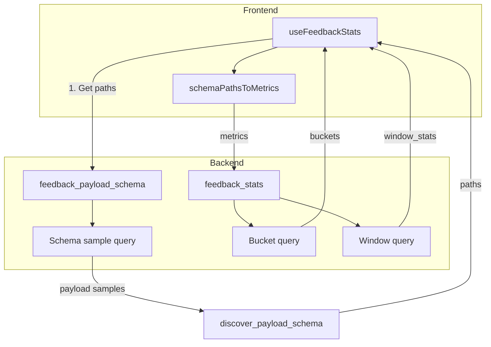

# Feedback Stats and Schema Discovery

Design doc for the feedback statistics and payload schema discovery system used by the Monitor scores UI and related features.

## Overview

The system has two main APIs:

1. **`feedback_payload_schema`** – Discovers the structure of feedback payloads (JSON paths and value types) from sample rows.
2. **`feedback_stats`** – Aggregates payload values over time buckets and optionally returns window-level stats.

The frontend calls schema first to get paths, converts them to `FeedbackMetricSpec[]`, then calls feedback_stats with those metrics.

## Data Flow



## Schema Discovery Query

**File:** `weave/trace_server/feedback_payload_schema.py`

### Design: One Payload Per Unique `trigger_ref`

Each `trigger_ref` (e.g. a monitor version) has a unique payload schema. Instead of sampling N arbitrary rows, we fetch **one payload per distinct `trigger_ref`** using the most recent row per ref.

### SQL Shape (ClickHouse)

```sql
SELECT argMax(payload_dump, created_at) AS payload_sample
FROM feedback
WHERE project_id = ?
  AND created_at >= toDateTime(?, 'UTC')
  AND created_at < toDateTime(?, 'UTC')
  AND payload_dump != ''
  AND payload_dump IS NOT NULL
  AND [trigger_ref filter if provided]
GROUP BY trigger_ref
LIMIT ?
```

**Important:** The aggregate alias must NOT be `payload_dump` (conflicts with the column name in WHERE). Use `payload_sample` or similar.

### Filters

- `project_id`, `start`, `end` – Same time range as the stats request.
- `trigger_ref` – Optional. Uses `startsWith(trigger_ref, prefix)` for `*` suffix (all versions) or exact match.
- `feedback_type` – Optional.

### Limits

- `sample_limit` – Max distinct `trigger_ref`s to return (default 2000, max 5000).
- `_SAMPLE_LIMIT` – Backend cap (5000).

### Path Discovery

`discover_payload_schema(payload_strs)` parses each JSON string, recursively finds leaf paths, infers `value_type` (numeric, boolean, categorical), and returns unique paths. Paths with `[` (array indices) or characters outside `[a-zA-Z0-9_.]` are skipped (must match `feedback_stats` JSONExtract constraints).

## Feedback Stats Queries

**File:** `weave/trace_server/feedback_stats_query_builder.py`

### Bucket Query

Aggregates payload values over time buckets. Uses `toStartOfInterval(created_at, INTERVAL N SECOND)` for bucketing. Returns one row per bucket with columns like `timestamp`, `count`, `avg_<slug>`, `p95_<slug>`, `count_true_<slug>`, etc.

### Window Query

Same filters and metric extraction as the bucket query, but aggregates over the full filtered set (no GROUP BY bucket). Returns one row with `avg_<slug>`, `min_<slug>`, `max_<slug>`, `p95_<slug>`, `count_true_<slug>`, etc. Used for "window stats" in the UI when nothing is hovered.

### JSON Path Constraints

- **Allowed characters:** `[a-zA-Z0-9_.]` (no spaces, no array indices in schema output).
- **Extraction:** `JSONExtractRaw` chained for dot paths; then `toFloat64OrNull`, `if(raw='true',1,...)` for boolean, or `JSONExtractString` for categorical.

### trigger_ref Filter

- Exact: `trigger_ref = ?`
- All versions (suffix `:*`): `startsWith(trigger_ref, prefix)`

## Key Files

| File | Purpose |
|------|---------|
| `feedback_payload_schema.py` | Schema discovery query + path inference |
| `feedback_stats_query_builder.py` | Bucket and window query builders |
| `clickhouse_trace_server_batched.py` | Runs both queries, merges results |
| `trace_server_interface.py` | `FeedbackPayloadSchemaReq`, `FeedbackStatsReq`, `FeedbackStatsRes` |

## Keeping This Doc in Sync

When changing the schema or stats queries:

1. Update the SQL shape and filters in this doc.
2. Document new constraints (e.g. json_path rules) or API fields.
3. Update the "Key Files" table if new modules are involved.
4. Add a brief changelog entry at the bottom.

---

## Changelog

- **2026-02-27**: Initial design doc. Schema query uses `GROUP BY trigger_ref` + `argMax` for one payload per ref. Window query returns `window_stats` for UI.
- **2026-02-27**: Schema aggregate alias changed from `payload_dump` to `payload_sample` to avoid ClickHouse ILLEGAL_AGGREGATION when column name shadows.
