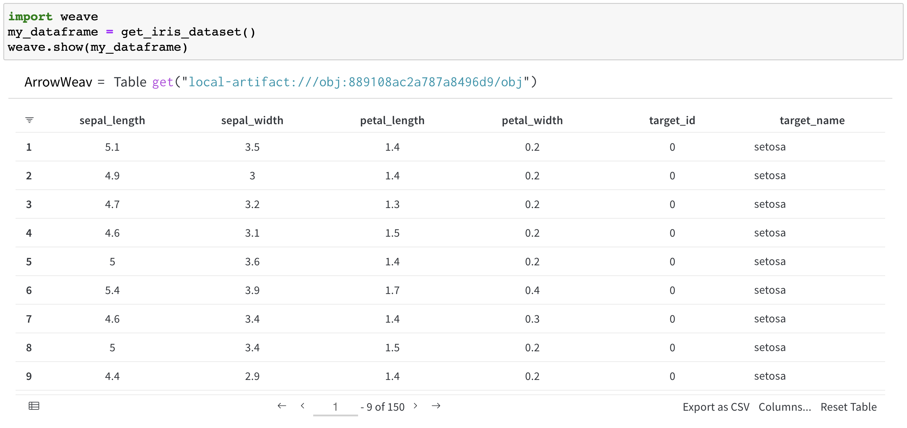
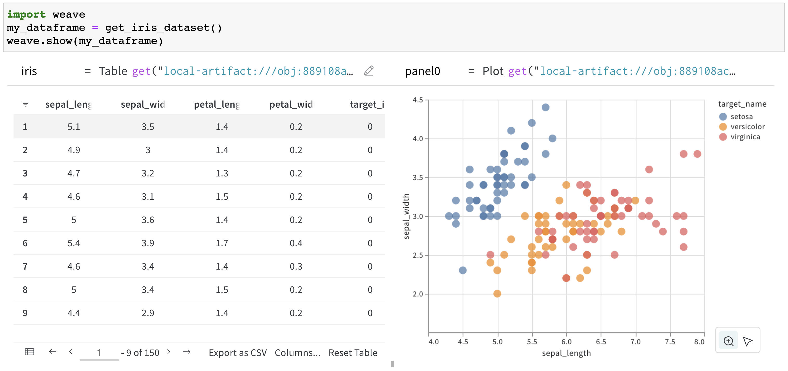
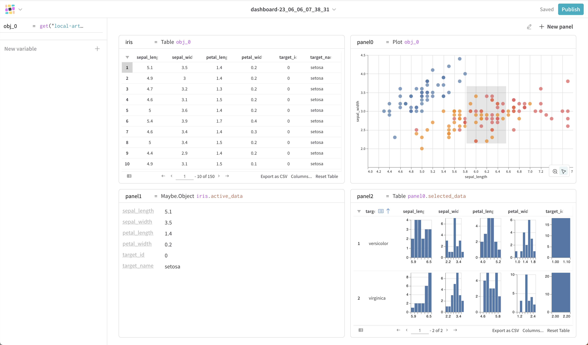

# Weave Quickstart Guide

---

Hello there data explorer! 🚀

This quickstart guide will help you hit the ground running with Weave. We'll guide you through the installation process and then demonstrate how you can start exploring your existing datasets with just one line of code!

## Step 1: Installation

First things first - let's get Weave installed. Open your terminal and type in:

```
pip install weave
```

Once installed, you're ready to dive into data exploration!

## Step 2: Begin Your Exploration

With Weave, turning a data frame into a field of exploration is as simple as a single line of code. Here's how you do it:

```python
import weave
# This is where you'd normally load your dataframe
weave.show(pandas_df)
```

For a hands-on example of this in action, check out our [Getting Started with Weave Notebook](../examples/get_started.ipynb).

## Dive Deeper into Data

What can you do with Weave, you ask? Let's take a look:

**1. Visualize a dataframe:**

Here's an example of the Iris dataset, visualized using Weave:



**2. Interactively derive insights:**

Uncover hidden patterns in your data through interactive exploration:



**3. Create and share dashboards:**

With Weave, you can configure your exploration into dashboards, which you can then share with others. Note to publish to Weights and Biases, you will want to authenticate your local machine by executing `wandb init` in a terminal or `wandb.init()` in a notebook, then restart your notebook!



---

And there you have it! You're now ready to start your data exploration journey with Weave. We can't wait to see the insights you'll uncover.

Happy Weaving! 🎉
