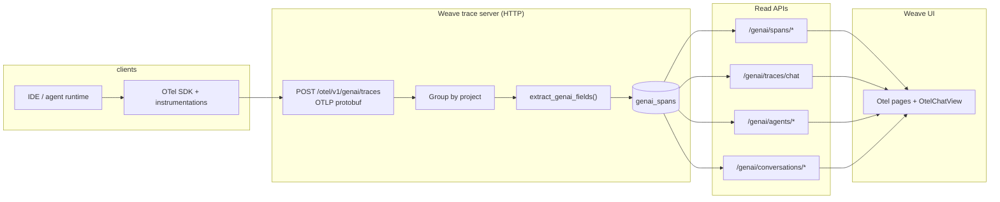

# GenAI agent trajectory data model (OpenTelemetry)

**Status:** implemented (Weave trace server + Weave UI)  
**Audience:** backend, SDK, and integration authors  

This document explains **why** Weave models agent behavior as OpenTelemetry traces, **how** those traces become a queryable “agent trajectory” in the product, and **how to emit data and build new integrations**.

---

## 1. Goals

1. **Interoperability** — Reuse the ecosystem’s standard for distributed traces (OTLP, semantic conventions, existing instrumentations) instead of inventing a parallel RPC log format.
2. **Fidelity** — Preserve hierarchy (`trace_id`, parent/child `span_id`), timing, status, events, and vendor-specific attributes while still supporting a **single normalized row shape** for analytics.
3. **Trajectory UX** — Drive a **chat-like** UI (user turns, model replies, tools, handoffs, compaction) derived from spans, not only raw span tables.
4. **Multi-turn sessions** — Link many traces into one **conversation** when the instrumentation provides a stable session identifier.

Non-goals for this doc: exact ClickHouse DDL, internal deployment topology, or PR-specific timelines.

---

## 2. Concepts

| Concept | Meaning in this system |
|--------|-------------------------|
| **OTel trace** | One tree of spans sharing a `trace_id`. Typically one **user turn** or one **agent invocation** end-to-end. |
| **GenAI span** | One row in `genai_spans` after ingest: normalized fields (agent, tool, model, tokens, messages, etc.) extracted from an OTel span. |
| **Agent (product)** | A **named logical agent** (`agent_name` + optional `agent_id`), aggregated across many spans/traces (dashboards, metrics). |
| **Conversation** | A **session** keyed by `conversation_id` on spans. Multiple traces can share one conversation (multi-turn). |
| **Trajectory / chat view** | An ordered list of **`GenAIChatMessage`** items built from the spans of **one trace** (`genai/traces/chat`) or **many traces** grouped by conversation (`genai/conversations/chat`). |

**Why this works as a trajectory model:** LLM agents are already modeled by instrumentations as **nested spans** (chat → tool → sub-agent). Normalization maps those spans to a small set of **operation types** (`operation_name`: chat, tool execution, agent invoke, handoff, etc.). The chat projection (`weave/trace_server/genai_chat_view.py`) walks normalized spans in time order and emits a **linear narrative** (messages, tool calls, boundaries) suitable for UI.

**Exact trajectory algorithm + SDK/CLI instrumentation contract:** [`genai_trajectory_algorithm_and_contract.md`](genai_trajectory_algorithm_and_contract.md).

---

## 3. Architecture

**Two export paths (do not confuse them):**

| Endpoint | Purpose |
|----------|---------|
| `POST /otel/v1/traces` | Legacy Weave OTel path → existing call/trace pipeline (`otel_export`). |
| `POST /otel/v1/genai/traces` | **GenAI agent model** → `genai_otel_export` → **`genai_spans`** table. |

Integrations that target this document should use **`/otel/v1/genai/traces`**.

---

## 4. Ingest: wire protocol and routing

### 4.1 Request format

- **Method:** `POST`
- **URL:** `{TRACE_SERVER_BASE}/otel/v1/genai/traces` (prefix depends on deployment; often same host as other trace APIs).
- **Body:** OTLP **`ExportTraceServiceRequest`** protobuf **serialized binary**.
- **`Content-Type`:** `application/x-protobuf`
- **`Content-Encoding` (optional):** `gzip` or `deflate`

### 4.2 Authentication

Either:

- Header **`wandb-api-key`:** `<API key>`, or  
- **`Authorization: Basic ...`** (password treated as API key).

### 4.3 Project resolution

Batches are split into one `OTelExportReq` per W&B project:

- Resource attributes **`wandb.entity`** and **`wandb.project`** (string), and/or  
- Legacy header **`project_id`** as `entity/project`.

The server builds `project_id` as **`{entity}/{project}`**. Spans without a resolvable project are dropped from the batch (see trace server validation errors).

### 4.4 Server-side processing

For each span in the batch:

1. Parse protobuf → internal `Span` + `Resource`.
2. **`extract_genai_fields(span, project_id, wb_user_id)`** → `GenAISpanCHInsertable`.
3. Insert rows into **`genai_spans`** (ClickHouse-backed server).

Partial failures are reported via **`OTelExportRes.partial_success`** (rejected span count + error message).

**Storage note:** The GenAI ingest and query APIs are implemented for the **ClickHouse** trace server. The **SQLite** server used in some tests intentionally **does not** implement `genai_otel_export` / GenAI queries.

---

## 5. Semantic contract: what integrators should emit

The normalizer is implemented in **`weave/trace_server/opentelemetry/genai_extraction.py`**. It prefers **[OpenTelemetry GenAI semantic conventions](https://opentelemetry.io/docs/specs/semconv/gen-ai/)** where possible, then applies **vendor fallbacks** (OpenAI Agents SDK, Google ADK / Vertex, Anthropic via Traceloop-style attributes, etc.).

### 5.1 Core identity and structure

| Intent | Preferred attributes | Notes |
|--------|----------------------|--------|
| Provider | `gen_ai.provider.name`, `gen_ai.system` | Also inferred from `span.name` prefix (e.g. `anthropic.*`). |
| Operation | `gen_ai.operation.name`, `agent.span.type` (OpenAI mapping) | Drives trajectory classification (chat vs tool vs agent vs handoff). |
| Agent | `gen_ai.agent.name`, `agent.name` | Fallback: parse `span.name` like `agent: MyBot`. |
| Agent metadata | `gen_ai.agent.id`, `gen_ai.agent.description`, `gen_ai.agent.version` | Optional. |
| Session / conversation | `gen_ai.conversation.id`, `gcp.vertex.agent.session_id` | Required for multi-turn **conversation** APIs. |
| Models | `gen_ai.request.model`, `gen_ai.response.model`, `gen_ai.response.id` | |
| Tools | `gen_ai.tool.name`, `gen_ai.tool.call.id`, `gen_ai.tool.type`, `gen_ai.tool.description`, `gen_ai.tool.definitions` | Traceloop indexed `gen_ai.completion.*` also supported. |
| Tokens | `gen_ai.usage.input_tokens`, `gen_ai.usage.output_tokens`, … | Multiple fallback keys for prompt/completion/total. |
| Messages | `gen_ai.input.messages`, `gen_ai.output.messages` | Often JSON strings; chat view parsers handle common shapes. |
| System prompt | `gen_ai.system_instructions` | |
| Finish reasons | `gen_ai.response.finish_reasons` | |

### 5.2 Events

Some stacks put completions on **span events** (e.g. `gen_ai.content.completion` with `gen_ai.completion` on the event). **`extract_output_messages`** merges attribute- and event-based sources.

### 5.3 Weave-specific extensions

These are optional but improve Weave-native UX (refs, compaction):

| Attribute | Purpose |
|-----------|---------|
| `weave.content_refs` | JSON list of content refs. |
| `weave.artifact_refs` | JSON list of artifact refs. |
| `weave.object_refs` | JSON list of object refs. |
| `weave.compaction.summary` | Human-readable compaction summary. |
| `weave.compaction.items_before` / `weave.compaction.items_after` | Compaction stats. |

### 5.4 Debugging fields

Every row stores **`attributes_dump`**, **`events_dump`**, and **`resource_dump`** (JSON) so unknown or future attributes remain inspectable even if not mapped to columns.

---

## 6. Read APIs (JSON over HTTP)

All are **POST** JSON bodies unless your gateway maps them differently; the Weave frontend uses the trace server direct client.

| Endpoint | Role |
|----------|------|
| `/genai/spans/query` | Paginated span search with filters (`trace_id`, `agent_name`, `conversation_id`, …). |
| `/genai/spans/trace` | All normalized spans for one `trace_id` (timeline / detail). |
| `/genai/spans/active` | In-progress spans (paired with optional live hooks). |
| `/otel/v1/genai/span/start` | Optional: notify span start for streaming / active list. |
| `/genai/traces/chat` | **`GenAITraceChatRes`**: ordered **`GenAIChatMessage`** for one trace. |
| `/genai/agents/query` | List agents with aggregate stats. |
| `/genai/agents/metrics` | Time-bucketed metrics for one agent. |
| `/genai/conversations/query` | List conversations by `conversation_id`. |
| `/genai/conversations/chat` | **`GenAIConversationChatRes`**: list of per-trace chat views (`turns`). |

**Types** are defined in **`weave/trace_server/trace_server_interface.py`** (`GenAISpanSchema`, `GenAIChatMessage`, `GenAITraceChatRes`, `GenAIConversationChatRes`, `GenAIAgentSchema`, …).

### 6.1 Chat message kinds

`GenAIChatMessage.type` is one of:

`user_message`, `agent_message`, `tool_call`, `agent_handoff`, `agent_start`, `context_compacted`

The projector merges provider-specific message JSON into **`text`**, **`tool_*`**, **`reasoning_*`**, token counts, duration, and status for display.

---

## 7. Building a new integration

### 7.1 Checklist

1. **OTLP exporter** pointing at **`/otel/v1/genai/traces`** (not the generic `/otel/v1/traces` if you want `genai_spans`).
2. Set **`Content-Type: application/x-protobuf`** and send the standard OTLP trace payload.
3. Ensure **resource** includes **`wandb.entity`** and **`wandb.project`** (or send **`project_id`** header).
4. Authenticate with **`wandb-api-key`** (or Basic).
5. Use **GenAI semantic attributes** on spans (see §5); set **`gen_ai.conversation.id`** if you need conversation APIs.
6. Verify in UI or via **`/genai/spans/query`** and **`/genai/traces/chat`**.

### 7.2 Autopatching / daemons

Pattern used for tools like Cursor:

- Run an **OpenTelemetry SDK** in the host process (or sidecar) with **instrumentations** that emit GenAI spans.
- Use a **custom exporter** or **OTLP HTTP exporter** with URL rewritten to the Weave trace server **`/otel/v1/genai/traces`**.
- Optionally call **`/otel/v1/genai/span/start`** when a turn begins so **`/genai/spans/active`** can show live activity.

Exact hook points are product-specific; the **contract** this doc relies on is still **OTLP + attributes above**.

### 7.3 Python / Node client libraries

The in-repo **`RemoteHTTPTraceServer`** bindings may not yet implement posting raw OTLP from the Weave Python client; integrations often use **generic OTLP exporters** (OpenTelemetry Python/JS) or HTTP from the host app. If you add first-class client support, keep this doc aligned with that API.

---

## 8. Weave UI

Routes under the project live in Browse3, e.g. **`…/otel`** (spans), **`…/otel/:traceId`**, **`…/otel/agents`**, etc. The UI loads data via **`traceServerDirectClient`** methods (`genaiSpansQuery`, `genaiTracesChat`, `genaiAgentsQuery`, `genaiConversationsQuery`, …).

---

## 9. Key source references

| Area | Location |
|------|----------|
| HTTP routes (ingest + GenAI API) | `services/weave-trace/src/trace_server.py` |
| OTLP batching / project grouping | `services/weave-trace/src/opentelemetry_helpers.py` |
| Field extraction | `weave/trace_server/opentelemetry/genai_extraction.py` |
| ClickHouse insert + queries | `weave/trace_server/clickhouse_trace_server_batched.py` |
| Span column schema | `weave/trace_server/genai_schema.py` |
| Chat projection | `weave/trace_server/genai_chat_view.py` |
| Public types | `weave/trace_server/trace_server_interface.py` |
| Frontend client | `frontends/weave/.../traceServerDirectClient.ts` |

---

## 10. Design tradeoffs (why it feels this way)

- **Spans as source of truth** — Avoids duplicating “calls” and “agent events” in two systems; analytics and UI both read **`genai_spans`**.
- **Wide normalized table** — Fast filters and dashboards; optional JSON dumps for long tail attributes.
- **Projection for UX** — `genai/traces/chat` is a **view**, not a second stored format, so improving trajectory logic does not require re-ingesting historical data.
- **Conversation is attribute-driven** — No separate “conversation create” API; grouping is **`conversation_id`** on spans.

---

## Changelog

| Date | Change |
|------|--------|
| 2026-03-19 | Initial design doc. |
