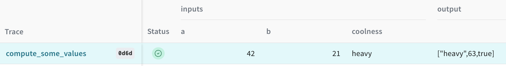
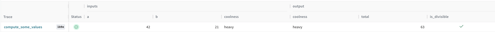

# Best Practices on instrumenting your code

Adding weave to any codebase can be very powerful, enabling you to keep an eye on inputs and outputs and disentangling complex workflows by exposing intermediate results.

## Simple Weave instrumentation

Let's start by instrumenting a simple function. We will use the `weave.op` decorator to instrument the function.

```python
def compute_some_values(a: int, b: int, coolness: str):
    "Simple function to compute some values"
    total = a + b
    is_divisible = a % b == 0
    return coolness, total, is_divisible
```

We need to add the `weave.op` decorator to the function to instrument it.

```python
@weave.op
def compute_some_values(a: int, b: int, coolness: str):
    "Simple function to compute some values"
    total = a + b
    is_divisible = a % b == 0
    return coolness, total, is_divisible
```

 Also, if we want the output to be stored and rendered on the UI on individual columns, we need to return a dict with the name of each attribute.

 

 As you can see, the output gets rendered as a list in the `output` column. We can unpack the list to render the output on individual columns. To do so, we need to return a dict with the name of each attribute.


```python
@weave.op
def compute_some_values(a: int, b: int, coolness: str):
    "Simple function to compute some values"
    total = a + b
    is_divisible = a % b == 0
    return {"coolness": coolness, "total": total, "is_divisible": is_divisible}
```


It is up to you if you want to change the output or not, but it may be useful to have the output in a dict. Also, most of the LLMs APIs return some kind of structured output, so it is a good idea to return a dict on other parts of your codebase too.

## Weave uses Pydantic

bla bla bla about Pydantic and how Weave uses Pydantic BaseModel everywhere

### weave.Object and weave.Model

A `weave.Model` is a `BaseModel` with ... some explanation about how to use it. We should be explicit about the `weave.Model` and attributes like `generate`, `predict`, `__call__`, etc...

### model_validator and delayed init

We need to document the `model_validator` decorator and when to use it. Typically, we use it to validate the data in the `__init__` method of a Pydantic BaseModel. For LLM use cases this is a good place to define the client or load the model weights.

Let's consider the following example:

```python
import json
import openai
import weave

class LLMModel(weave.Model):
    model_name: str
    prompt_template: str

    @weave.op()
    async def predict(self, sentence: str) -> dict:
        client = openai.AsyncClient()

        response = await client.chat.completions.create(
            model=self.model_name,
            messages=[
                {"role": "user", "content": self.prompt_template.format(sentence=sentence)}
            ],
        )
        return response.choices[0].message.content
```
Everytime we call `predict`, we create a new `openai.AsyncClient`. This is not efficient and can lead to a problems when we have a lot of requests to the model and the way Python handles processes. An alternative to this, is using the `model_validator` decorator to create the client before the model is initialized. As a `weave.Model` is a subclass of `pydantic.BaseModel`, we can use the `model_validator` decorator to create the client before the model is initialized.

```python
import json
import openai
import weave
# highlight-next-line
from pydantic import Field, model_validator

class LLMModel(weave.Model):
    model_name: str
    prompt_template: str
    client: openai.AsyncClient = Field(init=False)
    
    # highlight-next-line
    @model_validator(mode="before")
    def create_client(cls, values: dict):
        values['client'] = openai.AsyncClient()
        return values
    
    @weave.op()
    async def predict(self, topic: str) -> dict:
        response = await self.client.chat.completions.create(
            model=self.model_name,
            messages=[
                {"role": "user", "content": self.prompt_template.format(topic=topic)}
            ],
        )
        return response.choices[0].message.content
```
This way, the client becomes a model attribute and we can reuse the client to make requests to the API.

### Hugging Face model

When using Hugging Face and `weave.Model` you will want to use `model_validator` on the step where you load the model weights and tokenizer. A simple example of this is the following:

```python
import weave
from pydantic import model_validator, Field
from transformers import AutoModel
from transformers import PeftModelForCausalLM, LlamaForCausalLM, LlamaTokenizerFast

class LlamaModel(weave.Model):
    """A model class for MetaAI-LLama models"""
    model_id: str
    temperature: float = 0.5
    max_new_tokens: int = 128
    model: PeftModelForCausalLM | LlamaForCausalLM = Field(init=False)
    tokenizer: LlamaTokenizerFast = Field(init=False)

    @model_validator(mode='before')
    def load_model_and_tokenizer(cls, v):
        "Pydantic validator to load the model and the tokenizer"
        model_id = v["model_id"]
        if model_id is None:
            raise ValueError("model_id is required")
        model = AutoModel.from_pretrained(model_id)
        tokenizer = LlamaTokenizerFast.from_pretrained(model_id)
        v["model"] = model
        v["tokenizer"] = tokenizer
        return v

    @weave.op
    def apply_chat_template(messages: str, tokenizer):
        "A simple function to apply the chat template to the prompt"
        formatted_prompt = tokenizer.apply_chat_template(messages, tokenize=False)
        return formatted_prompt

    @weave.op()
    def predict(self, messages: list[dict[str, str]]) -> str:
        formatted_prompt = self.format_prompt(messages)
        tokenized_prompt = self.tokenizer.encode(formatted_prompt, return_tensors="pt").to(self.model.device)
        outputs = self.model.generate(
            tokenized_prompt,
            max_new_tokens=self.max_new_tokens,
            pad_token_id=self.tokenizer.eos_token_id,
            temperature=self.temperature,
        )
        generated_text = self.tokenizer.decode(outputs[0][len(tokenized_prompt[0]):], skip_special_tokens=True)
        return {"generated_text": generated_text}
```
Some explanation about the code above.
- In this code we have a `model_validator` that loads the model and the tokenizer.
- We have a `format_prompt` method that formats the prompt to be sent to the model. This is a good idea as you want to know exactly what is being sent to the model before tokenization.
- We have a `predict` method that generates a response from the model. Depending on the use case, you may want to return the raw output from the model or the decoded output.


