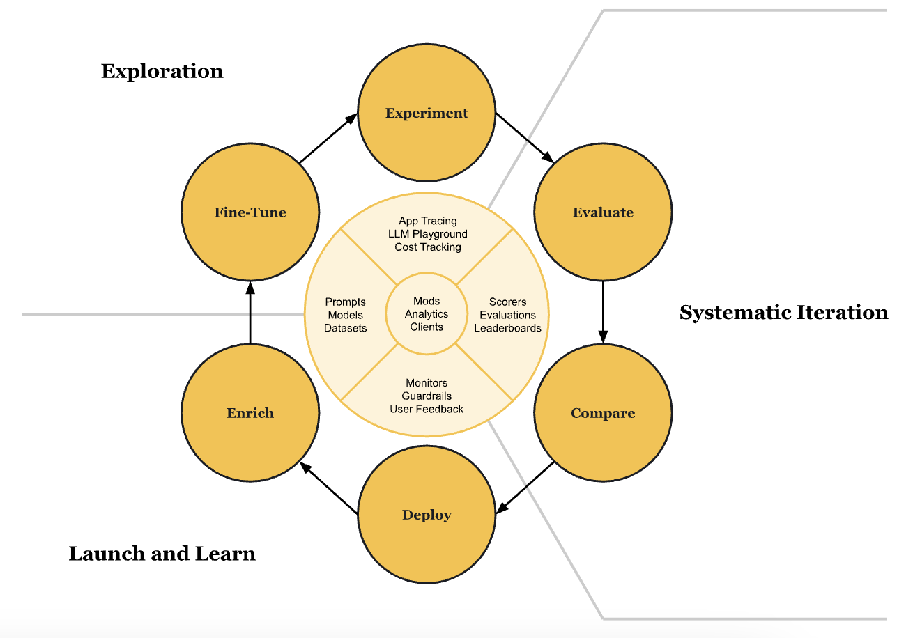

# Weave concepts and lifecycle

The Weave workflow can be broken into three major stages, organized as a loop:

1. [Exploration](#exploration): Experiment with prompts, pipelines, and initial test cases.
2. [Systematic Iteration](#systematic-iteration): Build evaluation datasets, compare models, and improve system performance.
3. [Launch and Learn](#launch-and-learn): Deploy applications, collect feedback, and iteratively refine.

Each stage includes specific substages that connect to core Weave features, as visualized in the diagram.

## Exploration

**Objective**: Early-stage experimentation to explore potential solutions and define tasks.

### Experiment
- **User Activities**: Experimenting with prompts and pipelines (e.g., Retrieval-Augmented Generation, or RAG).
- **Related Weave Features**: 
  - **App Tracing & Debugging**: 🟢 Lightweight tracing for quick insights.
  - **LLM Playground**: 🔵/🚧 Integrated environment for replayable experimentation.
  - **Cost Tracking**: 🟢 Understand and optimize resource usage.
- **Outcome**: Insights into initial LLM behaviors and problem framing.

### Fine-Tune
- **User Activities**: Fine-tuning frontier models with domain-specific data.
- **Related Weave Features**:
  - **Prompt Management & Versioning**: 🔵/🚧 Track and refine prompt iterations.
  - **Fine-Tune Tracking**: 💡 Monitor training improvements.
- **Outcome**: Models tailored to specific domains or applications.

---

## Systematic Iteration

**Objective**: Rigorous testing and evaluation to prepare for production.

### Evaluate
- **User Activities**: Building evaluation datasets and scoring methods.
- **Related Weave Features**:
  - **Evaluation Framework**: 🟢/📝 Code- and UI-based framework with intelligent caching.
  - **Built-in Scorers**: 🔵 Automated scoring for datasets.
- **Outcome**: Confidence in model accuracy and reliability.

### Compare
- **User Activities**: Comparing models and techniques.
- **Related Weave Features**:
  - **Model Management**: 🟢 Seamlessly organize and compare models.
  - **Model Comparison Reports**: 🟢 Visualize differences in performance.
  - **Leaderboards**: 🟢 Highlight top-performing approaches.
- **Outcome**: Clear selection of the best-performing configurations.

---

## Launch and Learn

**Objective**: Deploy LLM applications, collect feedback, and iterate.

### Deploy
- **User Activities**: Deploying the model/application.
- **Related Weave Features**:
  - **Production Tracing & Plotting**: 🟢 Monitor real-world behavior.
  - **Guardrails and Alerts**: 🚧 Proactively identify issues in production.
- **Outcome**: Applications ready for user interaction.

### Enrich
- **User Activities**: Collecting live user feedback and production data.
- **Related Weave Features**:
  - **Dataset Enrichment**: 🚧 Enhance evaluation datasets with production insights.
  - **User Feedback Collection**: 🟢 Record and analyze interactions.
- **Outcome**: Improved datasets and understanding of real-world use cases.

### Fine-Tune
- **User Activities**: Refining models based on production data.
- **Related Weave Features**:
  - **Fine-Tuning with Production Data**: 💡 Close the loop with improved performance.
- **Outcome**: Enhanced model accuracy and responsiveness.

---

## Cross-Stage Foundations

Weave includes foundational features that enhance every stage of the workflow:

- **Multi-Client Support**: 🟢 Python, TypeScript, HTTP APIs, and more.
- **Data Export**: 🟢 Export system data for external analysis.
- **Saved Views**: 🚧 Share analytics and evaluations.
- **Custom Mods**: 🚧 Build custom apps using Weave as a database.
- **W&B Integration**: 🚧 Connect model development with evaluations and workflows.

---