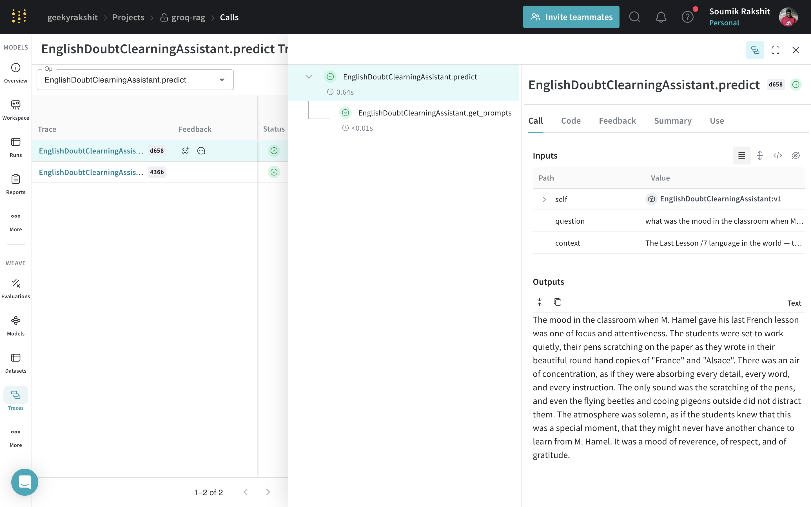
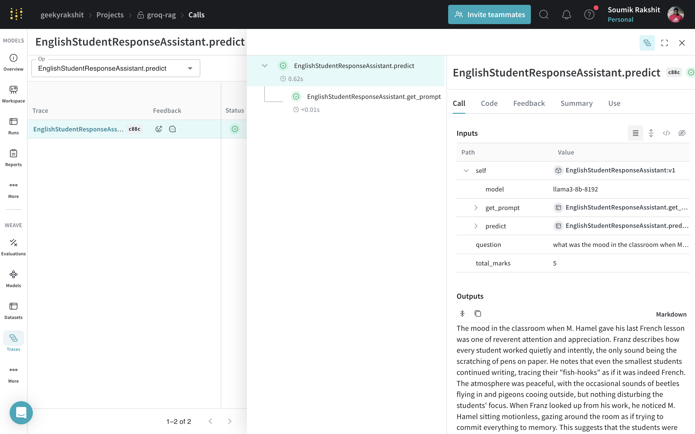
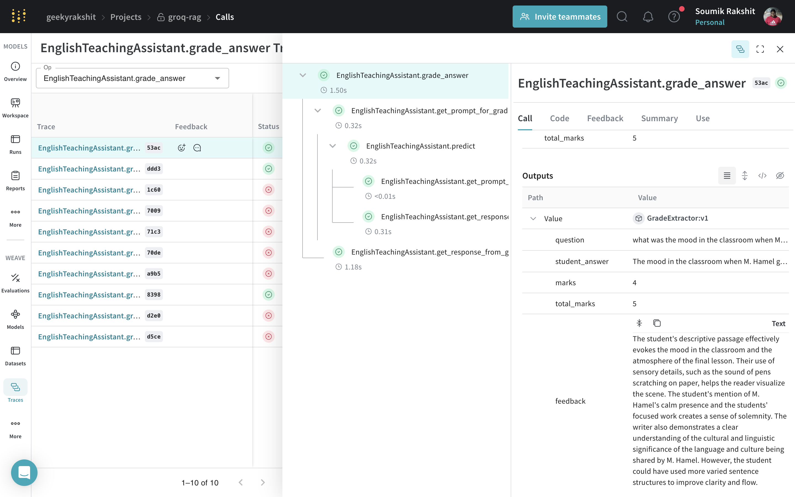

# Building Task-specific Assistants using Prompt Engineering

[](https://colab.research.google.com/github/wandb/weave/blob/master/docs/docs/guides/cookbooks/llamaindex_rag_ncert/notebooks/03_prompt_engineering.ipynb)

Now that we have a functional RAG pipeline, let's use some basic prompt engineering to make it a little more helpful. We need our teaching assistant to be able to perform the following tasks:

- emulating the ideal response of a student to a question
- emulating the teacher's response to a question from a student.
- help the teacher grade the answer given by a student to a question.

## Building a Retreiver from the Vector Store Index

Retrievers are responsible for fetching the most relevant context given a user query or chat message. We are going to use the [`as_retriever`](https://docs.llamaindex.ai/en/stable/api_reference/indices/document_summary/?h=as_retriever#llama_index.core.indices.DocumentSummaryIndex.as_retriever) instead of the `as_query_engine` in the previous recipe to build our retriever.

```python
import wandb

from llama_index.embeddings.huggingface import HuggingFaceEmbedding
from llama_index.core import (
    ServiceContext, StorageContext, load_index_from_storage
)

# fetch vector embeddings artifact
artifact = wandb.Api().artifact(
    "geekyrakshit/groq-rag/ncert-flamingoes-prose-embeddings:latest"
)
artifact_dir = artifact.download()

# define service and storage contexts
embed_model = HuggingFaceEmbedding(model_name="BAAI/bge-small-en-v1.5")
service_context = ServiceContext.from_defaults(
    embed_model=embed_model, llm=None
)
storage_context = StorageContext.from_defaults(persist_dir=artifact_dir)

# load index from storage
index = load_index_from_storage(
    storage_context, service_context=service_context
)

# build retriever
retreival_engine = index.as_retriever(
    service_context=service_context,
    similarity_top_k=10,
)
```

Now we can use this retriever to retrieve a list of [`NodeWithScore`](https://docs.llamaindex.ai/en/stable/api_reference/schema/?h=nodewithscore#llama_index.core.schema.NodeWithScore) objects which represent units of retrieved text segments. The nodes are arranged in descending order of similarity score, hence we can simply pick the first node in the list as our context.

```python
query = """what was the mood in the classroom when M. Hamel gave his last French lesson?"""
response = retreival_engine.retrieve(query)

chapter_name = response[0].node.metadata["file_name"].split(".")[0].replace("_", " ").title()
context = response[0].node.text

rich.print(f"{chapter_name=}")
rich.print(f"{context=}")
```

The output is:

```
chapter_name='The Last Lesson'

context='The Last Lesson /7\nlanguage in the world — the\nclearest, the most logical; that\nwe must guard it among 
us and\nnever forget it, because when a\npeople are enslaved, as long as\nthey hold fast to their language\nit is 
as if they had the key to their\nprison. Then he opened a\ngrammar and read us our lesson.\nI was amazed to see how
well I\nunderstood it. All he said seemed\nso easy, so easy! I think, too, that\nI had never listened so 
carefully,\nand that he had never explained\neverything with so much patience.\nIt seemed almost as if the 
poor\nman wanted to give us all he knew\nbefore going away, and to put it\nall into our heads at one stroke.\nAfter
the grammar , we had a\nlesson in writing. That day M.\nHamel had new copies for us,\nwritten in a beautiful round 
hand\n— France, Alsace, France, Alsace. They looked like little\nflags floating everywhere in the school-room, hung
from\nthe rod at the top of our desks. Y ou ought to have seen how\nevery one set to work, and how quiet it was! 
The only sound\nwas the scratching of the pens over the paper . Once some\nbeetles flew in; but nobody paid any 
attention to them, not\neven the littlest ones, who worked right on tracing their\nfish-hooks, as if that was 
French, too. On the roof the\npigeons cooed very low, and I thought to myself, “Will they\nmake them sing in 
German, even the pigeons?”\nWhenever I looked up from my writing I saw M. Hamel\nsitting motionless in his chair 
and gazing first at one thing,\nthen at another , as if he wanted to fix in his mind just how\neverything looked in
that little school-room. Fancy! For\nforty years he had been there in the same place, with his\ngarden outside the 
window and his class in front of him,\n1.What was Franz expected to\nbe prepared with for school\nthat day?\n2.What
did Franz notice that was\nunusual about the school that\nday?\n3.What had been put up on 
the\nbulletin-board?\nReprint 2024-25'
```

## Building a Simple Doubt-clearing Assistant

We're going to use [`weave.Model`](https://wandb.github.io/weave/guides/core-types/models) to write our assitants. A `weave.Model` is a combination of data (which can include configuration, trained model weights, or other information) and code that defines how the model operates. By structuring your code to be compatible with this API, you benefit from a structured way to version your application so you can more systematically keep track of your experiments.

Let's use a simple prompt template to build a doubt-clearning assistant:

```python
import weave

class EnglishDoubtClearningAssistant(weave.Model):
    model: str = "llama3-8b-8192"
    _groq_client: Optional[Groq] = None
    
    def __init__(self, model: Optional[str] = None):
        super().__init__()
        self.model = model if model is not None else self.model
        self._groq_client = Groq(
            api_key=os.environ.get("GROQ_API_KEY")
        )
    
    @weave.op()
    def get_prompts(self, question: str, context: str):
        system_prompt = """
You are a student in a class and your teacher has asked you to answer the following question.
You have to write the answer in the given word limit."""
        user_prompt = f"""
We have provided context information below. 

---
{context}
---

Answer the following question within 50-150 words:

---
{query}
---
"""
        return system_prompt, user_prompt

    @weave.op()
    def predict(self, question: str, context: str):
        system_prompt, user_prompt = self.get_prompts(question, context)
        chat_completion = self._groq_client.chat.completions.create(
            messages=[
                {
                    "role": "system",
                    "content": system_prompt,
                },
                {
                    "role": "user",
                    "content": user_prompt,
                },
            ],
            model=self.model,
        )
        return chat_completion.choices[0].message.content


weave.init(project_name="groq-rag")

assistant = EnglishDoubtClearningAssistant()

rich.print(assistant.predict(question=query, context=context))
```

|  |
|---|
| A trace for `EnglishDoubtClearningAssistant.predict` showing the versioned `EnglishDoubtClearningAssistant` model object. |

## Building a Simple Assistant for Generating Student Response

Let's use a simple prompt template to build an assistant to help clarify students' doubts about any point in the textbook.

```python
class EnglishStudentResponseAssistant(weave.Model):
    model: str = "llama3-8b-8192"
    _groq_client: Optional[Groq] = None
    
    def __init__(self, model: Optional[str] = None):
        super().__init__()
        self.model = model if model is not None else self.model
        self._groq_client = Groq(
            api_key=os.environ.get("GROQ_API_KEY")
        )
    
    @weave.op()
    def get_prompt(
        self, question: str, context: str, word_limit_min: int, word_limit_max: int
    ) -> Tuple[str, str]:
        system_prompt = """
You are a student in a class and your teacher has asked you to answer the following question.
You have to write the answer in the given word limit."""
        user_prompt = f"""
We have provided context information below. 

---
{context}
---

Answer the following question within {word_limit_min}-{word_limit_max} words:

---
{question}
---"""
        return system_prompt, user_prompt

    @weave.op()
    def predict(self, question: str, total_marks: int) -> str:
        response = retreival_engine.retrieve(question)
        context = response[0].node.text
        if total_marks < 3:
            word_limit_min = 5
            word_limit_max = 50
        elif total_marks < 5:
            word_limit_min = 50
            word_limit_max = 100
        else:
            word_limit_min = 100
            word_limit_max = 200
        system_prompt, user_prompt = self.get_prompt(
            question, context, word_limit_min, word_limit_max
        )
        chat_completion = self._groq_client.chat.completions.create(
            messages=[
                {
                    "role": "system",
                    "content": system_prompt,
                },
                {
                    "role": "user",
                    "content": user_prompt,
                },
            ],
            model=self.model,
        )
        return chat_completion.choices[0].message.content
```

|  |
|---|
| A trace for `EnglishStudentResponseAssistant.predict` showing the versioned `EnglishStudentResponseAssistant` model object. |

## Building a Simple Answer-grading Assistant

In order to get a holistic evaluation from our assistant, we would need to get the LLM response structured into a consistent schema like a `pydantic.BaseModel`. In order to acheive this we're going to use the [Instructor](https://python.useinstructor.com/) library with our LLM.

Let's first install Instructor using

```shell
pip install -U instructor
```

Next, we are going to use another simple prompt template to build a answer grading assistant.

```python
import instructor
from pydantic import BaseModel

class GradeExtractor(BaseModel):
    question: str
    student_answer: str
    marks: float
    total_marks: float
    feedback: str


class EnglishGradingAssistant(EnglishStudentResponseAssistant):
    model: str = "llama3-8b-8192"
    _groq_client: Optional[Groq] = None
    _instructor_groq_client: Optional[instructor.Instructor] = None

    def __init__(self, model: Optional[str] = None):
        super().__init__(model=model)
        self.model = model if model is not None else self.model
        self._instructor_groq_client = instructor.from_groq(
            Groq(api_key=os.environ.get("GROQ_API_KEY"))
        )
    
    @weave.op()
    def get_prompt_for_grading(
        self,
        question: str,
        context: str,
        total_marks: int,
        student_answer: Optional[str] = None,
    ) -> Tuple[str, str]:
        system_prompt = """
You are a helpful assistant to an English teacher meant to grade the answer given by a student to a question.
You have to extract the question , the student's answer, the marks awarded to the student out of total marks,
the total marks and a contructive feedback to the student's answer with regards to how accurate it is with
respect to the context.
        """
        student_answer = (
            self.predict(question, total_marks)
            if student_answer is None
            else student_answer
        )
        user_prompt = f"""
We have provided context information below. 

---
{context}
---

We have asked the following question to the student for total_marks={total_marks}:

---
{question}
---

The student has responded with the following answer:

---
{student_answer}
---"""
        return user_prompt, system_prompt
    
    @weave.op()
    def grade_answer(
        self, question: str, student_answer: str, total_marks: int
    ) -> GradeExtractor:
        user_prompt, system_prompt = self.get_prompt_for_grading(
            question, student_answer, total_marks
        )
        return self._instructor_groq_client.chat.completions.create(
            messages=[
                {
                    "role": "system",
                    "content": system_prompt,
                },
                {
                    "role": "user",
                    "content": user_prompt,
                },
            ],
            model=self.model,
            response_model=GradeExtractor,
        )

assistant = EnglishGradingAssistant()
grade = assistant.grade_answer(
    question=query,
    student_answer=ideal_student_response,
    total_marks=5
)
rich.print(grade)
```

|  |
|---|
| A trace for `EnglishGradingAssistant.grade_answer` showing the versioned `EnglishGradingAssistant` model object and the `GradeExtractor` object as its output which respresents the holistic grading of the student's answer in a structured manner. |

## What's next?

- [Building an Evaluation Pipeline](./evaluation.md)
