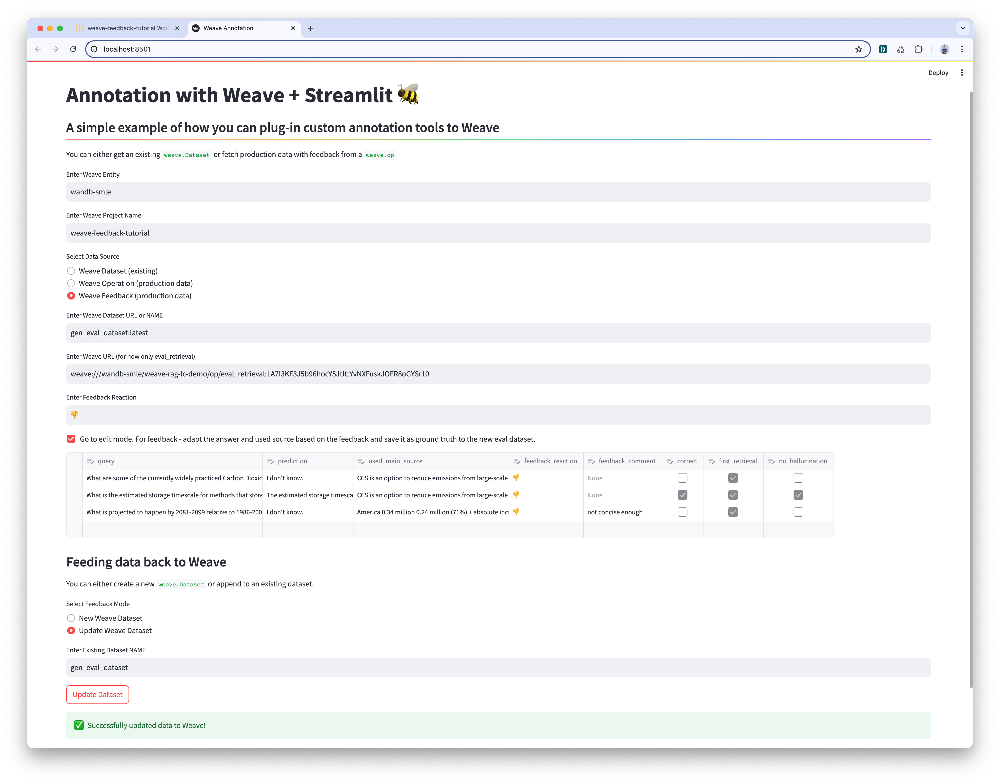
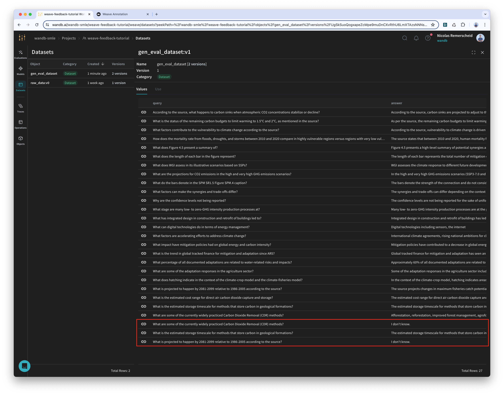

- Motivation
- Setup
- Core content explanation
- One big commented example code
- Call to action
- Optional: additional code needed to run the example

# Using Feedback with Weave: User and Expert Feedback to Improve Evaluation
In order to successfully deploy LLM apps that correspond to the users' expectation it's important to have an evaluation pipeline that produces representative metrics for both the specific user group and the specific set of use-cases. In order to guarantee this we need to continously gather feedback from the user (user group) and domain experts (use-case).

Here we'll do that using a custom chatbnot and argilla as sota tool - together with a best practice workflow that we've seen across users.

### Feedback Types
We consider three different types of feedback that are useful to improve the evaluation pipeline:

1. **User Feedback:** The user gives direct feedback on the answer of the chatbot. This can be done by only giving a reaction (e.g. thumbs up or thumbs down) or by also writing a note.

    * **Pro**: This gives the most direct signal on the performance of the app since the question and the feedback are directly from the user from the app context.
    * **Con**: This also gives the noisiest signal since it's subject to the user's mood, the user's understanding of the question, and the user's understanding of the answer. Also it only gives a feedback for the final generation and not for the intermediate steps of the generation process which make it harder to improve specific components of the app (e.g. retrieval or generation of the RAG).

2. **Expert Feedback:** An expert annotates the answer of the chatbot. This can be done by either requiring only a score or by also writing a note.

    * **Pro**: This gives a more neutral and clear signal on the performance of the app since it's coming from an expert.
    * **Con**: This might give a less representative signal since it's not from the user actually using the app. Also it's more expensive to collect this feedback since it requires to hire experts/annotators to annotate the data.
    
3. **Synthetic Feedback:** Using one or multiple LLM judges to evaluate the answer of the chatbot. This can also be done by only giving a score or by also requiring an explanation.

    * **Pro**: This is more cost-effective than annotators and can be done before deploying the app. Also it can be done for multiple LLMs at the same time which can be used to mitigate judge bias.
    * **Con**: This might give a less representative or hallucinated signal compared to the user or expert feedback.

So far we have found that a combination of all three types of feedback is the most effective way to improve the evaluation pipeline. The following tutorial will guide you through the creation of a systematic evaluation pipeline that uses all three types of feedback with Weave:

1. **1st Evaluation (synthetic):**: We use LLM judges to evaluate our RAG chatbot on a synthetic evaluation dataset based on the documents the RAG chatbot is supposed to use as context to answer questions. 
2. **2nd Evaluation (user):** We deploy the RAG chatbot to a specific group of users and let them ask some questions and encourage them to give some direct feedback (reaction + notes). We track their reactions as positive and negative rates as live evaluation while it's running in production. 
3. **3rd Evaluation (expert):** We pull all question-answer-pairs with a negative reaction into an annotation UI and let experts annotate the given answer with help of the given feedback from the user. We save back the new annotated samples as a new version of the existing evaluation dataset and run evaluations again.

:::note
Regardless of the type of feedback generating a synthetic evaluation dataset based on the documents the RAG chatbot is supposed to use as context to answer questions is a good manner to generate a first representative evaluation dataset (question-answer-sources-pairs) that can be used to evaluate the RAG chatbot before gathering enough production data.
:::

# Implementation
In this tutorial we'll focus on setting up the user and expert feedback loop so we'll skip the synthetic datset generation step and LLM evaluation step and directly jump to the user and expert feedback steps.

## 1. Gathering User Feedback from Production

### 1.1 Tracking Calls in Production
Here we're going to set up a minimal Streamlit app to serve to our end users. As you can see we only need weave-specific code in two places: 

```TODO: change chatbot and below code```

* retrieving the newest model developed on Weave 
* adding a decorator to the production function calls (might not even be necessary)

```python
import weave
from openai import OpenAI
import streamlit as st
from uuid import uuid4

st.title("Add feedback")

@weave.op
def chat_response(prompt):
    stream = client.chat.completions.create(
        model="gpt-4o",
        messages=[
            {"role": "user", "content": prompt},
            *[{"role": m["role"], "content": m["content"]} for m in st.session_state.messages]
        ],
        stream=True,
    )
    response = st.write_stream(stream)
    return response

client = OpenAI(api_key=st.secrets["OPENAI_API_KEY"])

def display_chat_messages():
    for message in st.session_state.messages:
        with st.chat_message(message["role"]):
            st.markdown(message["content"])

def get_and_process_prompt():
    if prompt := st.chat_input("What is up?"):
        st.session_state.messages.append({"role": "user", "content": prompt})
    
        with st.chat_message("user"):
            st.markdown(prompt)

        with st.chat_message("assistant"):
            with weave.attributes({'session': 12345}):
                call = chat_response.call(prompt)
                st.button(":thumbsup:",   on_click=lambda: call.feedback.add_reaction("👍"), key='up')
                st.button(":thumbsdown:", on_click=lambda: call.feedback.add_reaction("👎"), key='down')
                st.session_state.messages.append({"role": "assistant", "content": call.output})
        
def init_weave():
    # highlight-next-line
    client = weave.init('feedback-example')

def init_chat_history():
    if "messages" not in st.session_state:
        st.session_state.messages = st.session_state.messages = []

def main():
    session_id = str(uuid4())
    st.session_state['session_id'] = session_id
    init_weave()
    init_chat_history()
    display_chat_messages()
    get_and_process_prompt()

if __name__ == "__main__":
    main()
```

Save this to a file called `chatbot.py`. We can run it with `streamlit run chatbot.py`. 
Now, you can interact with this application and click the feedback buttons after each response. 
Visit the Weave UI to see the attached feedback.


### 1.2 User Feedback Collection through App UI
Again the Weave Feedback API faciliates this greatly. Feedback can be attached directly to the existing production trace using a single line of code. In this case we want to give the user the possibility to add a positive or negatve reaction along with an optional note.

If we consider our decorated prediction function as:
```python
# highlight-next-line
@weave.op
def predict(input_data):
    # Your prediction logic here
    return some_output
```

We can use it as usal to deliver some model response to the user:

```python
output = predict(input_data="your data here") # user question through the App UI
```

To attach feedback, you need the `call` object, which is obtained by using the `.call()` method:

```python
call = predict.call(input_data="your data here")
```

This call object is needed for attaching feedback to the specific response.
After making the call, you can access the output of the operation using:

```python
output = call.output
```

```python
call.feedback.add_reaction("👍") # user reaction through the App UI
```

## 2. Gathering Expert Feedback from Annotation UI

### 2.1 Fetch Production Calls based on User Feedback
To use the user feedback to improve our model, we need to fetch the production calls. However, since there are probably a lot of production calls we only want to retrieve the problematic calls that were rated as bad by the users (the 👎 ones).

This can be done very easily in Weave by defining feedback calls with a specific "reaction":
```python
import weave
client = weave.init('feedback-example')
# highlight-next-line
thumbs_down = client.feedback(reaction="👎")
calls = thumbs_down.refs().calls()
```

### 2.2 Expert Feedback through Annotation UI
Now we only need to display these production calls in a annotation UI for experts to annotate them. This can be done with different specialized tools or in a simple Streamlit app.

In the following we have created a simple Streamlite app that extracts the last emoji and comment attached to the trace and displays it along the user query, the model response, and the used source documents.

```python 
import weave
import pandas as pd
import streamlit as st

@st.cache_resource
def start_weave(entity: str, project_name: str):
    # highlight-next-line
    return weave.init(entity + "/" + project_name)

@st.cache_resource
def assemble_feedback_data(entity:str, project_name: str) -> pd.DataFrame:
    data = []
    client = start_weave(entity, project_name)
    # highlight-next-line
    thumbs_down = client.feedback(reaction=feedback_name)
    # highlight-next-line
    calls = thumbs_down.refs().calls()
    print(calls)
    for call in calls:
        last_reaction, last_comment = None, None
        for f in call.feedback[::-1]:
            if f.feedback_type == "wandb.reaction.1":
                last_reaction = f.payload["emoji"]
            elif f.feedback_type == "wandb.note.1":
                last_comment = f.payload["note"]
            if last_reaction and last_comment:
                break

        # NOTE: this can be easily customized based on the needed feedback structure
        data.append({
            # prediction - used as question and target answer and url in dataset
            "query": call.inputs['example']['query'],
            "prediction": call.output["model_output"]["result"]["content"],
            "used_main_source": call.output["model_output"]["source_documents"][0]["url"],
            # feedback - used to guide the annotation
            "feedback_reaction": last_reaction,
            "feedback_comment": last_comment,
        })
    return pd.DataFrame(data)

# store the calls in a pandas DF
weave_dataset_df = assemble_feedback_data("prod_team", "rag_project")
```

Now we're using Streamlit's power to create a simple annotation UI with a single line of code:
```python
edited_df = st.data_editor(weave_dataset_df, num_rows="dynamic")
```

And finally save the new changes as a new version of the existing evaluation dataset:
```python
dataset_name = st.text_input("Enter Existing Dataset NAME:VERSION", "gen_eval_dataset:latest")
dataset_name = dataset_name.split(":")[0]

# get the exisiting dataset as a list of dictionaries
# highlight-next-line
rows = [dict(elem) for elem in weave.ref(dataset_name).get().rows]

# add the newly annotated production 👎 calls to the existing dataset
for elem in edited_df.to_dict(orient="records"):
    rows.append(
        {
            "query": elem["query"], 
            "answer": elem["prediction"], 
            "main_source": elem["used_main_source"],
        }
    )

# update the dataset with the new rows
if st.button("Update Dataset"):
    # highlight-next-line
    dataset = weave.Dataset(
        # highlight-next-line
        name=dataset_name, 
        # highlight-next-line
        rows=rows,
    # highlight-next-line
    )
    # highlight-next-line
    weave.publish(dataset)
    st.success("Successfully updated data to Weave!", icon="✅")
```

In the following you can a screenshot of the simple annotation UI and of the resulting dataset.




## 3. Run new Evaluation with the new Dataset
After gathering new 👎 feedback and annotating it, we can now run our evaluation code again. This time we will use the new version of the evaluation dataset and use the comparison feature to understand how the impact of 👎 calls impacted the model performance. Of course it also makes sense to include positive annotated calls into the dataset to balance evaluation dataset. 

For more information on the evaluation workflow see the [Evaluation](./tutorial-eval.md) tutorial for more details.
