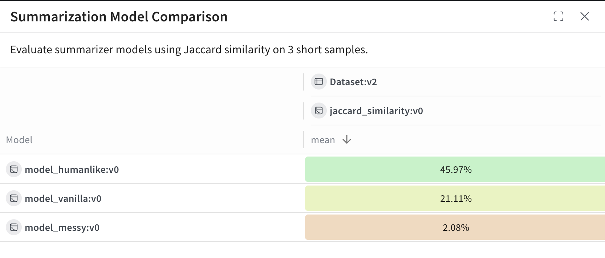

# Leaderboards

Use W&B Weave _Leaderboards_ to evaluate and compare multiple models across multiple metrics and measure accuracy, generation quality, latency, or custom evaluation logic. A leaderboard helps you visualize model performance in a central location, track changes over time, and align on team-wide benchmarks.

Leaderboards are ideal for:

- Tracking model performance regressions
- Coordinating shared evaluation workflows


## Create a Leaderboard

You can create a leaderboard via the [Weave UI](#ui) or [programmatically](#python).

### UI

To create and customize leaderboards directly in the Weave UI:

1. In the Weave UI, Navigate to the **Leaders** section. If it's not visible, click **More** → **Leaders**.
2. Click **+ New Leaderboard**.
3. In the **Leaderboard Title** field, enter a descriptive name (e.g., `summarization-benchmark-v1`).
4. Optionally, add a description to explain what this leaderboard compares.
5. [Add columns](#add-columns) to define which evaluations and metrics to display.
6. Once you're happy with the layout, save and publish your leaderboard to share it with others.

#### Add columns

Each column in a leaderboard represents a metric from a specific evaluation. To configure a column, you specify:

- **Evaluation**: Select an evaluation run from the dropdown (must be previously created).
- **Scorer**: Choose a scoring function (e.g., `jaccard_similarity`, `simple_accuracy`) used in that evaluation.
- **Metric**: Choose a summary metric to display (e.g., `mean`, `true_fraction`, etc.).

To add more columns, click **Add Column**.

To edit a column, click its three-dot menu (`⋯`) on the right. You can:

- **Move before / after** – Reorder columns
- **Duplicate** – Copy the column definition
- **Delete** – Remove the column
- **Sort ascending** – Set the default sort for the leaderboard (click again to toggle descending)

### Python

:::tip
Looking for a complete, runnable code sample? See the [End-to-end Python example](#end-to-end-python-example).
:::

To create and publish a leaderboard:

1. Define a test dataset. You can use the built-in [`Dataset`](datasets.md), or define a list of inputs and targets manually:

   ```python
   dataset = [
       {"input": "...", "target": "..."},
       ...
   ]
   ```

2. Define one or more [scorers](../evaluation/scorers.md):

   ```python
   @weave.op
   def jaccard_similarity(target: str, output: str) -> float:
       ...
   ```

3. Create an [`Evaluation`](../core-types/evaluations.md):

   ```python
   evaluation = weave.Evaluation(
       name="My Eval",
       dataset=dataset,
       scorers=[jaccard_similarity],
   )
   ```

4. Define models to be evaluated:

   ```python
   @weave.op
   def my_model(input: str) -> str:
       ...
   ```

5. Run the evaluation:

   ```python
    async def run_all():
        await evaluation.evaluate(model_vanilla)
        await evaluation.evaluate(model_humanlike)
        await evaluation.evaluate(model_messy)

   asyncio.run(run_all())
   ```

6. Create the leaderboard:

   ```python
   spec = leaderboard.Leaderboard(
       name="My Leaderboard",
       description="Evaluating models on X task",
       columns=[
           leaderboard.LeaderboardColumn(
               evaluation_object_ref=get_ref(evaluation).uri(),
               scorer_name="jaccard_similarity",
               summary_metric_path="mean",
           )
       ]
   )
   ```

7. Publish the leaderboard.

   ```python
   weave.publish(spec)
   ```

8. Retrieve the results:

   ```python
   results = leaderboard.get_leaderboard_results(spec, client)
   print(results)
   ```

## End-to-End Python example

The following example uses Weave Evaluations and creates a leaderboard to compare three summarization models on a shared dataset using a custom metric. It creates a small benchmark, evaluates each model, scores each model with [Jaccard similarity](https://www.learndatasci.com/glossary/jaccard-similarity/), and publishes the results to a Weave leaderboard.

```python
import weave
from weave.flow import leaderboard
from weave.trace.ref_util import get_ref
import asyncio

client = weave.init("leaderboard-demo")

dataset = [
    {
        "input": "Weave is a tool for building interactive LLM apps. It offers observability, trace inspection, and versioning.",
        "target": "Weave helps developers build and observe LLM applications."
    },
    {
        "input": "The OpenAI GPT-4o model can process text, audio, and vision inputs, making it a multimodal powerhouse.",
        "target": "GPT-4o is a multimodal model for text, audio, and images."
    },
    {
        "input": "The W&B team recently added native support for agents and evaluations in Weave.",
        "target": "W&B added agents and evals to Weave."
    }
]

@weave.op
def jaccard_similarity(target: str, output: str) -> float:
    target_tokens = set(target.lower().split())
    output_tokens = set(output.lower().split())
    intersection = len(target_tokens & output_tokens)
    union = len(target_tokens | output_tokens)
    return intersection / union if union else 0.0

evaluation = weave.Evaluation(
    name="Summarization Quality",
    dataset=dataset,
    scorers=[jaccard_similarity],
)

@weave.op
def model_vanilla(input: str) -> str:
    return input[:50]

@weave.op
def model_humanlike(input: str) -> str:
    if "Weave" in input:
        return "Weave helps developers build and observe LLM applications."
    elif "GPT-4o" in input:
        return "GPT-4o supports text, audio, and vision input."
    else:
        return "W&B added agent support to Weave."

@weave.op
def model_messy(input: str) -> str:
    return "Summarizer summarize models model input text LLMs."

async def run_all():
    await evaluation.evaluate(model_vanilla)
    await evaluation.evaluate(model_humanlike)
    await evaluation.evaluate(model_messy)

asyncio.run(run_all())

spec = leaderboard.Leaderboard(
    name="Summarization Model Comparison",
    description="Evaluate summarizer models using Jaccard similarity on 3 short samples.",
    columns=[
        leaderboard.LeaderboardColumn(
            evaluation_object_ref=get_ref(evaluation).uri(),
            scorer_name="jaccard_similarity",
            summary_metric_path="mean",
        )
    ]
)

weave.publish(spec)

results = leaderboard.get_leaderboard_results(spec, client)
print(results)
```

### View and interpret the Leaderboard

After the script finishes running, view view the leaderboard:

1. In the **Weave UI**, go to the **Leaders** tab. If it's not visible, click **More**, then select **Leaders**.
2. Click on the name of your leaderboard—e.g. `Summarization Model Comparison`.

In the leaderboard table, each row represents a given model (`model_humanlike`, `model_vanilla`, `model_messy`). The `mean` column shows the average Jaccard similarity between the model's output and the reference summaries.



For this example:

- `model_humanlike` performs the best, with \~46% overlap.
- `model_vanilla` (a naive truncation) gets \~21%.
- `model_messy` an intentionally bad model, scores \~2%.
