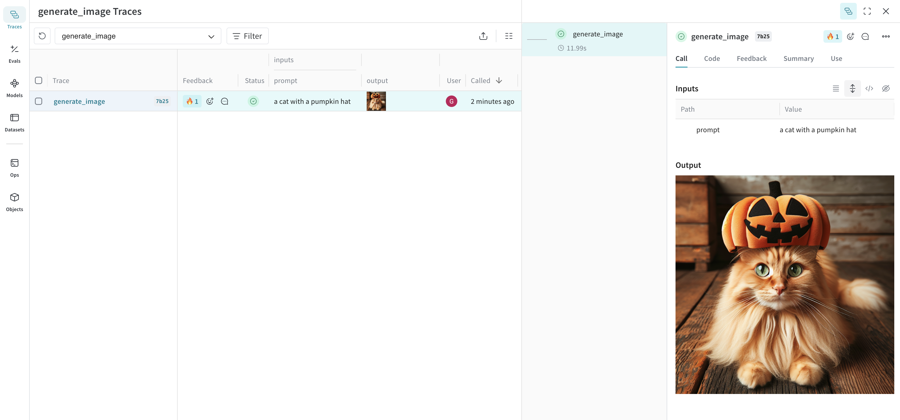
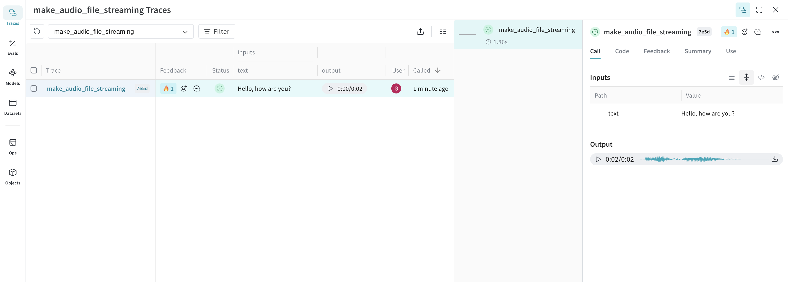

import Tabs from '@theme/Tabs';
import TabItem from '@theme/TabItem';

# Logging media

Weave supports logging and displaying video, images, and audio.

## Video

Weave automatically logs videos using [`moviepy`](https://zulko.github.io/moviepy/). This allows you to pass video inputs and outputs to traced functions, and Weave will automatically handle uploading and storing video data.

:::note
Video support is currently only available in Python.
:::

For usage information, see [Video Support](../tracking/video).

## Images

Logging type: `PIL.Image.Image`. 

:::important
Base64-encoded image strings (e.g., `data:image/jpeg;base64,...`) are technically supported but discouraged. They can cause performance issues and should only be used if absolutely necessary (e.g., for integration with specific APIs).
:::

The following example shows how to log an image generated via the OpenAI DALL-E API:

<Tabs groupId="programming-language" queryString>
  <TabItem value="python" label="Python" default>
  
    ```python
    import weave
    from openai import OpenAI
    import requests
    from PIL import Image

    weave.init('image-example')
    client = OpenAI()

    @weave.op
    def generate_image(prompt: str) -> Image:
        response = client.images.generate(
            model="dall-e-3",
            prompt=prompt,
            size="1024x1024",
            quality="standard",
            n=1,
        )
        image_url = response.data[0].url
        image_response = requests.get(image_url, stream=True)
        image = Image.open(image_response.raw)

        # return a PIL.Image.Image object to be logged as an image
        return image

    generate_image("a cat with a pumpkin hat")
    ```

  </TabItem>
  <TabItem value="typescript" label="TypeScript">

    ```typescript
    import {OpenAI} from 'openai';
    import * as weave from 'weave';

    async function main() {
        const client = await weave.init('image-example');
        const openai = new OpenAI();

        const generateImage = weave.op(async (prompt: string) => {
            const response = await openai.images.generate({
                model: 'dall-e-3',
                prompt: prompt,
                size: '1024x1024',
                quality: 'standard',
                n: 1,
            });
            const imageUrl = response.data[0].url;
            const imgResponse = await fetch(imageUrl);
            const data = Buffer.from(await imgResponse.arrayBuffer());

            return weave.weaveImage({data});
        });

        generateImage('a cat with a pumpkin hat');
    }

    main();
    ```

  </TabItem>
</Tabs>

This image is logged to Weave and automatically displayed in the UI. 



## Audio

Logging type: `wave.Wave_read`. 

The following example shows how to log an audio file using OpenAI's speech generation API.

<Tabs groupId="programming-language" queryString>
  <TabItem value="python" label="Python" default>
  
    ```python
    import weave
    from openai import OpenAI
    import wave

    weave.init("audio-example")
    client = OpenAI()


    @weave.op
    def make_audio_file_streaming(text: str) -> wave.Wave_read:
        with client.audio.speech.with_streaming_response.create(
            model="tts-1",
            voice="alloy",
            input=text,
            response_format="wav",
        ) as res:
            res.stream_to_file("output.wav")

        # return a wave.Wave_read object to be logged as audio
        return wave.open("output.wav")

    make_audio_file_streaming("Hello, how are you?")
    ```

  </TabItem>
  <TabItem value="typescript" label="TypeScript">

    ```typescript
    import {OpenAI} from 'openai';
    import * as weave from 'weave';

    async function main() {
        await weave.init('audio-example');
        const openai = new OpenAI();

        const makeAudioFileStreaming = weave.op(async function audio(text: string) {
            const response = await openai.audio.speech.create({
                model: 'tts-1',
                voice: 'alloy',
                input: text,
                response_format: 'wav',
            });

            const chunks: Uint8Array[] = [];
            for await (const chunk of response.body) {
                chunks.push(chunk);
            }
            return weave.weaveAudio({data: Buffer.concat(chunks)});
        });

        await makeAudioFileStreaming('Hello, how are you?');
    }

    main();
    ```

  </TabItem>
</Tabs>

This audio is logged to Weave and automatically displayed in the UI, along with an audio player. In the audio player, you can view and download the raw audio waveform.



:::tip
Try our cookbook for [Audio Logging](/reference/gen_notebooks/audio_with_weave) or <a href="https://colab.research.google.com/github/wandb/weave/blob/master/docs/./notebooks/audio_with_weave.ipynb" target="_blank" rel="noopener noreferrer" class="navbar__item navbar__link button button--secondary button--med margin-right--sm notebook-cta-button"><div><div>Open in Colab</div></div></a>. The cookbook also includes an advanced example of a Real Time Audio API based assistant integrated with Weave.
:::
