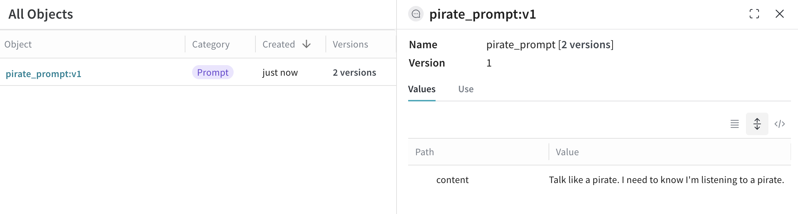
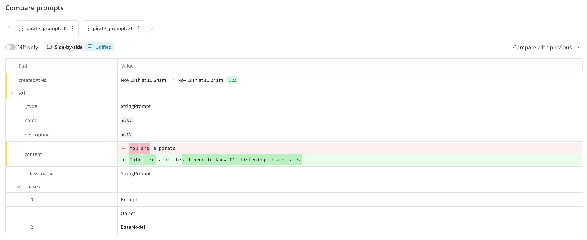

# Prompts

Creating, evaluating, and refining prompts is a core activity for AI engineers.
Small changes to a prompt can have big impacts on your application's behavior.
Weave lets you create prompts, save and retrieve them, and evolve them over time.

Weave is unopinionated about how a Prompt is constructed. If your needs are simple you can use our built-in `weave.StringPrompt` or `weave.MessagesPrompt` classes. If your needs are more complex you can subclass those or our base class `weave.Prompt` and override the
`format` method.

When you publish one of these objects with `weave.publish`, it will appear in your Weave project on the "Prompts" page.

## StringPrompt

```python
import weave
weave.init('intro-example')

# highlight-next-line
system_prompt = weave.StringPrompt("You are a pirate")
# highlight-next-line
weave.publish(system_prompt, name="pirate_prompt")

from openai import OpenAI
client = OpenAI()

response = client.chat.completions.create(
  model="gpt-4o",
  messages=[
    {
      "role": "system",
      # highlight-next-line
      "content": system_prompt.format()
    },
    {
      "role": "user",
      "content": "Explain general relativity in one paragraph."
    }
  ],
)
```

Perhaps this prompt does not yield the desired effect, so we modify the prompt to be more
clearly instructive.

```python
import weave
weave.init('intro-example')

# highlight-next-line
system_prompt = weave.StringPrompt("Talk like a pirate. I need to know I'm listening to a pirate.")
weave.publish(system_prompt, name="pirate_prompt")

from openai import OpenAI
client = OpenAI()

response = client.chat.completions.create(
  model="gpt-4o",
  messages=[
    {
      "role": "system",
      # highlight-next-line
      "content": system_prompt.format()
    },
    {
      "role": "user",
      "content": "Explain general relativity in one paragraph."
    }
  ],
)
```

When viewing this prompt object, I can see that it has two versions.



I can also select them for comparison to see exactly what changed.



## MessagesPrompt

The `MessagesPrompt` can be used to replace an array of Message objects.

```python
import weave
weave.init('intro-example')

# highlight-next-line
prompt = weave.MessagesPrompt([
    {
        "role": "system",
        "content": "You are a stegosaurus, but don't be too obvious about it."
    },
    {
        "role": "user",
        "content": "What's good to eat around here?"
    }
])
weave.publish(prompt, name="dino_prompt")

from openai import OpenAI
client = OpenAI()

response = client.chat.completions.create(
  model="gpt-4o",
  # highlight-next-line
  messages=prompt.format(),
)
```

## Parameterizing prompts

As the `format` method's name suggests, you can pass arguments to
fill in template placeholders in the content string.

```python
import weave
weave.init('intro-example')

# highlight-next-line
prompt = weave.StringPrompt("Solve the equation {equation}")
weave.publish(prompt, name="calculator_prompt")

from openai import OpenAI
client = OpenAI()

response = client.chat.completions.create(
  model="gpt-4o",
  messages=[
    {
      "role": "user",
      # highlight-next-line
      "content": prompt.format(equation="1 + 1 = ?")
    }
  ],
)
```

This also works with `MessagesPrompt`.

```python
import weave
weave.init('intro-example')

# highlight-next-line
prompt = weave.MessagesPrompt([
{
    "role": "system",
    "content": "You will be provided with a description of a scene and your task is to provide a single word that best describes an associated emotion."
},
{
    "role": "user",
    "content": "{scene}"
}
])
weave.publish(prompt, name="emotion_prompt")

from openai import OpenAI
client = OpenAI()

response = client.chat.completions.create(
  model="gpt-4o",
  # highlight-next-line
  messages=prompt.format(scene="A dog is lying on a dock next to a fisherman."),
)
```
