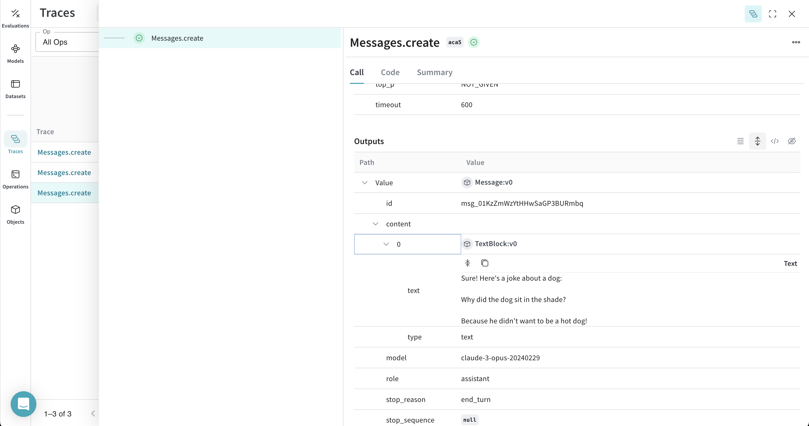
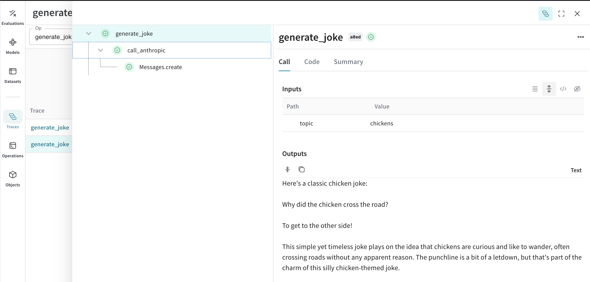
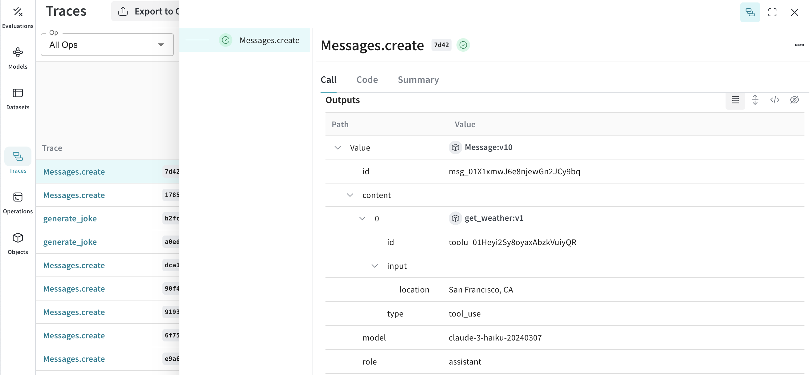

# Anthropic

Weave automatically tracks and logs LLM calls made via the [Anthropic Python library](https://github.com/anthropics/anthropic-sdk-python), after `weave.init()` is called.

## Traces

It’s important to store traces of LLM applications in a central database, both during development and in production. You’ll use these traces for debugging, and as a dataset that will help you improve your application.

Weave will automatically capture traces for [anthropic-sdk-python](https://github.com/anthropics/anthropic-sdk-python). You can use the library as usual, start by calling `weave.init()`:

```python
    import weave
    weave.init("anthropic_project")
    
    # use the anthropic library as usual
    import os
    from anthropic import Anthropic

    client = Anthropic(
        api_key=os.environ.get("ANTHROPIC_API_KEY"),
    )

    message = client.messages.create(
        max_tokens=1024,
        messages=[
            {
                "role": "user",
                "content": "Tell me a joke about a dog",
            }
        ],
        model="claude-3-opus-20240229",
    )
    print(message.content)
```


Weave will now track and log all LLM calls made through the Anthropic library. You can view the traces in the Weave web interface.

[](https://wandb.ai/capecape/anthropic_project/weave/calls)

:::note
We patch the anthropic `Messages.create` method for you to keep track of your LLM calls.
:::


Weave will now track and log all LLM calls made through Anthropic. You can view the logs and insights in the Weave web interface.

## Wrapping with your own ops

Weave ops make results *reproducible* by automatically versioning code as you experiment, and they capture their inputs and outputs. Simply create a function decorated with [`@weave.op()`](https://wandb.github.io/weave/guides/tracking/ops) that calls into [`Anthropic.messages.create`](https://docs.anthropic.com/en/api/messages-examples) and Weave will track the inputs and outputs for you. Let's see how we can do this in nested example:

```python
# highlight-next-line
@weave.op()
def call_anthropic(user_input:str, model:str) -> str:
    message = client.messages.create(
    max_tokens=1024,
    messages=[
        {
            "role": "user",
            "content": user_input,
        }
        ],
        model=model,
    )
    return message.content[0].text

# highlight-next-line
@weave.op()
def generate_joke(topic: str) -> str:
    return call_anthropic(f"Tell me a joke about {topic}", model="claude-3-haiku-20240307")

print(generate_joke("chickens"))
print(generate_joke("cars"))
```

[](https://wandb.github.io/weave/guides/tracking/ops)

## Tools (function calling)

Anthropic provides [tools](https://docs.anthropic.com/en/docs/tool-use) interface for calling functions. Weave will automatically track those functions calls.

```python
message = client.messages.create(
    max_tokens=1024,
    messages=[
        {
            "role": "user",
            "content": "What's the weather like in San Francisco?",
        }
    ],
    tools=[
        {
            "name": "get_weather",
            "description": "Get the current weather in a given location",
            "input_schema": {
                "type": "object",
                "properties": {
                    "location": {
                        "type": "string",
                        "description": "The city and state, e.g. San Francisco, CA",
                    }
                },
                "required": ["location"],
            },
        },
    ],
    model=model,
)

print(message)
```

We automatically capture the tools you used on the prompt and keep them versioned.

[](https://wandb.ai/capecape/anthropic_project/weave/calls)
