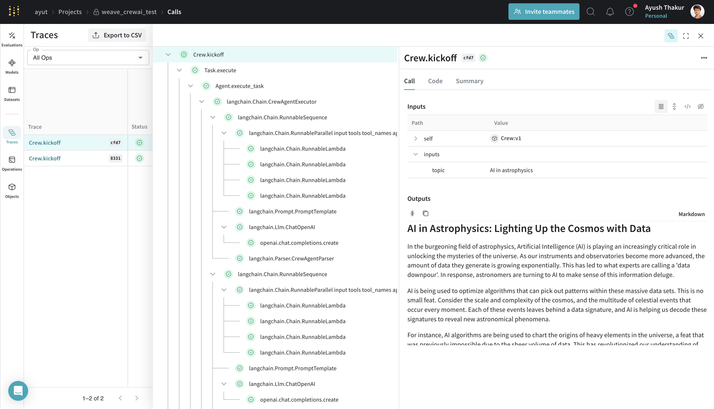

# CrewAI

[CrewAI](https://www.crewai.com) is a framework for orchestrating role-playing, autonomous AI agents. The framework is built on top of Langchain and allows users to build agents that can work together, tackle complex tasks with planning and tool usage.

## Tracing

Agents are complex in nature and usually rely on multiple LLM calls (sometimes in the order of hundreds). Agents need to talk and plan among each other to achieve one or more tasks. CrewAI abstracts away many pain points, but it can still be a debugging nightmare without proper observability and tracing.

With Weave, you can store traces of your "Crew" in a central database when you "kickoff" your Crew. You can use these traces for debugging your Crew. It also captures underlying Langchain invocations.

Start capturing by calling `weave.init(<entity/project-name>)` with a project name your choice.

```python
from crewai import Agent
from crewai import Task
from crewai import Crew, Process
from crewai_tools import SerperDevTool

import weave

# highlight-next-line
weave.init('my-dummy-agent')

# Build your Crew from CrewAI's Getting Started: https://docs.crewai.com/how-to/Creating-a-Crew-and-kick-it-off/

crew = Crew(
    agents=[researcher, writer],
    tasks=[research_task, write_task],
    process=Process.sequential,
    memory=True,
    cache=True,
    max_rpm=100,
    share_crew=True
)

result = crew.kickoff(inputs={'topic': 'AI in astrophysics'})
```

[](https://wandb.ai/ayut/weave_crewai_test/weave/calls)
