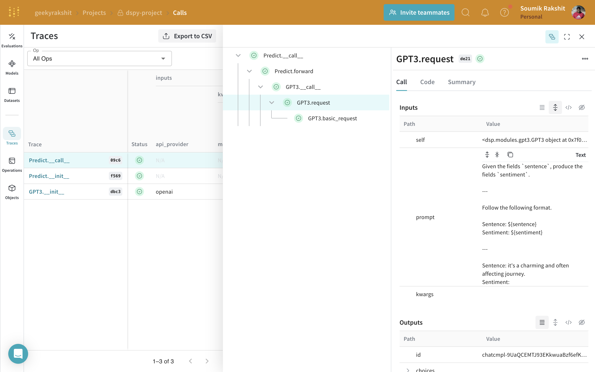
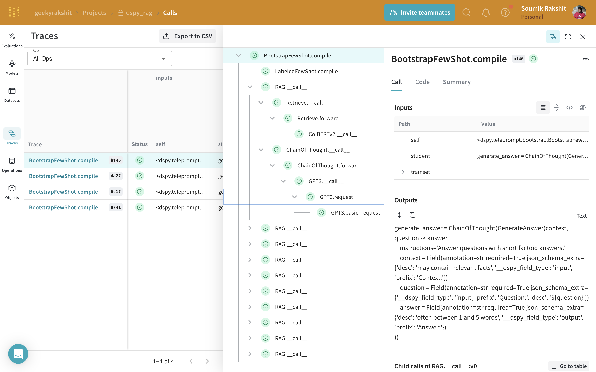
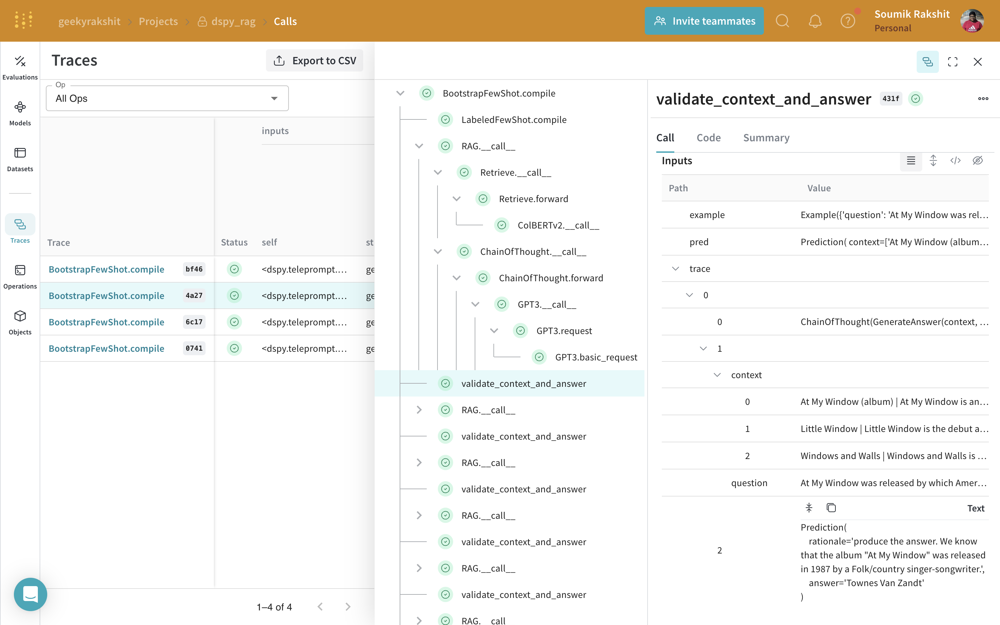

# DSPy

[DSPy](https://dspy-docs.vercel.app/) is a framework for algorithmically optimizing LM prompts and weights, especially when LMs are used one or more times within a pipeline. Weave automatically tracks and logs calls made using DSPy modules and functions.

## Tracing

It’s important to store traces of language model applications in a central location, both during development and in production. These traces can be useful for debugging, and as a dataset that will help you improve your application.

Weave will automatically capture traces for [DSPy](https://dspy-docs.vercel.app/). To start tracking, calling `weave.init(project_name="<YOUR-WANDB-PROJECT-NAME>")` and use the library as normal.

```python
import os
import dspy
import weave

os.environ["OPENAI_API_KEY"] = "<YOUR-OPENAI-API-KEY>"

weave.init(project_name="<YOUR-WANDB-PROJECT-NAME>")

gpt3_turbo = dspy.OpenAI(model="gpt-3.5-turbo-1106", max_tokens=300)
dspy.configure(lm=gpt3_turbo)
classify = dspy.Predict("sentence -> sentiment")
classify(sentence="it's a charming and often affecting journey.")
```

[](https://wandb.ai/geekyrakshit/dspy-project/weave/calls)


## Track your own ops

Wrapping a function with `@weave.op` starts capturing inputs, outputs and app logic so you can debug how data flows through your app. You can deeply nest ops and build a tree of functions that you want to track. This also starts automatically versioning code as you experiment to capture ad-hoc details that haven't been committed to git.

Simply create a function decorated with [`@weave.op`](/guides/tracking/ops).

In the example below, we have the function `validate_context_and_answer` which is the metric function wrapped with `@weave.op`. This helps us see how intermediate steps, like the optimization step for a DSPy application, are affecting the results.

```python
import dspy
from dspy.datasets import HotPotQA
from dspy.teleprompt import BootstrapFewShot

import weave


class GenerateAnswer(dspy.Signature):
    """Answer questions with short factoid answers."""

    context = dspy.InputField(desc="may contain relevant facts")
    question = dspy.InputField()
    answer = dspy.OutputField(desc="often between 1 and 5 words")


class RAG(dspy.Module):
    def __init__(self, num_passages=3):
        super().__init__()

        self.retrieve = dspy.Retrieve(k=num_passages)
        self.generate_answer = dspy.ChainOfThought(GenerateAnswer)
    
    def forward(self, question):
        context = self.retrieve(question).passages
        prediction = self.generate_answer(context=context, question=question)
        return dspy.Prediction(context=context, answer=prediction.answer)

@weabe.op()
def validate_context_and_answer(example, pred, trace=None):
    answer_EM = dspy.evaluate.answer_exact_match(example, pred)
    answer_PM = dspy.evaluate.answer_passage_match(example, pred)
    return answer_EM and answer_PM


weave.init(project_name="dspy_rag")
turbo = dspy.OpenAI(model='gpt-3.5-turbo')
colbertv2_wiki17_abstracts = dspy.ColBERTv2(url='http://20.102.90.50:2017/wiki17_abstracts')
dspy.settings.configure(lm=turbo, rm=colbertv2_wiki17_abstracts)
dataset = HotPotQA(train_seed=1, train_size=20, eval_seed=2023, dev_size=50, test_size=0)
trainset = [x.with_inputs('question') for x in dataset.train]
devset = [x.with_inputs('question') for x in dataset.dev]
teleprompter = BootstrapFewShot(metric=validate_context_and_answer)
compiled_rag = teleprompter.compile(RAG(), trainset=trainset)
```

| [](https://wandb.ai/geekyrakshit/dspy_rag/weave/calls?filter=%7B%22traceRootsOnly%22%3Atrue%7D&peekPath=%2Fgeekyrakshit%2Fdspy_rag%2Fcalls%2F8f643d8d-5b97-4494-b98f-ffc28bd8bf46) | [](https://wandb.ai/geekyrakshit/dspy_rag/weave/calls?filter=%7B%22traceRootsOnly%22%3Atrue%7D&peekPath=%2Fgeekyrakshit%2Fdspy_rag%2Fcalls%2F76dfb9bc-12e6-421b-b9dd-f10916494a27%3Fpath%3Dvalidate_context_and_answer*0%26tracetree%3D1) |
|---|---|
| Not tracing the metric function | Tracing the metric function using `@weave.op()` |
