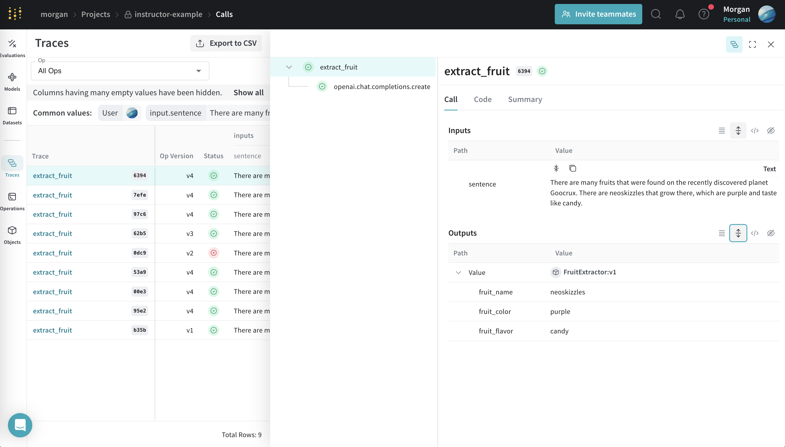

# Instructor

Weave works seamlessly the [Instructor Python library](https://github.com/jxnl/instructor), giving you the better, more consistent structured outputs with Instructor and full observability with Weave.

If you haven't used Instructor you can find the docuementation [here](https://python.useinstructor.com/) as well as our course, [LLM Engineering: Structured Outputs](https://www.wandb.courses/courses/steering-language-models) created by Jason Liu, the creator of Instructor.

If you haven't logged a Trace to Weave yet then start wth the quickstart [here](../../quickstart) and optionally take a deeper look at Tracing[here](../tracking/tracing).

:::note
Ensure to call `weave.init` before calling the Instructor patching of the model vendor client.

For example: 

```
# 1. first init weave
weave.init('instructor-example')

# 2. then patch the model vendor library
client = instructor.from_openai(OpenAI())
```
:::

## Example

1. Install Instructor:
   ```bash
   pip install instructor weave
   ```

2. Use the Instructor library as usual, remembering to call `weave.init` before patching the model vendor client, `OpenAI` in this case:

    ```python
    import weave
    import instructor
    from openai import OpenAI
    from pydantic import BaseModel

    class FruitExtractor(BaseModel):
        fruit_name: str
        fruit_color: str
        fruit_flavor: str

    # first init weave
    weave.init('instructor-example')

    # then patch the model vendor library
    client = instructor.from_openai(OpenAI())

    # use weave.op as usual
    @weave.op()
    def extract_fruit(sentence: str) -> dict:
        
        fruit_description = client.chat.completions.create(
        model="gpt-3.5-turbo-1106",
        response_model=FruitExtractor,
        messages=[
            {
                "role": "system",
                "content": "Your task is to extract the fruit, color and flavor from a given sentence."
            },
            {
                "role": "user",
                "content": sentence
            }
            ],
        )
        return fruit_description


    sentence = "There are many fruits that were found on the recently discovered planet Goocrux. \
    There are neoskizzles that grow there, which are purple and taste like candy."

    extract_fruit(sentence)

    ```

Weave will now track and log all LLM calls made via libraries patched using Instructor. You can view the logs and insights in the Weave web interface.

[](https://wandb.ai/morgan/instructor-example/weave/calls)
