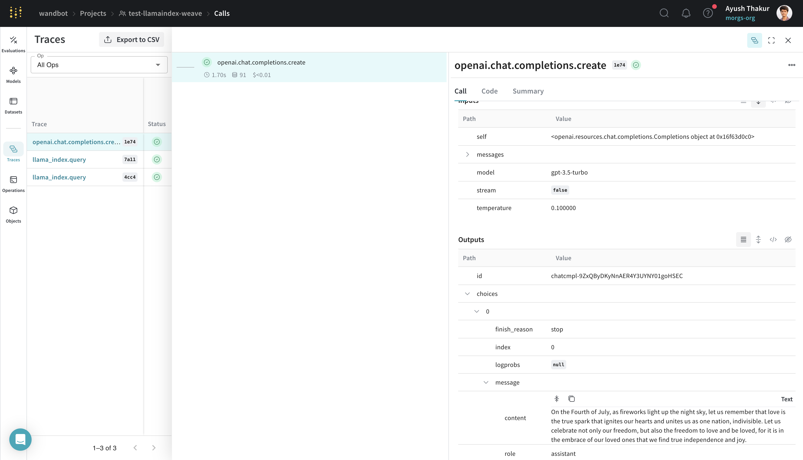
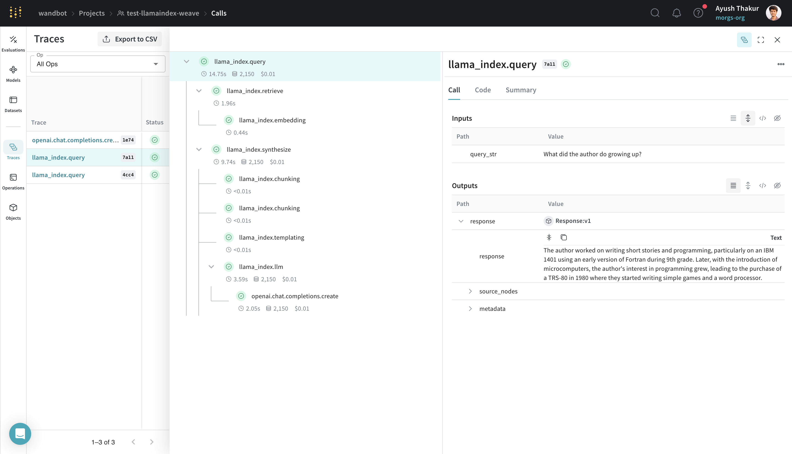
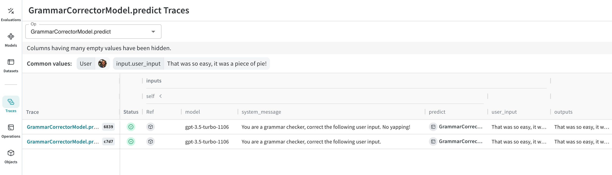

# LlamaIndex

Weave is designed to make tracking and logging all calls made through the [LlamaIndex Python library](https://github.com/run-llama/llama_index) effortless.

When working with LLMs, debugging is inevitable. Whether a model call fails, an output is misformatted, or nested model calls create confusion, pinpointing issues can be challenging. [LlamaIndex](https://docs.llamaindex.ai/en/stable/) applications often consist of multiple steps and LLM call invocations, making it crucial to understand the inner workings of your chains and agents.

Weave simplifies this process by automatically capturing traces for your LlamaIndex applications. This enables you to monitor and analyze your application's performance, making it easier to debug and optimize your LLM workflows. Weave also helps with your evaluation workflows.

## Getting Started

To get started, simply call `weave.init()` at the beginning of your script. The argument in `weave.init()` is a project name that will help you organize your traces.

```python
import weave
from llama_index.core.chat_engine import SimpleChatEngine

# Initialize Weave with your project name
# highlight-next-line
weave.init("llamaindex_demo")

chat_engine = SimpleChatEngine.from_defaults()
response = chat_engine.chat(
    "Say something profound and romantic about fourth of July"
)
print(response)
```

In the example above, we are creating a simple LlamaIndex chat engine which under the hood is making an OpenAI call. Check out the trace below:

[](https://wandb.ai/wandbot/test-llamaindex-weave/weave/calls/b6b5d898-2df8-4e14-b553-66ce84661e74)

## Tracing

LlamaIndex is known for it's ease of connecting data with LLM. We can easily build a "query" or "chat" engine with LlamaIndex. A simple RAG application requires an embedding step, retrieval step, response synthesis step. With the increasing complexity it get becomes important to store traces of individual steps in a central database during both development and production. 

These traces are essential for debugging and improving your application by providing a valuable dataset. Weave automatically captures traces for your LlamaIndex applications. It will track and log all calls made through the LlamaIndex library, including prompt templates, LLM calls, tools, and agent steps. You can view the traces in the Weave web interface.

Below is an example of a simple RAG pipeline from LlamaIndex's [Starter Tutorial (OpenAI)](https://docs.llamaindex.ai/en/stable/getting_started/starter_example/):

```python
import weave
from llama_index.core import VectorStoreIndex, SimpleDirectoryReader

# Initialize Weave with your project name
# highlight-next-line
weave.init("llamaindex_demo")

# Assuming you have a `.txt` file in the `data` directory
documents = SimpleDirectoryReader("data").load_data()
index = VectorStoreIndex.from_documents(documents)

query_engine = index.as_query_engine()
response = query_engine.query("What did the author do growing up?")
print(response)
```

The trace timeline not only capture the "events" but it also capture the execution time, cost and token counts where applicable. Drill down the trace to learn more about the different executions.

[](https://wandb.ai/wandbot/test-llamaindex-weave/weave/calls?filter=%7B%22traceRootsOnly%22%3Atrue%7D&peekPath=%2Fwandbot%2Ftest-llamaindex-weave%2Fcalls%2F6ac53407-1bb7-4c38-b5a3-c302bd877a11%3Ftracetree%3D1)

## One-click observability 🔭

LlamaIndex provides [one-click observability 🔭](https://docs.llamaindex.ai/en/stable/module_guides/observability/) to allow you to build principled LLM applications in a production setting.

Our integration leverages this capability of LlamaIndex and automatically sets [`WeaveCallbackHandler()`](/weave/weave/integrations/llamaindex/llamaindex.py) to `llama_index.core.global_handler`. Thus as a user of LlamaIndex and Weave all you need to do is initialize a Weave run - `weave.init(<name-of-project>)`

## Create a `Model` for easier experimentation

Organizing and evaluating LLMs in applications for various use cases is challenging with multiple components, such as prompts, model configurations, and inference parameters. Using the [`weave.Model`](/guides/core-types/models), you can capture and organize experimental details like system prompts or the models you use, making it easier to compare different iterations.

The following example demonstrates building a LlamaIndex query engine in a `WeaveModel`:

```python

```


## Create a `Model` for easier experimentation

Organizing experimentation is difficult when there are many moving pieces. By using the [`Model`](/guides/core-types/models) class, you can capture and organize the experimental details of your app like your system prompt or the model you're using. This helps organize and compare different iterations of your app. 

In addition to versioning code and capturing inputs/outputs, [`Model`](/guides/core-types/models)s capture structured parameters that control your application’s behavior, making it easy to find what parameters worked best. You can also use Weave Models with `serve`, and [`Evaluation`](/guides/core-types/evaluations)s.

In the example below, you can experiment with `model` and `system_message`. Every time you change one of these, you'll get a new _version_ of `GrammarCorrectorModel`. 

```python
import weave
from openai import OpenAI

weave.init('grammar-openai')

class GrammarCorrectorModel(weave.Model): # Change to `weave.Model`
  model: str
  system_message: str

  @weave.op()
  def predict(self, user_input): # Change to `predict`
    client = OpenAI()
    response = client.chat.completions.create(
      model=self.model,
      messages=[
          {
              "role": "system",
              "content": self.system_message
          },
          {
              "role": "user",
              "content": user_input
          }
          ],
          temperature=0,
    )
    return response.choices[0].message.content


corrector = GrammarCorrectorModel(
    model="gpt-3.5-turbo-1106",
    system_message = "You are a grammar checker, correct the following user input.")
result = corrector.predict("That was so easy, it was a piece of pie!")
print(result)
```

[](https://wandb.ai/_scott/grammar-openai/weave/calls)
