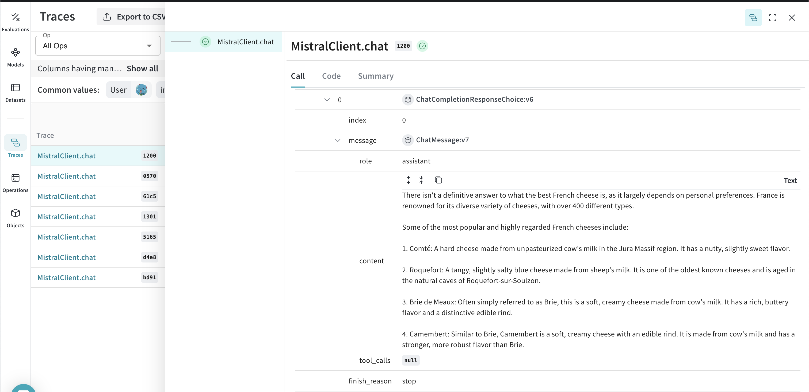

# MistralAI

Weave automatically tracks and logs LLM calls made via the [MistralAI Python library](https://github.com/mistralai/client-python), after `weave.init()` is called.

## Setup

1. Install the MistralAI Python library:
   ```bash
   pip install mistralai weave
   ```

2. Initialize Weave in your Python script:
   ```python
   import weave
   weave.init("my_llm_project")
   ```
   :::note
   We patch the mistral `chat_completion` method for you to keep track of your LLM calls.
   :::

3. Use the MistralAI library as usual:

    ```python
    import os
    from mistralai.client import MistralClient
    from mistralai.models.chat_completion import ChatMessage

    api_key = os.environ["MISTRAL_API_KEY"]
    model = "mistral-large-latest"

    client = MistralClient(api_key=api_key)

    messages = [
        ChatMessage(role="user", content="What is the best French cheese?")
    ]

    chat_response = client.chat(
        model=model,
        messages=messages,
    )

    print(chat_response.choices[0].message.content)
    ```

Weave will now track and log all LLM calls made through the MistralAI library. You can view the logs and insights in the Weave web interface.

[](https://wandb.ai/capecape/mistralai_project/weave/calls)
