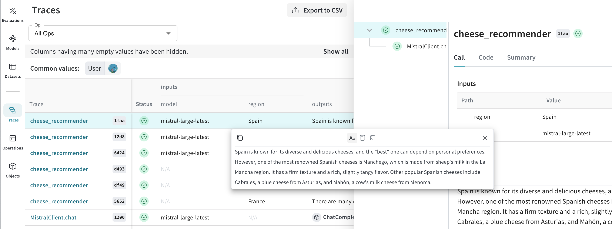

# MistralAI

Weave automatically tracks and logs LLM calls made via the [MistralAI Python library](https://github.com/mistralai/client-python).

## Traces

It’s important to store traces of LLM applications in a central database, both during development and in production. You’ll use these traces for debugging, and as a dataset that will help you improve your application.

Weave will automatically capture traces for [mistralai](https://github.com/mistralai/client-python). You can use the library as usual, start by calling `weave.init()`:

```python
import weave
weave.init("cheese_recommender")

# then use mistralai library as usual
import os
from mistralai.client import MistralClient
from mistralai.models.chat_completion import ChatMessage

api_key = os.environ["MISTRAL_API_KEY"]
model = "mistral-large-latest"

client = MistralClient(api_key=api_key)

messages = [
    ChatMessage(role="user", content="What is the best French cheese?")
]

chat_response = client.chat(
    model=model,
    messages=messages,
)
```

Weave will now track and log all LLM calls made through the MistralAI library. You can view the traces in the Weave web interface.

[](https://wandb.ai/capecape/mistralai_project/weave/calls)

## Wrapping with your own ops

Weave ops make results *reproducible* by automatically versioning code as you experiment, and they capture their inputs and outputs. Simply create a function decorated with [`@weave.op()`](/guides/tracking/ops) that calls into [`mistralai.client.MistralClient.chat()`](https://docs.mistral.ai/capabilities/completion/) and Weave will track the inputs and outputs for you. Let's see how we can do this for our cheese recommender:

```python
# highlight-next-line
@weave.op()
def cheese_recommender(region:str, model:str) -> str:
    "Recommend the best cheese in a given region"
    
    messages = [ChatMessage(role="user", content=f"What is the best cheese in {region}?")]

    chat_response = client.chat(
        model=model,
        messages=messages,
    )
    return chat_response.choices[0].message.content

cheese_recommender(region="France", model="mistral-large-latest")
cheese_recommender(region="Spain", model="mistral-large-latest")
cheese_recommender(region="Netherlands", model="mistral-large-latest")
```

[](https://wandb.ai/capecape/mistralai_project/weave/calls)

