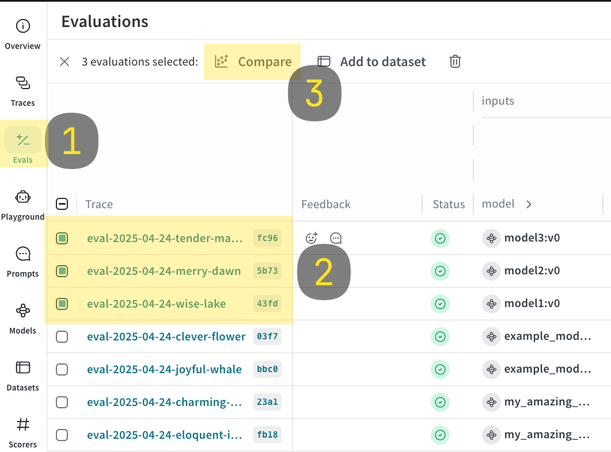
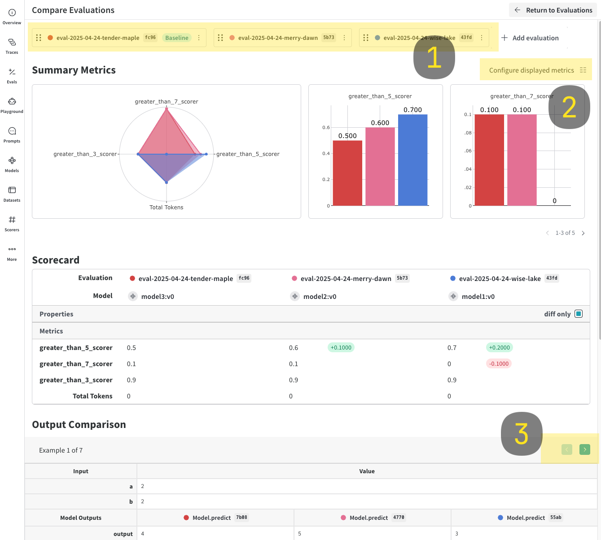

import Tabs from '@theme/Tabs';
import TabItem from '@theme/TabItem';

# `EvaluationLogger`

The `EvaluationLogger` provides a flexible, incremental way to log evaluation data directly from your code. You don't need deep knowledge of W&B Weave's internal data types; simply instantiate a logger and use its methods (`logPrediction`, `logScore`, `logSummary`) to record evaluation steps.

This approach is particularly helpful in complex workflows where the entire dataset or all scorers might not be defined upfront.

In contrast to the standard `Evaluation` object, which requires a predefined `Dataset` and list of `Scorer` objects, the `EvaluationLogger` allows you to log individual predictions and their associated scores incrementally as they become available.

:::info Prefer a more structured evaluation?

If you prefer a more opinionated evaluation framework with predefined datasets and scorers, see [Weave's standard Evaluation framework](../core-types/evaluations.md). 

The `EvaluationLogger` offers flexibility while the standard framework offers structure and guidance.
:::

## Basic workflow

1. _Initialize the logger:_ Create an instance of `EvaluationLogger`, optionally providing metadata about the `model` and `dataset`. Defaults will be used if omitted.
    :::important Track token usage and cost
    To capture token usage and cost for LLM calls (e.g. OpenAI), initialize `EvaluationLogger` before any LLM invocations**. 
    If you call your LLM first and then log predictions afterward, token and cost data are not captured.
    :::
2. _Log predictions:_ Call `log_prediction` for each input/output pair from your system.
3. _Log scores:_ Use the returned `ScoreLogger` to `log_score` for the prediction. Multiple scores per prediction are supported.
4. _Finish prediction:_ Always call `finish()` after logging scores for a prediction to finalize it.
5. _Log summary:_ After all predictions are processed, call `log_summary` to aggregate scores and add optional custom metrics.

:::important
After calling `finish()` on a prediction, no more scores can be logged for it.
:::

For code examples demonstrating the described workflow, see the [Basic example](#basic-example).

## Basic example
The following example shows how to use `EvaluationLogger` to log predictions and scores inline with your existing code.

The `userModel` model function is defined and applied to a list of inputs. For each example:

- The input and output are logged using `logPrediction`.
- A simple correctness score is logged via `logScore`.
- `finish()` finalizes logging for that prediction.

Finally, `logSummary` records any aggregate metrics and triggers automatic score summarization in Weave.

<Tabs groupId="programming-language">
  <TabItem value="python" label="Python" default>
    ```python
    import weave
    from openai import OpenAI
    from weave import EvaluationLogger

    weave.init('my-project')

    # Initialize EvaluationLogger BEFORE calling the model to ensure token tracking
    eval_logger = EvaluationLogger(
        model="my_model",
        dataset="my_dataset"
    )

    # Example input data (this can be any data structure you want)
    eval_samples = [
        {'inputs': {'a': 1, 'b': 2}, 'expected': 3},
        {'inputs': {'a': 2, 'b': 3}, 'expected': 5},
        {'inputs': {'a': 3, 'b': 4}, 'expected': 7},
    ]

    # Example model logic using OpenAI
    @weave.op
    def user_model(a: int, b: int) -> int:
        oai = OpenAI()
        response = oai.chat.completions.create(
            messages=[{"role": "user", "content": f"What is {a}+{b}?"}],
            model="gpt-4o-mini"
        )
        # Use the response in some way (here we just return a + b for simplicity)
        return a + b

    # Iterate through examples, predict, and log
    for sample in eval_samples:
        inputs = sample["inputs"]
        model_output = user_model(**inputs) # Pass inputs as kwargs

        # Log the prediction input and output
        pred_logger = eval_logger.log_prediction(
            inputs=inputs,
            output=model_output
        )

        # Calculate and log a score for this prediction
        expected = sample["expected"]
        correctness_score = model_output == expected
        pred_logger.log_score(
            scorer="correctness", # Simple string name for the scorer
            score=correctness_score
        )

        # Finish logging for this specific prediction
        pred_logger.finish()

    # Log a final summary for the entire evaluation.
    # Weave auto-aggregates the 'correctness' scores logged above.
    summary_stats = {"subjective_overall_score": 0.8}
    eval_logger.log_summary(summary_stats)

    print("Evaluation logging complete. View results in the Weave UI.")
    ```
  </TabItem>
  <TabItem value="typescript" label="TypeScript">
    ```typescript
    import * as weave from 'weave'
    import OpenAI from 'openai'

    await weave.init('my-project')

    // Initialize EvaluationLogger BEFORE calling the model to ensure token tracking
    const evalLogger = new weave.EvaluationLogger({
      model: {name: 'my_model'},
      dataset: 'my_dataset'
    })

    // Example input data (this can be any data structure you want)
    const evalSamples = [
      {inputs: {a: 1, b: 2}, expected: 3},
      {inputs: {a: 2, b: 3}, expected: 5},
      {inputs: {a: 3, b: 4}, expected: 7},
    ]

    // Example model logic using OpenAI
    const userModel = weave.op(async function userModel(a: number, b: number): Promise<number> {
      const oai = new OpenAI()
      const response = await oai.chat.completions.create({
        messages: [{role: 'user', content: `What is ${a}+${b}?`}],
        model: 'gpt-4o-mini'
      })
      // Use the response in some way (here we just return a + b for simplicity)
      return a + b
    })

    // Iterate through examples, predict, and log
    for (const sample of evalSamples) {
      const inputs = sample.inputs
      const modelOutput = await userModel(inputs.a, inputs.b)

      // Log the prediction input and output
      const predLogger = await evalLogger.logPrediction(inputs, modelOutput)

      // Calculate and log a score for this prediction
      const expected = sample.expected
      const correctnessScore = modelOutput === expected
      predLogger.logScore('correctness', correctnessScore) // Simple string name for the scorer

      // Finish logging for this specific prediction
      await predLogger.finish()
    }

    // Log a final summary for the entire evaluation.
    // Weave auto-aggregates the 'correctness' scores logged above.
    const summaryStats = {subjective_overall_score: 0.8}
    await evalLogger.logSummary(summaryStats)

    console.log('Evaluation logging complete. View results in the Weave UI.')
    ```
  </TabItem>
</Tabs>

## Advanced usage

### Get outputs before logging

You can first compute your model outputs, then separately log predictions and scores. This allows for better separation of evaluation and logging logic.

<Tabs groupId="programming-language">
  <TabItem value="python" label="Python" default>
    ```python
    # Initialize EvaluationLogger BEFORE calling the model to ensure token tracking
    ev = EvaluationLogger(
        model="example_model",
        dataset="example_dataset"
    )

    # Model outputs (e.g. OpenAI calls) must happen after logger init for token tracking
    outputs = [your_output_generator(**inputs) for inputs in your_dataset]
    preds = [ev.log_prediction(inputs, output) for inputs, output in zip(your_dataset, outputs)]
    for pred in preds:
        pred.log_score(scorer="greater_than_5_scorer", score=output > 5)
        pred.log_score(scorer="greater_than_7_scorer", score=output > 7)
        pred.finish()

    ev.log_summary()
    ```
  </TabItem>
  <TabItem value="typescript" label="TypeScript">
    ```typescript
    // Initialize EvaluationLogger BEFORE calling the model to ensure token tracking
    const ev = new weave.EvaluationLogger({
      model: {name: 'example_model'},
      dataset: 'example_dataset'
    })

    // Model outputs (e.g. OpenAI calls) must happen after logger init for token tracking
    const outputs = await Promise.all(
      yourDataset.map(async (inputs) => await yourOutputGenerator(inputs))
    )

    const preds = await Promise.all(
      yourDataset.map(async (inputs, i) =>
        await ev.logPrediction(inputs, outputs[i])
      )
    )

    for (const pred of preds) {
      pred.logScore('greater_than_5_scorer', output > 5)
      pred.logScore('greater_than_7_scorer', output > 7)
      await pred.finish()
    }

    await ev.logSummary()
    ```
  </TabItem>
</Tabs>

### Log rich media

Inputs, outputs, and scores can include rich media such as images, videos, audio, or structured tables. Simply pass a dict or media object into the `log_prediction` or `log_score` methods:

```python
import io
import wave
import struct
from PIL import Image
import random
from typing import Any
import weave

def generate_random_audio_wave_read(duration=2, sample_rate=44100):
    n_samples = duration * sample_rate
    amplitude = 32767  # 16-bit max amplitude

    buffer = io.BytesIO()

    # Write wave data to the buffer
    with wave.open(buffer, 'wb') as wf:
        wf.setnchannels(1)
        wf.setsampwidth(2)  # 16-bit
        wf.setframerate(sample_rate)

        for _ in range(n_samples):
            sample = random.randint(-amplitude, amplitude)
            wf.writeframes(struct.pack('<h', sample))

    # Rewind the buffer to the beginning so we can read from it
    buffer.seek(0)

    # Return a Wave_read object
    return wave.open(buffer, 'rb')

rich_media_dataset = [
    {
        'image': Image.new(
            "RGB",
            (100, 100),
            color=(
                random.randint(0, 255),
                random.randint(0, 255),
                random.randint(0, 255),
            ),
        ),
        "audio": generate_random_audio_wave_read(),
    }
    for _ in range(5)
]

@weave.op
def your_output_generator(image: Image.Image, audio) -> dict[str, Any]:
    return {
        "result": random.randint(0, 10),
        "image": image,
        "audio": audio,
    }

ev = EvaluationLogger(model="example_model", dataset="example_dataset")

for inputs in rich_media_dataset:
    output = your_output_generator(**inputs)
    pred = ev.log_prediction(inputs, output)
    pred.log_score(scorer="greater_than_5_scorer", score=output["result"] > 5)
    pred.log_score(scorer="greater_than_7_scorer", score=output["result"] > 7)

ev.log_summary()
```

### Log and compare multiple evaluations

With `EvaluationLogger`, you can log and compare multiple evaluations.

1. Run the code sample shown below.
2. In the Weave UI, navigate to the `Evals` tab.
3. Select the evals that you want to compare.
4. Click the **Compare** button. In the Compare view, you can:
   - Choose which Evals to add or remove
   - Choose which metrics to show or hide
   - Page through specific examples to see how different models performed for the same input on a given dataset
   
   For more information on comparisons, see [Comparisons](../tools/comparison.md)

<Tabs groupId="programming-language">
  <TabItem value="python" label="Python" default>
    ```python
    import weave

    models = [
        "model1",
        "model2",
        {"name": "model3", "metadata": {"coolness": 9001}}
    ]

    for model in models:
        # EvalLogger must be initialized before model calls to capture tokens
        ev = EvaluationLogger(model=model, dataset="example_dataset")
        for inputs in your_dataset:
            output = your_output_generator(**inputs)
            pred = ev.log_prediction(inputs=inputs, output=output)
            pred.log_score(scorer="greater_than_3_scorer", score=output > 3)
            pred.log_score(scorer="greater_than_5_scorer", score=output > 5)
            pred.log_score(scorer="greater_than_7_scorer", score=output > 7)
            pred.finish()

        ev.log_summary()
    ```
  </TabItem>
  <TabItem value="typescript" label="TypeScript">
    ```typescript
    import * as weave from 'weave'

    const models = [
      {name: 'model1'},
      {name: 'model2'},
      {name: 'model3', metadata: {coolness: 9001}}
    ]

    for (const model of models) {
      // EvalLogger must be initialized before model calls to capture tokens
      const ev = new weave.EvaluationLogger({
        model,
        dataset: 'example_dataset'
      })

      for (const inputs of yourDataset) {
        const output = await yourOutputGenerator(inputs)
        const pred = await ev.logPrediction(inputs, output)
        pred.logScore('greater_than_3_scorer', output > 3)
        pred.logScore('greater_than_5_scorer', output > 5)
        pred.logScore('greater_than_7_scorer', output > 7)
        await pred.finish()
      }

      await ev.logSummary()
    }
    ```
  </TabItem>
</Tabs>





## Usage tips

- Call `finish()` promptly after each prediction.
- Use `log_summary` to capture metrics not tied to single predictions (e.g., overall latency).
- Rich media logging is great for qualitative analysis.
