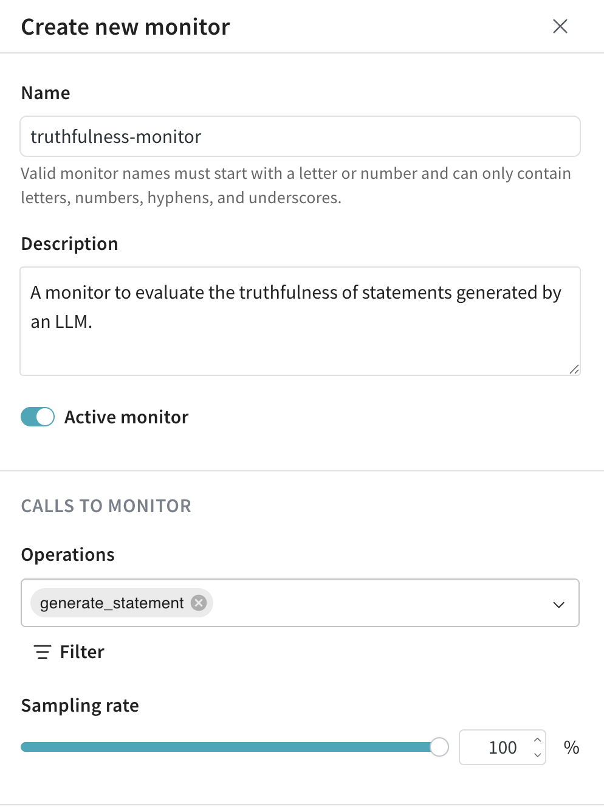
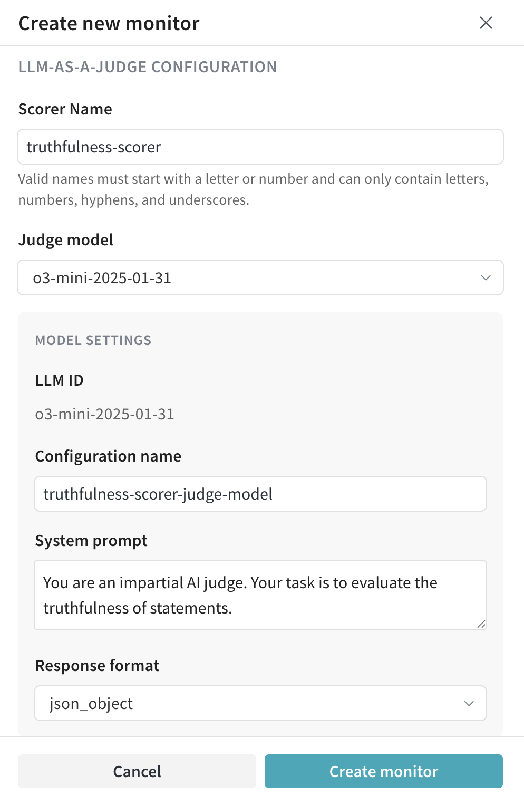
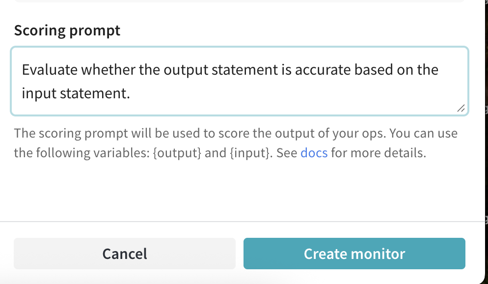

import Tabs from '@theme/Tabs';
import TabItem from '@theme/TabItem';

# Online Evaluation: Guardrails and Monitors


## Introduction

Building production LLM applications? Two questions likely keep you up at night:
1. How do you ensure your LLMs generate safe, appropriate content?
2. How do you measure and improve output quality over time?

W&B Weave's unified scoring system answers both questions through a simple yet powerful framework. Whether you need active safety controls (guardrails) or passive quality monitoring, this guide will show you how to implement robust evaluation systems for your LLM applications.

The foundation of Weave's evaluation system is the [**Scorer**](./scorers.md) - a component that evaluates your function's inputs and outputs to measure quality, safety, or any other metric you care about. Scorers are versatile and can be used in two ways:

- **As Guardrails**: Block or modify unsafe content before it reaches users
- **As Monitors**: Track quality metrics over time to identify trends and improvements

:::note Terminology
Throughout this guide, we'll refer to functions decorated with `@weave.op` as "ops". These are regular Python functions that have been enhanced with Weave's tracking capabilities.
:::

#### Ready-to-Use Scorers
While this guide shows you how to create custom scorers, Weave comes with a variety of [predefined scorers](./builtin_scorers.mdx) that you can use right away, including:
- [Hallucination detection](./builtin_scorers.mdx#hallucinationfreescorer)
- [Summarization quality](./builtin_scorers.mdx#summarizationscorer)
- [Embedding similarity](./builtin_scorers.mdx#embeddingsimilarityscorer)
- [Relevancy evaluation](./builtin_scorers.mdx#ragas---contextrelevancyscorer)
- And more!

### Guardrails vs. Monitors: When to Use Each

While scorers power both guardrails and monitors, they serve different purposes:

| Aspect | Guardrails | Monitors |
|--------|------------|----------|
| **Purpose** | Active intervention to prevent issues | Passive observation for analysis |
| **Timing** | Real-time, before output reaches users | Can be asynchronous or batched |
| **Performance** | Must be fast (affects response time) | Can be slower, run in background |
| **Sampling** | Usually every request | Often sampled (e.g., 10% of calls) |
| **Control Flow** | Can block/modify outputs | No impact on application flow |
| **Resource Usage** | Must be efficient | Can use more resources if needed |

For example, a toxicity scorer could be used:
- 🛡️ **As a Guardrail**: Block toxic content immediately
- 📊 **As a Monitor**: Track toxicity levels over time

:::note
Every scorer result is automatically stored in Weave's database. This means your guardrails double as monitors without any extra work! You can always analyze historical scorer results, regardless of how they were originally used.
:::

### Using the `.call()` Method

To use scorers with Weave ops, you'll need access to both the operation's result and its tracking information. The `.call()` method provides both:

```python
# Instead of calling the op directly:
result = generate_text(input)  # Primary way to call the op but doesn't give access to the Call object

# Use the .call() method to get both result and Call object:
result, call = generate_text.call(input)  # Now you can use the call object with scorers
```

:::tip Why Use `.call()`?
The Call object is essential for associating the score with the call in the database. While you can directly call the scoring function, this would not be associated with the call, and therefore not searchable, filterable, or exportable for later analysis.

For more details about Call objects, see the [Calls guide section on Call objects](../tracking/tracing.mdx#getting-a-handle-to-the-call-object-during-execution).
:::

## Getting Started with Scorers

### Basic Example

Here's a simple example showing how to use `.call()` with a scorer:

```python
import weave
from weave import Scorer

class LengthScorer(Scorer):
    @weave.op
    def score(self, output: str) -> dict:
        """A simple scorer that checks output length."""
        return {
            "length": len(output),
            "is_short": len(output) < 100
        }

@weave.op
def generate_text(prompt: str) -> str:
    return "Hello, world!"

# Get both result and Call object
result, call = generate_text.call("Say hello")

# Now you can apply scorers
await call.apply_scorer(LengthScorer())
```

## Using Scorers as Guardrails {#using-scorers-as-guardrails}

Guardrails act as safety checks that run before allowing LLM output to reach users. Here's a practical example:

```python
import weave
from weave import Scorer

@weave.op
def generate_text(prompt: str) -> str:
    """Generate text using an LLM."""
    # Your LLM generation logic here
    return "Generated response..."

class ToxicityScorer(Scorer):
    @weave.op
    def score(self, output: str) -> dict:
        """
        Evaluate content for toxic language.
        """
        # Your toxicity detection logic here
        return {
            "flagged": False,  # True if content is toxic
            "reason": None     # Optional explanation if flagged
        }

async def generate_safe_response(prompt: str) -> str:
    # Get result and Call object
    result, call = generate_text.call(prompt)
    
    # Check safety
    safety = await call.apply_scorer(ToxicityScorer())
    if safety.result["flagged"]:
        return f"I cannot generate that content: {safety.result['reason']}"
    
    return result
```

:::note Scorer Timing
When applying scorers:
- The main operation (`generate_text`) completes and is marked as finished in the UI
- Scorers run asynchronously after the main operation
- Scorer results are attached to the call once they complete
- You can view scorer results in the UI or query them via the API
:::

## Using Scorers as monitors {#using-scorers-as-monitors}

:::important
This feature is only available in Multi-Tenant (MT) SaaS deployments.
:::

If you want to track quality metrics without writing scoring logic into your app, you can use _monitors_.

A monitor is a background process that:
- Watches one or more specified functions decorated with `weave.op` 
- Scores a subset of calls using an _LLM-as-a-judge_ scorer, which is an LLM model with a specific prompt tailored to the ops you want to score 
- Runs automatically each time the specified `weave.op` is called, no need to manually call `.apply_scorer()`

Monitors are ideal for:
- Evaluating and tracking production behavior
- Catching regressions or drift
- Collecting real-world performance data over time

Learn how to [create a monitor in general](#create-a-monitor) or try out the [end-to-end example of creating a truthfulness monitor](#example-create-a-truthfulness-monitor).

### Create a monitor

1. From the left menu, select the **Monitors** tab.
2. From the monitors page, click **New Monitor**.
3. In the drawer, configure the monitor:
   - **Name**: Valid monitor names must start with a letter or number and can only contain letters, numbers, hyphens, and underscores.
   - **Description** *(optional)*: Explain what the monitor does.
   - **Active monitor** toggle: Turn the monitor on or off. 
   - **Calls to monitor**:
        - **Operations**: Choose one or more `@weave.op`s to monitor. 
            :::important
            You must log at least one trace for an Op for it to appear in the list of available operations.
            :::
        - **Filter** *(optional)*: Narrow down which op columns are eligible for monitoring (e.g., `max_tokens` or `top_p`)
        - **Sampling rate**: The percentage of calls to be scored, between 0% and 100% (e.g., 10%)
            :::tip 
            A lower sampling rate is useful for controlling costs, as each scoring call has a cost associated with it.
            :::
   - **LLM-as-a-Judge configuration**: 
        - **Scorer name**: Valid scorer names must start with a letter or number and can only contain letters, numbers, hyphens, and underscores.
        - **Judge model**: Select the model that will score your ops. Three types of models are available:
            - [Saved models](../tools/playground.md#saved-models)
            - Models from providers configured by your W&B admin
            - [W&B Inference models](https://docs.wandb.ai/guides/inference/models/)
        
        For the selected model, configure the following settings:
            - **Configuration name**
            - **System prompt**
            - **Response format**
        - **Scoring prompt**: The prompt used by the LLM-as-a-judge to score your ops. “You can reference `{output}`, individual inputs (like `{foo}`), and `{inputs}` as a dictionary. [For more information, see prompt variables](#prompt-variables).”
4. Click **Create Monitor**. Weave will automatically begin monitoring and scoring calls that match the specified criteria. You can view monitor details in the **Monitors** tab.

### Example: Create a truthfulness monitor

In the following example, you'll create:
- The `weave.op` to be monitored, `generate_statement`. This function outputs statements that either returns the input `ground_truth` statement (e.g. `"The Earth revolves around the Sun."`), or generates a statement that is incorrect based on the `ground_truth` (e.g. `"The Earth revolves around Saturn."`)
- A monitor, `truthfulness-monitor`, to evaluate the truthfulness of the generated statements.

1. Define `generate_statement`:
   ```python
    import weave
    import random
    import openai

    # Replace my-team/my-weave-project with your Weave team and project name 
    weave.init("my-team/my-weave-project")

    client = openai.OpenAI() 

    @weave.op()
    def generate_statement(ground_truth: str) -> str:
        if random.random() < 0.5:
            response = openai.ChatCompletion.create(
                model="gpt-4.1",
                messages=[
                    {
                        "role": "user",
                        "content": f"Generate a statement that is incorrect based on this fact: {ground_truth}"
                    }
                ]
            )
            return response.choices[0].message["content"]
        else:
            return ground_truth
   ```
2. Execute the code for `generate_statement`to log a trace. The `generate_statement` op will not appear in the Op dropdown unless it was logged at least once. 
2. In the Weave UI, navigate to **Monitors**.
3. From the monitors page, click **New Monitor**.
4. Configure the monitor as follows:
    - **Name**: `truthfulness-monitor`  
    - **Description**:  
    `A monitor to evaluate the truthfulness of statements generated by an LLM.`
    - **Active monitor** toggle:  
    Toggle **on** to begin scoring calls as soon as the monitor is created.
    
    - **Calls to Monitor**:
        - **Operations**: `generate_statement`.
        - **Filter** *(optional)*:  None applied in this example, but could be used to scope monitoring by arguments like `temperature` or `max_tokens`.
        - **Sampling rate**:  
        Set to `100%` to score every call.
        
    - **LLM-as-a-Judge Configuration**:
        - **Scorer name**: `truthfulness-scorer`  
        - **Judge model**:  
        `o3-mini-2025-01-31`
        - **Model settings**:
        - **LLM ID**: `o3-mini-2025-01-31`
        - **Configuration name**: `truthfulness-scorer-judge-model`
        - **System prompt**:  
            `You are an impartial AI judge. Your task is to evaluate the truthfulness of statements.`
        - **Response format**: `json_object`
        - **Scoring prompt**:  
            ```text
            Evaluate whether the output statement is accurate based on the input statement.

            This is the input statement: {ground_truth}

            This is the output statement: {output}

            The response should be a JSON object with the following fields:
            - is_true: a boolean stating whether the output statement is true or false based on the input statement.
            - reasoning: your reasoning as to why the statement is true or false.
            ```
            
5. Click **Create Monitor**. The `truthfulness-monitor` is ready to start monitoring.
6. Generate statements for evaluation by the monitor with true and easily verifiable `ground_truth` statements such as `"Water freezes at 0 degrees Celsius."`.
    ```python
    generate_statement("The Earth revolves around the Sun.")
    generate_statement("Water freezes at 0 degrees Celsius.")
    generate_statement("The Great Wall of China was built over several centuries, with construction beginning as early as the 7th century BCE.")
    ```
7. In the Weave UI, navigate to the **Traces** tab.
8. From the list of available traces, select any trace for **LLMAsAJudgeScorer.score**. 
9. Inspect the trace to see the monitor in action. For this example, the monitor correctly evaluated the `output` (in this instance, equivalent to the `ground_truth`) as `true` and provided sound `reasoning`.
    

### Prompt variables {#prompt-variables}

In scoring prompts, you can reference multiple variables from your op. These values are automatically extracted from your function call when the scorer runs. Consider the following example function:

```python
@weave.op
def my_function(foo: str, bar: str) -> str:
    return f"{foo} and {bar}"
```

In this case, the following variables are accessible:

| Variable     | Description                                           |
|--------------|-------------------------------------------------------|
| `{foo}`      | The value of the input argument `foo`                |
| `{bar}`      | The value of the input argument `bar`                |
| `{inputs}`   | A JSON dictionary of all input arguments             |
| `{output}`   | The result returned by your op                       |

For example:

```text
Input foo: {foo}
Input bar: {bar}
Output: {output}
```

If your op has other arguments, they’ll all be available by name.

## AWS Bedrock Guardrails

The `BedrockGuardrailScorer` uses AWS Bedrock's guardrail feature to detect and filter content based on configured policies. It calls the `apply_guardrail` API to apply the guardrail to the content.

To use the `BedrockGuardrailScorer`, you need the following:
- An AWS account with Bedrock access
- An AWS account with access to Bedrock
- A configured guardrail in the AWS Bedrock console
- The `boto3` Python package

:::tip
You don't need to create your own Bedrock client—Weave creates it for you.  To specify a region, pass the `bedrock_runtime_kwargs` parameter to the scorer.
:::

For more details on creating a guardrail, see the [Bedrock guardrails notebook](https://github.com/aws-samples/amazon-bedrock-samples/blob/main/responsible_ai/bedrock-guardrails/guardrails-api.ipynb).
```python
import weave
import boto3
from weave.scorers.bedrock_guardrails import BedrockGuardrailScorer

# Initialize Weave
weave.init("my_app")

# Create a guardrail scorer
guardrail_scorer = BedrockGuardrailScorer(
    guardrail_id="your-guardrail-id",  # Replace "your-guardrail-id" with your guardrail ID
    guardrail_version="DRAFT",          # Use guardrail_version to use a specific guardrail version
    source="INPUT",                             # Can be "INPUT" or "OUTPUT"
    bedrock_runtime_kwargs={"region_name": "us-east-1"}  # AWS region
)

@weave.op
def generate_text(prompt: str) -> str:
    # Add your text generation logic here
    return "Generated text..."

# Use the guardrail as a safety check
async def generate_safe_text(prompt: str) -> str:
    result, call = generate_text.call(prompt)
    
    # Apply the guardrail
    score = await call.apply_scorer(guardrail_scorer)
    
    # Check if the content passed the guardrail
    if not score.result.passed:
        # Use the modified output if available
        if score.result.metadata.get("modified_output"):
            return score.result.metadata["modified_output"]
        return "I cannot generate that content due to content policy restrictions."
    
    return result
```


## Implementation Details

### The Scorer Interface

A scorer is a class that inherits from `Scorer` and implements a `score` method. The method receives:
- `output`: The result from your function
- Any input parameters matching your function's parameters

Here's a comprehensive example:

```python
@weave.op
def generate_styled_text(prompt: str, style: str, temperature: float) -> str:
    """Generate text in a specific style."""
    return "Generated text in requested style..."

class StyleScorer(Scorer):
    @weave.op
    def score(self, output: str, prompt: str, style: str) -> dict:
        """
        Evaluate if the output matches the requested style.
        
        Args:
            output: The generated text (automatically provided)
            prompt: Original prompt (matched from function input)
            style: Requested style (matched from function input)
        """
        return {
            "style_match": 0.9,  # How well it matches requested style
            "prompt_relevance": 0.8  # How relevant to the prompt
        }

# Example usage
async def generate_and_score():
    # Generate text with style
    result, call = generate_styled_text.call(
        prompt="Write a story",
        style="noir",
        temperature=0.7
    )
    
    # Score the result
    score = await call.apply_scorer(StyleScorer())
    print(f"Style match score: {score.result['style_match']}")
```

### Score Parameters

#### Parameter Matching Rules
- The `output` parameter is special and always contains the function's result
- Other parameters must match the function's parameter names exactly
- Scorers can use any subset of the function's parameters
- Parameter types should match the function's type hints

#### Handling Parameter Name Mismatches

Sometimes your scorer's parameter names might not match your function's parameter names exactly. For example:

```python
@weave.op
def generate_text(user_input: str):  # Uses 'user_input'
    return process(user_input)

class QualityScorer(Scorer):
    @weave.op
    def score(self, output: str, prompt: str):  # Expects 'prompt'
        """Evaluate response quality."""
        return {"quality_score": evaluate_quality(prompt, output)}

result, call = generate_text.call(user_input="Say hello")

# Map 'prompt' parameter to 'user_input'
scorer = QualityScorer(column_map={"prompt": "user_input"})
await call.apply_scorer(scorer)
```

Common use cases for `column_map`:
- Different naming conventions between functions and scorers
- Reusing scorers across different functions
- Using third-party scorers with your function names


#### Adding Additional Parameters

Sometimes scorers need extra parameters that aren't part of your function. You can provide these using `additional_scorer_kwargs`:

```python
class ReferenceScorer(Scorer):
    @weave.op
    def score(self, output: str, reference_answer: str):
        """Compare output to a reference answer."""
        similarity = compute_similarity(output, reference_answer)
        return {"matches_reference": similarity > 0.8}

# Provide the reference answer as an additional parameter
await call.apply_scorer(
    ReferenceScorer(),
    additional_scorer_kwargs={
        "reference_answer": "The Earth orbits around the Sun."
    }
)
```

This is useful when your scorer needs context or configuration that isn't part of the original function call.


### Using Scorers: Two Approaches

1. **With Weave's Op System** (Recommended)
```python
result, call = generate_text.call(input)
score = await call.apply_scorer(MyScorer())
```

2. **Direct Usage** (Quick Experiments)
```python
scorer = MyScorer()
score = scorer.score(output="some text")
```

**When to use each:**
- 👉 Use the op system for production, tracking, and analysis
- 👉 Use direct scoring for quick experiments or one-off evaluations

**Tradeoffs of Direct Usage:**
- ✅ Simpler for quick tests
- ✅ No Op required
- ❌ No association with the LLM/Op call

### Score Analysis


For detailed information about querying calls and their scorer results, see our [Score Analysis Guide](./scorers.md#score-analysis) and our [Data Access Guide](/guides/tracking/tracing#querying-and-exporting-calls).


## Production Best Practices

### 1. Set Appropriate Sampling Rates
```python
@weave.op
def generate_text(prompt: str) -> str:
    return generate_response(prompt)

async def generate_with_sampling(prompt: str) -> str:
    result, call = generate_text.call(prompt)
    
    # Only monitor 10% of calls
    if random.random() < 0.1:
        await call.apply_scorer(ToxicityScorer())
        await call.apply_scorer(QualityScorer())
    
    return result
```

### 2. Monitor Multiple Aspects
```python
async def evaluate_comprehensively(call):
    await call.apply_scorer(ToxicityScorer())
    await call.apply_scorer(QualityScorer())
    await call.apply_scorer(LatencyScorer())
```
### 3. Analyze and Improve
- Review trends in the Weave Dashboard
- Look for patterns in low-scoring outputs
- Use insights to improve your LLM system
- Set up alerts for concerning patterns (coming soon)

### 4. Access Historical Data
Scorer results are stored with their associated calls and can be accessed through:
- The Call object's `feedback` field
- The Weave Dashboard
- Our query APIs

### 5. Initialize Guards Efficiently

For optimal performance, especially with locally-run models, initialize your guards outside of the main function. This pattern is particularly important when:
- Your scorers load ML models
- You're using local LLMs where latency is critical
- Your scorers maintain network connections
- You have high-traffic applications

See the Complete Example section below for a demonstration of this pattern.

:::caution Performance Tips
For Guardrails:
- Keep logic simple and fast
- Consider caching common results
- Avoid heavy external API calls
- Initialize guards outside of your main functions to avoid repeated initialization costs

For Monitors:
- Use sampling to reduce load
- Can use more complex logic
- Can make external API calls
:::

## Complete Example

Here's a comprehensive example that brings together all the concepts we've covered:

```python
import weave
from weave import Scorer
import asyncio
import random
from typing import Optional

class ToxicityScorer(Scorer):
    def __init__(self):
        # Initialize any expensive resources here
        self.model = load_toxicity_model()
    
    @weave.op
    async def score(self, output: str) -> dict:
        """Check content for toxic language."""
        try:
            result = await self.model.evaluate(output)
            return {
                "flagged": result.is_toxic,
                "reason": result.explanation if result.is_toxic else None
            }
        except Exception as e:
            # Log error and default to conservative behavior
            print(f"Toxicity check failed: {e}")
            return {"flagged": True, "reason": "Safety check unavailable"}

class QualityScorer(Scorer):
    @weave.op
    async def score(self, output: str, prompt: str) -> dict:
        """Evaluate response quality and relevance."""
        return {
            "coherence": evaluate_coherence(output),
            "relevance": evaluate_relevance(output, prompt),
            "grammar": evaluate_grammar(output)
        }

# Initialize scorers at module level (optional optimization)
toxicity_guard = ToxicityScorer()
quality_monitor = QualityScorer()
relevance_monitor = RelevanceScorer()

@weave.op
def generate_text(
    prompt: str,
    style: Optional[str] = None,
    temperature: float = 0.7
) -> str:
    """Generate an LLM response."""
    # Your LLM generation logic here
    return "Generated response..."

async def generate_safe_response(
    prompt: str,
    style: Optional[str] = None,
    temperature: float = 0.7
) -> str:
    """Generate a response with safety checks and quality monitoring."""
    try:
        # Generate initial response
        result, call = generate_text.call(
            prompt=prompt,
            style=style,
            temperature=temperature
        )

        # Apply safety check (guardrail)
        safety = await call.apply_scorer(toxicity_guard)
        if safety.result["flagged"]:
            return f"I cannot generate that content: {safety.result['reason']}"

        # Sample quality monitoring (10% of requests)
        if random.random() < 0.1:
            # Run quality checks in parallel
            await asyncio.gather(
                call.apply_scorer(quality_monitor),
                call.apply_scorer(relevance_monitor)
            )
        
        return result

    except Exception as e:
        # Log error and return user-friendly message
        print(f"Generation failed: {e}")
        return "I'm sorry, I encountered an error. Please try again."

# Example usage
async def main():
    # Basic usage
    response = await generate_safe_response("Tell me a story")
    print(f"Basic response: {response}")
    
    # Advanced usage with all parameters
    response = await generate_safe_response(
        prompt="Tell me a story",
        style="noir",
        temperature=0.8
    )
    print(f"Styled response: {response}")

```

This example demonstrates:
- Proper scorer initialization and error handling
- Combined use of guardrails and monitors
- Async operation with parallel scoring
- Production-ready error handling and logging

## Next Steps

- Explore [Available Scorers](./scorers.md)
- Learn about [Weave Ops](../../guides/tracking/ops.md)

