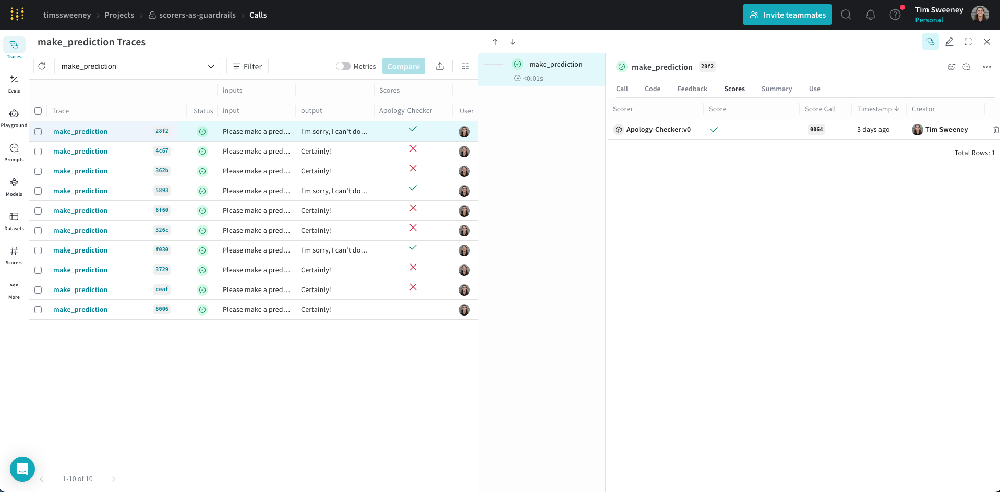

import Tabs from '@theme/Tabs';
import TabItem from '@theme/TabItem';

# Guardrails and Monitors



## Introduction

Building production LLM applications? Two questions likely keep you up at night:
1. How do you ensure your LLMs generate safe, appropriate content?
2. How do you measure and improve output quality over time?

Weave's unified scoring system answers both questions through a simple yet powerful framework. Whether you need active safety controls (guardrails) or passive quality monitoring, this guide will show you how to implement robust evaluation systems for your LLM applications.

## Overview

The foundation of Weave's evaluation system is the [**Scorer**](./scorers.md) - a component that evaluates your function's inputs and outputs to measure quality, safety, or any other metric you care about. Scorers are versatile and can be used in two ways:

- **As Guardrails**: Block or modify unsafe content before it reaches users
- **As Monitors**: Track quality metrics over time to identify trends and improvements

:::tip
Every scorer result is automatically stored in Weave's database. This means your guardrails double as monitors without any extra work! You can always analyze historical scorer results, regardless of how they were originally used.
:::

### Using the `.call()` Method

To use scorers with Weave ops, you'll need access to both the operation's result and its tracking information. The `.call()` method provides both:

```python
# Instead of calling the op directly:
result = my_op(input)  # This works but doesn't give access to the Call object

# Use the .call() method to get both result and Call object:
result, call = my_op.call(input)  # Now you can use the call object with scorers
```

:::tip Why Use `.call()`?
The Call object is essential for:
- Applying scorers to the operation
- Accessing tracking information
- Querying historical results
- Analyzing trends over time

For more details about Call objects, see our [Ops Guide](../../guides/tracking/ops.md#getting-a-handle-to-the-call-object).
:::

### Guardrails vs. Monitors: When to Use Each

While scorers power both guardrails and monitors, they serve different purposes:

| Aspect | Guardrails | Monitors |
|--------|------------|----------|
| **Purpose** | Active intervention to prevent issues | Passive observation for analysis |
| **Timing** | Real-time, before output reaches users | Can be asynchronous or batched |
| **Performance** | Must be fast (affects response time) | Can be slower, run in background |
| **Sampling** | Usually every request | Often sampled (e.g., 10% of calls) |
| **Control Flow** | Can block/modify outputs | No impact on application flow |
| **Resource Usage** | Must be efficient | Can use more resources if needed |

For example, a toxicity scorer could be used to:
- 🛡️ **As a Guardrail**: Block toxic content immediately
- 📊 **As a Monitor**: Track toxicity levels over time

## Getting Started with Scorers

### Basic Example

Here's a simple example showing how to use `.call()` with a scorer:

```python
@weave.op()
def generate_text(prompt: str) -> str:
    return "Hello, world!"

# Get both result and Call object
result, call = generate_text.call("Say hello")

# Now you can apply scorers
await call.apply_scorer(MyScorer())
```

## Using Scorers as Guardrails

Guardrails act as safety checks that run before allowing LLM output to reach users. Here's a practical example:

```python
import weave
from weave import Scorer

@weave.op()
def generate_text(prompt: str) -> str:
    """Generate text using an LLM."""
    # Your LLM generation logic here
    return "Generated response..."

class ToxicityScorer(Scorer):
    @weave.op
    def score(self, output: str) -> dict:
        """
        Evaluate content for toxic language.
        """
        # Your toxicity detection logic here
        return {
            "flagged": False,  # True if content is toxic
            "reason": None     # Optional explanation if flagged
        }

async def generate_safe_response(prompt: str) -> str:
    # Get result and Call object
    result, call = generate_text.call(prompt)
    
    # Check safety
    safety = await call.apply_scorer(ToxicityScorer())
    if safety.score["flagged"]:
        return f"I cannot generate that content: {safety.score['reason']}"
    
    return result
```

:::note Scorer Timing
When applying scorers:
- The main operation (`generate_text`) completes and is marked as finished in the UI
- Scorers run asynchronously after the main operation
- Scorer results are attached to the call once they complete
- You can view scorer results in the UI or query them via the API
:::

## Using Scorers as Monitors

Monitors help track quality metrics over time without blocking operations. This is useful for:
- Identifying quality trends
- Detecting model drift
- Gathering data for model improvements

```python
@weave.op()
def generate_text(prompt: str) -> str:
    """Generate text using an LLM."""
    return "Generated response..."

async def generate_with_monitoring(prompt: str) -> str:
    # Get both the result and tracking information
    result, call = generate_text.call(prompt)
    
    # Sample monitoring (only monitor 10% of calls)
    if random.random() < 0.1:
        # Monitor multiple aspects asynchronously
        await call.apply_scorer(QualityScorer())
        await call.apply_scorer(RelevanceScorer())
    
    return result
```

## Implementation Details

### The Scorer Interface

A scorer is a class that inherits from `Scorer` and implements a `score` method. The method receives:
- `output`: The result from your function
- Any input parameters matching your function's parameters

Here's a comprehensive example:

```python
@weave.op()
def generate_styled_text(prompt: str, style: str, temperature: float) -> str:
    """Generate text in a specific style."""
    return "Generated text in requested style..."

class StyleScorer(Scorer):
    @weave.op
    def score(self, output: str, prompt: str, style: str) -> dict:
        """
        Evaluate if the output matches the requested style.
        
        Args:
            output: The generated text (automatically provided)
            prompt: Original prompt (matched from function input)
            style: Requested style (matched from function input)
        """
        return {
            "style_match": 0.9,  # How well it matches requested style
            "prompt_relevance": 0.8  # How relevant to the prompt
        }

# Example usage
async def generate_and_score():
    # Generate text with style
    result, call = generate_styled_text.call(
        prompt="Write a story",
        style="noir",
        temperature=0.7
    )
    
    # Score the result
    score = await call.apply_scorer(StyleScorer())
    print(f"Style match score: {score.score['style_match']}")
```

:::tip Parameter Matching Rules
- The `output` parameter is special and always contains the function's result
- Other parameters must match the function's parameter names exactly
- Scorers can use any subset of the function's parameters
- Parameter types should match the function's type hints
:::

:::info Handling Parameter Name Mismatches
Sometimes your scorer's parameter names might not match your function's parameter names exactly. For example:

```python
@weave.op()
def my_function(user_input: str):  # Uses 'user_input'
    return process(user_input)

class MyScorer(Scorer):
    @weave.op
    def score(self, output: str, prompt: str):  # Expects 'prompt'
        return {"score": self._evaluate(prompt, output)}
```

You can handle this mismatch using `column_map`:

```python
class MyScorer(Scorer):
    def __init__(self):
        # Map scorer parameters to function parameters
        self.column_map = {
            "prompt": "user_input"  # map prompt → user_input
        }
    
    @weave.op
    def score(self, output: str, prompt: str):
        return {"score": self._evaluate(prompt, output)}

# Now it works!
scorer = MyScorer()
await call.apply_scorer(scorer)
```

Common use cases for `column_map`:
- Different naming conventions between functions and scorers
- Reusing scorers across different functions
- Using third-party scorers with your function names

You can also provide additional parameters not present in your function:
```python
await call.apply_scorer(
    scorer,
    additional_scorer_kwargs={"reference_text": "Expected output"}
)
```
:::

### Using Scorers: Two Approaches

1. **With Weave's Op System** (Recommended)
```python
result, call = my_op.call(input)
score = await call.apply_scorer(MyScorer())
```

2. **Direct Usage** (Quick Experiments)
```python
scorer = MyScorer()
score = scorer.score(output="some text")
```

**When to use each:**
- 👉 Use the op system for production, tracking, and analysis
- 👉 Use direct scoring for quick experiments or one-off evaluations

**Tradeoffs of Direct Usage:**
- ✅ Simpler for quick tests
- ✅ No Op required
- ❌ No association with the LLM/Op call

## Production Best Practices

### 1. Set Appropriate Sampling Rates
```python
@weave.op()
def my_llm_function(prompt: str) -> str:
    return generate_response(prompt)

async def generate_with_sampling(prompt: str) -> str:
    result, call = my_llm_function.call(prompt)
    
    # Only monitor 10% of calls
    if random.random() < 0.1:
        await call.apply_scorer(ToxicityScorer())
        await call.apply_scorer(QualityScorer())
    
    return result
```

### 2. Monitor Multiple Aspects
```python
async def evaluate_comprehensively(call):
    await call.apply_scorer(ToxicityScorer())
    await call.apply_scorer(QualityScorer())
    await call.apply_scorer(LatencyScorer())
```
### 3. Analyze and Improve
- Review trends in the Weave Dashboard
- Look for patterns in low-scoring outputs
- Use insights to improve your LLM system
- Set up alerts for concerning patterns (coming soon)

### 4. Access Historical Data

Scorer results are stored with their associated calls and can be accessed through:
- The Call object's `feedback` field
- The Weave Dashboard
- Our query APIs

For detailed information about querying calls and their scorer results, see our [Data Access Guide](/guides/tracking/tracing#querying--exporting-calls).

### 5. Initialize Guards Efficiently

For optimal performance, especially with locally-run models, initialize your guards outside of the main function:

```python
# Initialize guards once at module level
toxicity_guard = ToxicityScorer()
quality_guard = QualityScorer()

@weave.op()
def generate_text(prompt: str) -> str:
    """Generate text using an LLM."""
    return "Generated response..."

async def generate_safe_response(prompt: str) -> str:
    # Use pre-initialized guards
    result, call = generate_text.call(prompt)
    
    # Reuse the same guard instance
    safety = await call.apply_scorer(toxicity_guard)
    if safety.score["flagged"]:
        return f"I cannot generate that content: {safety.score['reason']}"
    
    # Monitor quality with pre-initialized scorer
    await call.apply_scorer(quality_guard)
    return result
```

This pattern is particularly important when:
- Your scorers load ML models
- You're using local LLMs where latency is critical
- Your scorers maintain network connections
- You have high-traffic applications

:::caution Performance Tips
For Guardrails:
- Keep logic simple and fast
- Consider caching common results
- Avoid heavy external API calls
- Initialize guards outside of your main functions to avoid repeated initialization costs

For Monitors:
- Use sampling to reduce load
- Can use more complex logic
- Can make external API calls
:::

## Next Steps

- Explore [Available Scorers](./scorers.md)
- Learn about [Weave Ops](../../guides/tracking/ops.md)

