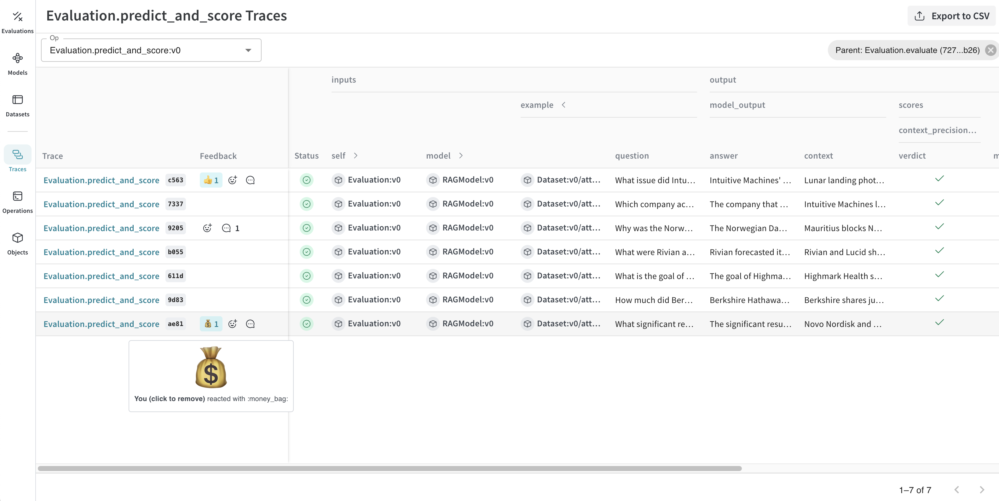

# Feedback

Evaluating LLM applications automatically is challenging. Teams often rely on direct user feedback, particularly from domain experts, who assess the content quality using simple indicators such as thumbs up or down. Developers also actively identify and resolve content issues.

Weave's feedback feature enables users to provide feedback directly within the Weave UI or through the API. You can add emoji reactions, textual notes, and structured data to calls. This feedback helps compile evaluation datasets, monitor application performance, and collect examples for advanced tasks like fine-tuning.

## View and Add Feedback within UI

Reactions and notes are displayed in a column in the calls grid. Hovering over these indicators provides more detail. Use these buttons to add reactions or notes.



View and edit feedback in the header of the call details page.


View the feedback for a call on the "Feedback" tab of the call details page.


Access copy-and-paste examples on the "Use" tab of the call details page to manipulate the feedback for that call using the SDK.


## SDK

Use the Weave Python SDK to programmatically add, remove, and query feedback on calls.

### Querying a project's feedback

```python
import weave
client = weave.init('intro-example')

# Get all feedback in a project
all_feedback = client.feedback()

# Fetch a specific feedback object by id.
# Note that the API still returns a collection, which is expected
# to contain zero or one item(s).
one_feedback = client.feedback("<feedback_uuid>")[0]

# Find all feedback objects with a specific reaction. You can specify offset and limit.
thumbs_up = client.feedback(reaction="👍", limit=10)

# After retrieval you can view the details of individual feedback objects.
for f in client.feedback():
    print(f.id)
    print(f.created_at)
    print(f.feedback_type)
    print(f.payload)
```

### Adding feedback to a call

```python
import weave
client = weave.init('intro-example')

call = client.call("<call_uuid>")

# Adding an emoji reaction
call.feedback.add_reaction("👍")

# Adding a note
call.feedback.add_note("this is a note")

# Adding custom key/value pairs.
# The first argument is a user-defined "type" string.
# Feedback must be JSON serializable and less than 1kb when serialized.
call.feedback.add("correctness", { "value": 5 })
```

### Retrieving the Call UUID

For scenarios where you need to add feedback immediately after a call, you can retrieve the call UUID programmatically during or after the call execution. Here is how to get the UUID of the call from within the operation:

```python

import weave
weave.init("uuid")

@weave.op()
def simple_operation(input_value):
    # Perform some simple operation
    output = f"Processed {input_value}"
    # Get the current call ID
    current_call = weave.get_current_call()
    call_id = current_call.id
    return output, call_id
```

Additionally, you can use call() method to execute the operation and retrieve the call ID after execution of the function:

```python
import weave
weave.init("uuid")

@weave.op()
def simple_operation(input_value):
    return f"Processed {input_value}"

# Execute the operation and retrieve the result and call ID
result, call = simple_operation.call("example input")
call_id = call.id
```

### Querying feedback on a call

```python
for f in call.feedback:
    print(f.id)
    print(f.feedback_type)
    print(f.payload)
```

### Deleting feedback from a call

```python
call.feedback.purge("<feedback_uuid>")
```
