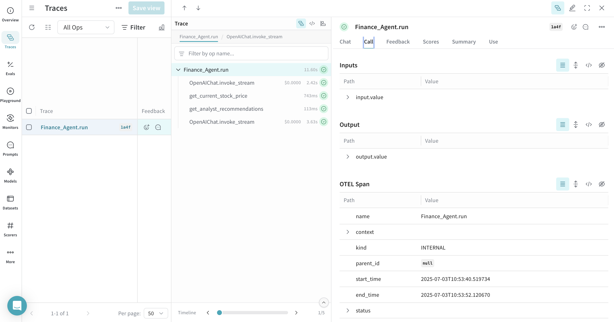
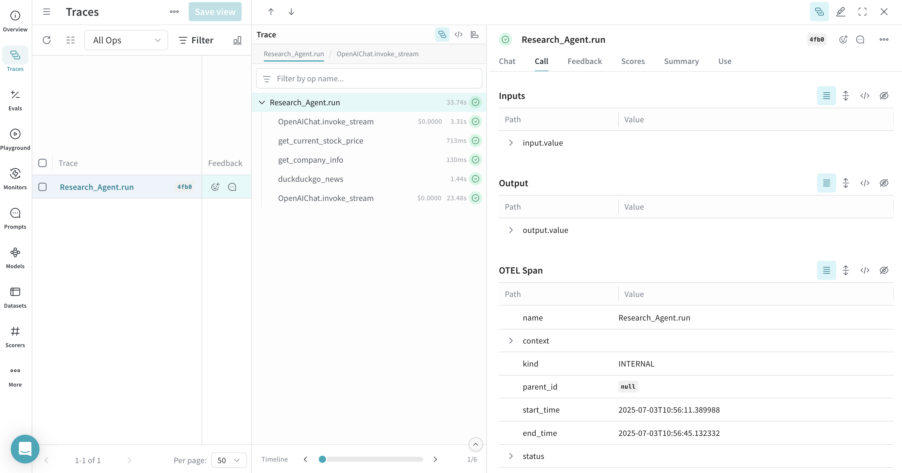
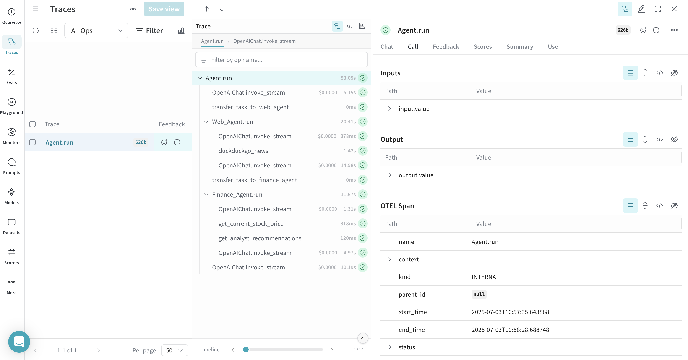
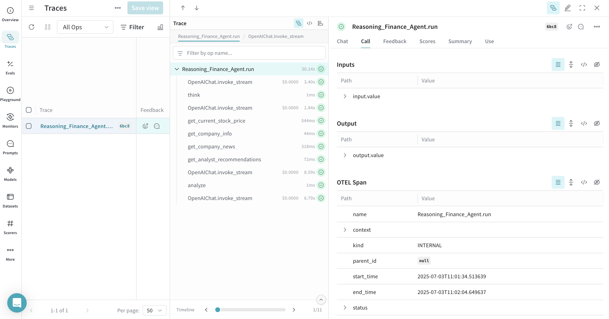
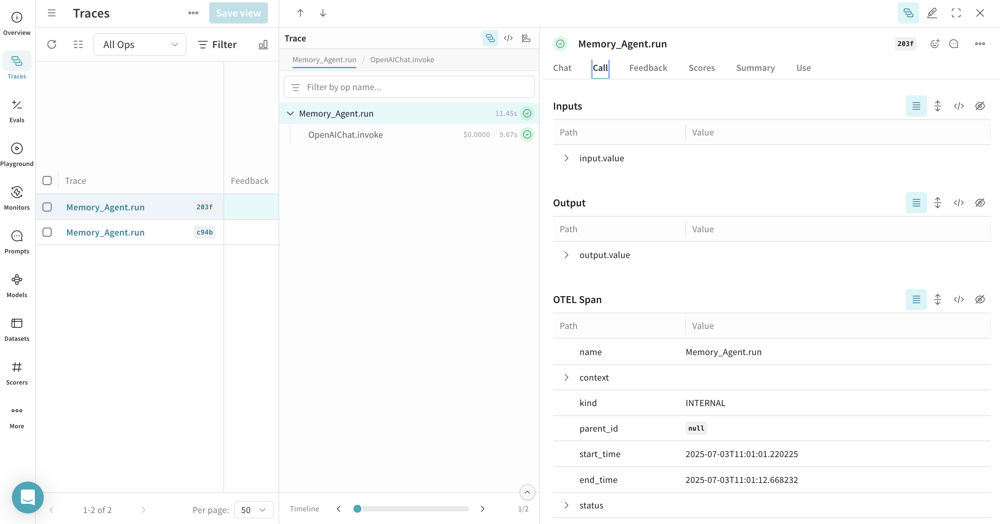

# Agno

You can trace [Agno](https://docs.agno.com/) agent and tool calls in Weave using [OpenTelemetry (OTEL)](https://opentelemetry.io/). Agno is a Python framework for building multi-agent systems with shared memory, knowledge, and reasoning. It's designed to be lightweight, model-agnostic, and highly performant, supporting multi-modal capabilities including text, image, audio, and video processing.

This guide explains how to trace Agno agent and tool calls using OTEL, and visualize those traces in Weave. You'll learn how to install the required dependencies, configure an OTEL tracer to send data to Weave, and instrument your Agno agents and tools.

:::tip
For more information on OTEL tracing in Weave, see [Send OTEL Traces to Weave](../tracking/otel.md).
:::

## Prerequisites

1. Install the required dependencies:

    ```bash
    pip install agno openinference-instrumentation-agno opentelemetry-sdk opentelemetry-exporter-otlp-proto-http
    ```

2. Set your OpenAI API key (or other model provider) as an environment variable:

    ```bash
    export OPENAI_API_KEY=your_api_key_here
    ```

3. [Configure OTEL tracing in Weave](#configure-otel-tracing-in-weave).

### Configure OTEL tracing in Weave

To send traces from Agno to Weave, configure OTEL with a `TracerProvider` and an `OTLPSpanExporter`. Set the exporter to the [correct endpoint and HTTP headers for authentication and project identification](#required-configuration).

:::important 
It is recommended that you store sensitive environment variables like your API key and project info in an environment file (e.g., `.env`), and load them using `os.environ`. This keeps your credentials secure and out of your codebase.
:::

#### Required configuration

- **Endpoint:** `https://trace.wandb.ai/otel/v1/traces`
- **Headers:**
  - `Authorization`: Basic auth using your W&B API key
  - `project_id`: Your W&B entity/project name (e.g., `myteam/myproject`). If you don't specify a W&B team, the project is created in your default entity. To find or update your default entity, refer to [User Settings](https://docs.wandb.ai/guides/models/app/settings-page/user-settings/#default-team) in the W&B Models documentation.

## Send OTEL traces from Agno to Weave

Once you've completed the [prerequisites](#prerequisites), you can send OTEL traces from Agno to Weave. The following code snippet demonstrates how to configure an OTLP span exporter and tracer provider to send OTEL traces from an Agno application to Weave.

:::important
To ensure that Weave traces Agno properly, set the global tracer provider _before_ using Agno components in your code.
:::

```python
# tracing.py

import base64
import os
from openinference.instrumentation.agno import AgnoInstrumentor
from opentelemetry.exporter.otlp.proto.http.trace_exporter import OTLPSpanExporter
from opentelemetry.sdk import trace as trace_sdk
from opentelemetry.sdk.trace.export import SimpleSpanProcessor
from opentelemetry import trace

# Load sensitive values from environment variables
WANDB_BASE_URL = "https://trace.wandb.ai"
# Your W&B entity/project name e.g. "myteam/myproject"
PROJECT_ID = os.environ.get("WANDB_PROJECT_ID")  
# Your W&B API key (found at https://wandb.ai/authorize)
WANDB_API_KEY = os.environ.get("WANDB_API_KEY")  

OTEL_EXPORTER_OTLP_ENDPOINT = f"{WANDB_BASE_URL}/otel/v1/traces"
AUTH = base64.b64encode(f"api:{WANDB_API_KEY}".encode()).decode()

OTEL_EXPORTER_OTLP_HEADERS = {
    "Authorization": f"Basic {AUTH}",
    "project_id": PROJECT_ID,
}

# Create the OTLP span exporter with endpoint and headers
exporter = OTLPSpanExporter(
    endpoint=OTEL_EXPORTER_OTLP_ENDPOINT,
    headers=OTEL_EXPORTER_OTLP_HEADERS,
)

# Create a tracer provider and add the exporter
tracer_provider = trace_sdk.TracerProvider()
tracer_provider.add_span_processor(SimpleSpanProcessor(exporter))

# Set the global tracer provider BEFORE importing/using Agno
trace.set_tracer_provider(tracer_provider)
```

## Trace Agno agents with OTEL

After setting up the tracer provider, you can create and run Agno agents with automatic tracing. The following example demonstrates how to create a simple agent with tools:

```python
from agno.agent import Agent
from agno.models.openai import OpenAIChat
from agno.tools.yfinance import YFinanceTools

from dotenv import load_dotenv
load_dotenv()

# Load AgnoInstrumentor from the file created above
from tracing import AgnoInstrumentor

# Start instrumenting Agno
AgnoInstrumentor().instrument()

# Create a finance agent
finance_agent = Agent(
    name="Finance Agent",
    model=OpenAIChat(id="gpt-4o-mini"),
    tools=[
        YFinanceTools(
            stock_price=True,
            analyst_recommendations=True,
            company_info=True,
            company_news=True
        )
    ],
    instructions=["Use tables to display data"],
    show_tool_calls=True,
    markdown=True,
)

# Use the agent - this will be automatically traced
finance_agent.print_response(
    "What is the current stock price of Apple and what are the latest analyst recommendations?",
    stream=True
)
```

All agent operations are automatically traced and sent to Weave, allowing you to visualize the execution flow, model calls, reasoning steps, and tool invocations.



## Trace Agno tools with OTEL

When you define and use tools with Agno, these tool calls are also captured in the trace. The OTEL integration automatically instruments both the agent's reasoning process and the individual tool executions, providing a comprehensive view of your agent's behavior.

Here's an example with multiple tools:

```python
from agno.agent import Agent
from agno.models.openai import OpenAIChat
from agno.tools.duckduckgo import DuckDuckGoTools
from agno.tools.yfinance import YFinanceTools

from dotenv import load_dotenv
load_dotenv()

# Load AgnoInstrumentor from the file created above
from tracing import AgnoInstrumentor

# Start instrumenting Agno
AgnoInstrumentor().instrument()

# Create an agent with multiple tools
research_agent = Agent(
    name="Research Agent",
    model=OpenAIChat(id="gpt-4o-mini"),
    tools=[
        DuckDuckGoTools(),
        YFinanceTools(stock_price=True, company_info=True),
    ],
    instructions=[
        "Search for current information and financial data",
        "Always include sources",
        "Use tables to display financial data"
    ],
    show_tool_calls=True,
    markdown=True,
)

# Use the agent - tool calls will be traced
research_agent.print_response(
    "Research Tesla's recent performance and news. Include stock price and any recent developments.",
    stream=True
)
```



## Trace multi-agent teams with OTEL

Agno's powerful multi-agent architecture allows you to create teams of agents that can collaborate and share context. These team interactions are also fully traced:

```python
from agno.agent import Agent
from agno.models.openai import OpenAIChat
from agno.tools.duckduckgo import DuckDuckGoTools
from agno.tools.yfinance import YFinanceTools

from dotenv import load_dotenv
load_dotenv()

# Load AgnoInstrumentor from the tracin.py file
from tracing import AgnoInstrumentor

# Start instrumenting Agno
AgnoInstrumentor().instrument()

# Create specialized agents
web_agent = Agent(
    name="Web Agent",
    role="Search the web for information",
    model=OpenAIChat(id="gpt-4o-mini"),
    tools=[DuckDuckGoTools()],
    instructions="Always include sources",
    show_tool_calls=True,
    markdown=True,
)

finance_agent = Agent(
    name="Finance Agent", 
    role="Get financial data",
    model=OpenAIChat(id="gpt-4o-mini"),
    tools=[YFinanceTools(stock_price=True, analyst_recommendations=True)],
    instructions="Use tables to display data",
    show_tool_calls=True,
    markdown=True,
)

# Create a team of agents
agent_team = Agent(
    team=[web_agent, finance_agent],
    model=OpenAIChat(id="gpt-4o"),
    instructions=["Always include sources", "Use tables to display data"],
    show_tool_calls=True,
    markdown=True,
)

# Use the team - all agent interactions will be traced
agent_team.print_response(
    "What's the current market sentiment around NVIDIA? Include both news analysis and financial metrics.",
    stream=True
)
```

This multi-agent trace will show the coordination between different agents in Weave, providing visibility into how tasks are distributed and executed across your agent team.



## Work with Reasoning Agents

Agno provides built-in reasoning capabilities that help agents think through problems step-by-step. These reasoning processes are also captured in traces:

```python
from agno.agent import Agent
from agno.models.openai import OpenAIChat
from agno.tools.reasoning import ReasoningTools
from agno.tools.yfinance import YFinanceTools

from dotenv import load_dotenv
load_dotenv()

# Load AgnoInstrumentor from the tracin.py file
from tracing import AgnoInstrumentor

# Start instrumenting Agno
AgnoInstrumentor().instrument()

# Create a reasoning agent
reasoning_agent = Agent(
    name="Reasoning Finance Agent",
    model=OpenAIChat(id="gpt-4o"),
    tools=[
        ReasoningTools(add_instructions=True),
        YFinanceTools(
            stock_price=True,
            analyst_recommendations=True,
            company_info=True,
            company_news=True
        ),
    ],
    instructions="Use tables to display data and show your reasoning process",
    show_tool_calls=True,
    markdown=True,
)

# Use the reasoning agent
reasoning_agent.print_response(
    "Should I invest in Apple stock right now? Analyze the current situation and provide a reasoned recommendation.",
    stream=True
)
```

The reasoning steps will be visible in the trace, showing how the agent breaks down complex problems and makes decisions.



## Work with memory and knowledge

Agno agents can maintain memory and access knowledge bases. These operations are also traced:

```python
from agno.agent import Agent
from agno.models.openai import OpenAIChat
from agno.memory import AgentMemory
from agno.storage.sqlite import SqliteStorage

from dotenv import load_dotenv
load_dotenv()

# Load AgnoInstrumentor from the tracin.py file
from tracing import AgnoInstrumentor

# Start instrumenting Agno
AgnoInstrumentor().instrument()


# Create an agent with memory
memory_agent = Agent(
    name="Memory Agent",
    model=OpenAIChat(id="gpt-4o-mini"),
    memory=AgentMemory(),
    storage=SqliteStorage(
        table_name="agent_sessions",
        db_file="agent_memory.db"
    ),
    instructions="Remember our conversation history",
    show_tool_calls=True,
    markdown=True,
)

# First interaction
memory_agent.print_response("My name is John and I'm interested in AI investing strategies.")

# Second interaction - agent will remember the previous context
memory_agent.print_response("What specific AI companies would you recommend for my portfolio?")
```



Memory operations, including storing and retrieving conversation history, will be shown in the trace.

## Learn more

- [Weave documentation: Send OTEL traces to Weave](../tracking/otel.md)
- [Official Agno documentation](https://docs.agno.com/)
- [Official OTEL documentation](https://opentelemetry.io/)
- [Agno GitHub repository](https://github.com/agno-agi/agno)
- [OpenInference Agno instrumentation](https://pypi.org/project/openinference-instrumentation-agno/)
