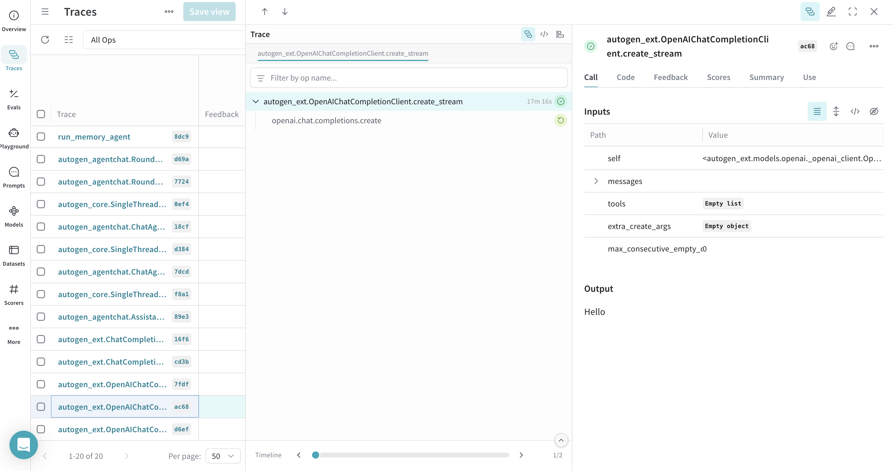
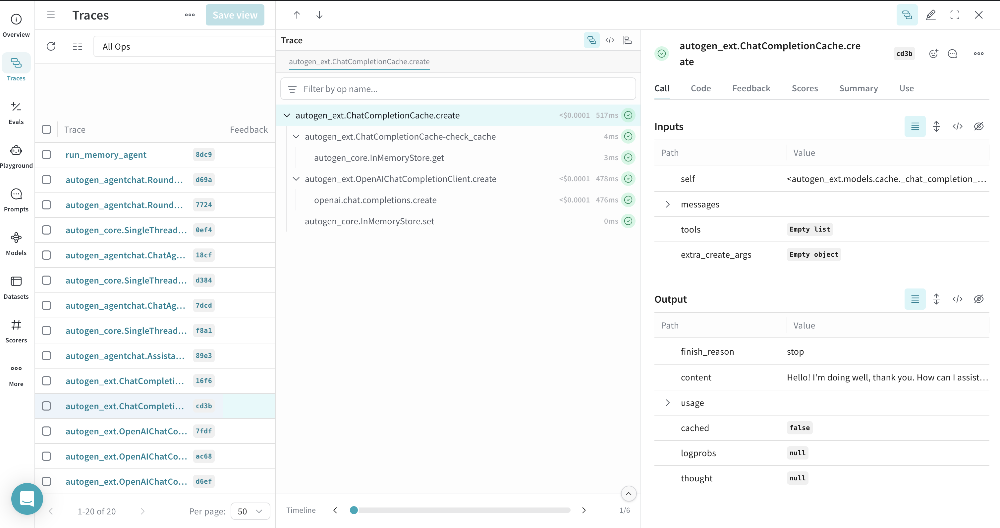
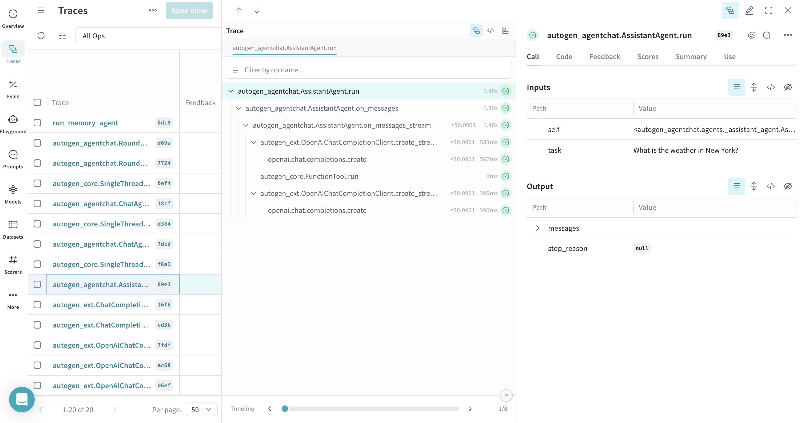
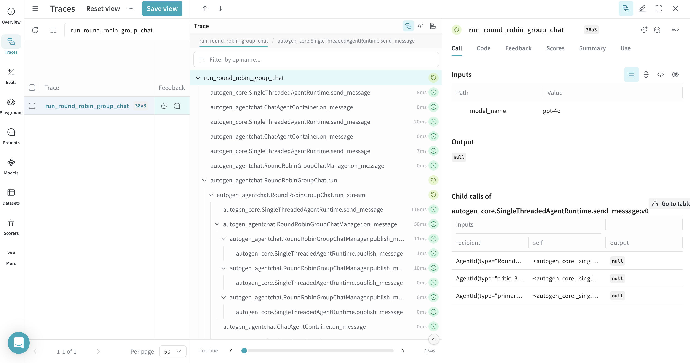
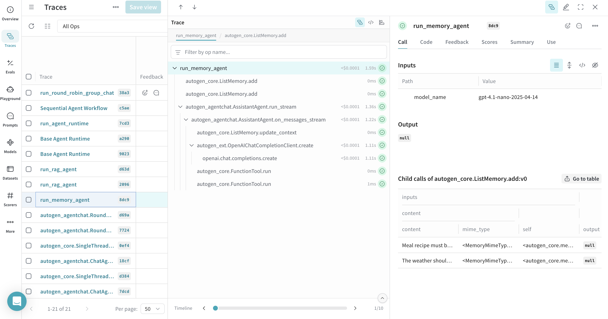
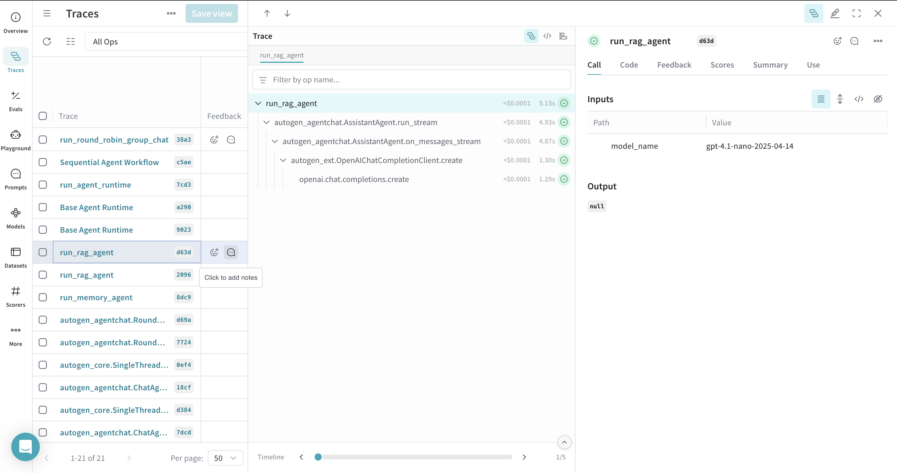
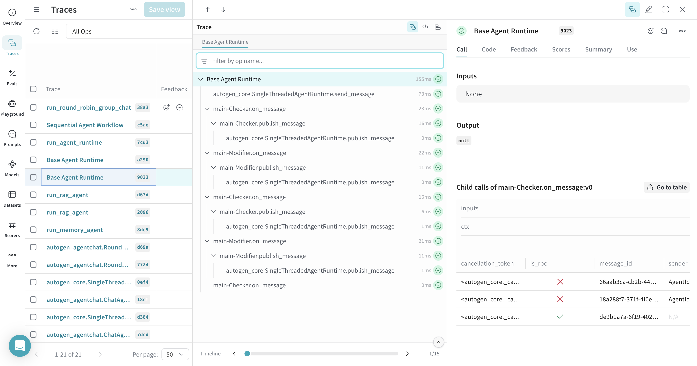
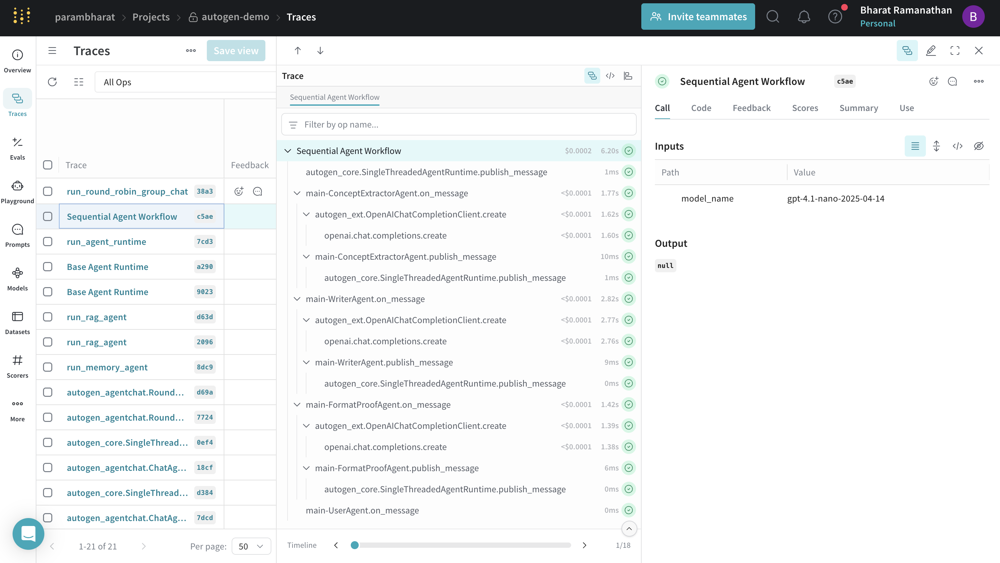
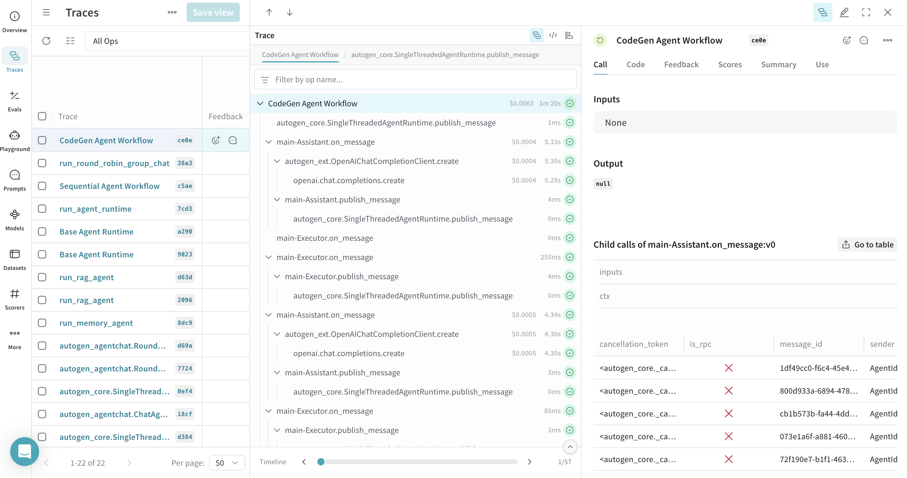

# AutoGen
<!-- TODO: Add a Colab notebook for this guide with a badge link here. -->

AutoGen is a framework from Microsoft for building AI agents and applications. It simplifies the creation of complex multi-agent systems, offering components for conversational AI (`AgentChat`), core multi-agent functionalities (`Core`), and integrations with external services (`Extensions`). AutoGen also provides a `Studio` for no-code agent prototyping. For more details, visit the [official AutoGen documentation](https://microsoft.github.io/autogen/stable//index.html).


:::note
This guide assumes you have a basic understanding of [AutoGen](https://microsoft.github.io/autogen/stable/index.html).
:::

Weave integrates with [AutoGen](https://microsoft.github.io/autogen/stable/index.html) to help you trace and visualize the execution of your multi-agent applications. By simply initializing Weave, you can automatically track interactions within `autogen_agentchat`, `autogen_core`, and `autogen_ext`. This guide will walk you through various examples of how to use Weave with AutoGen.

## Prerequisites

Before you begin, ensure you have AutoGen and Weave installed. You'll also need any SDKs for the LLM providers you intend to use (e.g., OpenAI, Anthropic).

```bash
pip install autogen_agentchat "autogen_ext[openai,anthropic]" weave 
```

Set up your API keys as environment variables:

```python
import os

os.environ["OPENAI_API_KEY"] = "<your-openai-api-key>"
os.environ["ANTHROPIC_API_KEY"] = "<your-anthropic-api-key>"
```

## Basic Setup

Initialize Weave at the beginning of your script to start capturing traces.

```python
# highlight-next-line
import weave
# highlight-next-line
weave.init("autogen-demo")
```

## Tracing a Simple Model Client

Weave can trace calls made directly to model clients within AutoGen.

### Tracing a client create call

This example demonstrates tracing a single call to an `OpenAIChatCompletionClient`.

```python
import asyncio
from autogen_core.models import UserMessage
from autogen_ext.models.openai import OpenAIChatCompletionClient
# from autogen_ext.models.anthropic import AnthropicChatCompletionClient

async def simple_client_call(model_name = "gpt-4o"):
    model_client = OpenAIChatCompletionClient(
        model=model_name,
    )
    # Alternatively, you can use Anthropic or other model clients
    # model_client = AnthropicChatCompletionClient(
        # model="claude-3-haiku-20240307"
    # )
    response = await model_client.create(
        [UserMessage(content="Hello, how are you?", source="user")]
    )
    print(response)

asyncio.run(simple_client_call())

```

[](https://wandb.ai/parambharat/autogen-demo/weave/traces?view=traces_default&peekPath=%2Fparambharat%2Fautogen-demo%2Fcalls%2F0196ee09-8dcf-7b72-8cdc-7699608cd6ef%3FhideTraceTree%3D0)

### Tracing a client create call with streaming

Weave also supports tracing streamed responses.

```python

async def simple_client_call_stream(model_name = "gpt-4o"):
    openai_model_client = OpenAIChatCompletionClient(model=model_name)
    async for item in openai_model_client.create_stream(
        [UserMessage(content="Hello, how are you?", source="user")]
    ):
      print(item, flush=True, end="")

asyncio.run(simple_client_call_stream())

```

[](https://wandb.ai/parambharat/autogen-demo/weave/traces?view=traces_default&peekPath=%2Fparambharat%2Fautogen-demo%2Fcalls%2F0196ee0e-24be-7523-b15e-04f87c03ac68%3FhideTraceTree%3D0)

### Weave records cached calls

AutoGen's `ChatCompletionCache` can be used, and Weave will trace these interactions, showing whether a response came from the cache or a new call.

```python

from autogen_ext.models.cache import ChatCompletionCache

async def run_cache_client(model_name = "gpt-4o"):
      openai_model_client = OpenAIChatCompletionClient(model=model_name)
      cache_client = ChatCompletionCache(openai_model_client,)

      response = await cache_client.create(
          [UserMessage(content="Hello, how are you?", source="user")]
      )
      print(response)  # Should print response from OpenAI
      response = await cache_client.create(
          [UserMessage(content="Hello, how are you?", source="user")]
      )
      print(response)  # Should print cached response

asyncio.run(run_cache_client())

```

[](https://wandb.ai/parambharat/autogen-demo/weave/traces?view=traces_default&peekPath=%2Fparambharat%2Fautogen-demo%2Fcalls%2F0196ee11-fded-72c2-baaa-7c0ba2a7cd3b%3FhideTraceTree%3D0)


## Tracing an Agent with Tool Calls

Weave traces agents and their tool usage, providing visibility into how agents select and execute tools.

```python
from autogen_agentchat.agents import AssistantAgent

async def get_weather(city: str) -> str:
    return f"The weather in {city} is 73 degrees and Sunny."

async def run_agent_with_tools(model_name = "gpt-4o"):
    model_client = OpenAIChatCompletionClient(model=model_name)

    agent = AssistantAgent(
        name="weather_agent",
        model_client=model_client,
        tools=[get_weather],
        system_message="You are a helpful assistant.",
        reflect_on_tool_use=True,
    )
    # For streaming output to console:
    # await Console(agent.run_stream(task="What is the weather in New York?"))
    res = await agent.run(task="What is the weather in New York?")
    print(res)
    await model_client.close()

asyncio.run(run_agent_with_tools())

```

[](https://wandb.ai/parambharat/autogen-demo/weave/traces?view=traces_default&peekPath=%2Fparambharat%2Fautogen-demo%2Fcalls%2F0196ee13-e5ca-72a1-b7b6-4b263fad89e3%3FhideTraceTree%3D0)

## Tracing a GroupChat - RoundRobin

Interactions within group chats, such as `RoundRobinGroupChat`, are traced by Weave, allowing you to follow the conversation flow between agents.

```python

from autogen_agentchat.conditions import TextMentionTermination
from autogen_agentchat.teams import RoundRobinGroupChat

# we add this weave op here because we want to trace the entire group chat
# it's completely optional but highly recommended to use it

# highlight-next-line
@weave.op
async def run_round_robin_group_chat(model_name="gpt-4o"):
    model_client = OpenAIChatCompletionClient(model=model_name)

    primary_agent = AssistantAgent(
        "primary",
        model_client=model_client,
        system_message="You are a helpful AI assistant.",
    )

    critic_agent = AssistantAgent(
        "critic",
        model_client=model_client,
        system_message="Provide constructive feedback. Respond with 'APPROVE' to when your feedbacks are addressed.",
    )

    text_termination = TextMentionTermination("APPROVE")

    team = RoundRobinGroupChat(
        [primary_agent, critic_agent], termination_condition=text_termination
    )
    await team.reset()
    # For streaming output to console:
    # await Console(team.run_stream(task="Write a short poem about the fall season."))
    result = await team.run(task="Write a short poem about the fall season.")
    print(result)
    await model_client.close()


asyncio.run(run_round_robin_group_chat())

```

[](https://wandb.ai/parambharat/autogen-demo/weave/traces?filter=%7B%22opVersionRefs%22%3A%5B%22weave%3A%2F%2F%2Fparambharat%2Fautogen-demo%2Fop%2Frun_round_robin_group_chat%3A*%22%5D%7D&peekPath=%2Fparambharat%2Fautogen-demo%2Fcalls%2F0196f16c-26ce-7b32-8f0c-2366d29038a3%3FdescendentCallId%3D0196f16c-26ce-7b32-8f0c-2366d29038a3%26hideTraceTree%3D0)

## Tracing Memory

AutoGen's memory components can be traced with Weave. You can use `@weave.op()` to group memory operations under a single trace for better readability.

```python

from autogen_core.memory import ListMemory, MemoryContent, MemoryMimeType

# We add this weave op here because we want to trace 
# the memory add calls along with the memory get calls under a single trace
# it's completely optional but highly recommended to use it

# highlight-next-line
@weave.op
async def run_memory_agent(model_name="gpt-4o"):
    user_memory = ListMemory()

    await user_memory.add(
        MemoryContent(
            content="The weather should be in metric units",
            mime_type=MemoryMimeType.TEXT,
        )
    )

    await user_memory.add(
        MemoryContent(
            content="Meal recipe must be vegan", mime_type=MemoryMimeType.TEXT
        )
    )

    async def get_weather(city: str, units: str = "imperial") -> str:
        if units == "imperial":
            return f"The weather in {city} is 73 °F and Sunny."
        elif units == "metric":
            return f"The weather in {city} is 23 °C and Sunny."
        else:
            return f"Sorry, I don't know the weather in {city}."

    model_client = OpenAIChatCompletionClient(model=model_name)
    assistant_agent = AssistantAgent(
        name="assistant_agent",
        model_client=model_client,
        tools=[get_weather],
        memory=[user_memory],
    )

    # For streaming output to console:
    # stream = assistant_agent.run_stream(task="What is the weather in New York?")
    # await Console(stream)
    result = await assistant_agent.run(task="What is the weather in New York?")
    print(result)
    await model_client.close()


asyncio.run(run_memory_agent())

```

[](https://wandb.ai/parambharat/autogen-demo/weave/traces?view=traces_default&peekPath=%2Fparambharat%2Fautogen-demo%2Fcalls%2F0196ee18-28b6-7063-90df-77aaedf88dc9%3FhideTraceTree%3D0)

## Tracing RAG Workflows

Retrieval Augmented Generation (RAG) workflows, including document indexing and retrieval with memory systems like `ChromaDBVectorMemory`, are traceable. Decorating the RAG process with `@weave.op()` helps in visualizing the entire flow.

:::note
The RAG example requires `chromadb`. Install it with `pip install chromadb`.
:::

```python
# highlight-next-line
# !pip install -q chromadb 
# Ensure chromadb is installed in your environment: `pip install chromadb`

import re
from typing import List
import os
from pathlib import Path

import aiofiles
import httpx

from autogen_core.memory import Memory, MemoryContent, MemoryMimeType
from autogen_ext.memory.chromadb import (
    ChromaDBVectorMemory,
    PersistentChromaDBVectorMemoryConfig,
)

class SimpleDocumentIndexer:
    def __init__(self, memory: Memory, chunk_size: int = 1500) -> None:
        self.memory = memory
        self.chunk_size = chunk_size

    async def _fetch_content(self, source: str) -> str:
        if source.startswith(("http://", "https://")):
            async with httpx.AsyncClient() as client:
                response = await client.get(source)
                return response.text
        else:
            async with aiofiles.open(source, "r", encoding="utf-8") as f:
                return await f.read()

    def _strip_html(self, text: str) -> str:
        text = re.sub(r"<[^>]*>", " ", text)
        text = re.sub(r"\\s+", " ", text)
        return text.strip()

    def _split_text(self, text: str) -> List[str]:
        chunks: list[str] = []
        for i in range(0, len(text), self.chunk_size):
            chunk = text[i : i + self.chunk_size]
            chunks.append(chunk.strip())
        return chunks

    async def index_documents(self, sources: List[str]) -> int:
        total_chunks = 0
        for source in sources:
            try:
                content = await self._fetch_content(source)
                if "<" in content and ">" in content:
                    content = self._strip_html(content)
                chunks = self._split_text(content)
                for i, chunk in enumerate(chunks):
                    await self.memory.add(
                        MemoryContent(
                            content=chunk,
                            mime_type=MemoryMimeType.TEXT,
                            metadata={"source": source, "chunk_index": i},
                        )
                    )
                total_chunks += len(chunks)
            except Exception as e:
                print(f"Error indexing {source}: {str(e)}")
        return total_chunks

# highlight-next-line
@weave.op
async def run_rag_agent(model_name="gpt-4o"):
    rag_memory = ChromaDBVectorMemory(
        config=PersistentChromaDBVectorMemoryConfig(
            collection_name="autogen_docs",
            persistence_path=os.path.join(str(Path.home()), ".chromadb_autogen_weave"),
            k=3,
            score_threshold=0.4,
        )
    )
    # await rag_memory.clear() # Uncomment to clear existing memory if needed

    async def index_autogen_docs() -> None:
        indexer = SimpleDocumentIndexer(memory=rag_memory)
        sources = [
            "https://raw.githubusercontent.com/microsoft/autogen/main/README.md",
            "https://microsoft.github.io/autogen/dev/user-guide/agentchat-user-guide/tutorial/agents.html",
        ]
        chunks: int = await indexer.index_documents(sources)
        print(f"Indexed {chunks} chunks from {len(sources)} AutoGen documents")
    
    # Only index if the collection is empty or you want to re-index
    # For demo purposes, we might index it each time or check if already indexed.
    # This example will try to index each run. Consider adding a check.
    await index_autogen_docs()

    model_client = OpenAIChatCompletionClient(model=model_name)
    rag_assistant = AssistantAgent(
        name="rag_assistant",
        model_client=model_client,
        memory=[rag_memory],
    )
    
    # For streaming output to console:
    # stream = rag_assistant.run_stream(task="What is AgentChat?")
    # await Console(stream)
    result = await rag_assistant.run(task="What is AgentChat?")
    print(result)

    await rag_memory.close()
    await model_client.close()

asyncio.run(run_rag_agent())
```

[](https://wandb.ai/parambharat/autogen-demo/weave/traces?view=traces_default&peekPath=%2Fparambharat%2Fautogen-demo%2Fcalls%2F0196ee1b-bac5-7b80-8be7-6e6ea7d1d63d%3FhideTraceTree%3D0)

## Tracing Agent Runtimes

Weave can trace operations within AutoGen's agent runtimes, like `SingleThreadedAgentRuntime`. Using `@weave.op()` around the runtime execution function can group related traces.

```python
from dataclasses import dataclass
from typing import Callable

from autogen_core import (
    DefaultTopicId,
    MessageContext,
    RoutedAgent,
    default_subscription,
    message_handler,
    AgentId,
    SingleThreadedAgentRuntime
)

@dataclass
class Message:
    content: int

@default_subscription
class Modifier(RoutedAgent):
    def __init__(self, modify_val: Callable[[int], int]) -> None:
        super().__init__("A modifier agent.")
        self._modify_val = modify_val

    @message_handler
    async def handle_message(self, message: Message, ctx: MessageContext) -> None:
        val = self._modify_val(message.content)
        print(f"{'-'*80}\\nModifier:\\nModified {message.content} to {val}")
        await self.publish_message(Message(content=val), DefaultTopicId())

@default_subscription
class Checker(RoutedAgent):
    def __init__(self, run_until: Callable[[int], bool]) -> None:
        super().__init__("A checker agent.")
        self._run_until = run_until

    @message_handler
    async def handle_message(self, message: Message, ctx: MessageContext) -> None:
        if not self._run_until(message.content):
            print(f"{'-'*80}\\nChecker:\\n{message.content} passed the check, continue.")
            await self.publish_message(
                Message(content=message.content), DefaultTopicId()
            )
        else:
            print(f"{'-'*80}\\nChecker:\\n{message.content} failed the check, stopping.")

# we add this weave op here because we want to trace 
# the entire agent runtime call under a single trace
# it's completely optional but highly recommended to use it

# highlight-next-line
@weave.op
async def run_agent_runtime() -> None:
    runtime = SingleThreadedAgentRuntime()

    await Modifier.register(
        runtime,
        "modifier",
        lambda: Modifier(modify_val=lambda x: x - 1),
    )

    await Checker.register(
        runtime,
        "checker",
        lambda: Checker(run_until=lambda x: x <= 1),
    )

    runtime.start()
    await runtime.send_message(Message(content=3), AgentId("checker", "default"))
    await runtime.stop_when_idle()

asyncio.run(run_agent_runtime())

```

[](https://wandb.ai/parambharat/autogen-demo/weave/traces?view=traces_default&peekPath=%2Fparambharat%2Fautogen-demo%2Fcalls%2F0196ee1d-6246-7f11-afb1-3a1874f79023%3FhideTraceTree%3D0)

## Tracing Workflows (Sequential)

Complex agent workflows, defining sequences of agent interactions, can be traced. `@weave.op()` can be used to provide a high-level trace for the entire workflow.

```python

from autogen_core import TopicId, type_subscription
from autogen_core.models import ChatCompletionClient, SystemMessage, UserMessage

@dataclass
class WorkflowMessage:
    content: str

concept_extractor_topic_type = "ConceptExtractorAgent"
writer_topic_type = "WriterAgent"
format_proof_topic_type = "FormatProofAgent"
user_topic_type = "User"

@type_subscription(topic_type=concept_extractor_topic_type)
class ConceptExtractorAgent(RoutedAgent):
    def __init__(self, model_client: ChatCompletionClient) -> None:
        super().__init__("A concept extractor agent.")
        self._system_message = SystemMessage(
            content=(
                "You are a marketing analyst. Given a product description, identify:\n"
                "- Key features\n"
                "- Target audience\n"
                "- Unique selling points\n\n"
            )
        )
        self._model_client = model_client

    @message_handler
    async def handle_user_description(self, message: WorkflowMessage, ctx: MessageContext) -> None:
        prompt = f"Product description: {message.content}"
        llm_result = await self._model_client.create(
            messages=[self._system_message, UserMessage(content=prompt, source=self.id.key)],
            cancellation_token=ctx.cancellation_token,
        )
        response = llm_result.content
        assert isinstance(response, str)
        print(f"{'-'*80}\\n{self.id.type}:\\n{response}")
        await self.publish_message(
            WorkflowMessage(response), topic_id=TopicId(writer_topic_type, source=self.id.key)
        )

@type_subscription(topic_type=writer_topic_type)
class WriterAgent(RoutedAgent):
    def __init__(self, model_client: ChatCompletionClient) -> None:
        super().__init__("A writer agent.")
        self._system_message = SystemMessage(
            content=(
                "You are a marketing copywriter. Given a block of text describing features, audience, and USPs, "
                "compose a compelling marketing copy (like a newsletter section) that highlights these points. "
                "Output should be short (around 150 words), output just the copy as a single text block."
            )
        )
        self._model_client = model_client
    
    @message_handler
    async def handle_intermediate_text(self, message: WorkflowMessage, ctx: MessageContext) -> None:
        prompt = f"Below is the info about the product:\\n\\n{message.content}"
        llm_result = await self._model_client.create(
            messages=[self._system_message, UserMessage(content=prompt, source=self.id.key)],
            cancellation_token=ctx.cancellation_token,
        )
        response = llm_result.content
        assert isinstance(response, str)
        print(f"{'-'*80}\\n{self.id.type}:\\n{response}")
        await self.publish_message(
            WorkflowMessage(response), topic_id=TopicId(format_proof_topic_type, source=self.id.key)
        )

@type_subscription(topic_type=format_proof_topic_type)
class FormatProofAgent(RoutedAgent):
    def __init__(self, model_client: ChatCompletionClient) -> None:
        super().__init__("A format & proof agent.")
        self._system_message = SystemMessage(
            content=(
                "You are an editor. Given the draft copy, correct grammar, improve clarity, ensure consistent tone, "
                "give format and make it polished. Output the final improved copy as a single text block."
            )
        )
        self._model_client = model_client

    @message_handler
    async def handle_intermediate_text(self, message: WorkflowMessage, ctx: MessageContext) -> None:
        prompt = f"Draft copy:\\n{message.content}."
        llm_result = await self._model_client.create(
            messages=[self._system_message, UserMessage(content=prompt, source=self.id.key)],
            cancellation_token=ctx.cancellation_token,
        )
        response = llm_result.content
        assert isinstance(response, str)
        print(f"{'-'*80}\\n{self.id.type}:\\n{response}")
        await self.publish_message(
            WorkflowMessage(response), topic_id=TopicId(user_topic_type, source=self.id.key)
        )

@type_subscription(topic_type=user_topic_type)
class UserAgent(RoutedAgent):
    def __init__(self) -> None:
        super().__init__("A user agent that outputs the final copy to the user.")

    @message_handler
    async def handle_final_copy(self, message: WorkflowMessage, ctx: MessageContext) -> None:
        print(f"\\n{'-'*80}\\n{self.id.type} received final copy:\\n{message.content}")

# we add this weave op here because we want to trace 
# the entire agent workflow under a single trace
# it's completely optional but highly recommended to use it

# highlight-next-line
@weave.op(call_display_name="Sequential Agent Workflow")
async def run_agent_workflow(model_name="gpt-4o"):
    model_client = OpenAIChatCompletionClient(model=model_name)
    runtime = SingleThreadedAgentRuntime()

    await ConceptExtractorAgent.register(runtime, type=concept_extractor_topic_type, factory=lambda: ConceptExtractorAgent(model_client=model_client))
    await WriterAgent.register(runtime, type=writer_topic_type, factory=lambda: WriterAgent(model_client=model_client))
    await FormatProofAgent.register(runtime, type=format_proof_topic_type, factory=lambda: FormatProofAgent(model_client=model_client))
    await UserAgent.register(runtime, type=user_topic_type, factory=lambda: UserAgent())

    runtime.start()
    await runtime.publish_message(
        WorkflowMessage(
            content="An eco-friendly stainless steel water bottle that keeps drinks cold for 24 hours"
        ),
        topic_id=TopicId(concept_extractor_topic_type, source="default"),
    )
    await runtime.stop_when_idle()
    await model_client.close()

asyncio.run(run_agent_workflow())

```

[](https://wandb.ai/parambharat/autogen-demo/weave/traces?view=traces_default&peekPath=%2Fparambharat%2Fautogen-demo%2Fcalls%2F0196ee1f-dd53-73f2-9119-2a44da92c5ae%3FhideTraceTree%3D0)

## Tracing Code Executor

:::warning[Docker Required]
This example involves code execution using Docker and may not work in all environments (e.g., Colab directly). Ensure Docker is running locally if you try this.
:::

Weave traces the generation and execution of code by AutoGen agents.

```python

import tempfile
from autogen_core import DefaultTopicId
from autogen_core.code_executor import CodeBlock, CodeExecutor
from autogen_core.models import (
    AssistantMessage,
    ChatCompletionClient,
    LLMMessage,
    SystemMessage,
    UserMessage,
)
from autogen_ext.code_executors.docker import DockerCommandLineCodeExecutor


@dataclass
class CodeGenMessage:
    content: str

@default_subscription
class Assistant(RoutedAgent):
    def __init__(self, model_client: ChatCompletionClient) -> None:
        super().__init__("An assistant agent.")
        self._model_client = model_client
        self._chat_history: List[LLMMessage] = [
           SystemMessage(
                content="""Write Python script in markdown block, and it will be executed.
Always save figures to file in the current directory. Do not use plt.show(). All code required to complete this task must be contained within a single response.""",
            )
        ]

    @message_handler
    async def handle_message(self, message: CodeGenMessage, ctx: MessageContext) -> None:
        self._chat_history.append(UserMessage(content=message.content, source="user"))
        result = await self._model_client.create(self._chat_history)
        print(f"\\n{'-'*80}\\nAssistant:\\n{result.content}")
        self._chat_history.append(AssistantMessage(content=result.content, source="assistant"))
        await self.publish_message(CodeGenMessage(content=result.content), DefaultTopicId())

def extract_markdown_code_blocks(markdown_text: str) -> List[CodeBlock]:
    pattern = re.compile(r"```(?:\\s*([\\w\\+\\-]+))?\\n([\\s\\S]*?)```")
    matches = pattern.findall(markdown_text)
    code_blocks: List[CodeBlock] = []
    for match in matches:
        language = match[0].strip() if match[0] else ""
        code_content = match[1]
        code_blocks.append(CodeBlock(code=code_content, language=language))
    return code_blocks

@default_subscription
class Executor(RoutedAgent):
    def __init__(self, code_executor: CodeExecutor) -> None:
        super().__init__("An executor agent.")
        self._code_executor = code_executor

    @message_handler
    async def handle_message(self, message: CodeGenMessage, ctx: MessageContext) -> None:
        code_blocks = extract_markdown_code_blocks(message.content)
        if code_blocks:
            result = await self._code_executor.execute_code_blocks(
                code_blocks, cancellation_token=ctx.cancellation_token
            )
            print(f"\\n{'-'*80}\\nExecutor:\\n{result.output}")
            await self.publish_message(CodeGenMessage(content=result.output), DefaultTopicId())

# we add this weave op here because we want to trace 
# the entire code gen workflow under a single trace
# it's completely optional but highly recommended to use it

# highlight-next-line
@weave.op(call_display_name="CodeGen Agent Workflow")
async def run_codegen(model_name="gpt-4o"): # Updated model
    work_dir = tempfile.mkdtemp()
    runtime = SingleThreadedAgentRuntime()

    # Ensure Docker is running for this example
    try:
        async with DockerCommandLineCodeExecutor(work_dir=work_dir) as executor:
            model_client = OpenAIChatCompletionClient(model=model_name)
            await Assistant.register(runtime, "assistant", lambda: Assistant(model_client=model_client))
            await Executor.register(runtime, "executor", lambda: Executor(executor))

            runtime.start()
            await runtime.publish_message(
                CodeGenMessage(content="Create a plot of NVDA vs TSLA stock returns YTD from 2024-01-01."),
                DefaultTopicId(),
            )
            await runtime.stop_when_idle()
            await model_client.close()
    except Exception as e:
        print(f"Could not run Docker code executor example: {e}")
        print("Please ensure Docker is installed and running.")
    finally:
        import shutil
        shutil.rmtree(work_dir)


asyncio.run(run_codegen())
```

[](https://wandb.ai/parambharat/autogen-demo/weave/traces?view=traces_default&peekPath=%2Fparambharat%2Fautogen-demo%2Fcalls%2F0196f173-21c2-7540-9dc7-fbab0b94ce0e%3FhideTraceTree%3D0)

## Learn More

- **Weave**:
    - [Tracing Guide](/guides/tracking/tracing)
    - [Op Decorator](/guides/tracking/ops)
- **AutoGen**:
    - [Official Documentation](https://microsoft.github.io/autogen/stable//index.html)
    - [AutoGen GitHub](https://github.com/microsoft/autogen)

This guide provides a starting point for integrating Weave with AutoGen. Explore the Weave UI to see detailed traces of your agent interactions, model calls, and tool usage.
