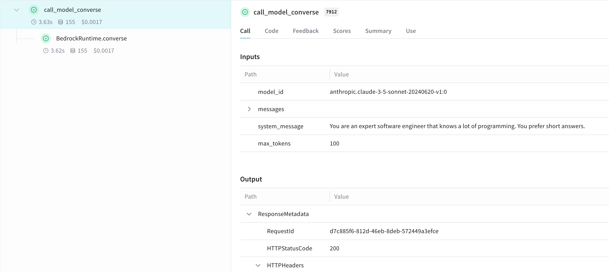

# Amazon Bedrock

Weave automatically tracks and logs LLM calls made via Amazon Bedrock, AWS's fully managed service that offers foundation models from leading AI companies through a unified API.

:::tip
For the latest tutorials, visit [Weights & Biases on Amazon Web Services](https://wandb.ai/site/partners/aws/).
:::

:::note
Do you want to experiment with Amazon Bedrock models on Weave without any set up? Try the [LLM Playground](../tools/playground.md).
:::

## Traces

Weave will automatically capture traces for Bedrock API calls. You can use the Bedrock client as usual after initializing Weave and patching the client:

```python
import weave
import boto3
import json
from weave.integrations.bedrock.bedrock_sdk import patch_client

weave.init("my_bedrock_app")

# Create and patch the Bedrock client
client = boto3.client("bedrock-runtime")
patch_client(client)

# Use the client as usual
response = client.invoke_model(
    modelId="anthropic.claude-3-5-sonnet-20240620-v1:0",
    body=json.dumps({
        "anthropic_version": "bedrock-2023-05-31",
        "max_tokens": 100,
        "messages": [
            {"role": "user", "content": "What is the capital of France?"}
        ]
    }),
    contentType='application/json',
    accept='application/json'
)
response_dict = json.loads(response.get('body').read())
print(response_dict["content"][0]["text"])
```

of using the `converse` API:

```python
messages = [{"role": "user", "content": [{"text": "What is the capital of France?"}]}]

response = client.converse(
    modelId="anthropic.claude-3-5-sonnet-20240620-v1:0",
    system=[{"text": "You are a helpful AI assistant."}],
    messages=messages,
    inferenceConfig={"maxTokens": 100},
)
print(response["output"]["message"]["content"][0]["text"])

```

## Wrapping with your own ops

You can create reusable operations using the `@weave.op()` decorator. Here's an example showing both the `invoke_model` and `converse` APIs:

```python
@weave.op
def call_model_invoke(
    model_id: str,
    prompt: str,
    max_tokens: int = 100,
    temperature: float = 0.7
) -> dict:
    body = json.dumps({
        "anthropic_version": "bedrock-2023-05-31",
        "max_tokens": max_tokens,
        "temperature": temperature,
        "messages": [
            {"role": "user", "content": prompt}
        ]
    })

    response = client.invoke_model(
        modelId=model_id,
        body=body,
        contentType='application/json',
        accept='application/json'
    )
    return json.loads(response.get('body').read())

@weave.op
def call_model_converse(
    model_id: str,
    messages: str,
    system_message: str,
    max_tokens: int = 100,
) -> dict:
    response = client.converse(
        modelId=model_id,
        system=[{"text": system_message}],
        messages=messages,
        inferenceConfig={"maxTokens": max_tokens},
    )
    return response
```



## Create a `Model` for easier experimentation

You can create a Weave Model to better organize your experiments and capture parameters. Here's an example using the `converse` API:

```python
class BedrockLLM(weave.Model):
    model_id: str
    max_tokens: int = 100
    system_message: str = "You are a helpful AI assistant."

    @weave.op
    def predict(self, prompt: str) -> str:
        "Generate a response using Bedrock's converse API"
        
        messages = [{
            "role": "user",
            "content": [{"text": prompt}]
        }]

        response = client.converse(
            modelId=self.model_id,
            system=[{"text": self.system_message}],
            messages=messages,
            inferenceConfig={"maxTokens": self.max_tokens},
        )
        return response["output"]["message"]["content"][0]["text"]

# Create and use the model
model = BedrockLLM(
    model_id="anthropic.claude-3-5-sonnet-20240620-v1:0",
    max_tokens=100,
    system_message="You are an expert software engineer that knows a lot of programming. You prefer short answers."
)
result = model.predict("What is the best way to handle errors in Python?")
print(result)
```

This approach allows you to version your experiments and easily track different configurations of your Bedrock-based application.
