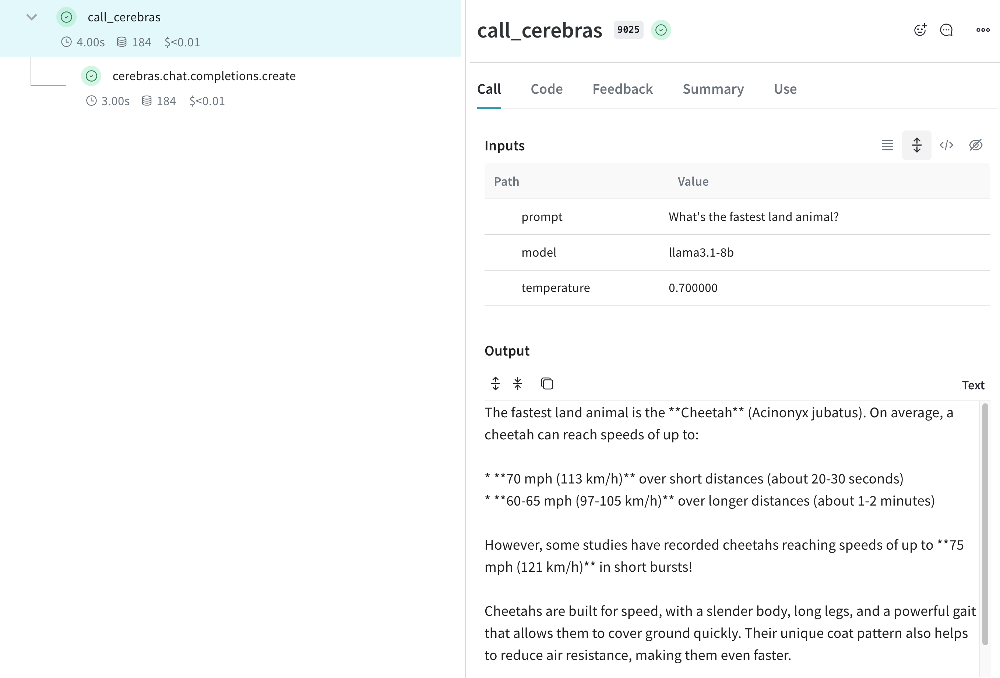
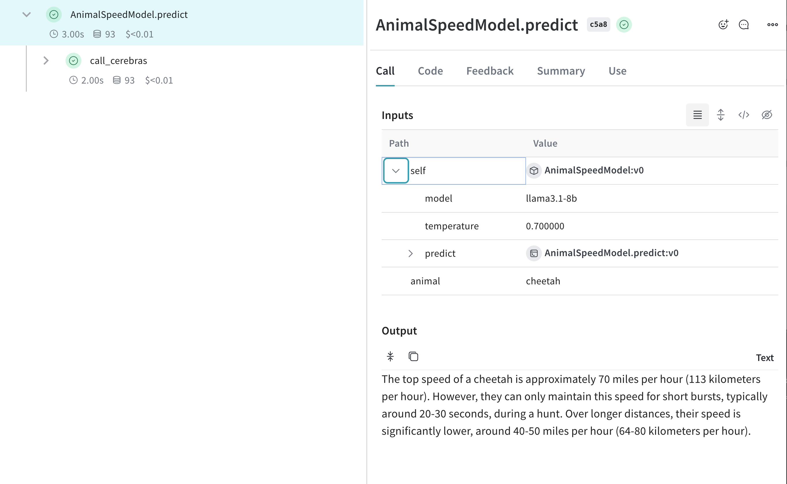

# Cerebras

Weave automatically tracks and logs LLM calls made via the [Cerebras Cloud SDK](https://inference-docs.cerebras.ai/introduction).

## Traces

Tracking LLM calls is crucial for debugging and performance monitoring. Weave helps you do this by automatically capturing traces for the Cerebras Cloud SDK.

Here's an example of how to use Weave with Cerebras:

```python
import os
import weave
from cerebras.cloud.sdk import Cerebras

# Initialise the weave project
weave.init("cerebras_speedster")

# Use the Cerebras SDK as usual
api_key = os.environ["CEREBRAS_API_KEY"]
model = "llama3.1-8b"  # Cerebras model

client = Cerebras(api_key=api_key)

response = client.chat.completions.create(
    model=model,
    messages=[{"role": "user", "content": "What's the fastest land animal?"}],
)

print(response.choices[0].message.content)
```

Weave will now track and log all LLM calls made through the Cerebras SDK. You can view the traces in the Weave web interface, including details like token usage and response time.

[](https://wandb.ai/capecape/cerebras_speedster/weave/traces)

## Wrapping with your own ops

Weave ops offer a powerful way to enhance reproducibility and traceability in your experiments. By automatically versioning your code and capturing inputs and outputs. Here's an example of how you can leverage Weave ops with the Cerebras SDK:

```python
import os
import weave
from cerebras.cloud.sdk import Cerebras

# Initialise the weave project
weave.init("cerebras_speedster")

client = Cerebras(api_key=os.environ["CEREBRAS_API_KEY"])

# Weave will track the inputs, outputs and code of this function
@weave.op
def animal_speedster(animal: str, model: str) -> str:
    "Find out how fast an animal can run"
    
    response = client.chat.completions.create(
        model=model,
        messages=[{"role": "user", "content": f"How fast can a {animal} run?"}],
    )
    return response.choices[0].message.content

animal_speedster("cheetah", "llama3.1-8b")
animal_speedster("ostrich", "llama3.1-8b")
animal_speedster("human", "llama3.1-8b")
```

## Create a `Model` for easier experimentation

The [Model](/guides/core-types/models) class in Weave helps you organize and compare different iterations of your app. This is particularly useful when experimenting with Cerebras models. Here's an example:


```python
import os
import weave
from cerebras.cloud.sdk import Cerebras

# Initialise the weave project
weave.init("cerebras_speedster")

client = Cerebras(api_key=os.environ["CEREBRAS_API_KEY"])

class AnimalSpeedModel(weave.Model):
    model: str
    temperature: float

    @weave.op
    def predict(self, animal: str) -> str:
        "Predict the top speed of an animal"        

        response = client.chat.completions.create(
            model=self.model,
            messages=[{"role": "user", "content": f"What's the top speed of a {animal}?"}],
            temperature=self.temperature
        )
        return response.choices[0].message.content

speed_model = AnimalSpeedModel(
    model="llama3.1-8b",
    temperature=0.7
)
result = speed_model.predict(animal="cheetah")
print(result)
```

With this setup, you can easily experiment with different models and parameters, all while keeping track of your Cerebras-powered inferences!

[](https://wandb.ai/capecape/cerebras_speedster/weave/traces)
