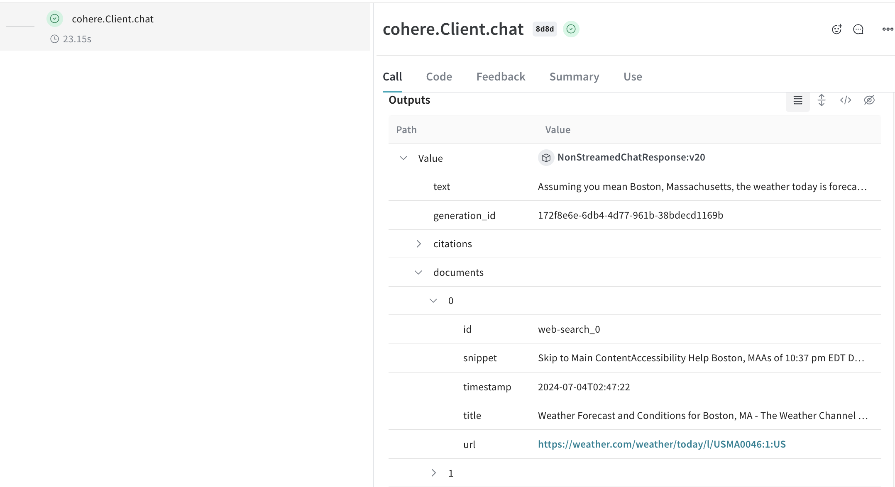
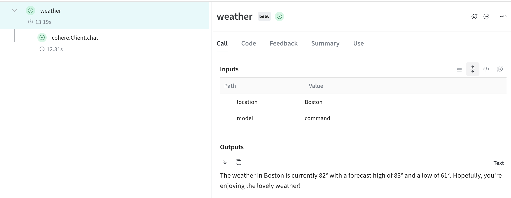
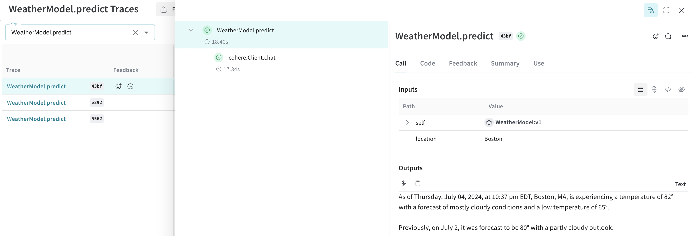

# Cohere

Weave automatically tracks and logs LLM calls made via the [Cohere Python library](https://github.com/cohere-ai/cohere-python) after `weave.init()` is called.

## Traces

It's important to store traces of LLM applications in a central database, both during development and in production. You'll use these traces for debugging, and as a dataset that will help you improve your application.

Weave will automatically capture traces for [cohere-python](https://github.com/cohere-ai/cohere-python). You can use the library as usual, start by calling `weave.init()`:

```python
import cohere
import os
import weave
from weave.integrations.cohere import cohere_patcher

# we need to patch before we create the client
cohere_patcher.attempt_patch()

# Use the Cohere library as usual
co = cohere.Client(api_key=os.environ["COHERE_API_KEY"])

# highlight-next-line
weave.init("cohere_project")


response = co.chat(
    message="How is the weather in Boston?",
    # perform web search before answering the question. You can also use your own custom connector.
    connectors=[{"id": "web-search"}],
)
print(response.text)
```
A powerful feature of cohere models is using [connectors](https://docs.cohere.com/docs/overview-rag-connectors#using-connectors-to-create-grounded-generations) enabling you to make requests to other API on the endpoint side. The response will then contain the generated text with citation elements that link to the documents returned from the connector. 

[](https://wandb.ai/capecape/cohere_dev/weave/calls)

:::note
We patch the Cohere `Client.chat`, `AsyncClient.chat`, `Client.chat_stream`, and `AsyncClient.chat_stream` methods for you to keep track of your LLM calls.
:::

## Wrapping with your own ops

Weave ops make results *reproducible* by automatically versioning code as you experiment, and they capture their inputs and outputs. Simply create a function decorated with [`@weave.op()`](/guides/tracking/ops) that calls into Cohere's chat methods, and Weave will track the inputs and outputs for you. Here's an example:

```python
import cohere
import os
import weave
from weave.integrations.cohere import cohere_patcher

# we need to patch before we create the client
cohere_patcher.attempt_patch()

co = cohere.Client(api_key=os.environ["COHERE_API_KEY"])

weave.init("cohere_project")


# highlight-next-line
@weave.op()
def weather(location: str, model: str) -> str:
    response = co.chat(
        model=model,
        message=f"How is the weather in {location}?",
        # perform web search before answering the question. You can also use your own custom connector.
        connectors=[{"id": "web-search"}],
    )
    return response.text


print(weather("Boston", "command"))
```

[](https://wandb.ai/capecape/cohere_dev/weave/calls)

## Create a `Model` for easier experimentation

Organizing experimentation is difficult when there are many moving pieces. By using the [`Model`](/guides/core-types/models) class, you can capture and organize the experimental details of your app like your system prompt or the model you're using. This helps organize and compare different iterations of your app.

In addition to versioning code and capturing inputs/outputs, [`Model`](/guides/core-types/models)s capture structured parameters that control your application's behavior, making it easy to find what parameters worked best. You can also use Weave Models with `serve`, and [`Evaluation`](/guides/core-types/evaluations)s.

In the example below, you can experiment with `model` and `temperature`. Every time you change one of these, you'll get a new _version_ of `WeatherModel`.

```python
import weave
import cohere
import os
# we need to patch before we create the client
cohere_patcher.attempt_patch()

weave.init('weather-cohere')

class WeatherModel(weave.Model):
    model: str
    temperature: float
  
    @weave.op()
    def predict(self, location: str) -> str:
        co = cohere.Client(api_key=os.environ["COHERE_API_KEY"])
        response = co.chat(
            message=f"How is the weather in {location}?",
            model=self.model,
            temperature=self.temperature,
            connectors=[{"id": "web-search"}]
        )
        return response.text

weather_model = WeatherModel(
    model="command",
    temperature=0.7
)
result = weather_model.predict("Boston")
print(result)
```

[](https://wandb.ai/capecape/cohere_dev/weave/models)

