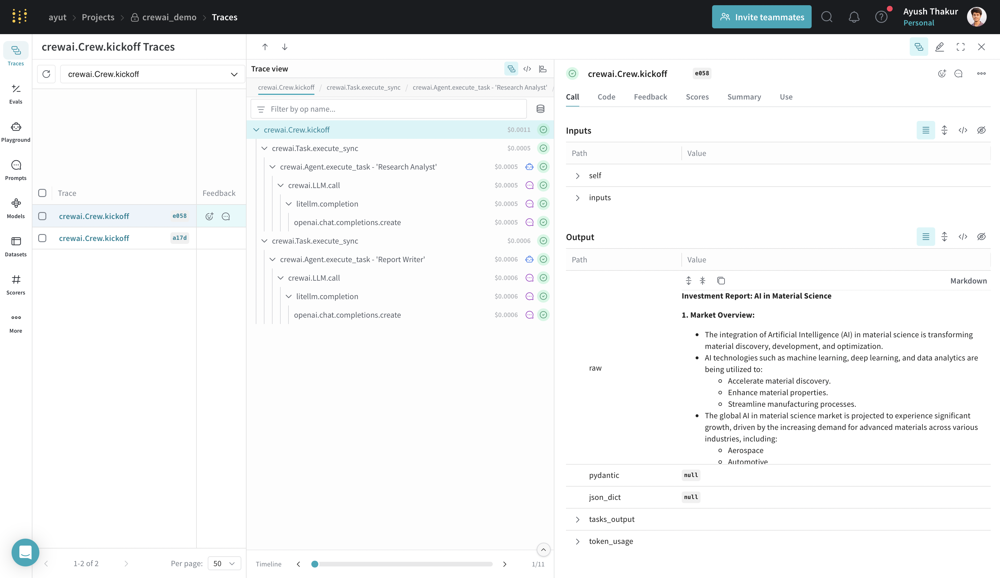
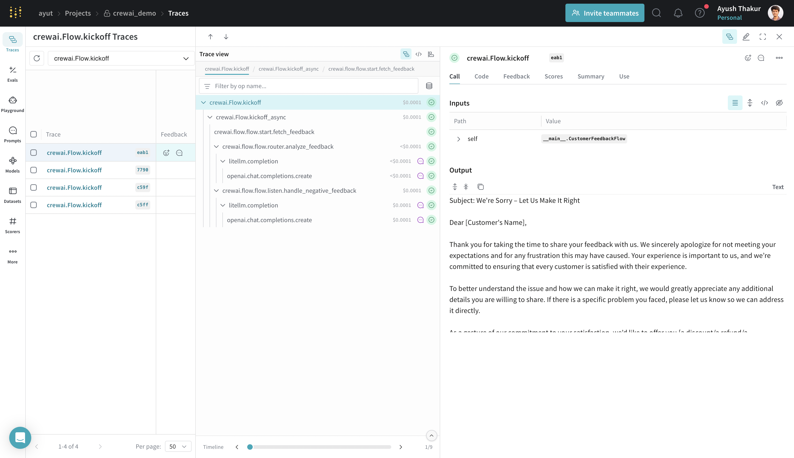
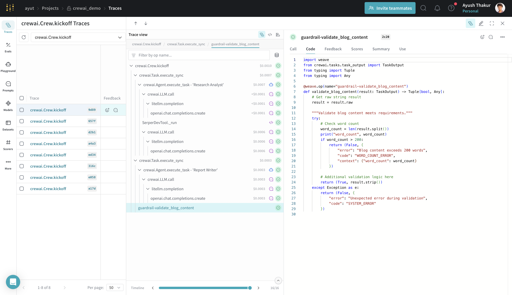

# CrewAI

<a target="_blank" href="https://colab.research.google.com/drive/1t8qlH99j-cCU2CceyGQQQY-p4oDbegxd?usp=sharing">
  
</a>

CrewAI is a lean, lightning-fast Python framework built entirely from scratch—completely independent of LangChain or other agent frameworks. CrewAI empowers developers with both high-level simplicity ([Crews](https://docs.crewai.com/guides/crews/first-crew)) and precise low-level control ([Flows](https://docs.crewai.com/guides/flows/first-flow)), ideal for creating autonomous AI agents tailored to any scenario. Learn more about [CrewAI here](https://docs.crewai.com/introduction).


When working with AI agents, debugging and monitoring their interactions is crucial. CrewAI applications often consist of multiple agents working together, making it essential to understand how they collaborate and communicate. Weave simplifies this process by automatically capturing traces for your CrewAI applications, enabling you to monitor and analyze your agents' performance and interactions.

The integration supports both Crews and Flows.

## Getting Started with Crew

You need to install CrewAI ([more details](https://docs.crewai.com/installation)) and weave to run this example:

```
pip install crewai weave
```

Now we will create a CrewAI Crew and trace the execution using Weave. To get started, simply call `weave.init()` at the beginning of your script. The argument in weave.init() is a project name where the traces will be logged.

```python
import weave
from crewai import Agent, Task, Crew, LLM, Process

# Initialize Weave with your project name
# highlight-next-line
weave.init(project_name="crewai_demo")

# Create an LLM with a temperature of 0 to ensure deterministic outputs
llm = LLM(model="gpt-4o-mini", temperature=0)

# Create agents
researcher = Agent(
    role='Research Analyst',
    goal='Find and analyze the best investment opportunities',
    backstory='Expert in financial analysis and market research',
    llm=llm,
    verbose=True,
    allow_delegation=False,
)

writer = Agent(
    role='Report Writer',
    goal='Write clear and concise investment reports',
    backstory='Experienced in creating detailed financial reports',
    llm=llm,
    verbose=True,
    allow_delegation=False,
)

# Create tasks
research_task = Task(
    description='Deep research on the {topic}',
    expected_output='Comprehensive market data including key players, market size, and growth trends.',
    agent=researcher
)

writing_task = Task(
    description='Write a detailed report based on the research',
    expected_output='The report should be easy to read and understand. Use bullet points where applicable.',
    agent=writer
)

# Create a crew
crew = Crew(
    agents=[researcher, writer],
    tasks=[research_task, writing_task],
    verbose=True,
    process=Process.sequential,
)

# Run the crew
result = crew.kickoff(inputs={"topic": "AI in material science"})
print(result)
```

Weave will track and log all calls made through the CrewAI library, including agent interactions, task executions, and LLM calls. You can view the traces in the Weave web interface.

[](https://wandb.ai/ayut/crewai_demo/weave/traces?filter=%7B%22opVersionRefs%22%3A%5B%22weave%3A%2F%2F%2Fayut%2Fcrewai_demo%2Fop%2Fcrewai.Crew.kickoff%3A*%22%5D%7D&peekPath=%2Fayut%2Fcrewai_demo%2Fcalls%2F0195c7ac-bd52-7390-95a7-309370e9e058%3FhideTraceTree%3D0&cols=%7B%22wb_run_id%22%3Afalse%2C%22attributes.weave.client_version%22%3Afalse%2C%22attributes.weave.os_name%22%3Afalse%2C%22attributes.weave.os_release%22%3Afalse%2C%22attributes.weave.os_version%22%3Afalse%2C%22attributes.weave.source%22%3Afalse%2C%22attributes.weave.sys_version%22%3Afalse%7D)

:::note
CrewAI provides several methods for better control over the kickoff process: `kickoff()`, `kickoff_for_each()`, `kickoff_async()`, and `kickoff_for_each_async()`. The integration supports logging traces from all these methods.
:::

## Track Tools

CrewAI tools empower agents with capabilities ranging from web searching and data analysis to collaboration and delegating tasks among coworkers. The integration can trace them as well. 

We will improve the quality of the generated report in the above example by giving it access to a tool that can search the internet and return the most relevant results.

Let us first install the extra dependency.

```
pip install 'crewai[tools]'
```

In this example, we are using the `SerperDevTool` to enable our 'Research Analyst' agent to search relevant information on the internet. Learn more about this tool and API requirements [here](https://docs.crewai.com/tools/serperdevtool).

```python
# .... existing imports ....
from crewai_tools import SerperDevTool

# We provide the agent with the tool.
researcher = Agent(
    role='Research Analyst',
    goal='Find and analyze the best investment opportunities',
    backstory='Expert in financial analysis and market research',
    llm=llm,
    verbose=True,
    allow_delegation=False,
    # highlight-next-line
    tools=[SerperDevTool()],
)

# .... existing code ....
```

Running this Crew with an agent with access to internet produces better and more relevant result. We automatically trace the tool usage as shown in the image below.

[](https://wandb.ai/ayut/crewai_demo/weave/traces?filter=%7B%22opVersionRefs%22%3A%5B%22weave%3A%2F%2F%2Fayut%2Fcrewai_demo%2Fop%2Fcrewai.Crew.kickoff%3A*%22%5D%7D&peekPath=%2Fayut%2Fcrewai_demo%2Fcalls%2F0195c7c7-0213-7f42-b130-caa93a79316c%3FdescendentCallId%3D0195c7c7-0a16-7f11-8cfd-9dedf1d03b3b&cols=%7B%22wb_run_id%22%3Afalse%2C%22attributes.weave.client_version%22%3Afalse%2C%22attributes.weave.os_name%22%3Afalse%2C%22attributes.weave.os_release%22%3Afalse%2C%22attributes.weave.os_version%22%3Afalse%2C%22attributes.weave.source%22%3Afalse%2C%22attributes.weave.sys_version%22%3Afalse%7D)

:::note
The integration automatically patches all the tools available in the [`crewAI-tools`](https://github.com/crewAIInc/crewAI-tools) repository. 
:::

## Getting Started with Flow

```python
import weave
# Initialize Weave with your project name
# highlight-next-line
weave.init("crewai_demo")

from crewai.flow.flow import Flow, listen, router, start
from litellm import completion


class CustomerFeedbackFlow(Flow):
    model = "gpt-4o-mini"

    @start()
    def fetch_feedback(self):
        print("Fetching customer feedback")
        # In a real-world scenario, this could be replaced by an API call.
        # For this example, we simulate customer feedback.
        feedback = (
            "I had a terrible experience with the product. "
            "It broke after one use and customer service was unhelpful."
        )
        self.state["feedback"] = feedback
        return feedback

    @router(fetch_feedback)
    def analyze_feedback(self, feedback):
        # Use the language model to analyze sentiment
        prompt = (
            f"Analyze the sentiment of this customer feedback and "
            "return only 'positive' or 'negative':\n\n"
            f"Feedback: {feedback}"
        )
        response = completion(
            model=self.model,
            messages=[{"role": "user", "content": prompt}],
        )
        sentiment = response["choices"][0]["message"]["content"].strip().lower()
        # If the response is ambiguous, default to negative
        if sentiment not in ["positive", "negative"]:
            sentiment = "negative"
        return sentiment

    @listen("positive")
    def handle_positive_feedback(self):
        # Generate a thank you message for positive feedback
        prompt = "Generate a thank you message for a customer who provided positive feedback."
        response = completion(
            model=self.model,
            messages=[{"role": "user", "content": prompt}],
        )
        thank_you_message = response["choices"][0]["message"]["content"].strip()
        self.state["response"] = thank_you_message
        return thank_you_message

    @listen("negative")
    def handle_negative_feedback(self):
        # Generate an apology message with a promise to improve service for negative feedback
        prompt = (
            "Generate an apology message to a customer who provided negative feedback and offer assistance or a solution."
        )
        response = completion(
            model=self.model,
            messages=[{"role": "user", "content": prompt}],
        )
        apology_message = response["choices"][0]["message"]["content"].strip()
        self.state["response"] = apology_message
        return apology_message

# Instantiate and kickoff the flow
flow = CustomerFeedbackFlow()
result = flow.kickoff()
print(result)
```

[](https://wandb.ai/ayut/crewai_demo/weave/traces?filter=%7B%22opVersionRefs%22%3A%5B%22weave%3A%2F%2F%2Fayut%2Fcrewai_demo%2Fop%2Fcrewai.Flow.kickoff%3A*%22%5D%7D&peekPath=%2Fayut%2Fcrewai_demo%2Fcalls%2F0195c7e3-7a63-7283-bef4-9e0eb2f0eab1&cols=%7B%22wb_run_id%22%3Afalse%2C%22attributes.weave.client_version%22%3Afalse%2C%22attributes.weave.os_name%22%3Afalse%2C%22attributes.weave.os_release%22%3Afalse%2C%22attributes.weave.os_version%22%3Afalse%2C%22attributes.weave.source%22%3Afalse%2C%22attributes.weave.sys_version%22%3Afalse%7D)

:::note
The integration automatically patches the `Flow.kickoff` entry point and all the available decorators -- `@start`, `@listen`, `@router`, `@or_` and `@and_`.
:::


## Crew Guardrail - Track your own ops

Task guardrails provide a way to validate and transform task outputs before they are passed to the next task. We can use a simple python function to validate the agent's execution on-the-fly.

Wrapping this function with `@weave.op` starts capturing inputs, outputs and app logic so you can debug how data is validated through your agents. This also starts automatically versioning code as you experiment to capture ad-hoc details that haven't been committed to git.

Let's take the example of research analyst and writer. We add a guardrail to validate the length of the generated report.

```python
# .... existing imports and weave initialization ....

# Decorate your guardrail function with `@weave.op()`
# highlight-next-line
@weave.op(name="guardrail-validate_blog_content")
def validate_blog_content(result: TaskOutput) -> Tuple[bool, Any]:
    # Get raw string result
    result = result.raw

    """Validate blog content meets requirements."""
    try:
        # Check word count
        word_count = len(result.split())
        print("word_count", word_count)
        if word_count > 200:
            return (False, {
                "error": "Blog content exceeds 200 words",
                "code": "WORD_COUNT_ERROR",
                "context": {"word_count": word_count}
            })

        # Additional validation logic here
        return (True, result.strip())
    except Exception as e:
        return (False, {
            "error": "Unexpected error during validation",
            "code": "SYSTEM_ERROR"
        })


# .... existing agents and research analyst task ....

writing_task = Task(
    description='Write a detailed report based on the research under 200 words',
    expected_output='The report should be easy to read and understand. Use bullet points where applicable.',
    agent=writer,
    # highlight-next-line
    guardrail=validate_blog_content,
)

# .... existing code to run crew ....
```

By simply decorating the guardrail function with `@weave.op` we are able to keep track of the input and output to this function along with execution time, token information if an LLM is used under the hood, code version and more.

[](https://wandb.ai/ayut/crewai_demo/weave/traces?filter=%7B%22opVersionRefs%22%3A%5B%22weave%3A%2F%2F%2Fayut%2Fcrewai_demo%2Fop%2Fcrewai.Crew.kickoff%3A*%22%5D%7D&peekPath=%2Fayut%2Fcrewai_demo%2Fcalls%2F0195c838-38cb-71a2-8a15-651ecddf9d89%3FdescendentCallId%3D0195c838-8632-7173-846d-f230e7272c20&cols=%7B%22wb_run_id%22%3Afalse%2C%22attributes.weave.client_version%22%3Afalse%2C%22attributes.weave.os_name%22%3Afalse%2C%22attributes.weave.os_release%22%3Afalse%2C%22attributes.weave.os_version%22%3Afalse%2C%22attributes.weave.source%22%3Afalse%2C%22attributes.weave.sys_version%22%3Afalse%7D)

## Conclusion

Do let us know what we should improve about this integration. Please open an issue if you encounter one [here](https://github.com/wandb/weave/issues/new/choose).

Learn more about how to build powerful multiagent systems using CrewAI through their [many examples](https://github.com/crewAIInc/crewAI-examples) and [documentation](https://docs.crewai.com/introduction).
