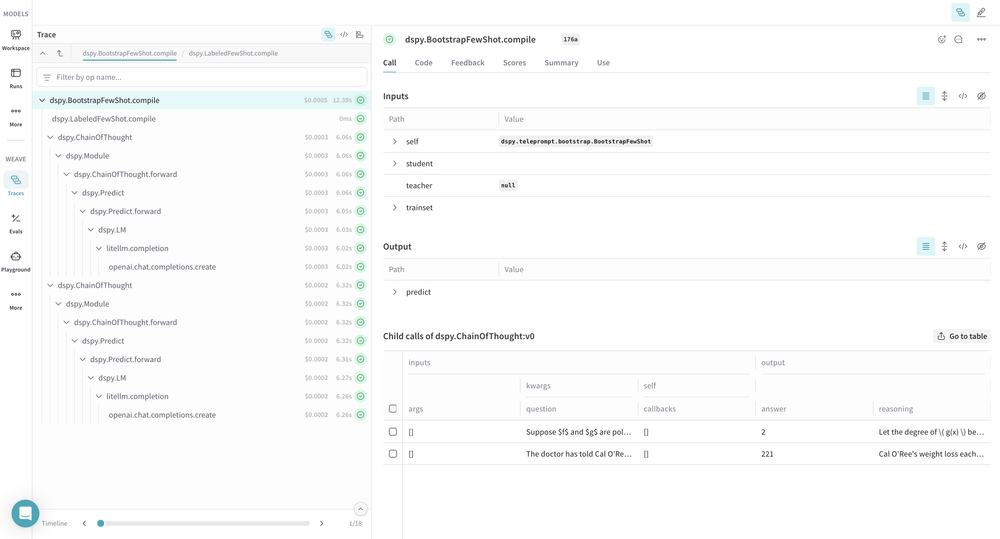

# DSPy

<a target="_blank" href="https://github.com/wandb/examples/blob/master/weave/docs/quickstart_dspy.ipynb">
  
</a>

[DSPy](https://dspy-docs.vercel.app/) is a framework for algorithmically optimizing LM prompts and weights, especially when LMs are used one or more times within a pipeline. Weave automatically tracks and logs calls made using DSPy modules and functions.

## Tracing

It’s important to store traces of language model applications in a central location, both during development and in production. These traces can be useful for debugging, and as a dataset that will help you improve your application.

Weave will automatically capture traces for [DSPy](https://dspy-docs.vercel.app/). To start tracking, calling `weave.init(project_name="<YOUR-WANDB-PROJECT-NAME>")` and use the library as normal.

```python
import os
import dspy
import weave

os.environ["OPENAI_API_KEY"] = "<YOUR-OPENAI-API-KEY>"

weave.init(project_name="<YOUR-WANDB-PROJECT-NAME>")

lm = dspy.LM('openai/gpt-4o-mini')
dspy.configure(lm=lm)
classify = dspy.Predict("sentence -> sentiment")
classify(sentence="it's a charming and often affecting journey.")
```

[](https://wandb.ai/geekyrakshit/dspy-project/weave/calls)

Weave logs all LM calls in your DSPy program, providing details about inputs, outputs, and metadata.

## Track your own DSPy Modules and Signatures

A `Module` is the building block with learnable parameters for DSPy programs that abstracts a prompting technique. A `Signature` is a declarative specification of input/output behavior of a DSPy Module. Weave automatically tracks all in-built and custom Signatures and Modules in your DSPy programs.

```python
import os
import dspy
import weave

os.environ["OPENAI_API_KEY"] = "<YOUR-OPENAI-API-KEY>"

weave.init(project_name="<YOUR-WANDB-PROJECT-NAME>")

class Outline(dspy.Signature):
    """Outline a thorough overview of a topic."""

    topic: str = dspy.InputField()
    title: str = dspy.OutputField()
    sections: list[str] = dspy.OutputField()
    section_subheadings: dict[str, list[str]] = dspy.OutputField(
        desc="mapping from section headings to subheadings"
    )


class DraftSection(dspy.Signature):
    """Draft a top-level section of an article."""

    topic: str = dspy.InputField()
    section_heading: str = dspy.InputField()
    section_subheadings: list[str] = dspy.InputField()
    content: str = dspy.OutputField(desc="markdown-formatted section")


class DraftArticle(dspy.Module):
    def __init__(self):
        self.build_outline = dspy.ChainOfThought(Outline)
        self.draft_section = dspy.ChainOfThought(DraftSection)

    def forward(self, topic):
        outline = self.build_outline(topic=topic)
        sections = []
        for heading, subheadings in outline.section_subheadings.items():
            section, subheadings = (
                f"## {heading}",
                [f"### {subheading}" for subheading in subheadings],
            )
            section = self.draft_section(
                topic=outline.title,
                section_heading=section,
                section_subheadings=subheadings,
            )
            sections.append(section.content)
        return dspy.Prediction(title=outline.title, sections=sections)


draft_article = DraftArticle()
article = draft_article(topic="World Cup 2002")
```

[](https://wandb.ai/geekyrakshit/dspy-project/weave/calls)


## Optimization and Evaluation of your DSPy Program

Weave also automatically captures traces for DSPy optimizers and Evaluation calls which you can use to improve and evaulate your DSPy program's performance on a development set.


```python
import os
import dspy
import weave

os.environ["OPENAI_API_KEY"] = "<YOUR-OPENAI-API-KEY>"
weave.init(project_name="<YOUR-WANDB-PROJECT-NAME>")

def accuracy_metric(answer, output, trace=None):
    predicted_answer = output["answer"].lower()
    return answer["answer"].lower() == predicted_answer

module = dspy.ChainOfThought("question -> answer: str, explanation: str")
optimizer = dspy.BootstrapFewShot(metric=accuracy_metric)
optimized_module = optimizer.compile(
    module, trainset=SAMPLE_EVAL_DATASET, valset=SAMPLE_EVAL_DATASET
)
```

[](https://wandb.ai/geekyrakshit/dspy-project/weave/calls)

## Evaluation: centralized metrics, traces, and comparisons

Weave now provides tighter integration with DSPy evaluation flows. When you run DSPy evaluations, Weave logs a structured evaluation run with:

- Aggregated metrics for the run
- Per-sample outputs and scores
- Links into full execution traces for each sample
- Model configuration and metadata for side-by-side comparisons

### Example: logging a DSPy evaluation

```python
import os
import dspy
from dspy.datasets import MATH
import weave

os.environ["OPENAI_API_KEY"] = "<YOUR-OPENAI-API-KEY>"

weave.init(project_name="dspy-test")

# Configure LM and dataset
lm = dspy.LM("openai/gpt-4o-mini", max_tokens=2000)
dspy.configure(lm=lm)
dataset = MATH(subset="algebra")

# Define a simple module and evaluate it
module = dspy.ChainOfThought("question -> answer")
evaluate = dspy.Evaluate(
    devset=dataset.dev[:2],
    metric=dataset.metric,
    num_threads=24,
    display_progress=True,
    return_all_scores=True,
    return_outputs=True,
    provide_traceback=True,
    failure_score=0.0,
)

result = evaluate(module)
```

After the run completes, open your Weave project and navigate to the Evals view to see the evaluation summary, metrics, and per-sample rows. You can drill into any row to inspect the full trace and artifacts that produced that output.

- Navigate to the trace for a given sample: see the Trace view guide at [Navigate the Trace View](../tracking/trace-tree.md)
- Leave or review annotations on any call: see [Feedback](../tracking/feedback.md)

### Compare evaluation runs

Evaluation logging enables both holistic and sample-wise comparisons:

- Holistic: compare aggregate metrics and model metadata across evaluation runs
- Sample-wise: page through the same dataset example to see how different models/pipelines performed

From the Evals tab, select multiple evals and click Compare. See [EvaluationLogger (Comparisons section)](../evaluation/evaluation_logger.md) and the general [Comparison](../tools/comparison.md) guide for details on the comparison UI and controls.

## FAQ

### How can I reduce ingestion volume?

DSPy often includes a verbose `history` in calls, which can increase ingestion volume. To suppress logging of DSPy history fields in Weave, set the following environment variable before running your program:

```bash
export WEAVE_DSPY_HIDE_HISTORY=true
```

Accepted truthy values are `true`, `1`, or `yes`.
