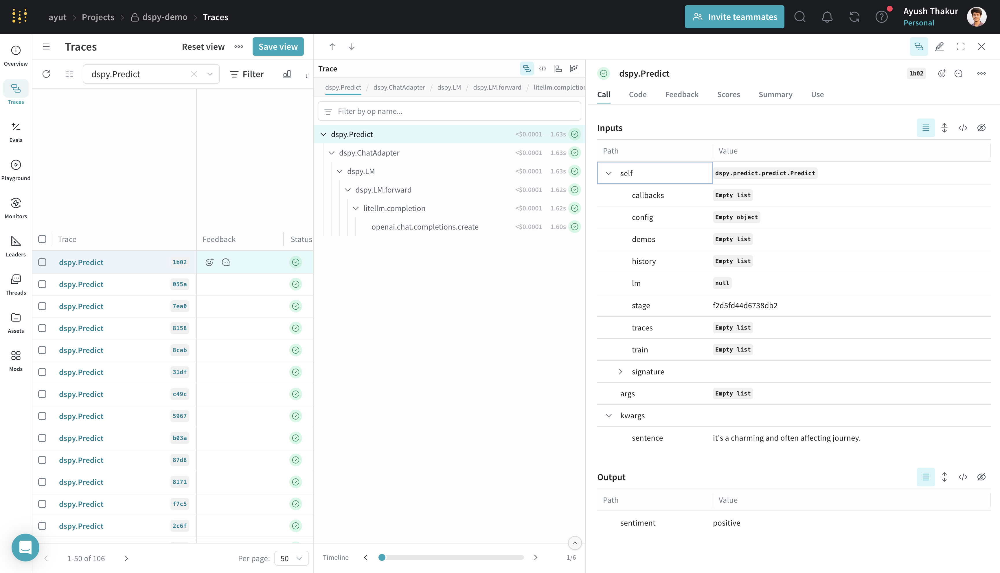
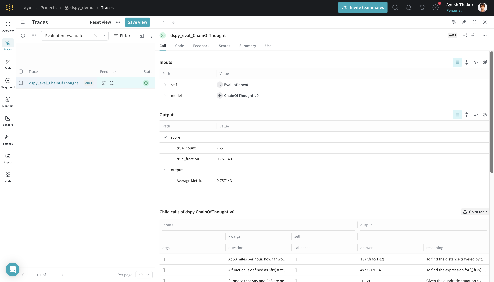
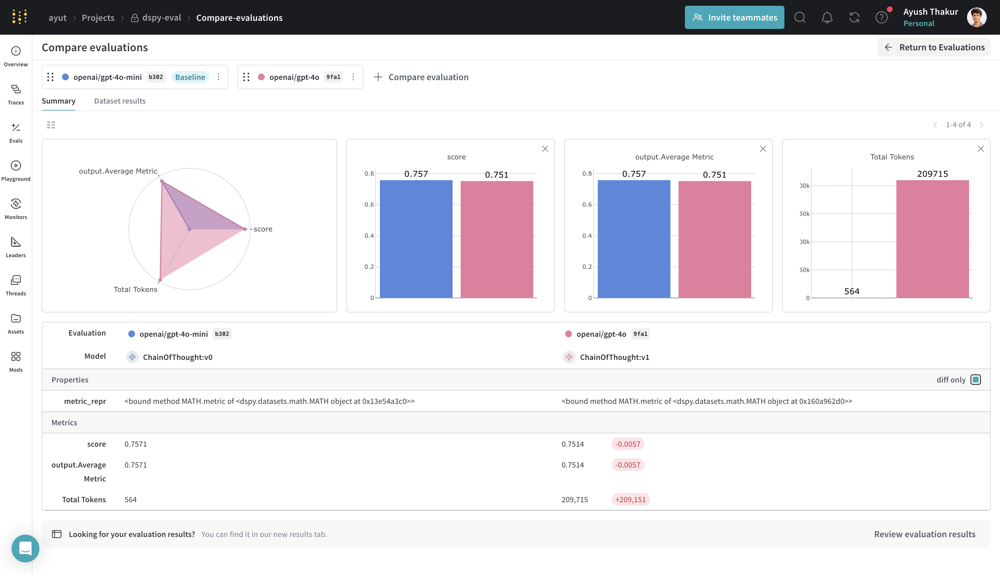
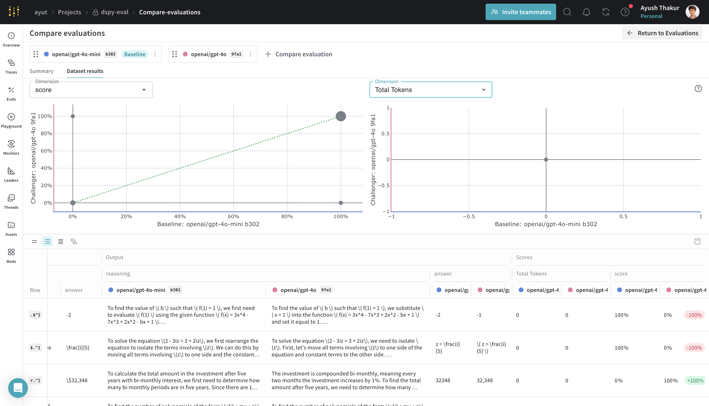
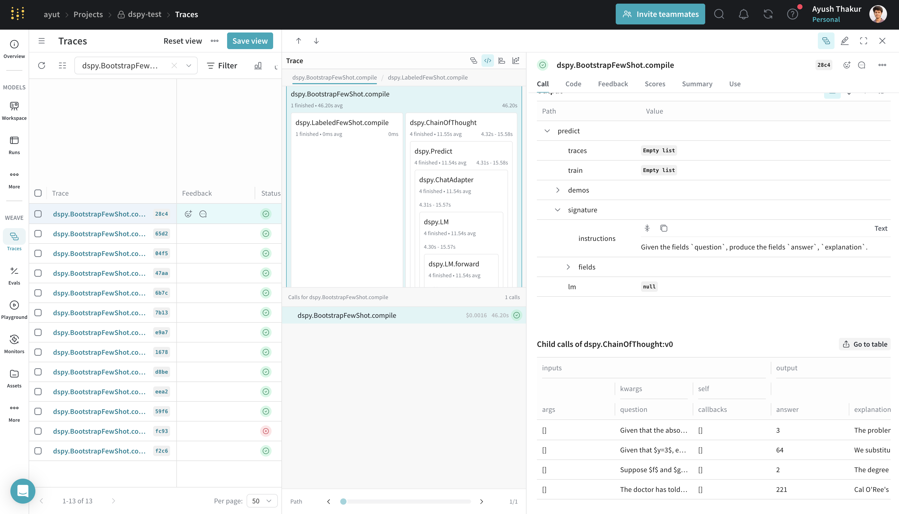
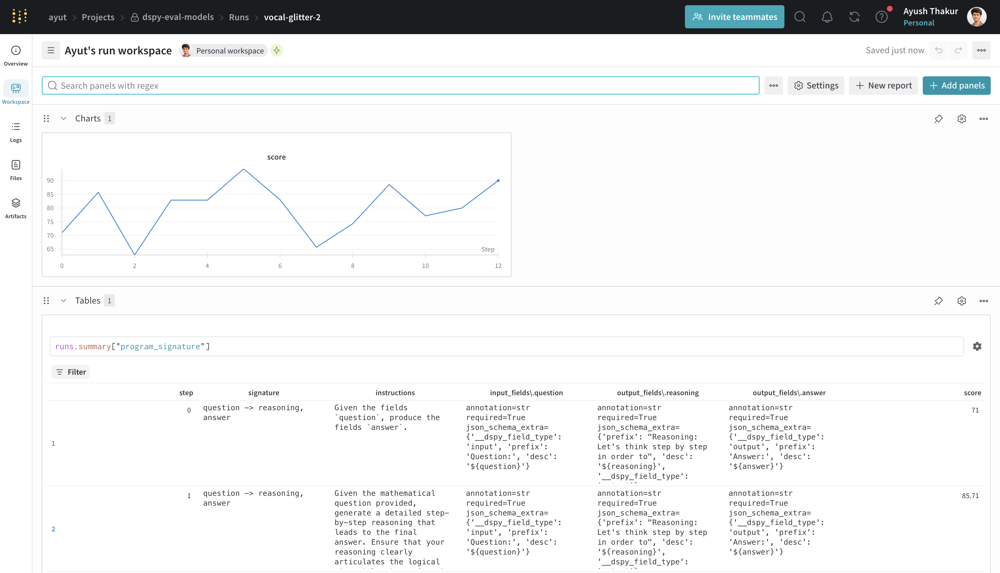

# DSPy

<a target="_blank" href="https://github.com/wandb/examples/blob/master/weave/docs/quickstart_dspy.ipynb">
  
</a>

[DSPy](https://dspy.ai/) is a framework for algorithmically optimizing LM prompts and weights, especially when LMs are used one or more times within a pipeline. Using the DSPy Weave integration, Weave will automatically track and log calls made using DSPy modules and functions.

:::note Support for DSPy 3.x
The DSPy Weave integration supports DSPy version 3.x. Features like Evaluation and Optimization are not supported for versions below 3.x.
:::

## Getting starting with tracing DSPy modules

Storing traces of AI applications, both during development and in production, is useful for debugging, and building evaluation datasets that will help you improve your application iteratively.

Once initiated with `weave.init()`, Weave will automatically capture traces for [DSPy](https://dspy.ai). To run the example below, you need to install DSPy and Weave.

```bash
pip install dspy weave
```

```python
import os
import dspy
import weave

os.environ["OPENAI_API_KEY"] = "<YOUR-OPENAI-API-KEY>"

# Initialize Weave with your project name
# highlight-next-line
weave.init(project_name="dspy_demo")

# Run your DSPy program as is
lm = dspy.LM('openai/gpt-4o-mini')
dspy.configure(lm=lm)
classify = dspy.Predict("sentence -> sentiment")
classify(sentence="it's a charming and often affecting journey.")
```

]

Weave logs all LM calls in your DSPy program, providing details about inputs, outputs, latency of each component, token counts, cost and more.

- Learn how to navigate the trace for a given sample: [Navigate the Trace View](../tracking/trace-tree.md)
- Leave or review annotations on any call: [Feedback](../tracking/feedback.md)

### Track your custom DSPy Modules and Signatures

A `Module` is the building block with learnable parameters for DSPy programs that abstracts a prompting technique. A `Signature` is a declarative specification of input/output behavior of a DSPy Module. Weave automatically tracks all in-built and custom Signatures and Modules in your DSPy programs.

```python
import os
import dspy
import weave

os.environ["OPENAI_API_KEY"] = "<YOUR-OPENAI-API-KEY>"

# highlight-next-line
weave.init(project_name="dspy_demo")

lm = dspy.LM('openai/gpt-4o-mini')
dspy.configure(lm=lm)

class Outline(dspy.Signature):
    """Outline a thorough overview of a topic."""

    topic: str = dspy.InputField()
    title: str = dspy.OutputField()
    sections: list[str] = dspy.OutputField()
    section_subheadings: dict[str, list[str]] = dspy.OutputField(
        desc="mapping from section headings to subheadings"
    )


class DraftSection(dspy.Signature):
    """Draft a top-level section of an article."""

    topic: str = dspy.InputField()
    section_heading: str = dspy.InputField()
    section_subheadings: list[str] = dspy.InputField()
    content: str = dspy.OutputField(desc="markdown-formatted section")


class DraftArticle(dspy.Module):
    def __init__(self):
        self.build_outline = dspy.ChainOfThought(Outline)
        self.draft_section = dspy.ChainOfThought(DraftSection)

    def forward(self, topic):
        outline = self.build_outline(topic=topic)
        sections = []
        for heading, subheadings in outline.section_subheadings.items():
            section, subheadings = (
                f"## {heading}",
                [f"### {subheading}" for subheading in subheadings],
            )
            section = self.draft_section(
                topic=outline.title,
                section_heading=section,
                section_subheadings=subheadings,
            )
            sections.append(section.content)
        return dspy.Prediction(title=outline.title, sections=sections)


draft_article = DraftArticle()
article = draft_article(topic="World Cup 2002")
```


## Evaluation of your DSPy Program

When you run `dspy.Evaluate`, weave automatically logs:

- Aggregated metrics and per-sample scores for the evaluation run
- Per-sample inputs/outputs and full execution traces for deep debugging
- Token usage, latency, and cost tracking when Weave is initialized before model calls
- Model configuration and metadata for side-by-side comparisons

Before running the below code sample, install this `pip` package from `hendrycks/math` on GitHub.

```bash
pip install git+https://github.com/hendrycks/math.git
```

```python
import os
import dspy
from dspy.datasets import MATH
import weave

os.environ["OPENAI_API_KEY"] = "<YOUR-OPENAI-API-KEY>"

# highlight-next-line
weave.init(project_name="dspy-test")

# Configure LM and dataset
lm = dspy.LM("openai/gpt-4o-mini", max_tokens=2000)
dspy.configure(lm=lm)
dataset = MATH(subset="algebra")

# Define a simple module and evaluate it
module = dspy.ChainOfThought("question -> answer")
evaluate = dspy.Evaluate(
    devset=dataset.dev[:2],
    metric=dataset.metric,
    num_threads=24,
    display_progress=True,
    return_all_scores=True,
    return_outputs=True,
    provide_traceback=True,
    failure_score=0.0,
)

result = evaluate(module)
```

After the run completes, click on the generated Weave URL and navigate to **Evals** to see the evaluation summary, metrics, and per-sample rows. You can drill into any row to inspect the full trace and the artifacts that produced that output.



### Compare evaluation runs

When viewing evaluation logs, Weave supports both holistic and sample-wise comparisons. Holistic compares aggregate metrics and model metadata across evaluation runs. Sample-wise allows you to page through different models and pipelines that run an evaluation using the same dataset to compare how they performed.

From the Evals tab, select multiple evals and click **Compare**. See [EvaluationLogger (Comparisons section)](../evaluation/evaluation_logger.md#log-and-compare-multiple-evaluations) and the general [Comparison](../tools/comparison.md) guide for details on the comparison UI and controls.


|  |  |
|---|---|
| Holistic comparison view | Sample-wise comparison view |

## Optimization

DSPy features a powerful [optimization module](https://dspy.ai/learn/optimization/overview/) that helps tune the prompts or weights in your program. Using the DSPy Weave integration, Weave will log traces as you optimize to help you get more out of your optimization workflow. 

```python
import os
import dspy
import weave
from dspy.datasets import MATH

os.environ["OPENAI_API_KEY"] = "<YOUR-OPENAI-API-KEY>"

# highlight-next-line
weave.init(project_name="dspy-test")

lm = dspy.LM('openai/gpt-4o-mini', max_tokens=2000, cache=False)
dspy.configure(lm=lm)
dataset = MATH(subset="algebra")

def accuracy_metric(answer, output, trace=None):
    predicted_answer = output["answer"].lower()
    return answer["answer"].lower() == predicted_answer

module = dspy.ChainOfThought("question -> answer: str, explanation: str")
optimizer = dspy.BootstrapFewShot(metric=accuracy_metric)
optimized_module = optimizer.compile(
    module, trainset=dataset.train[:5]
)
```



### Bringing W&B Models to track improvement of program signature

For optimizers that use `dspy.Evaluate` under the hood (ex: MIPROv2), you can optionally [initialize a `wandb` run](https://docs.wandb.ai/guides/track/create-an-experiment/) which will log the evaluation metrics over time as a line chart and log the evolution of the program signature as [W&B Tables](https://docs.wandb.ai/guides/models/tables/).

:::info This is an experimental feature
Using both W&B Models and Weave to improve your DSPy optimization workflow is experimental. 
:::

To use this feature first install the `wandb` package.

```bash
pip install wandb
```

```python
from tkinter.constants import TRUE
import dspy
from dspy.datasets import MATH

import weave
# import wandb and the callback
# highlight-next-line
import wandb
from wandb.integration.dspy import WandbDSPyCallback

wandb_project = "dspy-eval-models"

weave.init(wandb_project)
wandb.init(project=wandb_project)

# add the callback as dspy settings
# highlight-next-line
dspy.settings.callbacks.append(WandbDSPyCallback())

gpt4o_mini = dspy.LM('openai/gpt-4o-mini', max_tokens=2000)
gpt4o = dspy.LM('openai/gpt-4o', max_tokens=2000, cache=True)
dspy.configure(lm=gpt4o_mini)

dataset = MATH(subset='algebra')

module = dspy.ChainOfThought("question -> answer")

THREADS = 24

optimizer_kwargs = dict(
    num_threads=THREADS, teacher_settings=dict(lm=gpt4o), prompt_model=gpt4o_mini
)
optimizer = dspy.MIPROv2(metric=dataset.metric, auto="light", **optimizer_kwargs)

compile_kwargs = dict(requires_permission_to_run=False, max_bootstrapped_demos=2, max_labeled_demos=2)
optimized_module = optimizer.compile(module, trainset=dataset.train, **compile_kwargs)
print(optimized_module)
```

Running this program will generate both W&B run and Weave URLs. You can click on the W&B run URL to view the logged metrics and the W&B Table. You can then click on the **Overview** tab of the run page to see the traces associated with the optimization run.



## FAQ

### How can I reduce ingestion volume?

DSPy includes a verbose `history` field in calls, which increases ingestion volume and slows logging traces when running evaluations and optimizations. To suppress the logging of `history` fields in Weave, set the following environment variable before running your program:

```bash
export WEAVE_DSPY_HIDE_HISTORY=true
```
