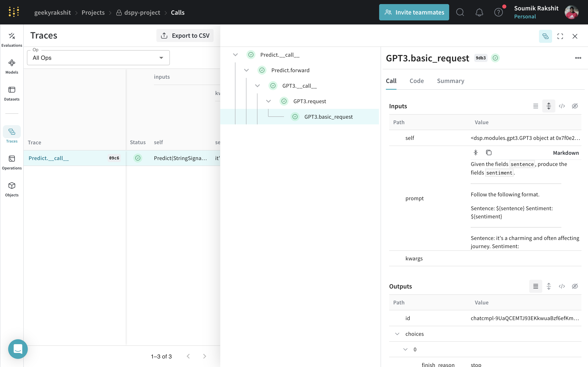
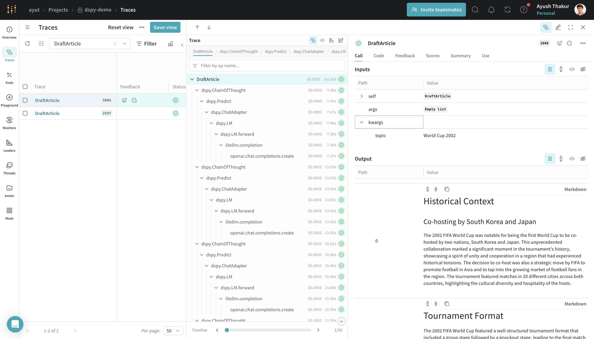

# DSPy

[DSPy](https://dspy-docs.vercel.app/) is a framework for algorithmically optimizing LM prompts and weights, especially when LMs are used one or more times within a pipeline. Weave automatically tracks and logs calls made using DSPy modules and functions.

## Tracing

It’s important to store traces of language model applications in a central location, both during development and in production. These traces can be useful for debugging, and as a dataset that will help you improve your application.

Weave will automatically capture traces for [DSPy](https://dspy-docs.vercel.app/). To start tracking, calling `weave.init(project_name="<YOUR-WANDB-PROJECT-NAME>")` and use the library as normal.

```python
import os
import dspy
import weave

os.environ["OPENAI_API_KEY"] = "<YOUR-OPENAI-API-KEY>"

weave.init(project_name="<YOUR-WANDB-PROJECT-NAME>")

lm = dspy.LM('openai/gpt-4o-mini')
dspy.configure(lm=lm)
classify = dspy.Predict("sentence -> sentiment")
classify(sentence="it's a charming and often affecting journey.")
```

[](https://wandb.ai/geekyrakshit/dspy-project/weave/calls)


## Track your own DSPy Modules and Signatures

A `Module` is the building block with learnable parameters for DSPy programs that abstracts a prompting technique. A `Signature` is a declarative specification of input/output behavior of a DSPy Module. Weave automatically tracks all in-built and cutom Signatures and Modules in your DSPy programs.

```python
import os
import dspy
import weave

os.environ["OPENAI_API_KEY"] = "<YOUR-OPENAI-API-KEY>"

weave.init(project_name="<YOUR-WANDB-PROJECT-NAME>")

class Outline(dspy.Signature):
    """Outline a thorough overview of a topic."""

    topic: str = dspy.InputField()
    title: str = dspy.OutputField()
    sections: list[str] = dspy.OutputField()
    section_subheadings: dict[str, list[str]] = dspy.OutputField(
        desc="mapping from section headings to subheadings"
    )


class DraftSection(dspy.Signature):
    """Draft a top-level section of an article."""

    topic: str = dspy.InputField()
    section_heading: str = dspy.InputField()
    section_subheadings: list[str] = dspy.InputField()
    content: str = dspy.OutputField(desc="markdown-formatted section")


class DraftArticle(dspy.Module):
    def __init__(self):
        self.build_outline = dspy.ChainOfThought(Outline)
        self.draft_section = dspy.ChainOfThought(DraftSection)

    def forward(self, topic):
        outline = self.build_outline(topic=topic)
        sections = []
        for heading, subheadings in outline.section_subheadings.items():
            section, subheadings = (
                f"## {heading}",
                [f"### {subheading}" for subheading in subheadings],
            )
            section = self.draft_section(
                topic=outline.title,
                section_heading=section,
                section_subheadings=subheadings,
            )
            sections.append(section.content)
        return dspy.Prediction(title=outline.title, sections=sections)


draft_article = DraftArticle()
article = draft_article(topic="World Cup 2002")
```

[](https://wandb.ai/geekyrakshit/dspy-project/weave/calls)
