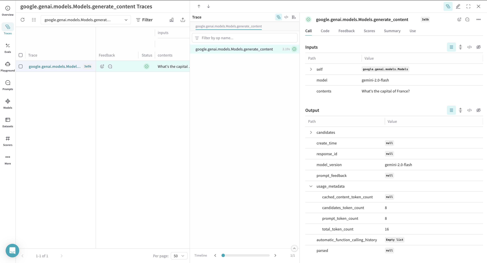
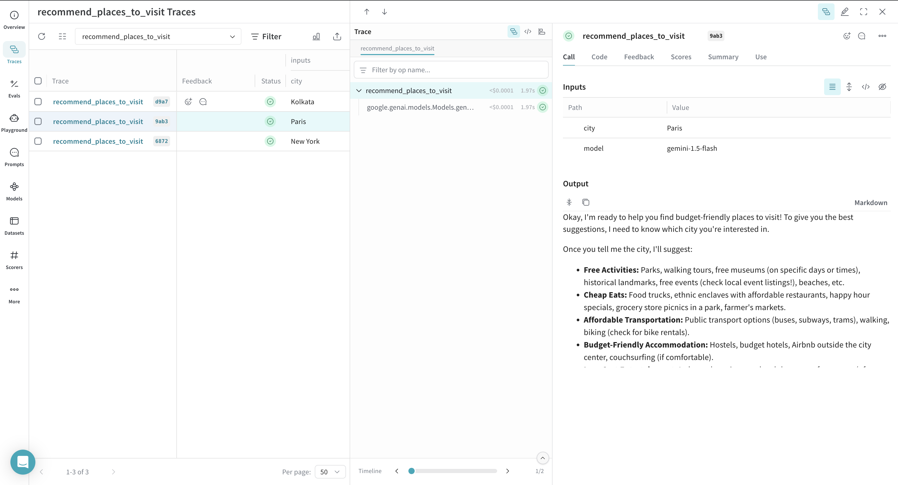

# Google

<a target="_blank" href="https://github.com/wandb/examples/blob/master/weave/docs/quickstart_google.ipynb">
  
</a>

:::tip
For the latest tutorials, visit [Weights & Biases on Google Cloud](https://wandb.ai/site/partners/googlecloud/).
:::

:::note
Do you want to experiment with Google AI models on Weave without any set up? Try the [LLM Playground](../tools/playground.md).
:::

This page describes how to use W&B Weave with the Google Vertex AI API and the Google Gemini API.

You can use Weave to evaluate, monitor, and iterate on your Google GenAI applications. Weave automatically captures traces for the:

1. [Google GenAI SDK](https://github.com/googleapis/python-genai), which is accessible via Python SDK, Node.js SDK, Go SDK, and REST.
2. [Google Vertex AI API](https://cloud.google.com/vertex-ai/docs), which provides access to Google’s Gemini models and [various partner models](https://cloud.google.com/vertex-ai/generative-ai/docs/partner-models/use-partner-models).

:::note
We also have support for the deprecated [Google AI Python SDK for the Gemini API](https://github.com/google-gemini/deprecated-generative-ai-python). Note that this support is deprecated as well and will be removed in a future version.
:::

## Get started

Weave will automatically capture traces for [Google GenAI SDK](https://github.com/googleapis/python-genai). To start tracking, calling `weave.init(project_name="<YOUR-WANDB-PROJECT-NAME>")` and use the library as normal.

```python
import os
from google import genai
import weave

weave.init(project_name="google-genai")

google_client = genai.Client(api_key=os.getenv("GOOGLE_GENAI_KEY"))
response = google_client.models.generate_content(
    model="gemini-2.0-flash",
    contents="What's the capital of France?",
)
```

[](https://wandb.ai/geekyrakshit/google-genai/weave/traces)

Weave will also automatically capture traces for [Vertex APIs](https://github.com/googleapis/python-aiplatform/tree/main/vertexai/generative_models). To start tracking, calling `weave.init(project_name="<YOUR-WANDB-PROJECT-NAME>")` and use the library as normal.

```python
import vertexai
import weave
from vertexai.generative_models import GenerativeModel

weave.init(project_name="vertex-ai-test")
vertexai.init(project="<YOUR-VERTEXAIPROJECT-NAME>", location="<YOUR-VERTEXAI-PROJECT-LOCATION>")
model = GenerativeModel("gemini-1.5-flash-002")
response = model.generate_content(
    "What's a good name for a flower shop specialising in selling dried flower bouquets?"
)
```

## Track your own ops

Wrapping a function with `@weave.op` starts capturing inputs, outputs and app logic so you can debug how data flows through your app. You can deeply nest ops and build a tree of functions that you want to track. This also starts automatically versioning code as you experiment to capture ad-hoc details that haven't been committed to git.

Simply create a function decorated with [`@weave.op`](/guides/tracking/ops).

In the example below, we have the function `recommend_places_to_visit` which is a function wrapped with `@weave.op` that recommends places to visit in a city.

```python
import os
from google import genai
import weave

weave.init(project_name="google-genai")
google_client = genai.Client(api_key=os.getenv("GOOGLE_GENAI_KEY"))


@weave.op()
def recommend_places_to_visit(city: str, model: str = "gemini-1.5-flash"):
    response = google_client.models.generate_content(
        model=model,
        contents="You are a helpful assistant meant to suggest all budget-friendly places to visit in a city",
    )
    return response.text


recommend_places_to_visit("New York")
recommend_places_to_visit("Paris")
recommend_places_to_visit("Kolkata")
```

[](https://wandb.ai/geekyrakshit/google-genai/weave/traces)

## Create a `Model` for easier experimentation

Organizing experimentation is difficult when there are many moving pieces. By using the [`Model`](../core-types/models) class, you can capture and organize the experimental details of your app like your system prompt or the model you're using. This helps organize and compare different iterations of your app. 

In addition to versioning code and capturing inputs/outputs, [`Model`](../core-types/models)s capture structured parameters that control your application’s behavior, making it easy to find what parameters worked best. You can also use Weave Models with `serve`, and [`Evaluation`](../core-types/evaluations.md)s.

In the example below, you can experiment with `CityVisitRecommender`. Every time you change one of these, you'll get a new _version_ of `CityVisitRecommender`.

```python
import os
from google import genai
import weave

weave.init(project_name="google-genai")
google_client = genai.Client(api_key=os.getenv("GOOGLE_GENAI_KEY"))


class CityVisitRecommender(weave.Model):
    model: str

    @weave.op()
    def predict(self, city: str) -> str:
        response = google_client.models.generate_content(
            model=self.model,
            contents="You are a helpful assistant meant to suggest all budget-friendly places to visit in a city",
        )
        return response.text


city_recommender = CityVisitRecommender(model="gemini-1.5-flash")
print(city_recommender.predict("New York"))
print(city_recommender.predict("San Francisco"))
print(city_recommender.predict("Los Angeles"))
```
