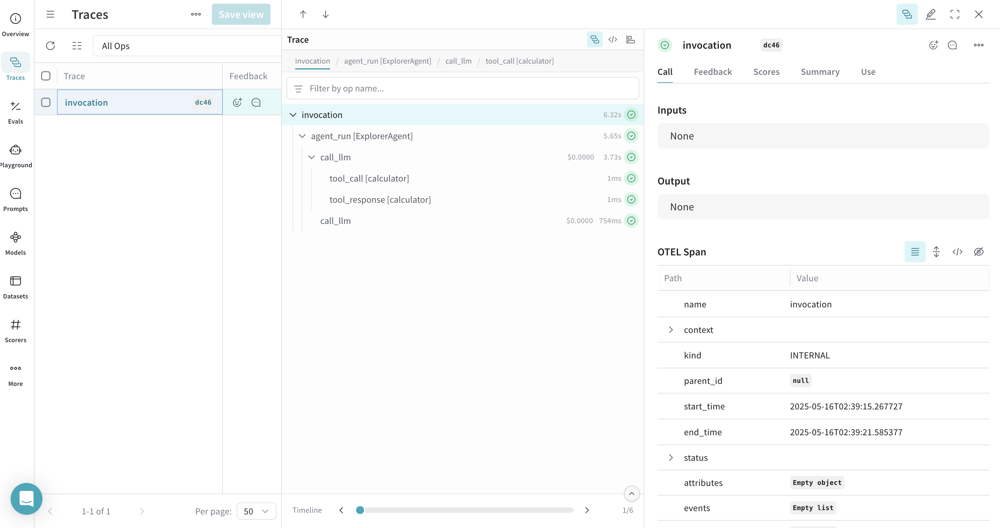
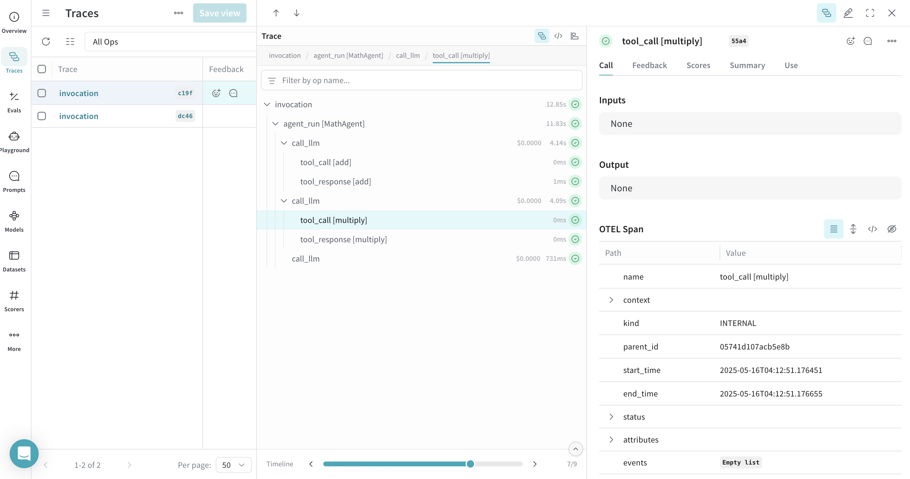
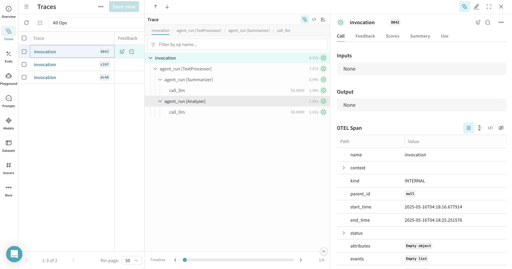

# Google Agent Development Kit (ADK)

You can trace [Google Agent Development Kit (ADK)](https://google.github.io/adk-docs/) agent and tool calls in Weave using [OpenTelemetry (OTEL)](https://opentelemetry.io/). ADK is a flexible and modular framework for developing and deploying AI agents. While optimized for Gemini and the Google ecosystem, ADK is model-agnostic and deployment-agnostic. It provides tools for creating, deploying, and orchestrating agentic architectures ranging from simple tasks to complex workflows.

This guide explains how to trace ADK agent and tool calls using OTEL, and visualize those traces in Weave. You'll learn how to install the required dependencies, configure an OTEL tracer to send data to Weave, and instrument your ADK agents and tools.

:::tip
For more information on OTEL tracing in Weave, see [Send OTEL Traces to Weave](../tracking/otel.md).
:::

## Prerequisites

1. Install the required dependencies:

    ```bash
    pip install google-adk opentelemetry-sdk opentelemetry-exporter-otlp-proto-http
    ```

2. Set your [Google API key](https://cloud.google.com/docs/authentication/api-keys) as an environment variable:

    ```bash
    export GOOGLE_API_KEY=your_api_key_here
    ```

3. [Configure OTEL tracing in Weave](#configure-otel-tracing-in-weave).

### Configure OTEL tracing in Weave

To send traces from ADK to Weave, configure OTEL with a `TracerProvider` and an `OTLPSpanExporter`. Set the exporter to the [correct endpoint and HTTP headers for authentication and project identification](#required-configuration).

:::important 
It is recommended that you store sensitive environment variables like your API key and project info in an environment file (e.g., `.env`), and load them using `os.environ`. This keeps your credentials secure and out of your codebase.
:::

### Required configuration

- **Endpoint:** `https://trace.wandb.ai/otel/v1/traces`
- **Headers:**
  - `Authorization`: Basic auth using your W&B API key
  - `project_id`: Your W&B entity/project name (e.g., `myteam/myproject`)

## Send OTEL traces from ADK to Weave

The following code snippet demonstrates how to configure an OTLP span exporter and tracer provider to send OTEL traces from an ADK application to Weave.

:::important
To ensure that Weave traces ADK properly, set the global tracer provider _before_ using ADK components in your code.
:::

```python
import base64
import os
from opentelemetry.exporter.otlp.proto.http.trace_exporter import OTLPSpanExporter
from opentelemetry.sdk import trace as trace_sdk
from opentelemetry.sdk.trace.export import SimpleSpanProcessor
from opentelemetry import trace

# Load sensitive values from environment variables
WANDB_BASE_URL = "https://trace.wandb.ai"
# Your W&B entity/project name e.g. "myteam/myproject"
PROJECT_ID = os.environ.get("WANDB_PROJECT_ID")  
# Your W&B API key (found at https://wandb.ai/authorize)
WANDB_API_KEY = os.environ.get("WANDB_API_KEY")  

OTEL_EXPORTER_OTLP_ENDPOINT = f"{WANDB_BASE_URL}/otel/v1/traces"
AUTH = base64.b64encode(f"api:{WANDB_API_KEY}".encode()).decode()

OTEL_EXPORTER_OTLP_HEADERS = {
    "Authorization": f"Basic {AUTH}",
    "project_id": PROJECT_ID,
}

# Create the OTLP span exporter with endpoint and headers
exporter = OTLPSpanExporter(
    endpoint=OTEL_EXPORTER_OTLP_ENDPOINT,
    headers=OTEL_EXPORTER_OTLP_HEADERS,
)

# Create a tracer provider and add the exporter
tracer_provider = trace_sdk.TracerProvider()
tracer_provider.add_span_processor(SimpleSpanProcessor(exporter))

# Set the global tracer provider BEFORE importing/using ADK
trace.set_tracer_provider(tracer_provider)
```

## Trace ADK Agents with OTEL

After setting up the tracer provider, you can create and run ADK agents with automatic tracing. The following example demonstrates how to create a simple LLM agent with a tool, and run it with an in-memory runner:

```python
from google.adk.agents import LlmAgent
from google.adk.runners import InMemoryRunner
from google.adk.tools import FunctionTool
from google.genai import types
import asyncio

# Define a simple tool for demonstration
def calculator(a: float, b: float) -> str:
    """Add two numbers and return the result.

    Args:
        a: First number
        b: Second number

    Returns:
        The sum of a and b
    """
    return str(a + b)

calculator_tool = FunctionTool(func=calculator)

async def run_agent():
    # Create an LLM agent
    agent = LlmAgent(
        name="MathAgent",
        model="gemini-2.0-flash",  # You can change this to another model if needed
        instruction=(
            "You are a helpful assistant that can do math. "
            "When asked a math problem, use the calculator tool to solve it."
        ),
        tools=[calculator_tool],
    )

    # Set up runner
    runner = InMemoryRunner(agent=agent, app_name="math_assistant")
    session_service = runner.session_service

    # Create a session
    user_id = "example_user"
    session_id = "example_session"
    session_service.create_session(
        app_name="math_assistant",
        user_id=user_id,
        session_id=session_id,
    )

    # Run the agent with a message that should trigger tool use
    async for event in runner.run_async(
        user_id=user_id,
        session_id=session_id,
        new_message=types.Content(
            role="user", parts=[types.Part(text="What is 5 + 7?")]
        ),
    ):
        if event.is_final_response() and event.content:
            print(f"Final response: {event.content.parts[0].text.strip()}")

# Run the async function
asyncio.run(run_agent())
```

All agent operations are automatically traced and sent to Weave, allowing you to visualize the execution flow. You can view model calls, reasoning steps, and tool invocations.



## Trace ADK Tools with OTEL

When you define and use tools with ADK, these tool calls are also captured in the trace. The OTEL integration automatically instruments both the agent's reasoning process and the individual tool executions, providing a comprehensive view of your agent's behavior.

Here's an example with multiple tools:

```python
from google.adk.agents import LlmAgent
from google.adk.runners import InMemoryRunner
from google.adk.tools import FunctionTool
from google.genai import types
import asyncio

# Define multiple tools
def add(a: float, b: float) -> str:
    """Add two numbers.
    
    Args:
        a: First number
        b: Second number
        
    Returns:
        The sum of a and b
    """
    return str(a + b)

def multiply(a: float, b: float) -> str:
    """Multiply two numbers.
    
    Args:
        a: First number
        b: Second number
        
    Returns:
        The product of a and b
    """
    return str(a * b)

# Create function tools
add_tool = FunctionTool(func=add)
multiply_tool = FunctionTool(func=multiply)

async def run_agent():
    # Create an LLM agent with multiple tools
    agent = LlmAgent(
        name="MathAgent",
        model="gemini-2.0-flash",
        instruction=(
            "You are a helpful assistant that can do math operations. "
            "When asked to add numbers, use the add tool. "
            "When asked to multiply numbers, use the multiply tool."
        ),
        tools=[add_tool, multiply_tool],
    )

    # Set up runner
    runner = InMemoryRunner(agent=agent, app_name="math_assistant")
    session_service = runner.session_service

    # Create a session
    user_id = "example_user"
    session_id = "example_session"
    session_service.create_session(
        app_name="math_assistant",
        user_id=user_id,
        session_id=session_id,
    )

    # Run the agent with a message that should trigger tool use
    async for event in runner.run_async(
        user_id=user_id,
        session_id=session_id,
        new_message=types.Content(
            role="user", parts=[types.Part(text="First add 5 and 7, then multiply the result by 2.")]
        ),
    ):
        if event.is_final_response() and event.content:
            print(f"Final response: {event.content.parts[0].text.strip()}")

# Run the async function
asyncio.run(run_agent())
```



## Work with Workflow Agents

ADK provides various [_workflow agents_](https://google.github.io/adk-docs/agents/workflow-agents/) for more complex scenarios. You can trace workflow agents just like regular LLM agents. Here's an example using a [`SequentialAgent`](https://google.github.io/adk-docs/agents/workflow-agents/sequential-agents/):

```python
from google.adk.agents import LlmAgent, SequentialAgent
from google.adk.runners import InMemoryRunner
from google.genai import types
import asyncio

async def run_workflow():
    # Create two LLM agents
    summarizer = LlmAgent(
        name="Summarizer",
        model="gemini-2.0-flash",
        instruction="Summarize the given text in one sentence.",
        description="Summarizes text in one sentence",
        output_key="summary"  # Store output in state['summary']
    )
    
    analyzer = LlmAgent(
        name="Analyzer",
        model="gemini-2.0-flash",
        instruction="Analyze the sentiment of the given text as positive, negative, or neutral. The text to analyze: {summary}",
        description="Analyzes sentiment of text",
        output_key="sentiment"  # Store output in state['sentiment']
    )
    
    # Create a sequential workflow
    workflow = SequentialAgent(
        name="TextProcessor",
        sub_agents=[summarizer, analyzer],
        description="Executes a sequence of summarization followed by sentiment analysis.",
    )
    
    # Set up runner
    runner = InMemoryRunner(agent=workflow, app_name="text_processor")
    session_service = runner.session_service
    
    # Create a session
    user_id = "example_user"
    session_id = "example_session"
    session_service.create_session(
        app_name="text_processor",
        user_id=user_id,
        session_id=session_id,
    )
    
    # Run the workflow
    async for event in runner.run_async(
        user_id=user_id,
        session_id=session_id,
        new_message=types.Content(
            role="user", 
            parts=[types.Part(text="The product exceeded my expectations. It worked perfectly right out of the box, and the customer service was excellent when I had questions about setup.")]
        ),
    ):
        if event.is_final_response() and event.content:
            print(f"Final response: {event.content.parts[0].text.strip()}")

# Run the async function
asyncio.run(run_workflow())
```

This workflow agent trace will show the sequential execution of both agents in Weave, providing visibility into how data flows through your multi-agent system.



## Learn more

- [Weave documentation: Send OTEL traces to Weave](../tracking/otel.md)
- [Official ADK documentation](https://google.github.io/adk-docs/)
- [Official OTEL documentation](https://opentelemetry.io/)
- [ADK GitHub repository](https://github.com/google/adk-python)