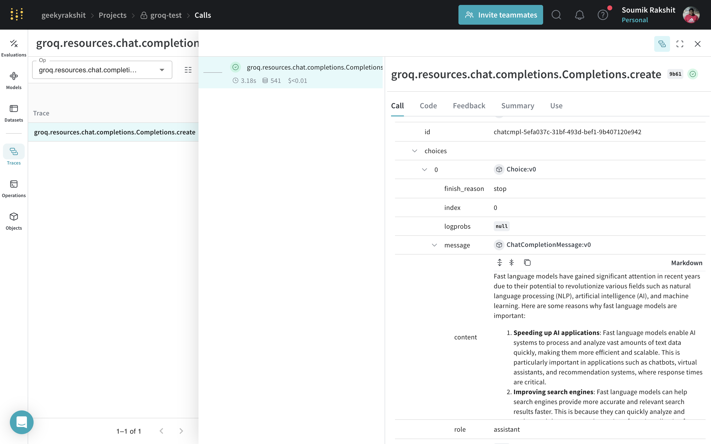
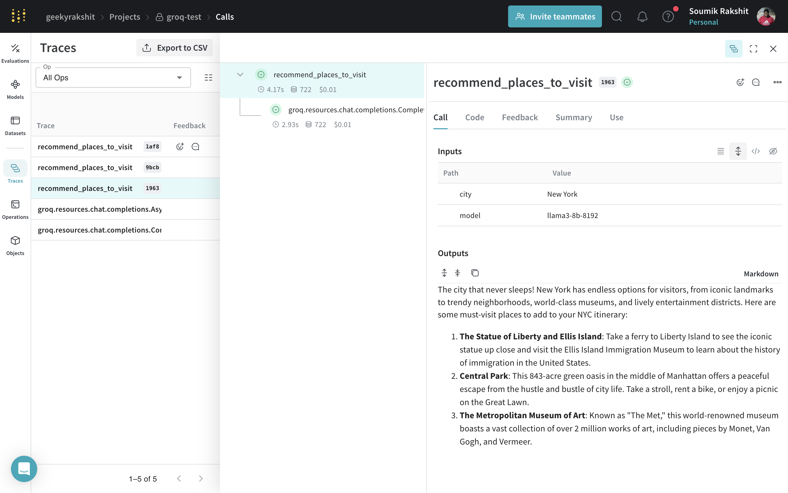
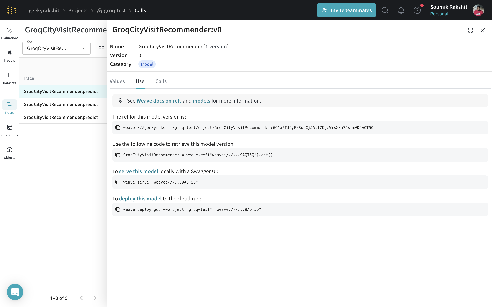

# Groq

[Groq](https://groq.com/) is the AI infrastructure company that delivers fast AI inference. The LPU™ Inference Engine by Groq is a hardware and software platform that delivers exceptional compute speed, quality, and energy efficiency. Weave automatically tracks and logs calls made using Groq chat completion calls.

## Tracing

It’s important to store traces of language model applications in a central location, both during development and in production. These traces can be useful for debugging, and as a dataset that will help you improve your application.

Weave will automatically capture traces for [Groq](https://groq.com/). To start tracking, calling `weave.init(project_name="<YOUR-WANDB-PROJECT-NAME>")` and use the library as normal.

```python
import os
import weave
from groq import Groq

weave.init(project_name="groq-project")

client = Groq(
    api_key=os.environ.get("GROQ_API_KEY"),
)
chat_completion = client.chat.completions.create(
    messages=[
        {
            "role": "user",
            "content": "Explain the importance of fast language models",
        }
    ],
    model="llama3-8b-8192",
)
```

|  |
|---|
| Weave will now track and log all LLM calls made through the Groq library. You can view the traces in the Weave web interface. |

## Track your own ops

Wrapping a function with `@weave.op` starts capturing inputs, outputs and app logic so you can debug how data flows through your app. You can deeply nest ops and build a tree of functions that you want to track. This also starts automatically versioning code as you experiment to capture ad-hoc details that haven't been committed to git.

Simply create a function decorated with [`@weave.op`](/guides/tracking/ops).

In the example below, we have the function `recommend_places_to_visit` which is a function wrapped with `@weave.op` that recommends places to visit in a city.

```python
import os
import weave
from groq import Groq


weave.init(project_name="groq-test")

client = Groq(
    api_key=os.environ.get("GROQ_API_KEY"),
)

@weave.op()
def recommend_places_to_visit(city: str, model: str="llama3-8b-8192"):
    chat_completion = client.chat.completions.create(
        messages=[
            {
                "role": "system",
                "content": "You are a helpful assistant meant to suggest places to visit in a city",
            },
            {
                "role": "user",
                "content": city,
            }
        ],
        model="llama3-8b-8192",
    )
    return chat_completion.choices[0].message.content


recommend_places_to_visit("New York")
recommend_places_to_visit("Paris")
recommend_places_to_visit("Kolkata")
```

|  |
|---|
| Decorating the `recommend_places_to_visit` function with `@weave.op` traces its inputs, outputs, and all internal LM calls made inside the function.  |

## Create a `Model` for easier experimentation

Organizing experimentation is difficult when there are many moving pieces. By using the [`Model`](../core-types/models) class, you can capture and organize the experimental details of your app like your system prompt or the model you're using. This helps organize and compare different iterations of your app. 

In addition to versioning code and capturing inputs/outputs, [`Model`](../core-types/models)s capture structured parameters that control your application’s behavior, making it easy to find what parameters worked best. You can also use Weave Models with `serve`, and [`Evaluation`](../core-types/evaluations.md)s.

In the example below, you can experiment with `WeaveModel`. Every time you change one of these, you'll get a new _version_ of `WeaveModel`.

```python
import os
from groq import Groq
import weave


class GroqCityVisitRecommender(weave.Model):
    model: str
    groq_client: Groq

    @weave.op()
    def predict(self, city: str) -> str:
        system_message = {
            "role": "system",
            "content": """
You are a helpful assistant meant to suggest places to visit in a city
""",
        }
        user_message = {"role": "user", "content": city}
        chat_completion = self.groq_client.chat.completions.create(
            messages=[system_message, user_message],
            model=self.model,
        )
        return chat_completion.choices[0].message.content


weave.init(project_name="groq-test")
city_recommender = GroqCityVisitRecommender(
    model="llama3-8b-8192", groq_client=Groq(api_key=os.environ.get("GROQ_API_KEY"))
)
print(city_recommender.predict("New York"))
print(city_recommender.predict("San Francisco"))
print(city_recommender.predict("Los Angeles"))
```

|  |
|---|
| Tracing and versioning your calls using a [`Model`](../core-types/models) |

### Serving a Weave Model

Given a weave reference any WeaveModel object, you can spin up a fastapi server and [serve](https://wandb.github.io/weave/guides/tools/serve) it.

| [](https://wandb.ai/geekyrakshit/groq-test/weave/objects/GroqCityVisitRecommender/versions/6O1xPTJ9yFx8uuCjJAlI7KgcVYxXKn7JxfmVD9AQT5Q) |
|---|
| You can find the weave reference of any WeaveModel by navigating to the model and copying it from the UI. |

You can serve your model by using the following command in the terminal:

```shell
weave serve weave:///your_entity/project-name/YourModel:<hash>
```
