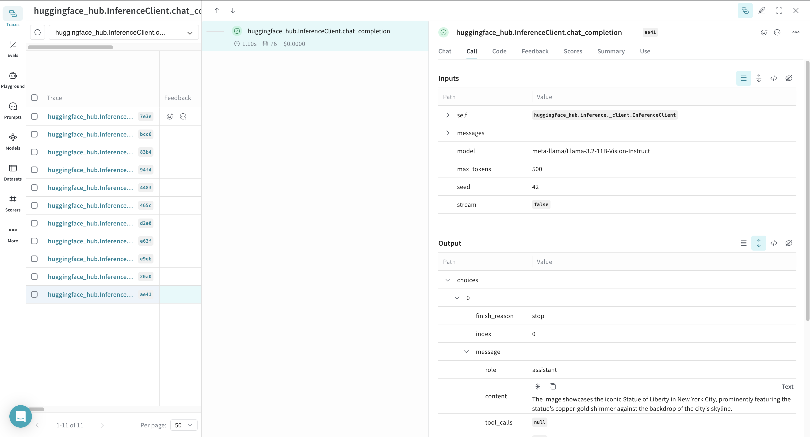
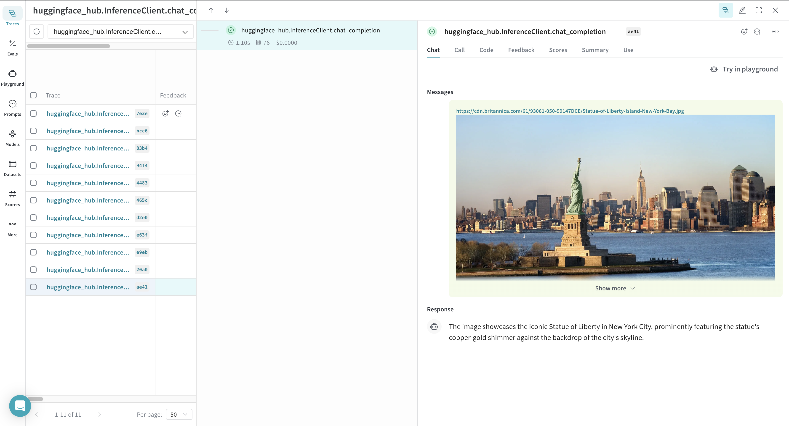
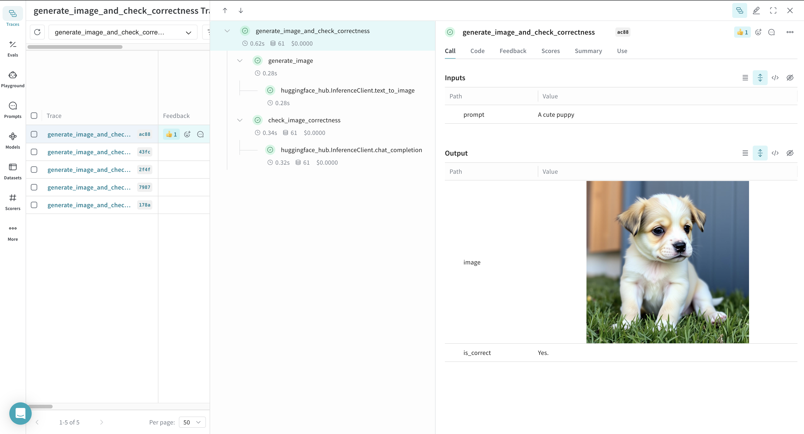

# HuggingFace Hub

[Hugging Face Hub](https://hf.co/) is a machine learning platform for creators and collaborators containing pre-trained models and datasets for your projects.
The `huggingface_hub` library provides a unified interface to run inference across multiple services for models hosted on the Hugging Face Hub which can be called
with the [`InferenceClient`](https://huggingface.co/docs/huggingface_hub/en/package_reference/inference_client) object.

```python
!pip install -U huggingface_hub weave -qqq
```

In order to use inference with a model on the Hugging Face Hub, you need to set your [User Access Token](https://huggingface.co/docs/hub/security-tokens) from your [Hugging Face Hub Settings page](https://huggingface.co/settings/tokens).

```python
import os
import getpass

os.environ["HUGGINGFACE_TOKEN"] = getpass.getpass("Enter your Hugging Face Hub Token: ")
```

# Tracing

It’s important to store traces of language model applications in a central location, both during development and in production. These traces can be useful for debugging, and as a dataset that will help you improve your application.

Weave will automatically capture traces for [`InferenceClient`](https://huggingface.co/docs/huggingface_hub/en/package_reference/inference_client). To start tracking, calling `weave.init()` and use the library as normal.

```python
import weave
from huggingface_hub import InferenceClient

# Initialize Weave
weave.init(project_name="quickstart-huggingface")

# Initialize Hugging Face Inference Client
huggingface_client = InferenceClient(
    api_key=os.environ.get("HUGGINGFACE_TOKEN")
)

# Make a chat completion inference call to the Hugging Face Hub with the Llama-3.2-11B-Vision-Instruct model
image_url = "https://cdn.britannica.com/61/93061-050-99147DCE/Statue-of-Liberty-Island-New-York-Bay.jpg"
response = huggingface_client.chat_completion(
    model="meta-llama/Llama-3.2-11B-Vision-Instruct",
    messages=[
        {
            "role": "user",
            "content": [
                {"type": "image_url", "image_url": {"url": image_url}},
                {"type": "text", "text": "Describe this image in one sentence."},
            ],
        }
    ],
    max_tokens=500,
    seed=42,
)
```


|  |
|----------------------------------------|
| Weave will now track and log all LLM calls made using Hugging Face Inference Client. You can view the traces in the Weave web interface. |

|  |
|----------------------------------------|
| Weave also renders the call as a chat view in the UI along with the entire chat history with the model. |

## Track your own ops

Wrapping a function with @weave.op starts capturing inputs, outputs and app logic so you can debug how data flows through your app. You can deeply nest ops and build a tree of functions that you want to track. This also starts automatically versioning code as you experiment to capture ad-hoc details that haven't been committed to git.

Simply create a function decorated with [`@weave.op`](https://weave-docs.wandb.ai/guides/tracking/ops).

In the example below, we have the functions `generate_image`, `check_image_correctness`, and `generate_image_and_check_correctness` which are wrapped with `@weave.op` that generates an image and checks if it is correct for a given prompt.

```python
import base64
from PIL import Image


def encode_image(pil_image):
    import io
    buffer = io.BytesIO()
    pil_image.save(buffer, format="JPEG")
    buffer.seek(0)
    encoded_image = base64.b64encode(buffer.read()).decode("utf-8")
    return f"data:image/jpeg;base64,{encoded_image}"


@weave.op
def generate_image(prompt: str):
    return huggingface_client.text_to_image(
        prompt=prompt,
        model="black-forest-labs/FLUX.1-schnell",
        num_inference_steps=4,
    )


@weave.op
def check_image_correctness(image: Image.Image, image_generation_prompt: str):
    return huggingface_client.chat_completion(
        model="meta-llama/Llama-3.2-11B-Vision-Instruct",
        messages=[
            {
                "role": "user",
                "content": [
                    {"type": "image_url", "image_url": {"url": encode_image(image)}},
                    {
                        "type": "text",
                        "text": f"Is this image correct for the prompt: {image_generation_prompt}? Answer with only one word: yes or no",
                    },
                ],
            }
        ],
        max_tokens=500,
        seed=42,
    ).choices[0].message.content


@weave.op
def generate_image_and_check_correctness(prompt: str):
    image = generate_image(prompt)
    return {
        "image": image,
        "is_correct": check_image_correctness(image, prompt),
    }


response = generate_image_and_check_correctness("A cute puppy")
```

|  |
|----------------------------------------|
| Weave will now track and log all the ops you call. You can view the traces in the Weave web interface. |


## Create a [`Model`](https://weave-docs.wandb.ai/guides/core-types/models) for easier experimentation

Organizing experimentation is difficult when there are many moving pieces. By using the [`Model`](https://weave-docs.wandb.ai/guides/core-types/models) class, you can capture and organize the experimental details of your app like your system prompt or the model you're using. This helps organize and compare different iterations of your app.

In addition to versioning code and capturing inputs/outputs, a [`Model`](https://weave-docs.wandb.ai/guides/core-types/models) captures structured parameters that control your application’s behavior, making it easy to find what parameters worked best. You can also use Weave a [`Model`](https://weave-docs.wandb.ai/guides/core-types/models) with serve, and [Evaluations](https://weave-docs.wandb.ai/guides/core-types/evaluations).

In the example below, you can experiment with `CityVisitRecommender`. Every time you change one of these, you'll get a new version of `CityVisitRecommender`.

```python
import rich


class CityVisitRecommender(weave.Model):
    model: str
    temperature: float = 0.7
    max_tokens: int = 500
    seed: int = 42

    @weave.op()
    def predict(self, city: str) -> str:
        return huggingface_client.chat_completion(
            model=self.model,
            messages=[
                {
                    "role": "system",
                    "content": "You are a helpful assistant meant to suggest places to visit in a city",
                },
                {"role": "user", "content": city},
            ],
            max_tokens=self.max_tokens,
            temperature=self.temperature,
            seed=self.seed,
        ).choices[0].message.content


city_visit_recommender = CityVisitRecommender(
    model="meta-llama/Llama-3.2-11B-Vision-Instruct",
    temperature=0.7,
    max_tokens=500,
    seed=42,
)
rich.print(city_visit_recommender.predict("New York City"))
rich.print(city_visit_recommender.predict("Paris"))
```

|  |
|----------------------------------------|
| Weave will now track and log all the models you use. You can view the traces in the Weave web interface. |

