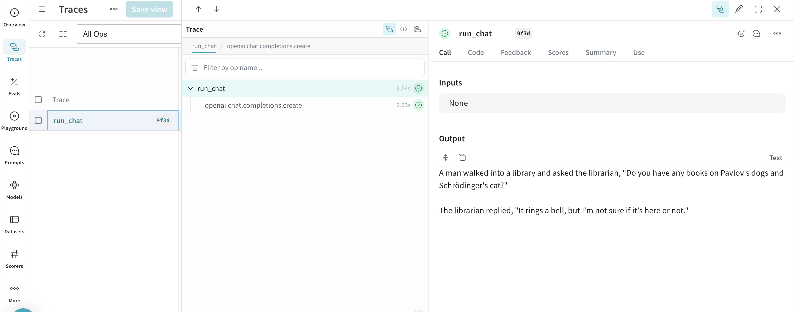
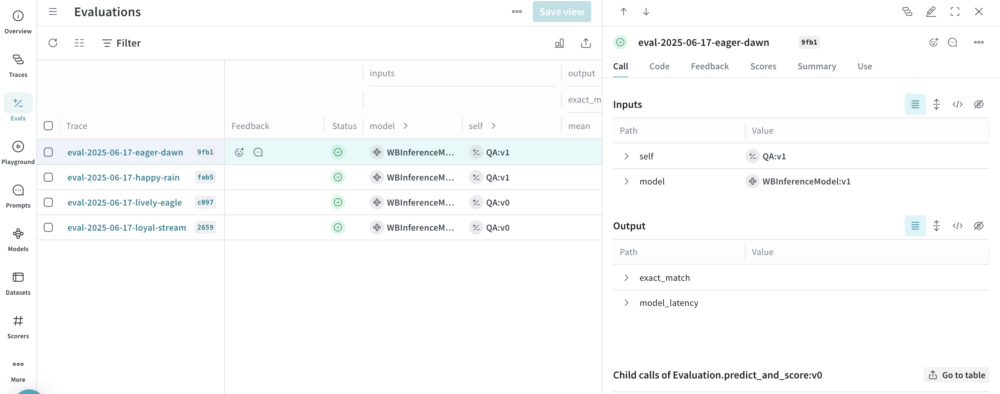
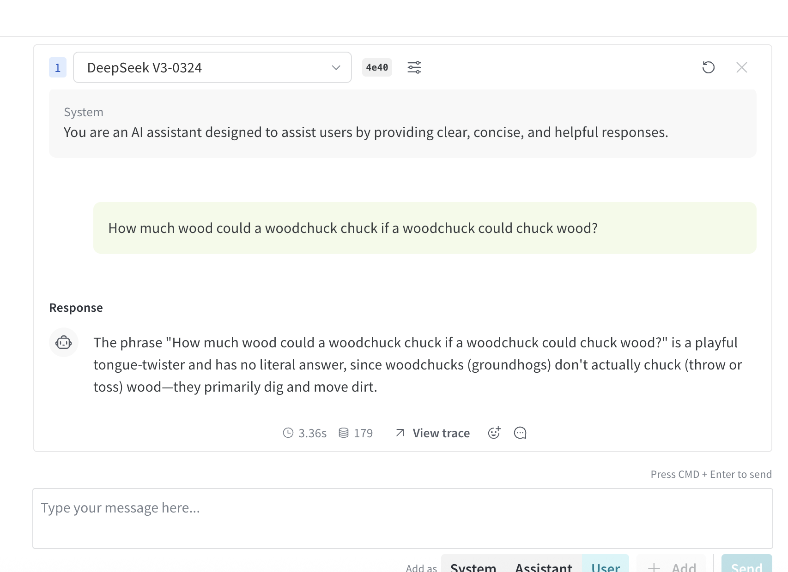
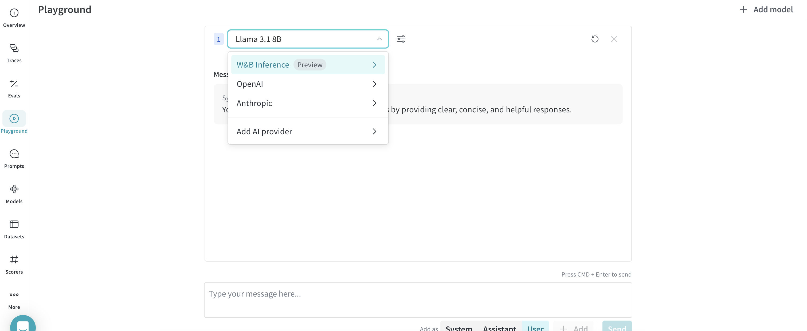
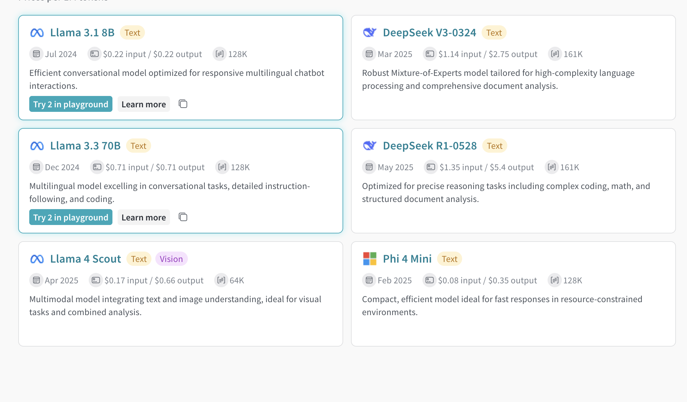

import Tabs from '@theme/Tabs';
import TabItem from '@theme/TabItem';

# W&B Inference

_W&B Inference_ provides access to leading open-source foundation models via W&B Weave and an OpenAI-compliant API. With W&B Inference, you can:

- Develop AI applications and agents without signing up for a hosting provider or self-hosting a model.
- Try the [supported models](#available-models) in the W&B Weave Playground.

Using Weave, you can trace, evaluate, monitor, and iterate on your W&B Inference-powered applications.

:::important
W&B Inference credits are included with Free, Pro, and Academic plans for a limited time. Availability may vary for Enterprise. Once credits are consumed:

- Free accounts must upgrade to a Pro plan to continue using Inference. **[Upgrade your plan here](https://wandb.ai/subscriptions)**.
- Pro plan users will be billed for Inference overages on a monthly basis, based on the model-specific pricing.
- Enterprise accounts will need to contact their account executive.

To learn more, see the [pricing page](https://wandb.ai/site/pricing/) and [W&B Inference model costs](https://wandb.ai/site/pricing/inference).
:::

## Get started

To get started with the Inference service, complete the following steps:

1. Familiarize yourself with the [available models](#available-models) and the [Usage information and limits](#usage-information-and-limits).
2. Complete the [prerequisites](#prerequisites).
3. Use the service programmatically (see the [usage examples](#usage-examples) and [API specification](#api-specification)) or via the [UI](#ui).

## Available models

The following models are available through W&B Inference:

| Model                      | Model ID (for API usage)                  | Type(s)      | Context Window | Parameters                  | Description                                                                                                                    |
| -------------------------- | ----------------------------------------- | ------------ | -------------- | --------------------------- | ------------------------------------------------------------------------------------------------------------------------------ |
| Qwen3 235B A22B-2507       | Qwen/Qwen3-235B-A22B-Instruct-2507        | Text         | 262K           | 22B - 235B (Active - Total) | Efficient multilingual, Mixture-of-Experts, instruction-tuned model, optimized for logical reasoning.                          |
| Qwen3 Coder 480B A35B | Qwen/Qwen3-Coder-480B-A35B-Instruct       | Text         | 262K           | 35B - 480B (Active - Total) | Mixture-of-Experts model optimized for agentic coding tasks such as function calling, tooling use, and long-context reasoning. |
| MoonshotAI Kimi K2         | moonshotai/Kimi-K2-Instruct               | Text         | 128K           | 32B - 1T (Active - Total)   | Mixture-of-Experts model optimized for complex tool use, reasoning, and code synthesis.                                        |
| DeepSeek R1-0528           | deepseek-ai/DeepSeek-R1-0528              | Text         | 161K           | 37B - 680B (Active - Total) | Optimized for precise reasoning tasks including complex coding, math, and structured document analysis.                        |
| DeepSeek V3-0324           | deepseek-ai/DeepSeek-V3-0324              | Text         | 161K           | 37B - 680B (Active - Total) | Robust Mixture-of-Experts model tailored for high-complexity language processing and comprehensive document analysis.          |
| Meta Llama 3.1 8B               | meta-llama/Llama-3.1-8B-Instruct          | Text         | 128K           | 8B (Total)                  | Efficient conversational model optimized for responsive multilingual chatbot interactions.                                     |
| Meta Llama 3.3 70B              | meta-llama/Llama-3.3-70B-Instruct         | Text         | 128K           | 70B (Total)                 | Multilingual model excelling in conversational tasks, detailed instruction-following, and coding.                              |
| Meta Llama 4 Scout              | meta-llama/Llama-4-Scout-17B-16E-Instruct | Text, Vision | 64K            | 17B - 109B (Active - Total) | Multimodal model integrating text and image understanding, ideal for visual tasks and combined analysis.                       |
| Microsoft Phi 4 Mini 3.8B                | microsoft/Phi-4-mini-instruct             | Text         | 128K           | 3.8B (Active - Total)       | Compact, efficient model ideal for fast responses in resource-constrained environments.                                        |

## Usage information and limits

The following section describes important usage information and limits. Familiarize yourself with this information before using the service.

### Pricing

For model pricing information, visit [https://wandb.ai/site/pricing/inference](https://wandb.ai/site/pricing/inference).

### Purchase more credits

W&B Inference credits are included with Free, Pro, and Academic plans for a limited time. Availability may vary for Enterprise. Once credits are consumed:

- Free accounts must upgrade to a Pro plan to continue using Inference. **[Upgrade your plan here](https://wandb.ai/subscriptions)**.
- Pro plan users will be billed for Inference overages on a monthly basis, based on the model-specific pricing.
- Enterprise accounts will need to contact their account executive.

### Concurrency limits

If a rate limit is exceeded, the API will return a `429 Concurrency limit reached for requests` response. To resolve this error, reduce the number of concurrent requests.

W&B applies rate limits per W&B project. For example, if you have 3 projects associated with a team, each project has its own rate limit quota. Users on [Paid plans](https://wandb.ai/site/pricing) have higher rate limits than Free plans.

### Personal entities unsupported

:::tip
Personal entities were deprecated in May 2024, so the following information only applies to legacy accounts.
:::

Personal accounts (personal entities) don’t support the Inference service. To access Inference, you either need to create a team, or switch to a non-personal account. 

### Geographic restrictions

The Inference service is only accessible from supported geographic locations. For more information, see the [Terms of Service](https://docs.coreweave.com/docs/policies/terms-of-service/terms-of-use#geographic-restrictions).

## Prerequisites

:::tip
Before using the Inference service, familiarize yourself with the [Usage information and limits](#usage-information-and-limits).
:::

The following prerequisites are required to access the W&B Inference service via the API or the W&B Weave UI.

1. A W&B account. Sign up [here](https://app.wandb.ai/login?signup=true&_gl=1*1yze8dp*_ga*ODIxMjU5MTk3LjE3NDk0OTE2NDM.*_ga_GMYDGNGKDT*czE3NDk4NDYxMzgkbzEyJGcwJHQxNzQ5ODQ2MTM4JGo2MCRsMCRoMA..*_ga_JH1SJHJQXJ*czE3NDk4NDU2NTMkbzI1JGcxJHQxNzQ5ODQ2MTQ2JGo0NyRsMCRoMA..*_gcl_au*MTE4ODk1MzY1OC4xNzQ5NDkxNjQzLjk1ODA2MjQwNC4xNzQ5NTgyMTUzLjE3NDk1ODIxNTM.).
2. A W&B API key. Get your API key at [https://wandb.ai/authorize](https://wandb.ai/authorize).
3. A W&B project.
4. If you are using the Inference service via Python, see [Additional prerequisites for using the API via Python](#additional-prerequisites-for-using-the-api-via-python).

### Additional prerequisites for using the API via Python

To use the Inference API via Python, do the following:

1. Complete the [general prerequisites](#prerequisites). 
2. Install the `openai` and `weave` libraries in your local environment:

    ```bash
    pip install openai weave
    ```

:::note
The `weave` library is only required if you'll be using Weave to trace your LLM applications. For information on getting started with Weave, see the [Weave Quickstart](../../quickstart.md).

For usage examples demonstrating how to use the W&B Inference service with Weave, see the [API usage examples](#usage-examples).
:::

## API specification

:::tip
Are you trying to troubleshoot API errors? See [API errors](#api-errors) and [usage information and limits](#usage-information-and-limits).
:::

The following section provides API specification information and API usage examples.

- [Endpoint](#endpoint)
- [Available methods](#available-methods)
- [Usage examples](#usage-examples)

### Endpoint

The Inference service can be accessed via the following endpoint:

```plaintext
https://api.inference.wandb.ai/v1
```

:::important
To access this endpoint, you must have a W&B account with Inference service credits allocated, a valid W&B API key, and a W&B entity (also referred to as "team") and project. In the code samples in this guide, entity (team) and project are referred to as `<your-team>\<your-project>`.
:::

### Available methods

The Inference service supports the following API methods:

- [Chat completions](#chat-completions)
- [List supported models](#list-supported-models)

#### Chat completions

The primary API method available is `/chat/completions`, which supports OpenAI-compatible request formats for sending messages to a supported model and receiving a completion. For usage examples demonstrating how to use the W&B Inference service with Weave, see the [API usage examples](#usage-examples).

To create a chat completion, you will need:

- The Inference service base URL `https://api.inference.wandb.ai/v1`
- Your W&B API key `<your-api-key>`
- Your W&B entity and project names `<your-team>/<your-project>`
- The ID for the model you want to use, one of:
  - `meta-llama/Llama-3.1-8B-Instruct`
  - `deepseek-ai/DeepSeek-V3-0324`
  - `meta-llama/Llama-3.3-70B-Instruct`
  - `deepseek-ai/DeepSeek-R1-0528`
  - `meta-llama/Llama-4-Scout-17B-16E-Instruct`
  - `microsoft/Phi-4-mini-instruct`
  - `moonshotai/Kimi-K2-Instruct`
  - `Qwen/Qwen3-235B-A22B-Instruct-2507`
  - `Qwen/Qwen3-Coder-480B-A35B-Instruct`

<Tabs groupId="programming-language" queryString>
  <TabItem value="bash" label="Bash" default>
    ```bash
    curl https://api.inference.wandb.ai/v1/chat/completions \
      -H "Content-Type: application/json" \
      -H "Authorization: Bearer <your-api-key>" \
      -H "OpenAI-Project: <your-team>/<your-project>" \
      -d '{
        "model": "<model-id>",
        "messages": [
          { "role": "system", "content": "You are a helpful assistant." },
          { "role": "user", "content": "Tell me a joke." }
        ]
      }'
    ```
  </TabItem>
  <TabItem value="python" label="Python">
    ```python
    import openai

    client = openai.OpenAI(
        # The custom base URL points to W&B Inference
        base_url='https://api.inference.wandb.ai/v1',

        # Get your API key from https://wandb.ai/authorize
        # Consider setting it in the environment as OPENAI_API_KEY instead for safety
        api_key="<your-api-key>",

        # Team and project are required for usage tracking
        project="<your-team>/<your-project>",
    )

    # Replace <model-id> with any of the following values:
    # meta-llama/Llama-3.1-8B-Instruct
    # deepseek-ai/DeepSeek-V3-0324
    # meta-llama/Llama-3.3-70B-Instruct
    # deepseek-ai/DeepSeek-R1-0528
    # meta-llama/Llama-4-Scout-17B-16E-Instruct
    # microsoft/Phi-4-mini-instruct
    # moonshotai/Kimi-K2-Instruct
    # Qwen/Qwen3-235B-A22B-Instruct-2507
    # Qwen/Qwen3-Coder-480B-A35B-Instruct

    response = client.chat.completions.create(
        model="<model-id>",
        messages=[
            {"role": "system", "content": "<your-system-prompt>"},
            {"role": "user", "content": "<your-prompt>"}
        ],
    )

    print(response.choices[0].message.content)
    ```

  </TabItem>
</Tabs>

#### List supported models

Use the API to query all currently available models and their IDs. This is useful for selecting models dynamically or inspecting what's available in your environment.

<Tabs groupId="programming-language" queryString>
  <TabItem value="bash" label="Bash" default>
    ```bash
    curl https://api.inference.wandb.ai/v1/models \
      -H "Content-Type: application/json" \
      -H "Authorization: Bearer <your-api-key>" \
      -H "OpenAI-Project: <your-team>/<your-project>" 
    ```
  </TabItem>
  <TabItem value="python" label="Python">
    ```python
    import openai

    client = openai.OpenAI(
        base_url="https://api.inference.wandb.ai/v1",
        api_key="<your-api-key>",
        project="<your-team>/<your-project>"
    )

    response = client.models.list()

    for model in response.data:
        print(model.id)
    ```

  </TabItem>
</Tabs>

## Usage examples

This section provides several examples demonstrating how to use W&B Inference with Weave:

- [Basic example: Trace Llama 3.1 8B with Weave](#basic-example-trace-llama-31-8b-with-weave)
- [Advanced example: Use Weave Evaluations and Leaderboards with the inference service](#advanced-example-use-weave-evaluations-and-leaderboards-with-the-inference-service)

### Basic example: Trace Llama 3.1 8B with Weave

The following Python code sample shows how to send a prompt to the **Llama 3.1 8B** model using the W&B Inference API and trace the call in Weave. Tracing lets you capture the full input/output of the LLM call, monitor performance, and analyze results in the Weave UI.

:::tip
Learn more about [tracing in Weave](../tracking/tracing.mdx).
:::

In this example:

- You define a `@weave.op()`-decorated function, `run_chat`, which makes a chat completion request using the OpenAI-compatible client.
- Your traces are recorded and associated with your W&B entity and project `project="<your-team>/<your-project>"`
- The function is automatically traced by Weave, so its inputs, outputs, latency, and metadata (like model ID) are logged.
- The result is printed in the terminal, and the trace appears in your **Traces** tab at [https://wandb.ai](https://wandb.ai) under the specified project.

To use this example, you must complete the [general prerequisites](#prerequisites) and [Additional prerequisites for using the API via Python](#additional-prerequisites-for-using-the-api-via-python).

```python
import weave
import openai

# Set the Weave team and project for tracing
weave.init("<your-team>/<your-project>")

client = openai.OpenAI(
    base_url='https://api.inference.wandb.ai/v1',

    # Get your API key from https://wandb.ai/authorize
    api_key="<your-api-key>",

    # Required for W&B inference usage tracking
    project="wandb/inference-demo",
)

# Trace the model call in Weave
@weave.op()
def run_chat():
    response = client.chat.completions.create(
        model="meta-llama/Llama-3.1-8B-Instruct",
        messages=[
            {"role": "system", "content": "You are a helpful assistant."},
            {"role": "user", "content": "Tell me a joke."}
        ],
    )
    return response.choices[0].message.content

# Run and log the traced call
output = run_chat()
print(output)
```

Once you run the code sample, you can view the trace in Weave by clicking the link printed in the terminal (e.g. `https://wandb.ai/<your-team>/<your-project>/r/call/01977f8f-839d-7dda-b0c2-27292ef0e04g`), or:

1. Navigate to [https://wandb.ai](https://wandb.ai).
2. Select the **Traces** tab to view your Weave traces.

Next, try the [advanced example](#advanced-example-use-weave-evaluations-and-leaderboards-with-the-inference-service).



### Advanced example: Use Weave Evaluations and Leaderboards with the inference service

In addition to using Weave with the Inference service to [trace model calls](../tracking/tracing.mdx), you can also [evaluate performance](../core-types/evaluations.md), and [publish a leaderboard](../core-types/leaderboards.md). The following Python code sample compares two models on a simple question–answer dataset.

To use this example, you must complete the [general prerequisites](#prerequisites) and [Additional prerequisites for using the API via Python](#additional-prerequisites-for-using-the-api-via-python).

```python
import os
import asyncio
import openai
import weave
from weave.flow import leaderboard
from weave.trace.ref_util import get_ref

# Set the Weave team and project for tracing
weave.init("<your-team>/<your-project>")

dataset = [
    {"input": "What is 2 + 2?", "target": "4"},
    {"input": "Name a primary color.", "target": "red"},
]

@weave.op
def exact_match(target: str, output: str) -> float:
    return float(target.strip().lower() == output.strip().lower())

class WBInferenceModel(weave.Model):
    model: str

    @weave.op
    def predict(self, prompt: str) -> str:
        client = openai.OpenAI(
            base_url="https://api.inference.wandb.ai/v1",
            # Get your API key from https://wandb.ai/authorize
            api_key="<your-api-key>",
            # Required for W&B inference usage tracking
            project="<your-team>/<your-project>",
        )
        resp = client.chat.completions.create(
            model=self.model,
            messages=[{"role": "user", "content": prompt}],
        )
        return resp.choices[0].message.content

llama = WBInferenceModel(model="meta-llama/Llama-3.1-8B-Instruct")
deepseek = WBInferenceModel(model="deepseek-ai/DeepSeek-V3-0324")

def preprocess_model_input(example):
    return {"prompt": example["input"]}

evaluation = weave.Evaluation(
    name="QA",
    dataset=dataset,
    scorers=[exact_match],
    preprocess_model_input=preprocess_model_input,
)

async def run_eval():
    await evaluation.evaluate(llama)
    await evaluation.evaluate(deepseek)

asyncio.run(run_eval())

spec = leaderboard.Leaderboard(
    name="Inference Leaderboard",
    description="Compare models on a QA dataset",
    columns=[
        leaderboard.LeaderboardColumn(
            evaluation_object_ref=get_ref(evaluation).uri(),
            scorer_name="exact_match",
            summary_metric_path="mean",
        )
    ],
)

weave.publish(spec)
```

After you run the following code sample, navigate to your W&B account at [https://wandb.ai/](https://wandb.ai/) and:

- Navigate to the **Traces** tab to [view your traces](../tracking/tracing.mdx)
- Navigate to the **Evals** tab to [view your model evaluations](../core-types/evaluations.md)
- Navigate to the **Leaders** tab to [view the generated leaderboard](../core-types/leaderboards.md)




## UI

The following section describes how to use the Inference service from the W&B UI. Before you can access the Inference service via the UI, complete the [prerequisites](#prerequisites).

### Access the Inference service

You can access the Inference service via the Weave UI from two different locations:

- [Direct link](#direct-link)
- [From the Inference tab](#from-the-inference-tab)
- [From the Playground tab](#from-the-playground-tab)

#### Direct link

Navigate to [https://wandb.ai/inference](https://wandb.ai/inference).

#### From the Inference tab

1. Navigate to your W&B account at [https://wandb.ai/](https://wandb.ai/).
2. From the left sidebar, select **Inference**. A page with available models and model information displays.



#### From the Playground tab

1. From the left sidebar, select **Playground**. The Playground chat UI displays.
2. From the LLM dropdown list, mouseover **W&B Inference**. A dropdown with available W&B Inference models displays to the right.
3. From the W&B Inference models dropdown, you can:
   - Click the name of any available model to [try it in the Playground](#try-a-model-in-the-playground).
   - [Compare one or more models in the Playground](#compare-multiple-models)



### Try a model in the Playground

Once you've [selected a model using one of the access options](#access-the-inference-service), you can try the model in Playground. The following actions are available:

- [Customize model settings and parameters](../tools/playground.md#customize-settings)
- [Add, retry, edit, and delete messages](../tools/playground.md#message-controls)
- [Save and reuse a model with custom settings](../tools/playground.md#saved-models)
- [Compare multiple models](#compare-multiple-models)

### Compare multiple models

You can compare multiple Inference models in the Playground. The Compare view can be accessed from two different locations:

- [Access the Compare view from the Inference tab ](#access-the-compare-view-from-the-inference-tab)
- [Access the Compare view from the Playground tab](#access-the-compare-view-from-the-playground-tab)

#### Access the Compare view from the Inference tab

1. From the left sidebar, select **Inference**. A page with available models and model information displays.
2. To select models for comparison, click anywhere on a model card (except for the model name). The border of the model card is highlighted in blue to indicate the selection.
3. Repeat step 2 for each model you want to compare.
4. In any of the selected cards, click the **Compare N models in the Playground** button. `N` is the number of models you are comparing. For example, when 3 models are selected, the button displays as **Compare 3 models in the Playground**. The comparison view opens.

Now, you can compare models in the Playground, and use any of the features described in [Try a model in the Playground](#try-a-model-in-the-playground).



#### Access the Compare view from the Playground tab

1. From the left sidebar, select **Playground**. The Playground chat UI displays.
2. From the LLM dropdown list, mouseover **W&B Inference**. A dropdown with available W&B Inference models displays to the right.
3. From the dropdown, select **Compare**. The **Inference** tab displays.
4. To select models for comparison, click anywhere on a model card (except for the model name). The border of the model card is highlighted in blue to indicate the selection.
5. Repeat step 4 for each model you want to compare.
6. In any of the selected cards, click the **Compare N models in the Playground** button (`N` is the number of models you are comparing. For example, when 3 models are selected, the button displays as **Compare 3 models in the Playground**). The comparison view opens.

Now, you can compare models in the Playground, and use any of the features described in [Try a model in the Playground](#try-a-model-in-the-playground).

### View billing and usage information

Organization admins can track current Inference credit balance, usage history, and upcoming billing (if applicable) directly from the W&B UI:

1. In the W&B UI, navigate to the W&B **Billing** page.
2. In the bottom right-hand corner, the Inference billing information card is displayed. From here, you can:

- Click the **View usage** button in the Inference billing information card to view your usage over time.
- If you're on a paid plan, view your upcoming inference charges.

:::tip
Visit the [Inference pricing page for a breakdown of per-model pricing](https://wandb.ai/site/pricing/inference)
:::

## API errors

| Error Code | Message                                                                     | Cause                                                                                    | Solution                                                                                           |
| ---------- | --------------------------------------------------------------------------- | ---------------------------------------------------------------------------------------- | -------------------------------------------------------------------------------------------------- |
| 401        | Invalid Authentication                                                      | Invalid authentication credentials or your W&B project entity and/or name are incorrect. | Ensure the correct API key is being used and/or that your W&B project name and entity are correct. |
| 403        | Country, region, or territory not supported                                 | Accessing the API from an unsupported location.                                          | Please see [Geographic restrictions](#geographic-restrictions)                                     |
| 429        | Concurrency limit reached for requests                                      | Too many concurrent requests.                                                            | Reduce the number of concurrent requests or increase your limits. For more information, see [Usage information and limits](#usage-information-and-limits).                                                             |
| 429        | You exceeded your current quota, please check your plan and billing details | Out of credits or reached monthly spending cap.                                          | Purchase more credits or increase your limits. For more information, see [Usage information and limits](#usage-information-and-limits).                                                     |
| 500        | The server had an error while processing your request                       | Internal server error.                                                                   | Retry after a brief wait and contact support if it persists.                                       |
| 503        | The engine is currently overloaded, please try again later                  | Server is experiencing high traffic.                                                     | Retry your request after a short delay.                                                            |
