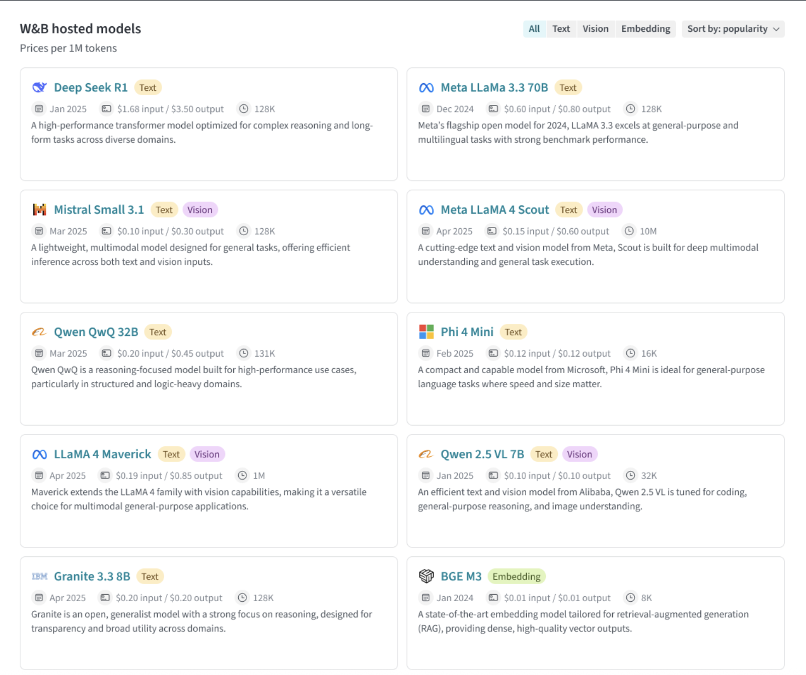

import Tabs from '@theme/Tabs';
import TabItem from '@theme/TabItem';

# Weights & Biases (W&B) Inference Service

_Weights & Biases (W&B) Inference_ provides access to leading open-source foundation models via the W&B Weave UI and an OpenAI-compliant API. With W&B Inference, you can develop AI applications and agents without signing up for a hosting provider or self-hosting a model. Using Weave, you can trace, evaluate, monitor, and iterate on your W&B Inference-powered applications.

This guide provides an overview of the service and available models, as well as:

- [Prerequisites](#prerequisites)
- [Usage limits](#usage-limits)
- [Usage examples](#usage-examples)
  

## Prerequisites

- A Weights & Biases account.

:::tip
Before using the service, familiarize yourself with the [usage limits](#usage-limits).
:::

## Usage examples

This section describes several ways to interact with the W&B Inference service:

- [UI]
- [API: List available models](#list-available-models) — Programmatically retrieve a list of available models for reference or automation.
- [API: Chat completion](#chat-completion) — Use code examples to interact with specific open-source models.

### UI



### API

Each supported model includes examples using both Bash (via `curl`) and Python (via the OpenAI-compatible SDK).

- [DeepSeek R1](#deepseek-r1)
- [Qwen QwQ 32B](#qwen-qwq-32b)
- [Llama 3.3 70B](#llama-33-70b)
- [BGE M3](#bge-m3)
- [Mistral Small 3.1](#mistral-small-31)
- [Llama 4 Scout](#llama-4-scout)
- [Qwen 2.5 VL 7B](#qwen-25-vl-7b)
- [Phi 4 Mini](#phi-4-mini)
- [Llama 4 Maverick](#llama-4-maverick)
- [Granite 3.3 8B](#granite-33-8b)

You can also [list the available models using the API](#list-available-models).

### List available models

Use the API to query all currently available models and their IDs. This is useful for selecting models dynamically or inspecting what's available in your environment.

<Tabs groupId="programming-language" queryString>
  <TabItem value="bash" label="Bash" default>
    ```bash
    curl https://infr.cw4637-staging.coreweave.app/v1/models \
      -H "Content-Type: application/json" \
      -H "Authorization: Bearer <your key from qa>" \
      -H "OpenAI-Project: hello-world-team/new-inference-project"
    ```
  </TabItem>
  <TabItem value="python" label="Python">

  </TabItem>
</Tabs>

#### DeepSeek R1

<Tabs groupId="programming-language" queryString>
  <TabItem value="bash" label="Bash" default>
    ```bash
    curl https://infr.cw4637-staging.coreweave.app/v1/chat/completions \
      -H "Content-Type: application/json" \
      -H "Authorization: Bearer some-key-value" \
      -H "OpenAI-Project: entity1/project1" \
      -d '{
        "model": "cw_deepseek-ai_DeepSeek-R1",
        "messages": [
          { "role": "system", "content": "You are a helpful assistant." },
          { "role": "user", "content": "Tell me a joke." }
        ]
      }'
    ```
  </TabItem>
  <TabItem value="python" label="Python">
    ```python
    import openai
    import weave

    # Set a custom base URL
    client = openai.OpenAI(
        base_url='https://infr.cw4637-staging.coreweave.app/v1',
        # Generally recommend setting OPENAI_API_KEY in the environment
        api_key="some-key-value"
    )

    # Make a call using the client
    response = client.chat.completions.create(
        model="cw_deepseek-ai_DeepSeek-R1",
        messages=[
            {"role": "system", "content": "You are a helpful assistant."},
            {"role": "user", "content": "Tell me a joke."}
        ],
        extra_headers={
            "OpenAI-Project": "entity1/project1"
        },
    )

    print(response.choices[0].message.content)
    ```
  </TabItem>
</Tabs>

#### Qwen QwQ 32B

<Tabs groupId="programming-language">
  <TabItem value="bash" label="Bash" default>
    ```bash
  curl https://infr.cw4637-staging.coreweave.app/v1/chat/completions \
    -H "Content-Type: application/json" \
    -H "Authorization: Bearer some-key-value" \
    -H "OpenAI-Project: entity1/project1" \
    -d '{
      "model": "cw_Qwen_QwQ-32B",
      "messages": [
        { "role": "system", "content": "You are a helpful assistant." },
        { "role": "user", "content": "Tell me a joke." }
      ]
    }'
    ```
  </TabItem>
  <TabItem value="python" label="Python">
    ```python
    import openai
    import weave

    # Set a custom base URL
    client = openai.OpenAI(
        base_url='https://infr.cw4637-staging.coreweave.app/v1',
        # Generally recommend setting OPENAI_API_KEY in the environment
        api_key="some-key-value"
    )

    # Make a call using the client
    response = client.chat.completions.create(
        model="cw_Qwen_QwQ-32B",
        messages=[
            {"role": "system", "content": "You are a helpful assistant."},
            {"role": "user", "content": "Tell me a joke."}
        ],
        extra_headers={
            "OpenAI-Project": "entity1/project1"
        },
    )

    print(response.choices[0].message.content)
    ```
  </TabItem>
</Tabs>


#### Llama 3.3 70B

<Tabs groupId="programming-language" queryString>
  <TabItem value="bash" label="Bash" default>

  </TabItem>
  <TabItem value="python" label="Python">

  </TabItem>
</Tabs>

<Tabs groupId="programming-language" queryString>
  <TabItem value="bash" label="Bash" default>
    ```bash
    curl https://infr.cw4637-staging.coreweave.app/v1/chat/completions \
      -H "Content-Type: application/json" \
      -H "Authorization: Bearer some-key-value" \
      -H "OpenAI-Project: entity1/project1" \
      -d '{
        "model": "cw_meta-llama_Llama-3.3-70B-Instruct",
        "messages": [
          { "role": "system", "content": "You are a helpful assistant." },
          { "role": "user", "content": "Tell me a joke." }
        ]
      }'
    ```
  </TabItem>
  <TabItem value="python" label="Python">
    ```python
    import openai
    import weave

    # Set a custom base URL
    client = openai.OpenAI(
        base_url='https://infr.cw4637-staging.coreweave.app/v1',
        # Generally recommend setting OPENAI_API_KEY in the environment
        api_key="some-key-value"
    )

    # Make a call using the client
    response = client.chat.completions.create(
        model="cw_meta-llama_Llama-3.3-70B-Instruct",
        messages=[
            {"role": "system", "content": "You are a helpful assistant."},
            {"role": "user", "content": "Tell me a joke."}
        ],
        extra_headers={
            "OpenAI-Project": "entity1/project1"
        },
    )

    print(response.choices[0].message.content)
    ```
  </TabItem>
</Tabs>

#### BGE M3

<Tabs groupId="programming-language" queryString>
  <TabItem value="bash" label="Bash" default>
    ```bash
    curl https://api.openai.com/v1/embeddings \
      -H "Content-Type: application/json" \
      -H "Authorization: Bearer some-key-value" \
      -d '{
        "input": "Your text string goes here",
        "model": "undefined"
      }'
    ```
  </TabItem>
  <TabItem value="python" label="Python">
    ```python 
    from openai import OpenAI
    client = OpenAI()

    response = client.embeddings.create(
        input="Your text string goes here",
        model="undefined"
    )

    print(response.data[0].embedding)
    ```

    ```bash
    curl https://api.openai.com/v1/embeddings \
      -H "Content-Type: application/json" \
      -H "Authorization: Bearer some-key-value" \
      -d '{
        "input": "Your text string goes here",
        "model": "undefined"
      }'
    ```
  </TabItem>
</Tabs>

#### Mistral Small 3.1

<Tabs groupId="programming-language" queryString>
  <TabItem value="bash" label="Bash" default>
    ```bash
    curl https://infr.cw4637-staging.coreweave.app/v1/chat/completions \
      -H "Content-Type: application/json" \
      -H "Authorization: Bearer some-key-value" \
      -H "OpenAI-Project: entity1/project1" \
      -d '{
        "model": "cw_mistralai_Mistral-Small-3.1-24B-Instruct-2503",
        "messages": [
          { "role": "system", "content": "You are a helpful assistant." },
          { "role": "user", "content": "Tell me a joke." }
        ]
      }'
    ```
  </TabItem>
  <TabItem value="python" label="Python">
    ```python
    import openai
    import weave

    # Set a custom base URL
    client = openai.OpenAI(
        base_url='https://infr.cw4637-staging.coreweave.app/v1',
        # Generally recommend setting OPENAI_API_KEY in the environment
        api_key="some-key-value"
    )

    # Make a call using the client
    response = client.chat.completions.create(
        model="cw_mistralai_Mistral-Small-3.1-24B-Instruct-2503",
        messages=[
            {"role": "system", "content": "You are a helpful assistant."},
            {"role": "user", "content": "Tell me a joke."}
        ],
        extra_headers={
            "OpenAI-Project": "entity1/project1"
        },
    )

    print(response.choices[0].message.content)
    ```
  </TabItem>
</Tabs>

#### Llama 4 Scout

<Tabs groupId="programming-language" queryString>
  <TabItem value="bash" label="Bash" default>
    ```bash
    curl https://infr.cw4637-staging.coreweave.app/v1/chat/completions \
      -H "Content-Type: application/json" \
      -H "Authorization: Bearer some-key-value" \
      -H "OpenAI-Project: entity1/project1" \
      -d '{
        "model": "cw_meta-llama_Llama-4-Scout-17B-16E-Instruct",
        "messages": [
          { "role": "system", "content": "You are a helpful assistant." },
          { "role": "user", "content": "Tell me a joke." }
        ]
      }'
    ```
  </TabItem>
  <TabItem value="python" label="Python">
    ```python 
    import openai
    import weave

    # Set a custom base URL
    client = openai.OpenAI(
        base_url='https://infr.cw4637-staging.coreweave.app/v1',
        # Generally recommend setting OPENAI_API_KEY in the environment
        api_key="some-key-value"
    )

    # Make a call using the client
    response = client.chat.completions.create(
        model="cw_meta-llama_Llama-4-Scout-17B-16E-Instruct",
        messages=[
            {"role": "system", "content": "You are a helpful assistant."},
            {"role": "user", "content": "Tell me a joke."}
        ],
        extra_headers={
            "OpenAI-Project": "entity1/project1"
        },
    )

    print(response.choices[0].message.content)
    ```
  </TabItem>
</Tabs>

#### Qwen 2.5 VL 7B

<Tabs groupId="programming-language" queryString>
  <TabItem value="bash" label="Bash" default>
    ```bash
    curl https://infr.cw4637-staging.coreweave.app/v1/chat/completions \
      -H "Content-Type: application/json" \
      -H "Authorization: Bearer some-key-value" \
      -H "OpenAI-Project: entity1/project1" \
      -d '{
        "model": "cw_Qwen_Qwen2.5-VL-7B-Instruct",
        "messages": [
          { "role": "system", "content": "You are a helpful assistant." },
          { "role": "user", "content": "Tell me a joke." }
        ]
      }'
    ```
  </TabItem>
  <TabItem value="python" label="Python">
    ```python
    import openai
    import weave

    # Set a custom base URL
    client = openai.OpenAI(
        base_url='https://infr.cw4637-staging.coreweave.app/v1',
        # Generally recommend setting OPENAI_API_KEY in the environment
        api_key="some-key-value"
    )

    # Make a call using the client
    response = client.chat.completions.create(
        model="cw_Qwen_Qwen2.5-VL-7B-Instruct",
        messages=[
            {"role": "system", "content": "You are a helpful assistant."},
            {"role": "user", "content": "Tell me a joke."}
        ],
        extra_headers={
            "OpenAI-Project": "entity1/project1"
        },
    )

    print(response.choices[0].message.content)
    ```
  </TabItem>
</Tabs>

#### Phi 4 Mini

<Tabs groupId="programming-language" queryString>
  <TabItem value="bash" label="Bash" default>
    ```bash
    curl https://infr.cw4637-staging.coreweave.app/v1/chat/completions \
      -H "Content-Type: application/json" \
      -H "Authorization: Bearer some-key-value" \
      -H "OpenAI-Project: entity1/project1" \
      -d '{
        "model": "cw_microsoft_Phi-4-mini-instruct",
        "messages": [
          { "role": "system", "content": "You are a helpful assistant." },
          { "role": "user", "content": "Tell me a joke." }
        ]
      }'
    ```
  </TabItem>
  <TabItem value="python" label="Python">
    ```python
    import openai
    import weave

    # Set a custom base URL
    client = openai.OpenAI(
        base_url='https://infr.cw4637-staging.coreweave.app/v1',
        # Generally recommend setting OPENAI_API_KEY in the environment
        api_key="some-key-value"
    )

    # Make a call using the client
    response = client.chat.completions.create(
        model="cw_microsoft_Phi-4-mini-instruct",
        messages=[
            {"role": "system", "content": "You are a helpful assistant."},
            {"role": "user", "content": "Tell me a joke."}
        ],
        extra_headers={
            "OpenAI-Project": "entity1/project1"
        },
    )

    print(response.choices[0].message.content)
    ```
  </TabItem>
</Tabs>

#### Llama 4 Maverick

<Tabs groupId="programming-language" queryString>
  <TabItem value="bash" label="Bash" default>
    ```bash
    curl https://infr.cw4637-staging.coreweave.app/v1/chat/completions \
      -H "Content-Type: application/json" \
      -H "Authorization: Bearer some-key-value" \
      -H "OpenAI-Project: entity1/project1" \
      -d '{
        "model": "cw_meta-llama_Llama-4-Maverick-17B-128E-Instruct-FP8",
        "messages": [
          { "role": "system", "content": "You are a helpful assistant." },
          { "role": "user", "content": "Tell me a joke." }
        ]
      }'
    ```
  </TabItem>
  <TabItem value="python" label="Python">
    ```python 
    import openai
    import weave

    # Set a custom base URL
    client = openai.OpenAI(
        base_url='https://infr.cw4637-staging.coreweave.app/v1',
        # Generally recommend setting OPENAI_API_KEY in the environment
        api_key="some-key-value"
    )

    # Make a call using the client
    response = client.chat.completions.create(
        model="cw_meta-llama_Llama-4-Maverick-17B-128E-Instruct-FP8",
        messages=[
            {"role": "system", "content": "You are a helpful assistant."},
            {"role": "user", "content": "Tell me a joke."}
        ],
        extra_headers={
            "OpenAI-Project": "entity1/project1"
        },
    )

    print(response.choices[0].message.content)
    ```
  </TabItem>
</Tabs>

#### Granite 3.3 8B

<Tabs groupId="programming-language" queryString>
  <TabItem value="bash" label="Bash" default>
    ```python
    import openai
    import weave

    # Set a custom base URL
    client = openai.OpenAI(
        base_url='https://infr.cw4637-staging.coreweave.app/v1',
        # Generally recommend setting OPENAI_API_KEY in the environment
        api_key="some-key-value"
    )

    # Make a call using the client
    response = client.chat.completions.create(
        model="cw_ibm-granite_granite-3.3-8b-instruct",
        messages=[
            {"role": "system", "content": "You are a helpful assistant."},
            {"role": "user", "content": "Tell me a joke."}
        ],
        extra_headers={
            "OpenAI-Project": "entity1/project1"
        },
    )

    print(response.choices[0].message.content)
    ```
  </TabItem>
  <TabItem value="python" label="Python">
    ```python 
    import openai
    import weave

    # Set a custom base URL
    client = openai.OpenAI(
        base_url='https://infr.cw4637-staging.coreweave.app/v1',
        # Generally recommend setting OPENAI_API_KEY in the environment
        api_key="some-key-value"
    )

    # Make a call using the client
    response = client.chat.completions.create(
        model="cw_meta-llama_Llama-4-Maverick-17B-128E-Instruct-FP8",
        messages=[
            {"role": "system", "content": "You are a helpful assistant."},
            {"role": "user", "content": "Tell me a joke."}
        ],
        extra_headers={
            "OpenAI-Project": "entity1/project1"
        },
    )

    print(response.choices[0].message.content)
    ```
  </TabItem>
</Tabs>


## Usage limits

### Geographic restrictions


https://docs.coreweave.com/docs/policies/terms-of-service/terms-of-use#geographic-restrictions

## Troubleshooting

### API errors

| Error Code | Message                                                                     | Cause                                           | Solution                                                                               |
| ---------- | --------------------------------------------------------------------------- | ----------------------------------------------- | -------------------------------------------------------------------------------------- |
| 401        | Invalid Authentication                                                      | Invalid authentication credentials.             | Ensure the correct API key is being used.                                              |
| 403        | Country, region, or territory not supported                                 | Accessing the API from an unsupported location. | Please see [this page](#) for more information.                                        |
| 429        | Concurrency limit reached for requests                                      | Too many concurrent requests.                   | Reduce the number of concurrent requests. See the [Rate limit guide](#).               |
| 429        | You exceeded your current quota, please check your plan and billing details | Out of credits or reached monthly spending cap. | [Buy more credits](#) or learn how to [increase your limits](#).                       |
| 500        | The server had an error while processing your request                       | Internal server error.                          | Retry after a brief wait and contact support if it persists. See the [status page](#). |
| 503        | The engine is currently overloaded, please try again later                  | Server is experiencing high traffic.            | Retry your request after a short delay.                                                |