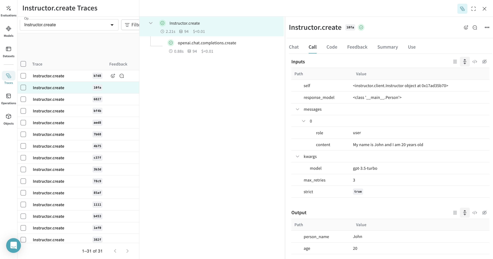
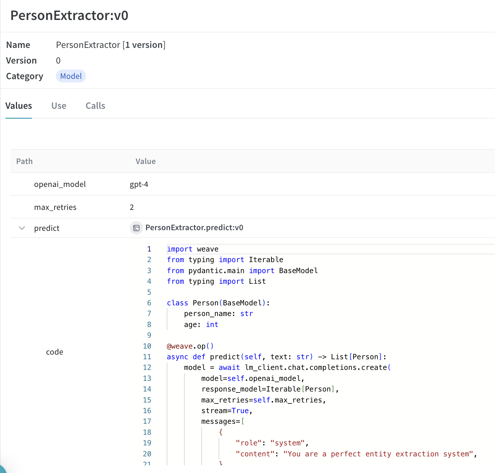
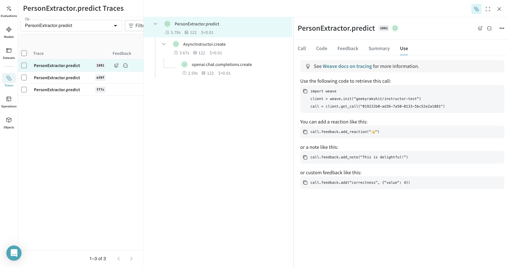

# Instructor

[Instructor](https://python.useinstructor.com/) is a lightweight library that makes it easy to get structured data like JSON from LLMs.

## Tracing

It’s important to store traces of language model applications in a central location, both during development and in production. These traces can be useful for debugging, and as a dataset that will help you improve your application.

Weave will automatically capture traces for [Instructor](https://python.useinstructor.com/). To start tracking, calling `weave.init(project_name="<YOUR-WANDB-PROJECT-NAME>")` and use the library as normal.

```python
import instructor
import weave
from pydantic import BaseModel
from openai import OpenAI


# Define your desired output structure
class UserInfo(BaseModel):
    user_name: str
    age: int

# Initialize Weave
weave.init(project_name="instructor-test")

# Patch the OpenAI client
client = instructor.from_openai(OpenAI())

# Extract structured data from natural language
user_info = client.chat.completions.create(
    model="gpt-3.5-turbo",
    response_model=UserInfo,
    messages=[{"role": "user", "content": "John Doe is 30 years old."}],
)
```

|                                                                         |
|-----------------------------------------------------------------------------------------------------------------------|
| Weave will now track and log all LLM calls made using Instructor. You can view the traces in the Weave web interface. |

## Track your own ops

Wrapping a function with `@weave.op` starts capturing inputs, outputs and app logic so you can debug how data flows through your app. You can deeply nest ops and build a tree of functions that you want to track. This also starts automatically versioning code as you experiment to capture ad-hoc details that haven't been committed to git.

Simply create a function decorated with [`@weave.op`](/guides/tracking/ops).

In the example below, we have the function `extract_person` which is the metric function wrapped with `@weave.op`. This helps us see how intermediate steps, such as OpenAI chat completion call.

```python
import instructor
import weave
from openai import OpenAI
from pydantic import BaseModel


# Define your desired output structure
class Person(BaseModel):
    person_name: str
    age: int


# Initialize Weave
weave.init(project_name="instructor-test")

# Patch the OpenAI client
lm_client = instructor.from_openai(OpenAI())


# Extract structured data from natural language
@weave.op()
def extract_person(text: str) -> Person:
    return lm_client.chat.completions.create(
        model="gpt-3.5-turbo",
        messages=[
            {"role": "user", "content": text},
        ],
        response_model=Person,
    )


person = extract_person("My name is John and I am 20 years old")
```

|  |
|---|
| Decorating the `extract_person` function with `@weave.op` traces its inputs, outputs, and all internal LM calls made inside the function. Weave also automatically tracks and versions the structured objects generated by Instructor. |

## Create a `Model` for easier experimentation

Organizing experimentation is difficult when there are many moving pieces. By using the [`Model`](../core-types/models) class, you can capture and organize the experimental details of your app like your system prompt or the model you're using. This helps organize and compare different iterations of your app. 

In addition to versioning code and capturing inputs/outputs, [`Model`](../core-types/models)s capture structured parameters that control your application’s behavior, making it easy to find what parameters worked best. You can also use Weave Models with `serve` (see below), and [`Evaluation`](../core-types/evaluations.md)s.

In the example below, you can experiment with `PersonExtractor`. Every time you change one of these, you'll get a new _version_ of `PersonExtractor`.

```python
import asyncio
from typing import List, Iterable

import instructor
import weave
from openai import AsyncOpenAI
from pydantic import BaseModel


# Define your desired output structure
class Person(BaseModel):
    person_name: str
    age: int


# Initialize Weave
weave.init(project_name="instructor-test")

# Patch the OpenAI client
lm_client = instructor.from_openai(AsyncOpenAI())


class PersonExtractor(weave.Model):
    openai_model: str
    max_retries: int

    @weave.op()
    async def predict(self, text: str) -> List[Person]:
        model = await lm_client.chat.completions.create(
            model=self.openai_model,
            response_model=Iterable[Person],
            max_retries=self.max_retries,
            stream=True,
            messages=[
                {
                    "role": "system",
                    "content": "You are a perfect entity extraction system",
                },
                {
                    "role": "user",
                    "content": f"Extract `{text}`",
                },
            ],
        )
        return [m async for m in model]


model = PersonExtractor(openai_model="gpt-4", max_retries=2)
asyncio.run(model.predict("John is 30 years old"))
```

|  |
|---------------------------------------------------------------------------|
| Tracing and versioning your calls using a [`Model`](../core-types/models) |

## Serving a Weave Model

Given a weave reference a `weave.Model` object, you can spin up a fastapi server and [`serve`](https://wandb.github.io/weave/guides/tools/serve) it.

| [](https://wandb.ai/geekyrakshit/instructor-test/weave/objects/PersonExtractor/versions/xXpMsJvaiTOjKafz1TnHC8wMgH5ZAAwYOaBMvHuLArI) |
|----------------------------------------------------------------------------------------------------------------------------------------------------------------|
| You can find the weave reference of any `weave.Model` by navigating to the model and copying it from the UI.                                                      |

You can serve your model by using the following command in the terminal:

```shell
weave serve weave:///your_entity/project-name/YourModel:<hash>
```