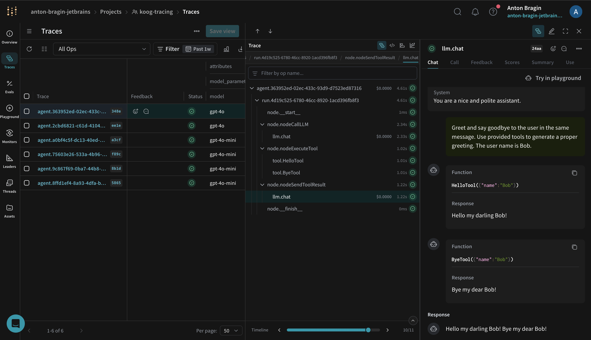

# Koog

[Koog](https://docs.koog.ai/) is a Kotlin-based framework for building single-run and complex workflow agents. Koog includes built-in OpenTelemetry (OTEL) support and can export traces directly to W&B Weave, giving you rich visibility into prompts, completions, tool calls, and end-to-end agent execution.

With the Weave exporter enabled, Koog forwards OpenTelemetry spans to your Weave project so you can debug, analyze performance, and iterate faster.



## Prerequisites

Set the following environment variables before running your agent:

```bash
export WEAVE_API_KEY="<your-api-key>"
export WEAVE_ENTITY="<your-entity>"           # your W&B team/entity
export WEAVE_PROJECT_NAME="koog-tracing"      # any project name; created on first use
```

## Install Koog (Gradle)

Add Koog to your Kotlin project (Kotlin DSL shown):

```kotlin
dependencies {
    implementation("ai.koog:koog-agents:LATEST_VERSION")
}
```

Learn more about installing Koog [here](https://docs.koog.ai/).

## Enable Weave export (OpenTelemetry)

Install Koog’s OpenTelemetry feature and add the Weave exporter. Doing so uses Weave’s OpenTelemetry endpoint under the hood and maps Koog spans to Weave traces.

If you’re new to the integration, start with the [Koog → Weave exporter guide](https://docs.koog.ai/opentelemetry-weave-exporter/) and skim Koog’s [OpenTelemetry support](https://docs.koog.ai/opentelemetry-support/) for core concepts, when wiring things up. To understand how Weave ingests OTLP data, see the [Weave OTEL docs](../tracking/otel.md)

Here's a simple example to understand how to use the `addWeaveExporter`:

```kotlin
fun main() = runBlocking {
    val apiKey = "api-key"
    val entity = System.getenv()["WEAVE_ENTITY"] ?: throw IllegalArgumentException("WEAVE_ENTITY is not set")
    val projectName = System.getenv()["WEAVE_PROJECT_NAME"] ?: "koog-tracing"

    val agent = AIAgent(
        executor = simpleOpenAIExecutor(apiKey),
        llmModel = OpenAIModels.CostOptimized.GPT4oMini,
        systemPrompt = "You are a code assistant. Provide concise code examples."
    ) {
        install(OpenTelemetry) {
            addWeaveExporter()
        }
    }

    println("Running agent with Weave tracing")

    val result = agent.run("Tell me a joke about programming")

    println("Result: $result\nSee traces on https://wandb.ai/$entity/$projectName/weave/traces")
}
```

### Advanced configuration

You can customize the Weave exporter via optional parameters (see [API reference](https://api.koog.ai/agents/agents-features/agents-features-opentelemetry/ai.koog.agents.features.opentelemetry.integration.weave/add-weave-exporter.html?query=fun%20OpenTelemetryConfig.addWeaveExporter(weaveOtelBaseUrl:%20String?%20=%20null,%20weaveEntity:%20String?%20=%20null,%20weaveProjectName:%20String?%20=%20null,%20weaveApiKey:%20String?%20=%20null,%20timeout:%20Duration%20=%2010.seconds)):

```kotlin
install(OpenTelemetry) {
    addWeaveExporter(
        weaveOtelBaseUrl = "https://trace.wandb.ai",
        weaveEntity = System.getenv()["WEAVE_ENTITY"],
        weaveProjectName = System.getenv()["WEAVE_PROJECT_NAME"],
        weaveApiKey = System.getenv()["WEAVE_API_KEY"],
        timeout = 10.seconds
    )
}
```

- Use `weaveEntity` and `weaveProjectName` to route traces to a specific team and project.
- If you are on a dedicated instance, set `weaveOtelBaseUrl` to your trace endpoint (for example, `https://<your-subdomain>.wandb.io/<path>`).

## What gets traced

When enabled, Koog’s Weave exporter captures the same spans as Koog’s general OTEL integration, including:

- Agent lifecycle events (start, stop, errors)
- LLM interactions (prompts, completions, token usage, latency)
- Tool and API calls (function calls and external requests)
- System context (model name, Koog version, environment metadata)

You can visualize these traces in the Weave UI to understand performance and quality. If you are new to tracing in Weave check out our [tracing overview](../tracking/tracing.mdx).

## Example notebook

For a runnable example that streams traces to Weave, see the Koog → Weave example notebook: [docs.koog.ai/examples/Weave](https://docs.koog.ai/examples/Weave/).

## Troubleshooting

- If traces are missing, first verify that `WEAVE_API_KEY`, `WEAVE_ENTITY`, and `WEAVE_PROJECT_NAME` are set correctly.
- Confirm your environment can reach `https://trace.wandb.ai` and that the exporter is configured as shown above.
- For deeper troubleshooting and sampling guidance, see Koog’s [OpenTelemetry support](https://docs.koog.ai/opentelemetry-support/).
