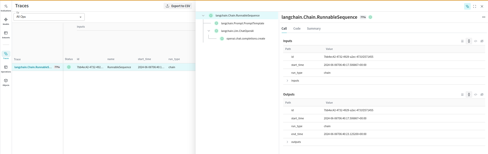
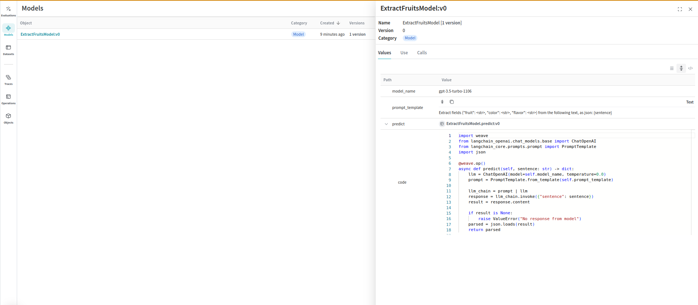
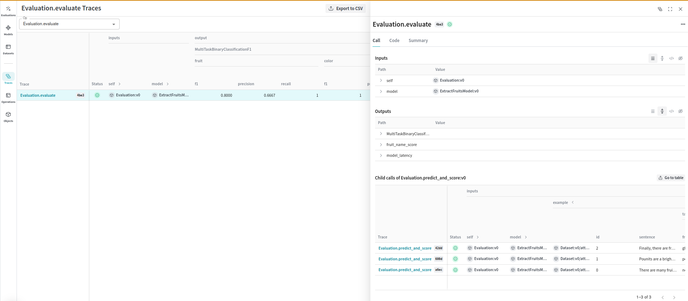

# LangChain

Weave is designed to make tracking and logging all calls made through the [LangChain Python library](https://github.com/langchain-ai/langchain) effortless.

When working with LLMs, debugging is inevitable. Whether a model call fails, an output is misformatted, or nested model calls create confusion, pinpointing issues can be challenging. LangChain applications often consist of multiple steps and LLM call invocations, making it crucial to understand the inner workings of your chains and agents.

Weave simplifies this process by automatically capturing traces for your [LangChain](https://python.langchain.com/v0.2/docs/introduction/) applications. This enables you to monitor and analyze your application's performance, making it easier to debug and optimize your LLM workflows.


## Getting Started

To get started, simply call `weave.init()` at the beginning of your script. The argument in weave.init() is a project name that will help you organize your traces.

```python
import weave
from langchain_core.prompts import PromptTemplate
from langchain_openai import ChatOpenAI

# Initialize Weave with your project name
# highlight-next-line
weave.init("langchain_demo")

llm = ChatOpenAI()
prompt = PromptTemplate.from_template("1 + {number} = ")

llm_chain = prompt | llm

output = llm_chain.invoke({"number": 2})

print(output)
```

## Traces

Storing traces of LLM applications in a central database is crucial during both development and production. These traces are essential for debugging and improving your application by providing a valuable dataset.

Weave automatically captures traces for your LangChain applications. It will track and log all calls made through the LangChain library, including prompt templates, chains, LLM calls, tools, and agent steps. You can view the traces in the Weave web interface.

[](https://wandb.ai/parambharat/langchain_demo/weave/calls)

## Manually Tracing Calls

In addition to automatic tracing, you can manually trace calls using the `WeaveTracer` callback or the `weave_tracing_enabled` context manager. These methods are akin to using request callbacks in individual parts of a LangChain application.

**Note:** Weave traces Langchain Runnables by default and this is enabled when you call `weave.init()`. You can disable this behaviour by setting the environment variable `WEAVE_TRACE_LANGCHAIN` to `"false"` before calling `weave.init()`. This allows you to control the tracing behaviour of specific chains or even individual requests in your application.

### Using `WeaveTracer`

You can pass the `WeaveTracer` callback to individual LangChain components to trace specific requests.

```python
import os

os.environ["WEAVE_TRACE_LANGCHAIN"] = "false" # <- explicitly disable global tracing.

from weave.integrations.langchain import WeaveTracer
from langchain_core.prompts import PromptTemplate
from langchain_openai import ChatOpenAI
import weave

# Initialize Weave with your project name
# highlight-next-line
weave.init("langchain_demo")  # <-- we don't enable tracing here because the env var is explicitly set to `false`

# highlight-next-line
weave_tracer = WeaveTracer()

# highlight-next-line
config = {"callbacks": [weave_tracer]}

llm = ChatOpenAI()
prompt = PromptTemplate.from_template("1 + {number} = ")

llm_chain = prompt | llm

# highlight-next-line
output = llm_chain.invoke({"number": 2}, config=config) # <-- this enables tracing only for this chain invoke.

llm_chain.invoke({"number": 4})  # <-- this will not have tracing enabled for langchain calls but openai calls will still be traced
```

### Using `weave_tracing_enabled` Context Manager

Alternatively, you can use the `weave_tracing_enabled` context manager to enable tracing for specific blocks of code.

```python
import os

os.environ["WEAVE_TRACE_LANGCHAIN"] = "false" # <- explicitly disable global tracing.

from weave.integrations.langchain import weave_tracing_enabled
from langchain_core.prompts import PromptTemplate
from langchain_openai import ChatOpenAI
import weave

# Initialize Weave with your project name
# highlight-next-line
weave.init("langchain_demo")  # <-- we don't enable tracing here because the env var is explicitly set to `false`

llm = ChatOpenAI()
prompt = PromptTemplate.from_template("1 + {number} = ")

llm_chain = prompt | llm

# highlight-next-line
with weave_tracing_enabled():  # <-- this enables tracing only for this chain invoke.
    output = llm_chain.invoke({"number": 2})


llm_chain.invoke({"number": 4})  # <-- this will not have tracing enabled for langchain calls but openai calls will still be traced
```

## Configuration

Upon calling `weave.init`, tracing is enabled by setting the environment variable `WEAVE_TRACE_LANGCHAIN` to `"true"`. This allows Weave to automatically capture traces for your LangChain applications. If you wish to disable this behavior, set the environment variable to `"false"`.

## Relation to LangChain Callbacks

### Auto Logging

The automatic logging provided by `weave.init()` is similar to passing a constructor callback to every component in a LangChain application. This means that all interactions, including prompt templates, chains, LLM calls, tools, and agent steps, are tracked globally across your entire application.

### Manual Logging

The manual logging methods (`WeaveTracer` and `weave_tracing_enabled`) are similar to using request callbacks in individual parts of a LangChain application. These methods provide finer control over which parts of your application are traced:

- **Constructor Callbacks:** Applied to the entire chain or component, logging all interactions consistently.
- **Request Callbacks:** Applied to specific requests, allowing detailed tracing of particular invocations.

By integrating Weave with LangChain, you can ensure comprehensive logging and monitoring of your LLM applications, facilitating easier debugging and performance optimization.

For more detailed information, refer to the [LangChain documentation](https://python.langchain.com/v0.2/docs/how_to/debugging/#tracing).

## Models and Evaluations

Organizing and evaluating LLMs in applications for various use cases is challenging with multiple components, such as prompts, model configurations, and inference parameters. Using the [`weave.Model`](/guides/core-types/models), you can capture and organize experimental details like system prompts or the models you use, making it easier to compare different iterations.

The following example demonstrates wrapping a Langchain chain in a `WeaveModel`:

```python
import json
import asyncio

import weave

from langchain_core.prompts import PromptTemplate
from langchain_openai import ChatOpenAI

# Initialize Weave with your project name
# highlight-next-line
weave.init("langchain_demo")

# highlight-next-line
class ExtractFruitsModel(weave.Model):
    model_name: str
    prompt_template: str

# highlight-next-line
    @weave.op()
    async def predict(self, sentence: str) -> dict:
        llm = ChatOpenAI(model=self.model_name, temperature=0.0)
        prompt = PromptTemplate.from_template(self.prompt_template)

        llm_chain = prompt | llm
        response = llm_chain.invoke({"sentence": sentence})
        result = response.content

        if result is None:
            raise ValueError("No response from model")
        parsed = json.loads(result)
        return parsed

model = ExtractFruitsModel(
    model_name="gpt-3.5-turbo-1106",
    prompt_template='Extract fields ("fruit": <str>, "color": <str>, "flavor": <str>) from the following text, as json: {sentence}',
)
sentence = "There are many fruits that were found on the recently discovered planet Goocrux. There are neoskizzles that grow there, which are purple and taste like candy."

prediction = asyncio.run(model.predict(sentence))

# if you're in a Jupyter Notebook, run:
# prediction = await model.predict(sentence)

print(prediction)
```
This code creates a model that can be visualized in the Weave UI:

[](https://wandb.ai/parambharat/langchain_demo/weave/object-versions?filter=%7B%22baseObjectClass%22%3A%22Model%22%7D&peekPath=%2Fparambharat%2Flangchain_demo%2Fobjects%2FExtractFruitsModel%2Fversions%2FBeoL6WuCH8wgjy6HfmuBMyKzArETg1oAFpYaXZSq1hw%3F%26)


You can also use Weave Models with `serve`, and [`Evaluations`](/guides/core-types/evaluations).

### Evaluations
Evaluations help you measure the performance of your models. By using the [`weave.Evaluation`](/guides/core-types/evaluations) class, you can capture how well your model performs on specific tasks or datasets, making it easier to compare different models and iterations of your application. The following example demonstrates how to evaluate the model we created:


```python

from weave.flow.scorer import MultiTaskBinaryClassificationF1

sentences = [
    "There are many fruits that were found on the recently discovered planet Goocrux. There are neoskizzles that grow there, which are purple and taste like candy.",
    "Pounits are a bright green color and are more savory than sweet.",
    "Finally, there are fruits called glowls, which have a very sour and bitter taste which is acidic and caustic, and a pale orange tinge to them.",
]
labels = [
    {"fruit": "neoskizzles", "color": "purple", "flavor": "candy"},
    {"fruit": "pounits", "color": "bright green", "flavor": "savory"},
    {"fruit": "glowls", "color": "pale orange", "flavor": "sour and bitter"},
]
examples = [
    {"id": "0", "sentence": sentences[0], "target": labels[0]},
    {"id": "1", "sentence": sentences[1], "target": labels[1]},
    {"id": "2", "sentence": sentences[2], "target": labels[2]},
]

@weave.op()
def fruit_name_score(target: dict, model_output: dict) -> dict:
    return {"correct": target["fruit"] == model_output["fruit"]}


evaluation = weave.Evaluation(
    dataset=examples,
    scorers=[
        MultiTaskBinaryClassificationF1(class_names=["fruit", "color", "flavor"]),
        fruit_name_score,
    ],
)
scores = asyncio.run(evaluation.evaluate(model)))
# if you're in a Jupyter Notebook, run:
# scores = await evaluation.evaluate(model)

print(scores)
```

This code generates an evaluation trace that can be visualized in the Weave UI:

[](https://wandb.ai/parambharat/langchain_demo/weave/calls?filter=%7B%22traceRootsOnly%22%3Atrue%7D&peekPath=%2Fparambharat%2Flangchain_demo%2Fcalls%2F44c3f26c-d9d3-423e-b434-651ea5174be3)

By integrating Weave with Langchain, you can ensure comprehensive logging and monitoring of your LLM applications, facilitating easier debugging and performance optimization.


## Known Issues

- **Tracing Async Calls** - A bug in the implementation of the `AsyncCallbackManager` in Langchain results in async calls not being traced in the correct order. We have filed a [PR](https://github.com/langchain-ai/langchain/pull/23909) to fix this. Therefore, the order of calls in the trace may not be accurate when using `ainvoke`, `astream` and `abatch` methods in Langchain Runnables.
