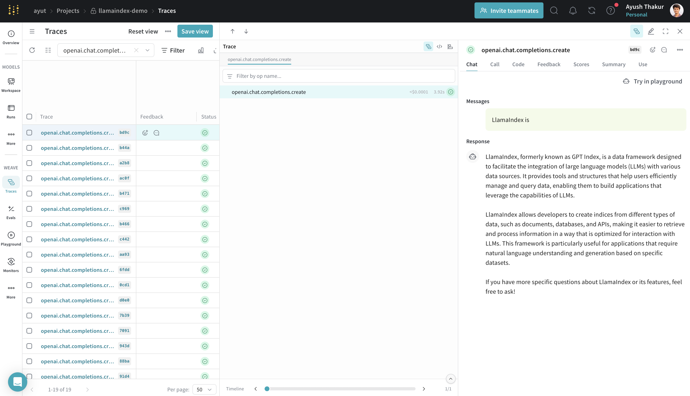
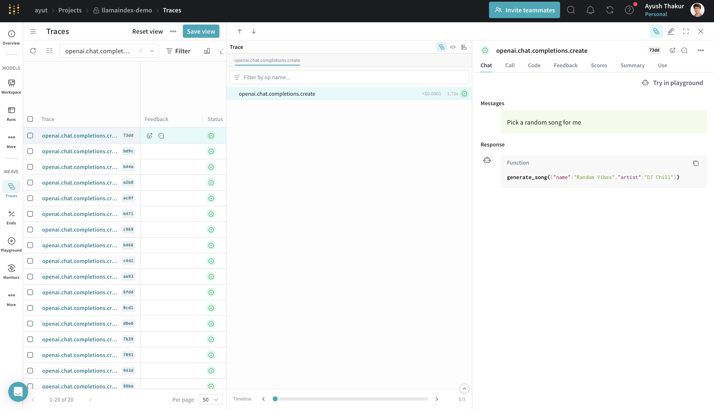
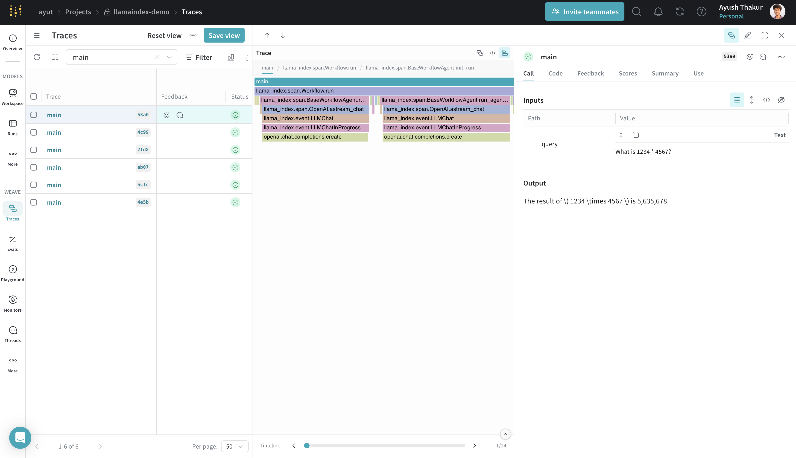
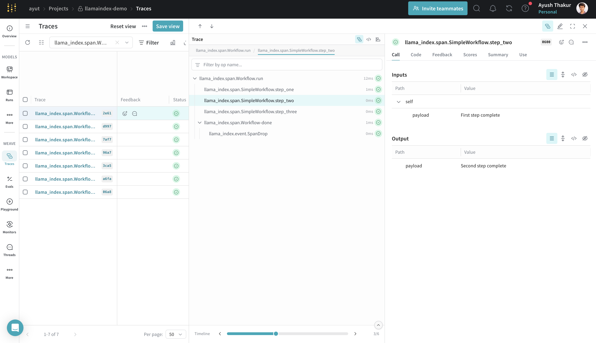
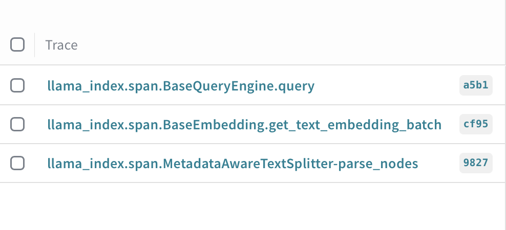
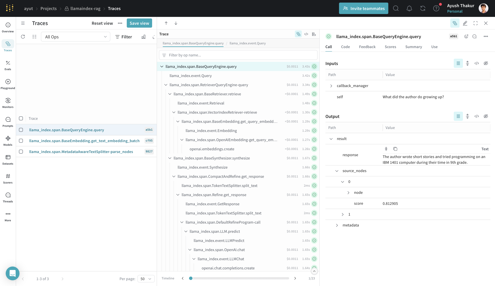
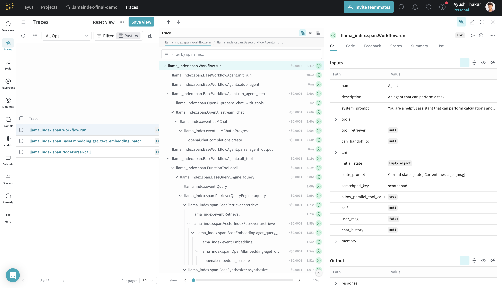

# LlamaIndex

Weave integrates with [LlamaIndex](https://docs.llamaindex.ai/en/stable/), a powerful framework for building LLM-driven applications like RAG systems, chatbots, and agents.

Using [LlamaIndex’s instrumentation system](https://docs.llamaindex.ai/en/stable/module_guides/observability/instrumentation/), the Weave integration automatically captures:

- _Execution time_: Duration of each operation
- _Token usage_: Input and output token counts
- _Cost tracking_: Estimated costs for API calls
- _Inputs and outputs_: Full request and response data
- _Error handling_: Detailed error traces and stack traces
- _Nested operations_: Complete trace hierarchy showing parent-child relationships
- _Streaming data_: Accumulated streaming responses

All trace data is viewable in the Weave UI, making it easy to debug and optimize your LlamaIndex applications.

For a basic usage example, see [Get started](#get-started). For more examples demonstrating advanced usage, see [Advanced usage](#advanced-usage) and the [Complete example: Tracking agents](#complete-example-tracking-agents).

## Get started

To get started, call `weave.init()` in your LLM application. The integration will begin tracing all LlamaIndex operations automatically.

The example below initializes a Weave project `llamaindex-demo`, sends a prompt to `gpt-4o-mini`, and prints the result.

```python
import weave
from llama_index.llms.openai import OpenAI

# Initialize Weave with your project name
weave.init("llamaindex-demo")

# All LlamaIndex operations are now automatically traced
llm = OpenAI(model="gpt-4o-mini")
response = llm.complete("William Shakespeare is ")
print(response)
```



Next, try out the examples in [Advanced usage](#advanced-usage).

## Advanced usage

The examples below demonstrate more advanced LlamaIndex features, including streaming, chat, tool calling, and workflows. Each example includes a short description of what it does and how Weave traces it.

### Synchronous and asynchronous completions

Use these methods to get text completions either synchronously or with `await`. Weave traces both methods.

```python
import weave
from llama_index.llms.openai import OpenAI

weave.init("llamaindex-demo")

llm = OpenAI(model="gpt-4o-mini")

# Synchronous completion
response = llm.complete("William Shakespeare is ")
print(response)

# Asynchronous completion
response = await llm.acomplete("William Shakespeare is ")
print(response)
```

### Streaming operations

LlamaIndex supports streaming token output from completions. Weave captures the token stream for both sync and async modes.

```python
import weave
from llama_index.llms.openai import OpenAI

weave.init("llamaindex-demo")

llm = OpenAI(model="gpt-4o-mini")

# Synchronous streaming
handle = llm.stream_complete("William Shakespeare is ")
for token in handle:
    print(token.delta, end="", flush=True)

# Asynchronous streaming
handle = await llm.astream_complete("William Shakespeare is ")
async for token in handle:
    print(token.delta, end="", flush=True)
```

### Chat interface

The chat interface allows for back-and-forth message exchanges. This is useful for building assistants or more interactive experiences. Weave traces all chat interactions.

```python
import weave
from llama_index.llms.openai import OpenAI
from llama_index.core.llms import ChatMessage

weave.init("llamaindex-demo")

llm = OpenAI(model="gpt-4o-mini")
messages = [
    ChatMessage(role="system", content="You are a helpful assistant."),
    ChatMessage(role="user", content="Tell me a joke."),
]

# Synchronous chat
response = llm.chat(messages)
print(response)

# Asynchronous chat
response = await llm.achat(messages)
print(response)

# Streaming chat
handle = llm.stream_chat(messages)
for token in handle:
    print(token.delta, end="", flush=True)
```

### Tool calling

Tool calling is commonly used when building agents and workflows. Weave automatically traces each tool call and its result.

```python
import weave
from pydantic import BaseModel
from llama_index.core.tools import FunctionTool
from llama_index.llms.openai import OpenAI

weave.init("llamaindex-demo")

class Song(BaseModel):
    name: str
    artist: str

def generate_song(name: str, artist: str) -> Song:
    return Song(name=name, artist=artist)

tool = FunctionTool.from_defaults(fn=generate_song)
llm = OpenAI(model="gpt-4o-mini")

response = llm.predict_and_call([tool], "Pick a random song for me")
print(response)
```



### Tracking agents

Agents in LlamaIndex use LLMs and tools to solve tasks. They can ask clarifying questions or call functions repeatedly. Weave captures every step in the flow.

```python
import asyncio
import weave
from llama_index.core.agent.workflow import FunctionAgent
from llama_index.llms.openai import OpenAI
from llama_index.core.memory import ChatMemoryBuffer

weave.init("llamaindex-demo")

def multiply(a: float, b: float) -> float:
    return a * b

agent = FunctionAgent(
    tools=[multiply],
    llm=OpenAI(model="gpt-4o-mini"),
    system_prompt="You are a helpful assistant that can multiply two numbers.",
)

memory = ChatMemoryBuffer.from_defaults(token_limit=40000)

@weave.op()
async def main(query: str):
    response = await agent.run(query, memory=memory)
    return str(response)

if __name__ == "__main__":
    response = asyncio.run(main("What is 1234 * 4567?"))
    print(response)
```

The `@weave.op()` decorator wraps the `main()` function so it can be traced in Weave. This helps capture custom async workflows clearly in the trace tree.



### Workflows

LlamaIndex workflows use event-based steps to build structured execution logic. Weave traces each step and the data passed between them.

```python
import weave
from llama_index.core.workflow import (
    StartEvent,
    StopEvent,
    Workflow,
    step,
    Event,
)

weave.init("llamaindex-demo")

class FirstEvent(Event):
    payload: str

class SecondEvent(Event):
    payload: str

class SimpleWorkflow(Workflow):
    @step
    async def step_one(self, ev: StartEvent) -> FirstEvent:
        return FirstEvent(payload="First step complete")

    @step
    async def step_two(self, ev: FirstEvent) -> SecondEvent:
        return SecondEvent(payload="Second step complete")

    @step
    async def step_three(self, ev: SecondEvent) -> StopEvent:
        return StopEvent(result="Workflow complete")

workflow = SimpleWorkflow(timeout=10, verbose=False)
result = await workflow.run(first_input="Start the workflow")
print(result)
```

Weave traces each event and transition, which is useful for debugging multi-step flows with conditionals, branches, or loops.



### RAG pipelines

RAG (Retrieval Augmented Generation) pipelines use LLMs with external context. This example loads documents, builds an index, and queries it. Weave traces the parsing, indexing, and querying stages.

```python
import weave
from llama_index.core import VectorStoreIndex, SimpleDirectoryReader
from llama_index.core.node_parser import SentenceSplitter
from llama_index.llms.openai import OpenAI

weave.init("llamaindex-demo")

# Load and process documents
documents = SimpleDirectoryReader("data").load_data()
parser = SentenceSplitter()
nodes = parser.get_nodes_from_documents(documents)

# Create index and query engine
index = VectorStoreIndex(nodes)
query_engine = index.as_query_engine()

# Query the documents
response = query_engine.query("What did the author do growing up?")
print(response)
```

Weave shows separate traces for node parsing, index creation, and querying. To view all steps under a single trace, wrap the logic in a `@weave.op()` function. Note that parsing and indexing are typically one-time setup steps.




## Complete example: Tracking agents

This end-to-end example shows how to combine a document search tool and a math tool in a single agent. Weave traces the full interaction, including tool calls and the final response.

```python
import weave
from llama_index.core import VectorStoreIndex, SimpleDirectoryReader
from llama_index.core.agent.workflow import FunctionAgent
from llama_index.llms.openai import OpenAI

weave.init("llamaindex-demo")

# Create a RAG tool
documents = SimpleDirectoryReader("data").load_data()
index = VectorStoreIndex.from_documents(documents)
query_engine = index.as_query_engine()

def multiply(a: float, b: float) -> float:
    return a * b

async def search_documents(query: str) -> str:
    response = await query_engine.aquery(query)
    return str(response)

# Create an agent with both tools
agent = FunctionAgent(
    tools=[multiply, search_documents],
    llm=OpenAI(model="gpt-4o-mini"),
    system_prompt="""You are a helpful assistant that can perform calculations
    and search through documents to answer questions.""",
)

response = await agent.run(
    "What did the author do in college? Also, what's 7 * 8?"
)
print(response)
```

This combines retrieval and arithmetic tasks. Weave traces the question routing, tool invocations, and agent response timeline.


