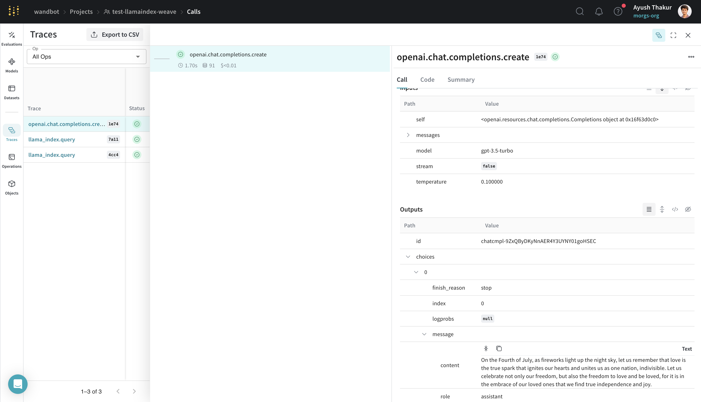
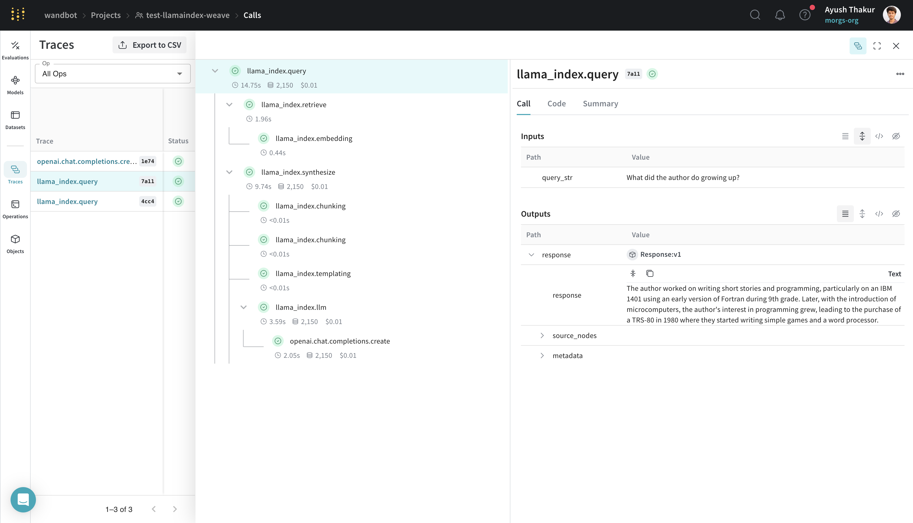
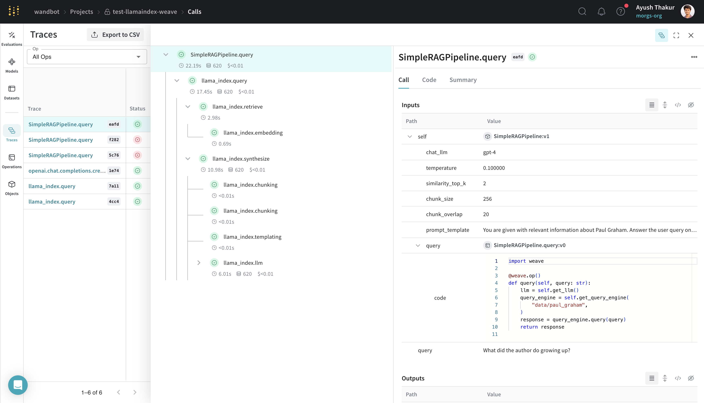
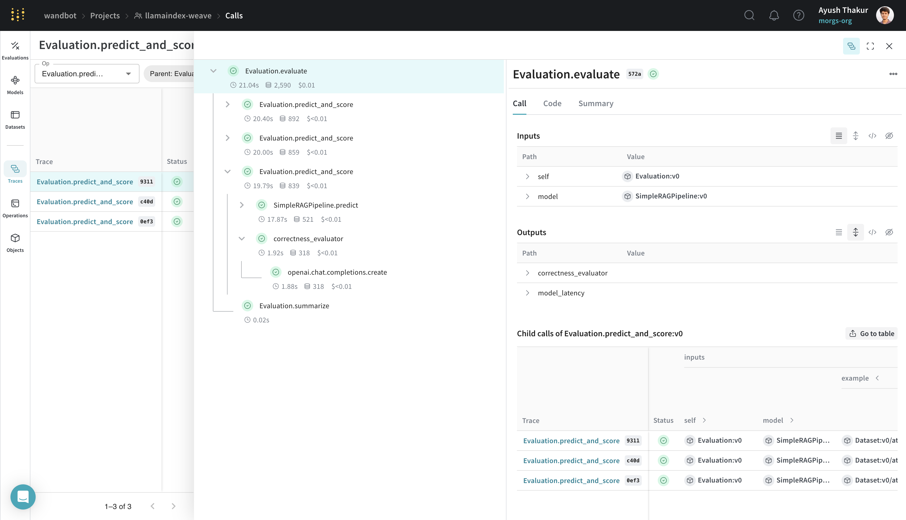

# LlamaIndex

Weave is designed to simplify the tracking and logging of all calls made through the [LlamaIndex Python library](https://github.com/run-llama/llama_index).

When working with LLMs, debugging is inevitable. Whether a model call fails, an output is misformatted, or nested model calls create confusion, pinpointing issues can be challenging. [LlamaIndex](https://docs.llamaindex.ai/en/stable/) applications often consist of multiple steps and LLM call invocations, making it crucial to understand the inner workings of your chains and agents.

Weave simplifies this process by automatically capturing traces for your LlamaIndex applications. This enables you to monitor and analyze your application's performance, making it easier to debug and optimize your LLM workflows. Weave also helps with your evaluation workflows.

## Getting Started

To get started, simply call `weave.init()` at the beginning of your script. The argument in `weave.init()` is a project name that will help you organize your traces.

```python
import weave
from llama_index.core.chat_engine import SimpleChatEngine

# Initialize Weave with your project name
# highlight-next-line
weave.init("llamaindex_demo")

chat_engine = SimpleChatEngine.from_defaults()
response = chat_engine.chat(
    "Say something profound and romantic about fourth of July"
)
print(response)
```

In the example above, we are creating a simple LlamaIndex chat engine which under the hood is making an OpenAI call. Check out the trace below:

[](https://wandb.ai/wandbot/test-llamaindex-weave/weave/calls/b6b5d898-2df8-4e14-b553-66ce84661e74)

## Tracing

LlamaIndex is known for its ease of connecting data with LLM. A simple RAG application requires an embedding step, retrieval step and a response synthesis step. With the increasing complexity, it becomes important to store traces of individual steps in a central database during both development and production.

These traces are essential for debugging and improving your application. Weave automatically tracks all calls made through the LlamaIndex library, including prompt templates, LLM calls, tools, and agent steps. You can view the traces in the Weave web interface.

Below is an example of a simple RAG pipeline from LlamaIndex's [Starter Tutorial (OpenAI)](https://docs.llamaindex.ai/en/stable/getting_started/starter_example/):

```python
import weave
from llama_index.core import VectorStoreIndex, SimpleDirectoryReader

# Initialize Weave with your project name
# highlight-next-line
weave.init("llamaindex_demo")

# Assuming you have a `.txt` file in the `data` directory
documents = SimpleDirectoryReader("data").load_data()
index = VectorStoreIndex.from_documents(documents)

query_engine = index.as_query_engine()
response = query_engine.query("What did the author do growing up?")
print(response)
```

The trace timeline not only captures the "events" but it also capture the execution time, cost and token counts where applicable. Drill down the trace to see the inputs and outputs of each step.

[](https://wandb.ai/wandbot/test-llamaindex-weave/weave/calls?filter=%7B%22traceRootsOnly%22%3Atrue%7D&peekPath=%2Fwandbot%2Ftest-llamaindex-weave%2Fcalls%2F6ac53407-1bb7-4c38-b5a3-c302bd877a11%3Ftracetree%3D1)

## One-click observability 🔭

LlamaIndex provides [one-click observability 🔭](https://docs.llamaindex.ai/en/stable/module_guides/observability/) to allow you to build principled LLM applications in a production setting.

Our integration leverages this capability of LlamaIndex and automatically sets [`WeaveCallbackHandler()`](https://github.com/wandb/weave/blob/master/weave/integrations/llamaindex/llamaindex.py) to `llama_index.core.global_handler`. Thus as a user of LlamaIndex and Weave all you need to do is initialize a Weave run - `weave.init(<name-of-project>)`

## Create a `Model` for easier experimentation

Organizing and evaluating LLMs in applications for various use cases is challenging with multiple components, such as prompts, model configurations, and inference parameters. Using the [`weave.Model`](/guides/core-types/models), you can capture and organize experimental details like system prompts or the models you use, making it easier to compare different iterations.

The following example demonstrates building a LlamaIndex query engine in a `WeaveModel`, using data that can be found in the [weave/data](https://github.com/wandb/weave/tree/master/data) folder:

```python
import weave

from llama_index.core import VectorStoreIndex, SimpleDirectoryReader
from llama_index.core.node_parser import SentenceSplitter
from llama_index.llms.openai import OpenAI
from llama_index.core import PromptTemplate


PROMPT_TEMPLATE = """
You are given with relevant information about Paul Graham. Answer the user query only based on the information provided. Don't make up stuff.

User Query: {query_str}
Context: {context_str}
Answer:
"""

# highlight-next-line
class SimpleRAGPipeline(weave.Model):
    chat_llm: str = "gpt-4"
    temperature: float = 0.1
    similarity_top_k: int = 2
    chunk_size: int = 256
    chunk_overlap: int = 20
    prompt_template: str = PROMPT_TEMPLATE

    def get_llm(self):
        return OpenAI(temperature=self.temperature, model=self.chat_llm)

    def get_template(self):
        return PromptTemplate(self.prompt_template)

    def load_documents_and_chunk(self, data):
        documents = SimpleDirectoryReader(data).load_data()
        splitter = SentenceSplitter(
            chunk_size=self.chunk_size,
            chunk_overlap=self.chunk_overlap,
        )
        nodes = splitter.get_nodes_from_documents(documents)
        return nodes

    def get_query_engine(self, data):
        nodes = self.load_documents_and_chunk(data)
        index = VectorStoreIndex(nodes)

        llm = self.get_llm()
        prompt_template = self.get_template()

        return index.as_query_engine(
            similarity_top_k=self.similarity_top_k,
            llm=llm,
            text_qa_template=prompt_template,
        )

# highlight-next-line
    @weave.op()
    def predict(self, query: str):
        query_engine = self.get_query_engine(
            # This data can be found in the weave repo under data/paul_graham
            "data/paul_graham",
        )
        response = query_engine.query(query)
        return {"response": response.response}

# highlight-next-line
weave.init("test-llamaindex-weave")

rag_pipeline = SimpleRAGPipeline()
response = rag_pipeline.predict("What did the author do growing up?")
print(response)
```

This `SimpleRAGPipeline` class subclassed from `weave.Model` organizes the important parameters for this RAG pipeline. Decorating the `query` method with `weave.op()` allows for tracing.

[](https://wandb.ai/wandbot/test-llamaindex-weave/weave/calls?filter=%7B%22traceRootsOnly%22%3Atrue%7D&peekPath=%2Fwandbot%2Ftest-llamaindex-weave%2Fcalls%2Fa82afbf4-29a5-43cd-8c51-603350abeafd%3Ftracetree%3D1)

## Doing Evaluation with `weave.Evaluation`

Evaluations help you measure the performance of your applications. By using the [`weave.Evaluation`](/guides/core-types/evaluations) class, you can capture how well your model performs on specific tasks or datasets, making it easier to compare different models and iterations of your application. The following example demonstrates how to evaluate the model we created:

```python
import asyncio
from llama_index.core.evaluation import CorrectnessEvaluator

eval_examples = [
    {
        "id": "0",
        "query": "What programming language did Paul Graham learn to teach himself AI when he was in college?",
        "ground_truth": "Paul Graham learned Lisp to teach himself AI when he was in college.",
    },
    {
        "id": "1",
        "query": "What was the name of the startup Paul Graham co-founded that was eventually acquired by Yahoo?",
        "ground_truth": "The startup Paul Graham co-founded that was eventually acquired by Yahoo was called Viaweb.",
    },
    {
        "id": "2",
        "query": "What is the capital city of France?",
        "ground_truth": "I cannot answer this question because no information was provided in the text.",
    },
]

llm_judge = OpenAI(model="gpt-4", temperature=0.0)
evaluator = CorrectnessEvaluator(llm=llm_judge)

# highlight-next-line
@weave.op()
def correctness_evaluator(query: str, ground_truth: str, model_output: dict):
    result = evaluator.evaluate(
        query=query, reference=ground_truth, response=model_output["response"]
    )
    return {"correctness": float(result.score)}

# highlight-next-line
evaluation = weave.Evaluation(dataset=eval_examples, scorers=[correctness_evaluator])

rag_pipeline = SimpleRAGPipeline()

# highlight-next-line
asyncio.run(evaluation.evaluate(rag_pipeline))
```

This evaluation builds on the example in the earlier section. Evaluating using `weave.Evaluation` requires an evaluation dataset, a scorer function and a `weave.Model`. Here are a few nuances about the three key components:

- Make sure that the keys of the evaluation sample dicts matches the arguments of the scorer function and of the `weave.Model`'s `predict` method.
- The `weave.Model` should have a method with the name `predict` or `infer` or `forward`. Decorate this method with `weave.op()` for tracing.
- The scorer function should be decorated with `weave.op()` and should have `model_output` as named argument.

[](https://wandb.ai/wandbot/llamaindex-weave/weave/calls?filter=%7B%22opVersionRefs%22%3A%5B%22weave%3A%2F%2F%2Fwandbot%2Fllamaindex-weave%2Fop%2FEvaluation.predict_and_score%3ANmwfShfFmgAhDGLXrF6Xn02T9MIAsCXBUcifCjyKpOM%22%5D%2C%22parentId%22%3A%2233491e66-b580-47fa-9d43-0cd6f1dc572a%22%7D&peekPath=%2Fwandbot%2Fllamaindex-weave%2Fcalls%2F33491e66-b580-47fa-9d43-0cd6f1dc572a%3Ftracetree%3D1)

By integrating Weave with LlamaIndex, you can ensure comprehensive logging and monitoring of your LLM applications, facilitating easier debugging and performance optimization using evaluation.
