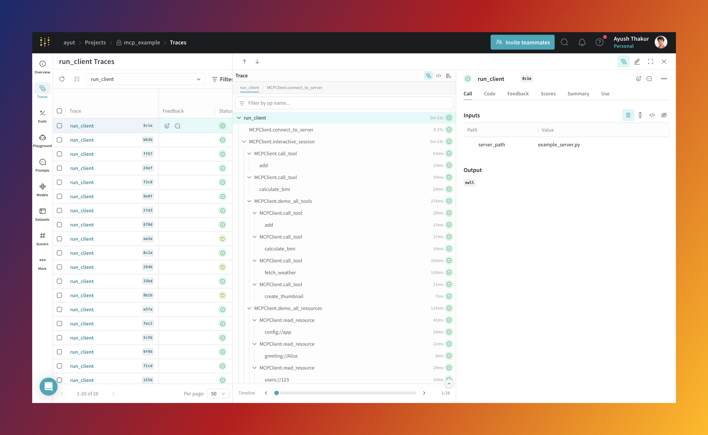

# Model Context Protocol (MCP) and Weave

<a target="_blank" href="https://colab.research.google.com/drive/174VzXlU5Qcgvjt4OoIWN-guTxJcOefAh?usp=sharing">
  
</a>

The Model Context Protocol (MCP) is a standardized communication protocol that enables AI applications to exchange information with large language models (LLMs). Similar to universal connectors that transformed hardware compatibility, MCP provides an interface for LLMs to access various data sources and interact with external tools, all without requiring custom integrations for each new service.

The Weave integration lets you trace activity between your MCP client and MCP server. It gives you detailed visibility into tool calls, resource access, and prompt generation across MCP-based systems.

## How it works

:::important
Currently, the integration captures client-side and server-side operations separately, but does not provide end-to-end visibility into their interaction. There's an ongoing proposal to add OpenTelemetry trace support to MCP to enable end-to-end observability. For more information, see [GitHub discussion #269](https://github.com/modelcontextprotocol/modelcontextprotocol/discussions/269).
:::

The Weave integration automatically traces key components of the Model Context Protocol (MCP) by patching core methods with the [`weave.op()`](../tracking/ops.md) decorator. Specifically, it patches methods in the [`mcp.server.fastmcp.FastMCP`](https://github.com/modelcontextprotocol/python-sdk/blob/b4c7db6a50a5c88bae1db5c1f7fba44d16eebc6e/src/mcp/server/fastmcp/server.py#L109) and [`mcp.ClientSession`](https://github.com/modelcontextprotocol/python-sdk/blob/b4c7db6a50a5c88bae1db5c1f7fba44d16eebc6e/src/mcp/client/session.py#L84) classes.

Through this integration, Weave traces the following MCP components:

- [Tools](https://modelcontextprotocol.io/docs/concepts/tools)
- [Resources](https://modelcontextprotocol.io/docs/concepts/resources)
- [Prompts](https://modelcontextprotocol.io/docs/concepts/prompts)

[](https://wandb.ai/ayut/mcp_example/weave/traces?filter=%7B%22opVersionRefs%22%3A%5B%22weave%3A%2F%2F%2Fayut%2Fmcp_example%2Fop%2Frun_client%3A*%22%5D%7D&peekPath=%2Fayut%2Fmcp_example%2Fcalls%2F01966bbe-cc5e-7012-b45f-bf10617d8c1e%3FhideTraceTree%3D0)


## Use the integration

The Weave integration works with both the MCP server and client. Once installed, you can enable tracing with just two additional lines of code—one to import `weave`, and another to initialize it.

### Prerequisites

Before you begin, install the required packages:

```bash
pip install -qq "mcp[cli]" weave
```

### Configuration

The MCP integration can be configured through environment variables:

- `MCP_TRACE_LIST_OPERATIONS`: Set to `true` to trace list operations (`list_tools`, `list_resources`, and `list_prompts`) on both server and client sides.

### Server-side integration

To trace an MCP server, add two lines to your existing `FastMCP` setup: one to import Weave and one to initialize the client. Once added, tool, resource, and prompt operations will be automatically traced.

```python
# Import Weave (required for tracing)
import weave
from mcp.server.fastmcp import FastMCP

# Initialize Weave with your project name
weave_client = weave.init("my-project")

# Set up the MCP server
mcp = FastMCP("Demo")

# Define a tool (this call will be traced)
@mcp.tool()
def add(a: int, b: int) -> int:
    """Add two numbers."""
    return a + b

# Define a resource (this call will be traced)
@mcp.resource("greeting://{name}")
def get_greeting(name: str) -> str:
    """Return a personalized greeting."""
    return f"Hello, {name}!"

# Define a prompt (this call will be traced)
@mcp.prompt()
def review_code(code: str) -> str:
    """Return a prompt for reviewing code."""
    return f"Please review this code:\n\n{code}"

# Start the server
mcp.run(transport="stdio")
```

### Client-side integration

On the client side, tracing also requires just two changes: import Weave and initialize it. All tool calls, resource accesses, and prompt requests will be traced automatically.

```python
# Import Weave (required for tracing)
import weave
from mcp import ClientSession, StdioServerParameters
from mcp.client.stdio import stdio_client

# Initialize Weave with your project name
weave_client = weave.init("my-project")

# Set up and run the MCP client
async with stdio_client(server_params) as (read, write):
    async with ClientSession(read, write) as session:
        # Initialize the session
        await session.initialize()
        
        # Call a tool (this will be traced)
        result = await session.call_tool("add", arguments={"a": 1, "b": 2})
        
        # Read a resource (this will be traced)
        resource = await session.read_resource("greeting://user")
        
        # Get a prompt (this will be traced)
        prompt = await session.get_prompt("review_code", arguments={"code": "print('Hello')"})
```

## Tutorial: `mcp_demo` example

The [`mcp_example`](https://github.com/wandb/weave/tree/master/examples/mcp_demo) demonstrates an integration between the Model Context Protocol (MCP) and Weave for tracing. It showcases how to instrument both the client and server components to capture detailed traces of their interactions. 

### Run the example

1. Clone the `weave` repository and navigate to the `mcp_demo` example:

   ```bash
   git clone https://github.com/wandb/weave
   cd weave/examples/mcp_demo
   ```

   The example includes two main files:

    - `example_server.py`: A demo MCP server built with `FastMCP`. It defines tools, resources, and prompts.
    - `example_client.py`: A client that connects to the server and interacts with its components.

2. Install the required dependencies manually:

   ```bash
   pip install mcp[cli] weave
   ```

3. Run the demo:

   ```bash
   python example_client.py example_server.py
   ```

   This command launches both the client and server. The client starts an interactive CLI where you can test various features.

### Client CLI commands

The client interface supports the following commands:

| Command               | Description                             |
|-----------------------|-----------------------------------------|
| `tools`              | List available tools                     |
| `resources`          | List available resources                 |
| `prompts`            | List available prompts                   |
| `add <a> <b>`        | Add two numbers                          |
| `bmi <weight> <height>` | Calculate Body Mass Index             |
| `weather <city>`     | Get weather data for a city              |
| `greeting <name>`    | Get a personalized greeting              |
| `user <id>`          | Retrieve a user profile                  |
| `config`             | Fetch app configuration                 |
| `code-review <code>` | Generate a code review prompt            |
| `debug <error>`      | Generate a debugging prompt              |
| `demo`               | Run a full demo of all available features. This will run each feature in sequence and produce a full trace timeline of interactions in the Weave UI. |
| `q`                  | Quit the session                         |

### Understanding the example

The `example_server.py` server defines the following:

- _Tools_: Functions such as `add()`, `calculate_bmi()`, `fetch_weather()`
- _Resources_: Endpoints like `greeting://{name}`, `config://app`, `users://{id}/profile`
- _Prompts_: Templates like `review_code()` and `debug_error()`

All server-side operations are automatically traced by Weave when you initialize the client with `weave.init()`.

The `example_client.py` client demonstrates how to:

- Connect to an MCP server
- Discover available tools, resources, and prompts
- Call tools with parameters
- Read from resource URIs
- Generate prompts with arguments
- Show usage of [`weave.op()`](../tracking/ops.md) with custom methods/functions.

Weave traces all client-side calls to provide a complete view of interactions between the client and server.

## FAQ

### Why is MCP tracing needed?

As an LLM application developer, you fall into one of three categories:

- _MCP server-side developer_: You want to expose multiple tools, resources, and prompts to the MCP client. You expose your existing application's tools, resources, etc., or you have built agents or have multiple agents orchestrated by an orchestrator agent. 

- _MCP client-side developer_: You want to plug your client-side application into multiple MCP servers. A core part of your client-side logic is making LLM calls to decide which tool to call or which resource to fetch.

- _MCP server and client developer_: You are developing both the server and the client.

If you fall into either of the first two categories, you want to know when each tool is called, what the execution flow looks like, the token count, and latency of different components in your server or client-side logic. 

If you are developing both the server and client, the ability to see a unified trace timeline can help you quickly iterate through both server and client-side logic.

In any case, an observability layer allows you to:

- Quickly iterate through your application
- Audit the workflow or execution logic
- Identify bottlenecks

