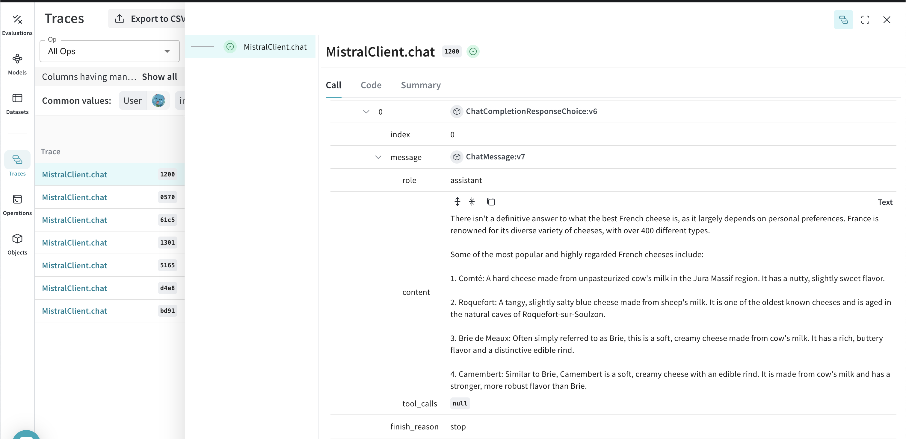
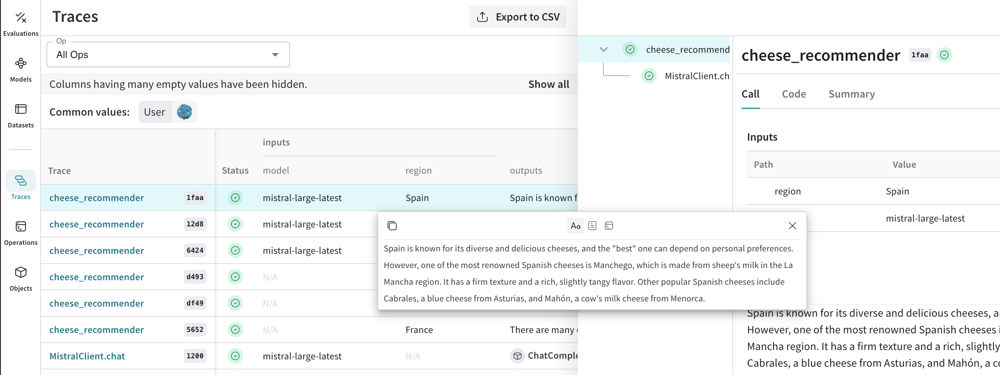
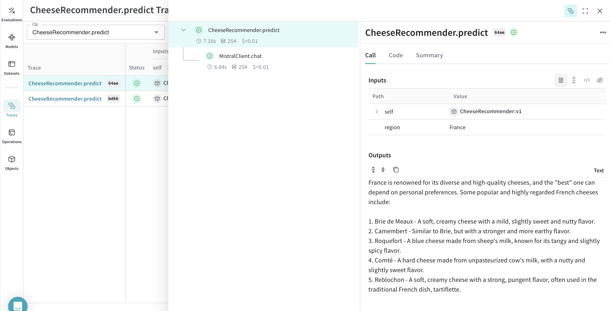

# MistralAI

Weave automatically tracks and logs LLM calls made via the [MistralAI Python library](https://github.com/mistralai/client-python).

## Traces

It’s important to store traces of LLM applications in a central database, both during development and in production. You’ll use these traces for debugging, and as a dataset that will help you improve your application.

Weave will automatically capture traces for [mistralai](https://github.com/mistralai/client-python). You can use the library as usual, start by calling `weave.init()`:

```python
import weave
weave.init("cheese_recommender")

# then use mistralai library as usual
import os
from mistralai.client import MistralClient
from mistralai.models.chat_completion import ChatMessage

api_key = os.environ["MISTRAL_API_KEY"]
model = "mistral-large-latest"

client = MistralClient(api_key=api_key)

messages = [
    ChatMessage(role="user", content="What is the best French cheese?")
]

chat_response = client.chat(
    model=model,
    messages=messages,
)
```

Weave will now track and log all LLM calls made through the MistralAI library. You can view the traces in the Weave web interface.

[](https://wandb.ai/capecape/mistralai_project/weave/calls)

## Wrapping with your own ops

Weave ops make results *reproducible* by automatically versioning code as you experiment, and they capture their inputs and outputs. Simply create a function decorated with [`@weave.op()`](/guides/tracking/ops) that calls into [`mistralai.client.MistralClient.chat()`](https://docs.mistral.ai/capabilities/completion/) and Weave will track the inputs and outputs for you. Let's see how we can do this for our cheese recommender:

```python
# highlight-next-line
@weave.op()
def cheese_recommender(region:str, model:str) -> str:
    "Recommend the best cheese in a given region"
    
    messages = [ChatMessage(role="user", content=f"What is the best cheese in {region}?")]

    chat_response = client.chat(
        model=model,
        messages=messages,
    )
    return chat_response.choices[0].message.content

cheese_recommender(region="France", model="mistral-large-latest")
cheese_recommender(region="Spain", model="mistral-large-latest")
cheese_recommender(region="Netherlands", model="mistral-large-latest")
```

[](https://wandb.ai/capecape/mistralai_project/weave/calls)

## Create a `Model` for easier experimentation

Organizing experimentation is difficult when there are many moving pieces. By using the [`Model`](/guides/core-types/models) class, you can capture and organize the experimental details of your app like your system prompt or the model you're using. This helps organize and compare different iterations of your app. 

In addition to versioning code and capturing inputs/outputs, [`Model`](/guides/core-types/models)s capture structured parameters that control your application’s behavior, making it easy to find what parameters worked best. You can also use Weave Models with `serve`, and [`Evaluation`](/guides/core-types/evaluations)s.

In the example below, you can experiment with `model` and `country`. Every time you change one of these, you'll get a new _version_ of `CheeseRecommender`. 

```python
import weave
import mistralai

weave.init("mistralai_project")

class CheeseRecommender(weave.Model): # Change to `weave.Model`
    model: str
    temperature: float

    @weave.op()
    def predict(self, region:str) -> str: # Change to `predict`
        "Recommend the best cheese in a given region"
        
        client = MistralClient()

        messages = [ChatMessage(
            role="user", 
            content=f"What is the best cheese in {region}?")]

        chat_response = client.chat(
            model=model,
            messages=messages,
            temperature=self.temperature
        )
        return chat_response.choices[0].message.content

cheese_model = CheeseRecommender(
    model="mistral-medium-latest",
    temperature=0.0
    )
result = cheese_model.predict(region="France")
print(result)
```

[](https://wandb.ai/capecape/mistralai_project/weave/models)
