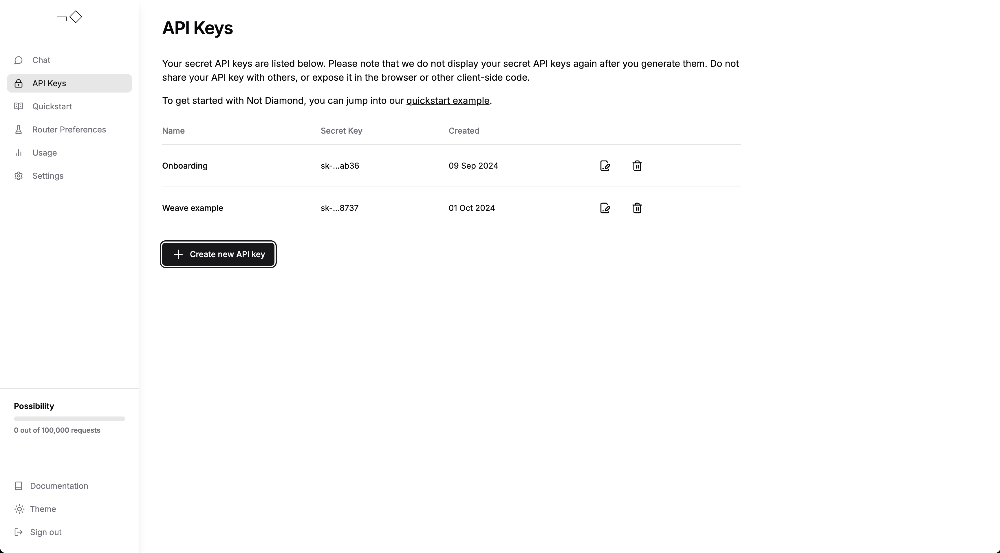

# Not Diamond ¬◇

When building complex LLM workflows users may need to prompt different models according to accuracy,
cost, or call latency. Users can use [Not Diamond][nd] to route prompts in these workflows to the
right model for their needs, helping maximize accuracy while saving on model costs.

## Getting started

Make sure you have [created an account][account] and [generated an API key][keys], then add your API
key to your env as `NOTDIAMOND_API_KEY`.

]

From here, you can

- try the [quickstart guide],
- [build a custom router][custom router] with W&B Weave and Not Diamond, or
- [chat with Not Diamond][chat] to see routing in action

## Tracing

Weave integrates with [Not Diamond's Python library][python] to [automatically log API calls][ops].
You only need to run `weave.init()` at the start of your workflow, then continue using the routed
provider as usual:

```python
from notdiamond import NotDiamond

import weave
weave.init('notdiamond-quickstart')

client = NotDiamond()
session_id, provider = client.chat.completions.model_select(
    messages=[
        {"role": "system", "content": "You are a helpful assistant."},
        {"role": "user", "content": "Concisely explain merge sort."}
    ],
    model=['openai/gpt-4o', 'anthropic/claude-3-5-sonnet-20240620']
)

print("LLM called: ", provider.provider)  # openai, anthropic, etc
print("Provider model: ", provider.model) # gpt-4o, claude-3-5-sonnet-20240620, etc
```

## Custom routing

You can also train your own [custom router] on [Evaluations][evals], allowing Not Diamond to route prompts
according to eval performance for specialized use cases.

Start by training a custom router:

```python
from weave.flow.eval import EvaluationResults
from weave.integrations.notdiamond.custom_router import train_router

# Build an Evaluation on gpt-4o and Claude 3.5 Sonnet
evaluation = weave.Evaluation(...)
gpt_4o = weave.Model(...)
sonnet = weave.Model(...)

model_evals = {
    'openai/gpt-4o': evaluation.get_eval_results(gpt_4o),
    'anthropic/claude-3-5-sonnet-20240620': evaluation.get_eval_results(sonnet),
}
preference_id = train_router(
    model_evals=model_evals,
    prompt_column="prompt",
    response_column="actual",
    language="en",
    maximize=True,
)
```

By reusing this preference ID in any `model_select` request, you can route your prompts
to maximize performance and minimize cost on your evaluation data:

```python
from notdiamond import NotDiamond
client = NotDiamond()

import weave
weave.init('notdiamond-quickstart')

session_id, provider = client.chat.completions.model_select(
    messages=[
        {"role": "system", "content": "You are a helpful assistant."},
        {"role": "user", "content": "Concisely explain merge sort."}
    ],
    model=['openai/gpt-4o', 'anthropic/claude-3-5-sonnet-20240620'],

    # passing this preference ID reuses your custom router
    preference_id=preference_id
)

print("LLM called: ", provider.provider)  # openai, anthropic, etc
print("Provider model: ", provider.model) # gpt-4o, claude-3-5-sonnet-20240620, etc
```

## Additional support

Visit the [docs] or [send us a message][support] for further support.

[account]: https://app.notdiamond.ai
[chat]: https://chat.notdiamond.ai
[custom router]: https://docs.notdiamond.ai/docs/router-training-quickstart
[docs]: https://docs.notdiamond.ai
[evals]: ../../guides/core-types/evaluations.md
[keys]: https://app.notdiamond.ai/keys
[nd]: https://www.notdiamond.ai/
[ops]: ../../guides/tracking/ops.md
[python]: https://github.com/Not-Diamond/notdiamond-python
[quickstart guide]: https://docs.notdiamond.ai/docs/quickstart
[support]: mailto:support@notdiamond.ai
