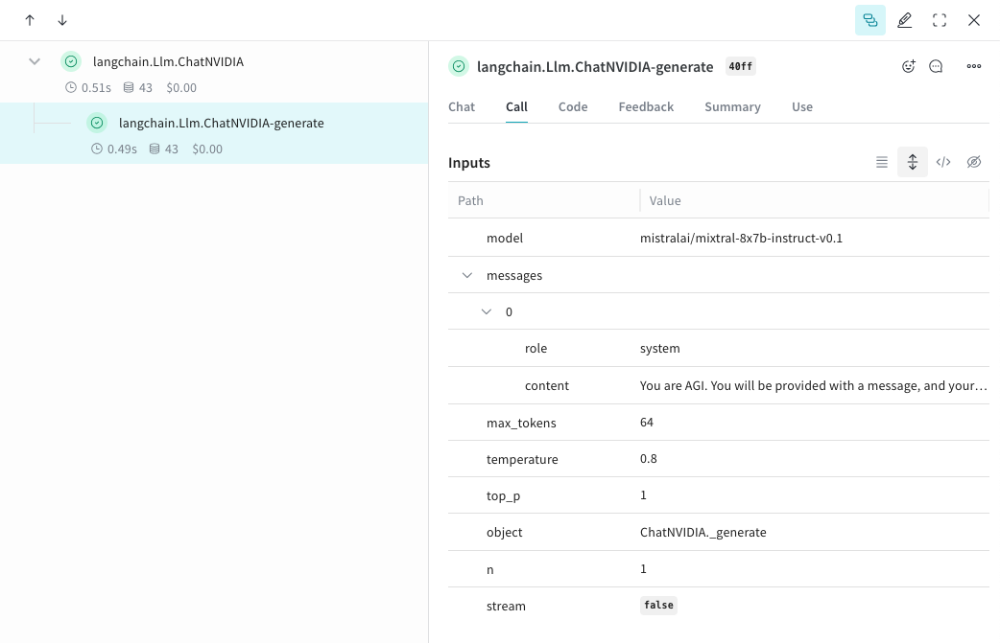
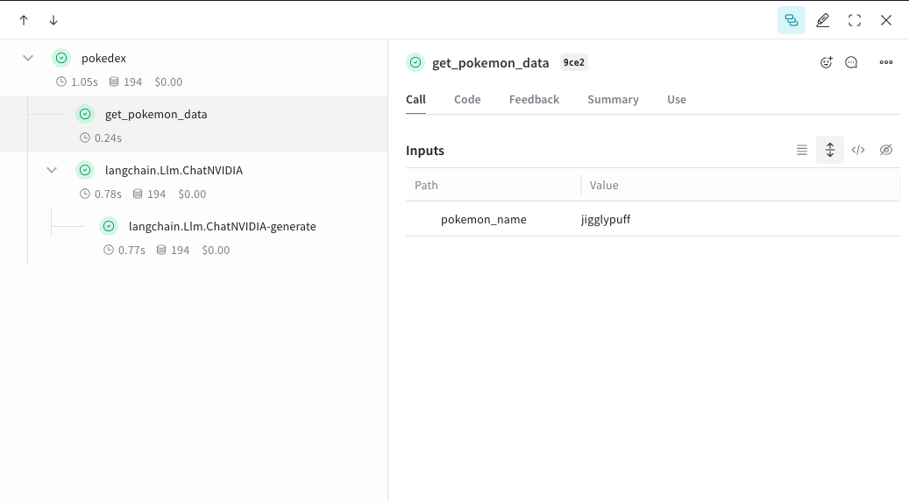
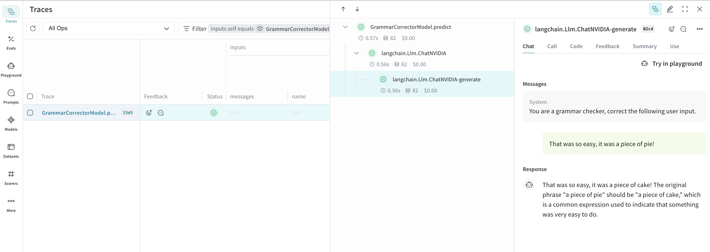

import Tabs from '@theme/Tabs';
import TabItem from '@theme/TabItem';

# NVIDIA NIM

Weave automatically tracks and logs LLM calls made via the [ChatNVIDIA](https://python.langchain.com/docs/integrations/chat/nvidia_ai_endpoints/) library, after `weave.init()` is called.

:::tip
For the latest tutorials, visit [Weights & Biases on NVIDIA](https://wandb.ai/site/partners/nvidia).
:::

## Tracing

It’s important to store traces of LLM applications in a central database, both during development and in production. You’ll use these traces for debugging and to help build a dataset of tricky examples to evaluate against while improving your application.

<Tabs groupId="programming-language" queryString>
  <TabItem value="python" label="Python" default>
    Weave can automatically capture traces for the [ChatNVIDIA python library](https://python.langchain.com/docs/integrations/chat/nvidia_ai_endpoints/).

    Start capturing by calling `weave.init(<project-name>)` with a project name your choice.

    ```python
    from langchain_nvidia_ai_endpoints import ChatNVIDIA
    import weave
    client = ChatNVIDIA(model="mistralai/mixtral-8x7b-instruct-v0.1", temperature=0.8, max_tokens=64, top_p=1)
    # highlight-next-line
    weave.init('emoji-bot')

    messages=[
        {
          "role": "system",
          "content": "You are AGI. You will be provided with a message, and your task is to respond using emojis only."
        }]

    response = client.invoke(messages)
    ```

  </TabItem>
  <TabItem value="typescript" label="TypeScript">
      ```plaintext
      This feature is not available in TypeScript yet since this library is only in Python.
      ```
  </TabItem>
</Tabs>



## Track your own ops

<Tabs groupId="programming-language" queryString>
  <TabItem value="python" label="Python" default>
Wrapping a function with `@weave.op` starts capturing inputs, outputs and app logic so you can debug how data flows through your app. You can deeply nest ops and build a tree of functions that you want to track. This also starts automatically versioning code as you experiment to capture ad-hoc details that haven't been committed to git.

Simply create a function decorated with [`@weave.op`](/guides/tracking/ops) that calls into [ChatNVIDIA python library](https://python.langchain.com/docs/integrations/chat/nvidia_ai_endpoints/).

In the example below, we have 2 functions wrapped with op. This helps us see how intermediate steps, like the retrieval step in a RAG app, are affecting how our app behaves.

    ```python
    # highlight-next-line
    import weave
    from langchain_nvidia_ai_endpoints import ChatNVIDIA
    import requests, random
    PROMPT="""Emulate the Pokedex from early Pokémon episodes. State the name of the Pokemon and then describe it.
            Your tone is informative yet sassy, blending factual details with a touch of dry humor. Be concise, no more than 3 sentences. """
    POKEMON = ['pikachu', 'charmander', 'squirtle', 'bulbasaur', 'jigglypuff', 'meowth', 'eevee']
    client = ChatNVIDIA(model="mistralai/mixtral-8x7b-instruct-v0.1", temperature=0.7, max_tokens=100, top_p=1)

    # highlight-next-line
    @weave.op
    def get_pokemon_data(pokemon_name):
        # highlight-next-line
        # This is a step within your application, like the retrieval step within a RAG app
        url = f"https://pokeapi.co/api/v2/pokemon/{pokemon_name}"
        response = requests.get(url)
        if response.status_code == 200:
            data = response.json()
            name = data["name"]
            types = [t["type"]["name"] for t in data["types"]]
            species_url = data["species"]["url"]
            species_response = requests.get(species_url)
            evolved_from = "Unknown"
            if species_response.status_code == 200:
                species_data = species_response.json()
                if species_data["evolves_from_species"]:
                    evolved_from = species_data["evolves_from_species"]["name"]
            return {"name": name, "types": types, "evolved_from": evolved_from}
        else:
            return None

    # highlight-next-line
    @weave.op
    def pokedex(name: str, prompt: str) -> str:
        # highlight-next-line
        # This is your root op that calls out to other ops
        # highlight-next-line
        data = get_pokemon_data(name)
        if not data: return "Error: Unable to fetch data"

        messages=[
                {"role": "system","content": prompt},
                {"role": "user", "content": str(data)}
            ]

        response = client.invoke(messages)
        return response.content

    # highlight-next-line
    weave.init('pokedex-nvidia')
    # Get data for a specific Pokémon
    pokemon_data = pokedex(random.choice(POKEMON), PROMPT)
    ```

Navigate to Weave and you can click `get_pokemon_data` in the UI to see the inputs & outputs of that step.
</TabItem>
<TabItem value="typescript" label="TypeScript">
    ```plaintext
    This feature is not available in TypeScript yet since this library is only in Python.
    ```
</TabItem>
</Tabs>



## Create a `Model` for easier experimentation

<Tabs groupId="programming-language" queryString>
  <TabItem value="python" label="Python" default>
    Organizing experimentation is difficult when there are many moving pieces. By using the [`Model`](/guides/core-types/models) class, you can capture and organize the experimental details of your app like your system prompt or the model you're using. This helps organize and compare different iterations of your app.

    In addition to versioning code and capturing inputs/outputs, [`Model`](/guides/core-types/models)s capture structured parameters that control your application’s behavior, making it easy to find what parameters worked best. You can also use Weave Models with `serve`, and [`Evaluation`](/guides/core-types/evaluations)s.

    In the example below, you can experiment with `model` and `system_message`. Every time you change one of these, you'll get a new _version_ of `GrammarCorrectorModel`.

    ```python
    import weave
    from langchain_nvidia_ai_endpoints import ChatNVIDIA

    weave.init('grammar-nvidia')

    class GrammarCorrectorModel(weave.Model): # Change to `weave.Model`
      system_message: str

      @weave.op()
      def predict(self, user_input): # Change to `predict`
        client = ChatNVIDIA(model="mistralai/mixtral-8x7b-instruct-v0.1", temperature=0, max_tokens=100, top_p=1)

        messages=[
              {
                  "role": "system",
                  "content": self.system_message
              },
              {
                  "role": "user",
                  "content": user_input
              }
              ]

        response = client.invoke(messages)
        return response.content


    corrector = GrammarCorrectorModel(
        system_message = "You are a grammar checker, correct the following user input.")
    result = corrector.predict("That was so easy, it was a piece of pie!")
    print(result)
    ```
  </TabItem>
  <TabItem value="typescript" label="TypeScript">
    ```plaintext
    This feature is not available in TypeScript yet since this library is only in Python.
    ```
  </TabItem>
</Tabs>



## Usage Info

The ChatNVIDIA integration supports `invoke`, `stream` and their async variants. It also supports tool use. 
As ChatNVIDIA is meant to be used with many types of models, it does not have function calling support.
