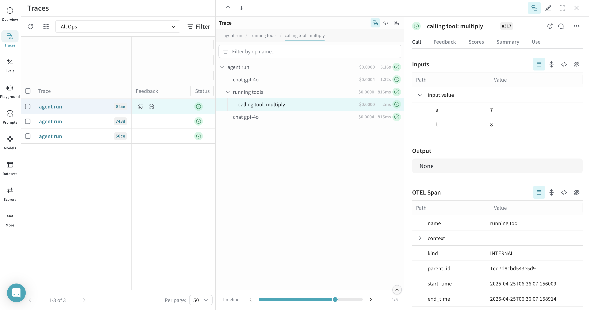

# PydanticAI

You can trace [PydanticAI](https://ai.pydantic.dev/) agent and tool calls in Weave using [OpenTelemetry (OTEL)](https://opentelemetry.io/). PydanticAI is a Python agent framework built by the Pydantic team to make it easy and type-safe to build production-grade applications with Generative AI. It uses OTEL for tracing all agent and tool calls.

:::tip
For more information on OTEL tracing in Weave, see [Send OTEL Traces to Weave](../tracking/otel.md).
:::

This guide shows you how to trace PydanticAI agent and tool calls using OTEL and visualize those traces in Weave. You’ll learn how to install the required dependencies, configure an OTEL tracer to send data to Weave, and instrument your PydanticAI agents and tools. You’ll also see how to enable tracing by default across all agents in your application.

## Prerequisites

Before you begin, install the required OTEL dependencies:

```bash
pip install opentelemetry-sdk OTELemetry-exporter-otlp-proto-http
```
Then, [configure OTEL tracing in Weave](#configure-otel-tracing-in-weave).

### Configure OTEL tracing in Weave

To send traces from PydanticAI to Weave, configure OTEL with a `TracerProvider` and an `OTLPSpanExporter`. Set the exporter to the [correct endpoint and HTTP headers for authentication and project identification](#required-configuration).

:::important 
It is recommended that you store sensitive environment variables like your API key and project info in an environment file (e.g., `.env`), and load them using `os.environ`. This keeps your credentials secure and out of your codebase.
:::

### Required configuration

- **Endpoint:** `https://trace.wandb.ai/otel/v1/traces`
- **Headers:**
  - `Authorization`: Basic auth using your W&B API key
  - `project_id`: Your W&B entity/project name (e.g., `myteam/myproject`)

### Example set up

The following code snippet demonstrates how to configure an OTLP span exporter and tracer provider to send OTEL traces from a PydanticAI application to Weave. 

```python
import base64
import os
from opentelemetry.exporter.otlp.proto.http.trace_exporter import OTLPSpanExporter
from opentelemetry.sdk import trace as trace_sdk
from opentelemetry.sdk.trace.export import SimpleSpanProcessor

# Load sensitive values from environment variables
WANDB_BASE_URL = "https://trace.wandb.ai"
PROJECT_ID = os.environ.get("WANDB_PROJECT_ID")  # Your W&B entity/project name e.g. "myteam/myproject"
WANDB_API_KEY = os.environ.get("WANDB_API_KEY")  # Your W&B API key

OTEL_EXPORTER_OTLP_ENDPOINT = f"{WANDB_BASE_URL}/otel/v1/traces"
AUTH = base64.b64encode(f"api:{WANDB_API_KEY}".encode()).decode()

OTEL_EXPORTER_OTLP_HEADERS = {
    "Authorization": f"Basic {AUTH}",
    "project_id": PROJECT_ID,
}

# Create the OTLP span exporter with endpoint and headers
exporter = OTLPSpanExporter(
    endpoint=OTEL_EXPORTER_OTLP_ENDPOINT,
    headers=OTEL_EXPORTER_OTLP_HEADERS,
)

# Create a tracer provider and add the exporter
tracer_provider = trace_sdk.TracerProvider()
tracer_provider.add_span_processor(SimpleSpanProcessor(exporter))
```

## Trace PydanticAI Agents with OTEL

To trace your PydanticAI agents and send trace data to Weave, pass an `InstrumentationSettings` object configured with your tracer provider to the `Agent constructor`. This ensures that all agent and tool calls are traced according to your OTEL configuration.

The following example shows how to create a simple agent with tracing enabled. The key step is setting the instrument argument when initializing the agent:

```python
from pydantic_ai import Agent
from pydantic_ai.models.instrumented import InstrumentationSettings

# Create a PydanticAI agent with OTEL tracing
agent = Agent(
    "openai:gpt-4o",
    instrument=InstrumentationSettings(tracer_provider=tracer_provider),
)

result = agent.run_sync("What is the capital of France?")
print(result.output)
```

All calls to the agent are traced and sent to Weave.

 

## Trace PydanticAI Tools with OTEL

Weave can trace any PydanticAI operations that are instrumented with OTEL, including both agent and tool calls. This means that when your agent invokes a tool (e.g. a function decorated with `@agent.tool_plain`), the entire interaction is captured and visualized in Weave, including tool inputs, outputs, and the model's reasoning.

The following example shows how to create an agent with a system prompt and a tool. Tracing is enabled automatically for both the agent and the tool:

```python
from pydantic_ai import Agent
from pydantic_ai.models.instrumented import InstrumentationSettings

# Create a PydanticAI agent with a system prompt and OTEL tracing
agent = Agent(
    "openai:gpt-4o",
    system_prompt=(
        "You are a helpful assistant that can multiply numbers. "
        "When asked to multiply numbers, use the multiply tool."
    ),
    instrument=InstrumentationSettings(tracer_provider=tracer_provider),
)

# Define a tool
@agent.tool_plain
def multiply(a: int, b: int) -> int:
    """Multiply two numbers."""
    return a * b

# Ask the agent to use the tool
result = agent.run_sync("What is 7 multiplied by 8?")
print(result.output)
```

 

Both the agent call and the tool call are traced in Weave, allowing you to inspect the full reasoning and execution path of your application.

## Instrument all agents by default

To apply OTEL tracing to all PydanticAI agents in your application, use the `Agent.instrument_all()` method. This sets a default `InstrumentationSettings` instance for any agent that doesn’t explicitly specify the `instrument` parameter.

```python
from pydantic_ai import Agent
from pydantic_ai.models.instrumented import InstrumentationSettings

# Set up default instrumentation for all agents
Agent.instrument_all(InstrumentationSettings(tracer_provider=tracer_provider))

# Now, any new agent will use this instrumentation by default
agent1 = Agent("openai:gpt-4o")
agent2 = Agent("openai:gpt-4o", system_prompt="Be helpful.")

result = agent1.run_sync("What is the capital of France?")
print(result.output)
```

This is useful for larger applications where you want consistent tracing across all agents without repeating configuration. For more details, see the [PydanticAI OTEL docs](https://ai.pydantic.dev/logfire/#using-logfire).

## Learn more

- [Weave documentation: Send OTEL traces to Weave](../tracking/otel.md)
- [Official OTEL documentation](https://opentelemetry.io/)
- [Official PydanticAI documentation](https://ai.pydantic.dev/)
- [PydanticAI GitHub repository](https://github.com/pydantic/pydantic-ai)